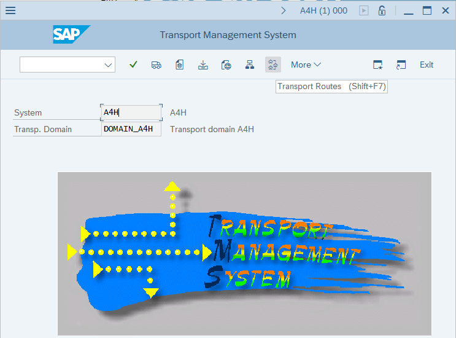

# Configure SAP Transport Management System

This article shows you how to configure the SAP Transport Management System in order to successfully deploy the Continuous Threat Monitoring solution for SAP in Microsoft Sentinel.

SAP's Transport Management System is normally already configured on production systems. However, in a lab environment, where CRs often haven't been previously installed, configuration may be required.

If you get this error running the **STMS_IMPORT** transaction while [preparing your SAP environment](preparing-sap.md), you'll need to configure the Transport Management System.

The following steps are a sample on how to configure a transport management system.

> [!IMPORTANT] 
> In production systems always consult with SAP administrator on the steps to configure a transport management system

1. Run a new instance of **SAP Logon** and sign in to **Client number** `000` as **user** `DDIC`.

    

1. Run the **STMS** transaction:

    Type `STMS` in the field in the upper left corner of the screen and press the **Enter** key.

1. Delete the existing TMS configuration:

    In the **Transport Management System** screen, select **More > Extras > Delete TMS Configuration**, and select **Yes** to confirm.

    

    After deletion of the configuration, TMS transport domain needs to be configured.

    In the **TMS: Configure Transport Domain** screen, select **Save**.

    In the **Set Password for User TMSADM**, define a complex password, make a note of the password in a secure location and click the green checkbox.

1. Configure Transport routes:

    In the **Transport Management System** screen, select **Transport Routes**.

    

    In the **Change Transport Routes (Active)** screen, select **Display <-> Change**.

    

    Select **More > Configuration > Standard Configuration > Single System**.

    

    In the **Change Transport Routes (Revised)** screen, select **Save**.

    In the **Configuration Short Text** screen, select **Save**.

    In the **Distribute and Activate** screen, select **Yes**.

After steps above have been carried out, Transport management system will be configured and `STMS_IMPORT` transaction will work.
Close SAP GUI logged on to client `000` as `DDIC` and return to SAP GUI logged on to client `001`

## Next steps

After the steps above are complete, the CRs required for Sentinel continuous protection for SAP operation are deployed, sample role is provisioned and a user account is created with necessary role profile assigned.
The next step is to deploy the data connector agent container.

> [!div class="nextstepaction"]
> [Deploy and configure the data connector agent container](deploy_data_connector_agent_container.md)

