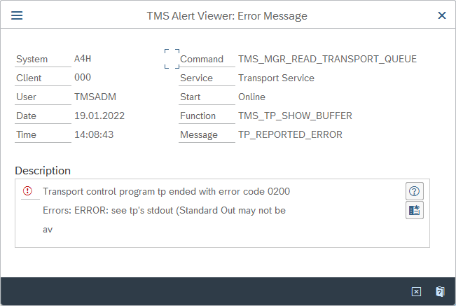

# Configure SAP Transport Management System to connect from Microsoft Sentinel

This article shows you how to configure the SAP Transport Management System in order to successfully deploy the Microsoft Sentinel solution for SAP® applications.

SAP's Transport Management System is normally already configured on production systems. However, in a lab environment, where CRs often haven't been previously installed, configuration may be required.

If you get this error running the **STMS_IMPORT** transaction while [preparing your SAP environment](preparing-sap.md), you'll need to configure the Transport Management System.

## Configure Transport Management System

The following steps show the process for configuring the Transport Management System.

> [!IMPORTANT] 
> In production systems, always consult with a SAP administrator before making changes to your SAP environment.

1. Run a new instance of **SAP Logon** and sign in to **Client number** `000` as **user** `DDIC`.

    :::image type="content" source="media/configure-transport/ddic-logon.png" alt-text="Screenshot of logging into SAP as a D D I C account.":::

1. Run the **STMS** transaction:

    Type `STMS` in the field in the upper left corner of the screen and press the **Enter** key.

1. Remove the existing TMS configuration:

    1. In the **Transport Management System** screen, select **More > Extras > Delete TMS Configuration**, and select **Yes** to confirm.

        :::image type="content" source="media/configure-transport/remove-tms-configuration.png" alt-text="Screenshot of deleting existing T M S configuration.":::

    1. After deleting the configuration, you will be prompted to configure the TMS transport domain.

    1. In the **TMS: Configure Transport Domain** dialog, select **Save**.

    1. In the **Set Password for User TMSADM** dialog, define a complex password and enter it twice. Record the password in a secure location and select the green checkmark to confirm.

1. Configure Transport routes:

    1. In the **Transport Management System** screen, select **Transport Routes**.

        :::image type="content" source="media/configure-transport/tms-transport-routes.png" alt-text="Screenshot of configuring transport routes.":::

    1. In the **Change Transport Routes (Active)** screen, select **Display <-> Change**.

        :::image type="content" source="media/configure-transport/transport-routes-display-change.png" alt-text="Screenshot of displaying and changing transport routes." lightbox="media/configure-transport/transport-routes-display-change-lightbox.png":::

    1. Select **More > Configuration > Standard Configuration > Single System**.

        :::image type="content" source="media/configure-transport/transport-routes-display-singlesystem.png" alt-text="Screenshot of changing a single system transport route." lightbox="media/configure-transport/transport-routes-display-singlesystem.png":::

    1. In the **Change Transport Routes (Revised)** screen, select **Save**.

    1. In the **Configuration Short Text** screen, select **Save**.

    1. In the **Distribute and Activate** screen, select **Yes**.

1. Close the SAP application signed in to client `000` as `DDIC`, and return to the SAP application signed in to client `001`.

## Next steps

Now that you've configured the Transport Management System, you'll be able to successfully complete the `STMS_IMPORT` transaction and you can continue [preparing your SAP environment](preparing-sap.md) for deploying the Microsoft Sentinel solution for SAP® applications in Microsoft Sentinel.

> [!div class="nextstepaction"]
> [Deploy SAP Change Requests and configure authorization](preparing-sap.md#import-the-crs)

Learn more about the Microsoft Sentinel solution for SAP® applications:

- [Deploy Microsoft Sentinel solution for SAP® applications](deployment-overview.md)
- [Prerequisites for deploying Microsoft Sentinel solution for SAP® applications](prerequisites-for-deploying-sap-continuous-threat-monitoring.md)
- [Deploy SAP Change Requests (CRs) and configure authorization](preparing-sap.md)
- [Deploy and configure the container hosting the SAP data connector agent](deploy-data-connector-agent-container.md)
- [Deploy SAP security content](deploy-sap-security-content.md)
- [Deploy the Microsoft Sentinel solution for SAP® applications data connector with SNC](configure-snc.md)
- [Enable and configure SAP auditing](configure-audit.md)
- [Collect SAP HANA audit logs](collect-sap-hana-audit-logs.md)

Troubleshooting:

- [Troubleshoot your Microsoft Sentinel solution for SAP® applications deployment](sap-deploy-troubleshoot.md)

Reference files:

- [Microsoft Sentinel solution for SAP® applications data reference](sap-solution-log-reference.md)
- [Microsoft Sentinel solution for SAP® applications: security content reference](sap-solution-security-content.md)
- [Kickstart script reference](reference-kickstart.md)
- [Update script reference](reference-update.md)
- [Systemconfig.ini file reference](reference-systemconfig.md)

For more information, see [Microsoft Sentinel solutions](../sentinel-solutions.md).
