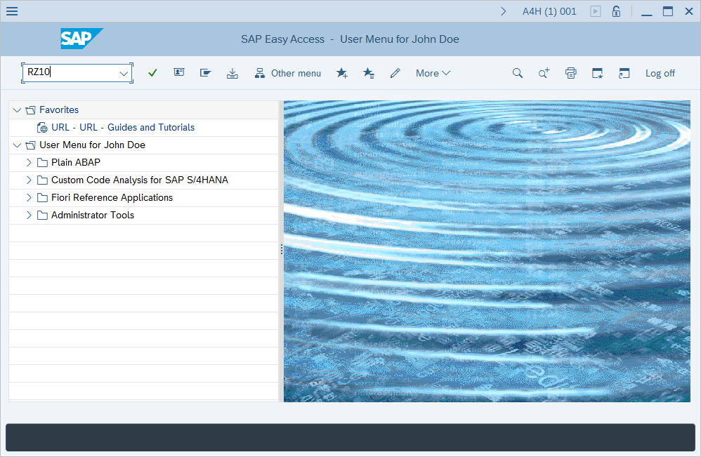
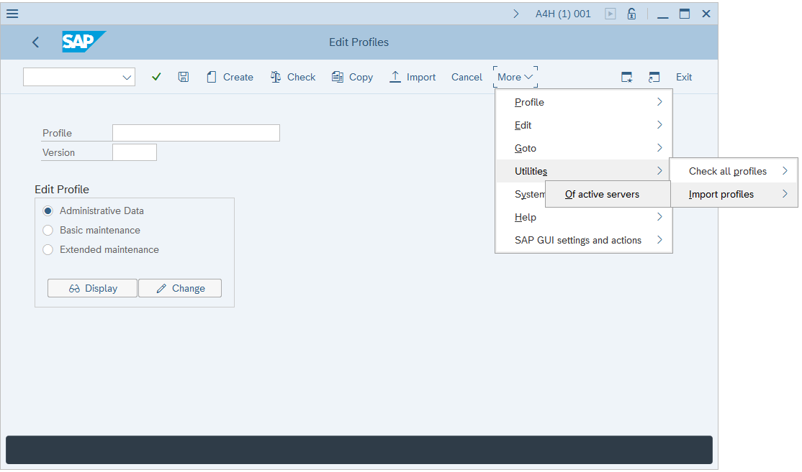
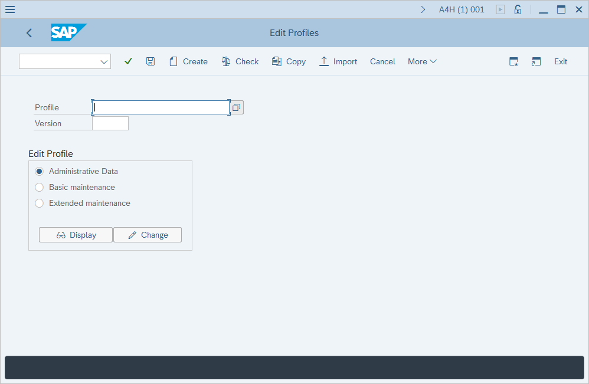
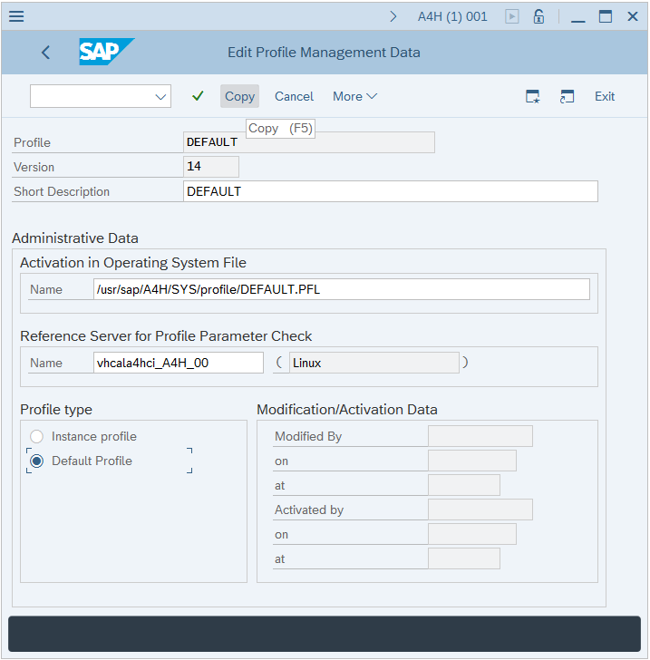

# Enable and configure SAP auditing
[!INCLUDE [Banner for top of topics](../includes/banner.md)]

The following article provides a step-by-step guidance to deploy Microsoft Sentinel continuous protection for SAP data connector Virtual Machine in Azure. Azure key vault will be used to store secrets (such as credentials to access SAP and Log Analytics workspace). Virtual Machine will use Azure Managed identity to authenticate to Azure key vault.

> [!IMPORTANT]
> The Microsoft Sentinel SAP solution is currently in PREVIEW. The [Azure Preview Supplemental Terms](https://azure.microsoft.com/support/legal/preview-supplemental-terms/) include additional legal terms that apply to Azure features that are in beta, preview, or otherwise not yet released into general availability.

Some installations of SAP may not have audit log enabled by default.
To get best experience from evaluation of SAP continuous threat monitoring, it is recommended to enable auditing of SAP and configure audit parameters.
This guide is a step-by-step instruction on how to enable and configure auditing

> [!IMPORTANT]
> 
> It is strongly recommended that management of SAP system is carried out by an experienced SAP system administrator
>
> The steps below may differ depending on the version of the SAP system and should be considered as a sample only

#### Verify if auditing is enabled
1. Logon to SAP GUI and run **RSAU_CONFIG** transaction
   
2. In **Security Audit Log - Display of Current Configuration** window navigate to **Parameter** section in **Configuration** section, then verify **Static security audit active** checkbox in **General Parameters** section

#### Enabling auditing

1. Logon to SAP GUI and run **RZ10** transaction
 
2. In **Edit Profiles** window select **More** -> **Utilities** -> **Import profiles** -> **Of active servers**
 
3. In **Display Profile Check Log** click **Back**
 
4. Back in **Edit Profiles** window click the boxes next to **Profile** field
 
5. In **Restrict Value Range** window select **Default** profile and click green checkbox (Copy)
 
6. Back in **Edit Profiles** window verify **Administrative Data** is selected in **Edit Profile** section and click **Import**
 
7. In the Information dialog box click green checkbox
 
8. In **Edit Profile Management Data** window, type a profile description and add an extension **.PFL** (e.g.) `DEFAULT` to **Activation in Operating System File** field (e.g.) `/usr/sap/A4H/SYS/profile/DEFAULT.PFL`, check **Default Profile** in **Profile type**, then click **Copy**
 
9. Back in **Edit Profiles** click **Import** 
 
10. In **Import Profile** dialog box click the boxes next to **Name** field
 
11. In the **Instance Profile** window, select the profile name specified in the previous step, then click **Copy** (green checkbox)
 
12. In the **Import profile** window click **Copy**
 

