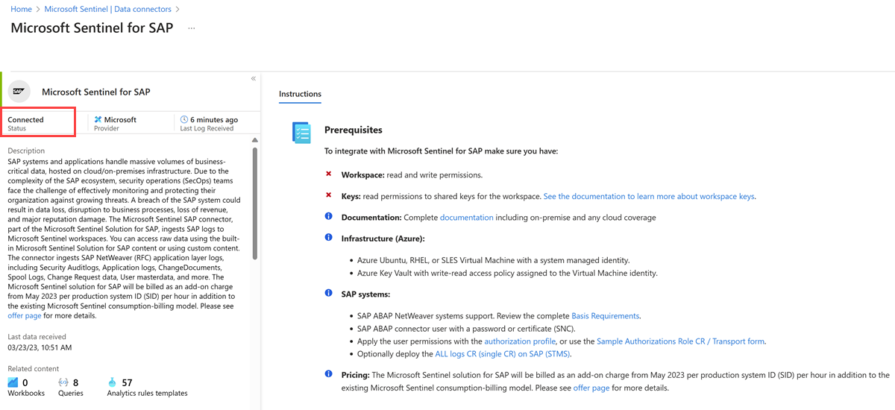
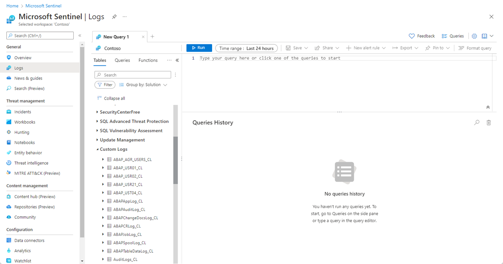

# Deploy SAP security content in Microsoft Sentinel

[!INCLUDE [Banner for top of topics](../includes/banner.md)]

This article shows you how to deploy Microsoft Sentinel security content into your Microsoft Sentinel workspace. This content makes up the remaining parts of the Continuous Threat Monitoring solution for SAP.

> [!IMPORTANT]
> The Microsoft Sentinel SAP solution is currently in PREVIEW. The [Azure Preview Supplemental Terms](https://azure.microsoft.com/support/legal/preview-supplemental-terms/) include additional legal terms that apply to Azure features that are in beta, preview, or otherwise not yet released into general availability.

## Deployment milestones

Track your SAP solution deployment journey through this series of articles:

1. [Deployment overview](deployment-overview.md)

1. [Deployment prerequisites](prerequisites-for-deploying-sap-continuous-threat-monitoring.md)

1. [Prepare SAP environment](preparing-sap.md)

1. [Deploy data connector agent](deploy-data-connector-agent-container.md)

1. **Deploy SAP security content (*You are here*)**

1. Optional deployment steps
   - [Configure auditing](configure-audit.md)
   - [Configure SAP data connector to use SNC](configure-snc.md)

## Deploy SAP security content

Deploy the [SAP security content](sap-solution-security-content.md) from the Microsoft Sentinel **Content hub** and **Watchlists** areas.

Deploying the **Microsoft Sentinel - Continuous Threat Monitoring for SAP** solution causes the SAP data connector to be displayed in the Microsoft Sentinel **Data connectors** area. The solution also deploys the **SAP - System Applications and Products** workbook and SAP-related analytics rules.

To deploy SAP solution security content, do the following:

1. In Microsoft Sentinel, on the left pane, select **Content hub (Preview)**.

    The **Content hub (Preview)** page displays a filtered, searchable list of solutions.

1. To open the SAP solution page, select **Continuous Threat Monitoring for SAP**.

    :::image type="content" source="./media/deploy-sap-security-content/sap-solution.png" alt-text="Screenshot of the 'Microsoft Sentinel - Continuous Threat Monitoring for SAP' solution pane." lightbox="media/deploy-sap-security-content/sap-solution.png":::

1. To launch the solution deployment wizard, select **Create**, and then enter the details of the Azure subscription, resource group, and Log Analytics workspace (the one used by Microsoft Sentinel) where you want to deploy the solution.

1. Select **Next** to cycle through the **Data Connectors**, **Analytics**, and **Workbooks** tabs, where you can learn about the components that will be deployed with this solution.

    For more information, see [Microsoft Sentinel SAP solution: security content reference (public preview)](sap-solution-security-content.md).

1. On the **Review + create tab** pane, wait for the **Validation Passed** message, then select **Create** to deploy the solution.

    > [!TIP]
    > You can also select **Download a template** for a link to deploy the solution as code.

1. After the deployment is completed, a confirmation message appears at the upper right.

    To display the newly deployed content, go to:

    - **Threat Management** > **Workbooks** > **My workbooks**, to find the [built-in SAP workbooks](sap-solution-security-content.md#built-in-workbooks).
    - **Configuration** > **Analytics** to find a series of [SAP-related analytics rules](sap-solution-security-content.md#built-in-analytics-rules).

1. In Microsoft Sentinel, go to the **Microsoft Sentinel Continuous Threat Monitoring for SAP** data connector to confirm the connection:

    

    SAP ABAP logs are displayed on the Microsoft Sentinel **Logs** page, under **Custom logs**:

    

    For more information, see [Microsoft Sentinel SAP solution logs reference](sap-solution-log-reference.md).

## Next steps

Learn more about the Microsoft Sentinel SAP solutions:

- [Deploy Continuous Threat Monitoring for SAP](deployment-overview.md)
- [Prerequisites for deploying SAP continuous threat monitoring](prerequisites-for-deploying-sap-continuous-threat-monitoring.md)
- [Deploy SAP Change Requests (CRs) and configure authorization](preparing-sap.md)
- [Deploy and configure the SAP data connector agent container](deploy-data-connector-agent-container.md)
- [Deploy SAP security content](deploy-sap-security-content.md)
- [Deploy the Microsoft Sentinel SAP data connector with SNC](configure-snc.md)
- [Enable and configure SAP auditing](configure-audit.md)
- [Collect SAP HANA audit logs](collect-sap-hana-audit-logs.md)

Troubleshooting:

- [Troubleshoot your Microsoft Sentinel SAP solution deployment](sap-deploy-troubleshoot.md)
- [Configure SAP Transport Management System](configure-transport.md)

Reference files:

- [Microsoft Sentinel SAP solution data reference](sap-solution-log-reference.md)
- [Microsoft Sentinel SAP solution: security content reference](sap-solution-security-content.md)
- [Update script reference](reference-update.md)
- [Systemconfig.ini file reference](reference-systemconfig.md)

For more information, see [Microsoft Sentinel solutions](../sentinel-solutions.md).
