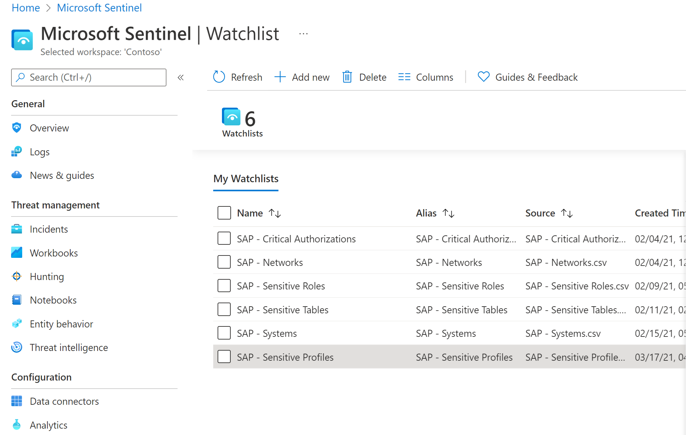

# Deploy SAP security content

[!INCLUDE [Banner for top of topics](../includes/banner.md)]

This article shows you how to deploy Microsoft Sentinel security content into your Microsoft Sentinel workspace. This content makes up the remaining parts of the Continuous Threat Monitoring solution for SAP.

## Deployment milestones

Track your SAP solution deployment journey through this series of articles:

1. [Deployment overview](deployment-overview.md)

1. [Deployment prerequisites](prerequisites-for-deploying-sap-continuous-threat-monitoring.md)

1. [Prepare SAP environment](preparing-sap.md)

1. [Deploy data connector agent](deploy-data-connector-agent-container.md)

1. **Deploy SAP security content (*You are here*)**

1. Optional deployment steps
   - [Configure auditing](configure_audit.md)
   - [Configure SAP data connector to use SNC](configure_snc.md)

## Deploy SAP security content

Deploy the [SAP security content](sap-solution-security-content.md) from the Microsoft Sentinel **Content hub** and **Watchlists** areas.

The **Microsoft Sentinel - Continuous Threat Monitoring for SAP** solution enables the SAP data connector to be displayed in the Microsoft Sentinel **Data connectors** area. The solution also deploys the **SAP - System Applications and Products** workbook and SAP-related analytics rules.

Add SAP-related watchlists to your Microsoft Sentinel workspace manually.

To deploy SAP solution security content, do the following:

1. In Microsoft Sentinel, on the left pane, select **Content hub (Preview)**.

    The **Content hub (Preview)** page displays a filtered, searchable list of solutions.

1. To open the SAP solution page, select **Continuous Threat Monitoring for SAP**.

    :::image type="content" source="./media/deploy-sap-security-content/sap-solution.png" alt-text="Screenshot of the 'Microsoft Sentinel - Continuous Threat Monitoring for SAP' solution pane." lightbox="media/deploy-sap-security-content/sap-solution.png":::

1. To launch the solution deployment wizard, select **Create**, and then enter the details of the Azure subscription, resource group, and Log Analytics workspace where you want to deploy the solution.

1. Select **Next** to cycle through the **Data Connectors**, **Analytics**, and **Workbooks** tabs, where you can learn about the components that will be deployed with this solution.

    The default name for the workbook is **SAP - System Applications and Products**. Change it in the workbooks tab as needed.

    For more information, see [Microsoft Sentinel SAP solution: security content reference (public preview)](sap-solution-security-content.md).

1. On the **Review + create tab** pane, wait for the **Validation Passed** message, then select **Create** to deploy the solution.

    > [!TIP]
    > You can also select **Download a template** for a link to deploy the solution as code.

1. After the deployment is completed, a confirmation message appears at the upper right.

    To display the newly deployed content, go to:

    - **Threat Management** > **Workbooks** > **My workbooks**, to find the [built-in SAP workbooks](sap-solution-security-content.md#built-in-workbooks).
    - **Configuration** > **Analytics** to find a series of [SAP-related analytics rules](sap-solution-security-content.md#built-in-analytics-rules).

1. Add SAP-related watchlists to use in your search, detection rules, threat hunting, and response playbooks. These watchlists provide the configuration for the Microsoft Sentinel SAP Continuous Threat Monitoring solution. Do the following:

    1. Download SAP watchlists from the Microsoft Sentinel GitHub repository at https://github.com/Azure/Azure-Sentinel/tree/master/Solutions/SAP/Analytics/Watchlists.
    
    1. In the Microsoft Sentinel **Watchlists** area, add the watchlists to your Microsoft Sentinel workspace. Use the downloaded CSV files as the sources, and then customize them as needed for your environment.  

    

    For more information, see [Use Microsoft Sentinel watchlists](../watchlists.md) and [Available SAP watchlists](sap-solution-security-content.md#available-watchlists).

1. In Microsoft Sentinel, go to the **Microsoft Sentinel Continuous Threat Monitoring for SAP** data connector to confirm the connection:

    

    SAP ABAP logs are displayed on the Microsoft Sentinel **Logs** page, under **Custom logs**:

    

    For more information, see [Microsoft Sentinel SAP solution logs reference](sap-solution-log-reference.md).
