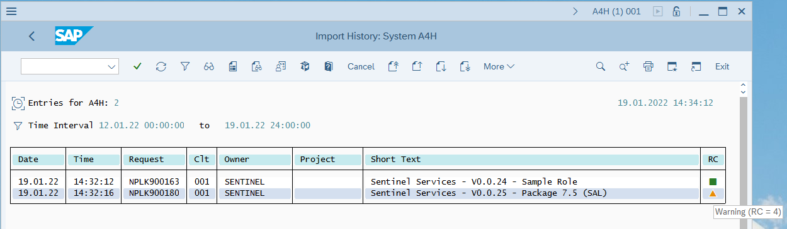
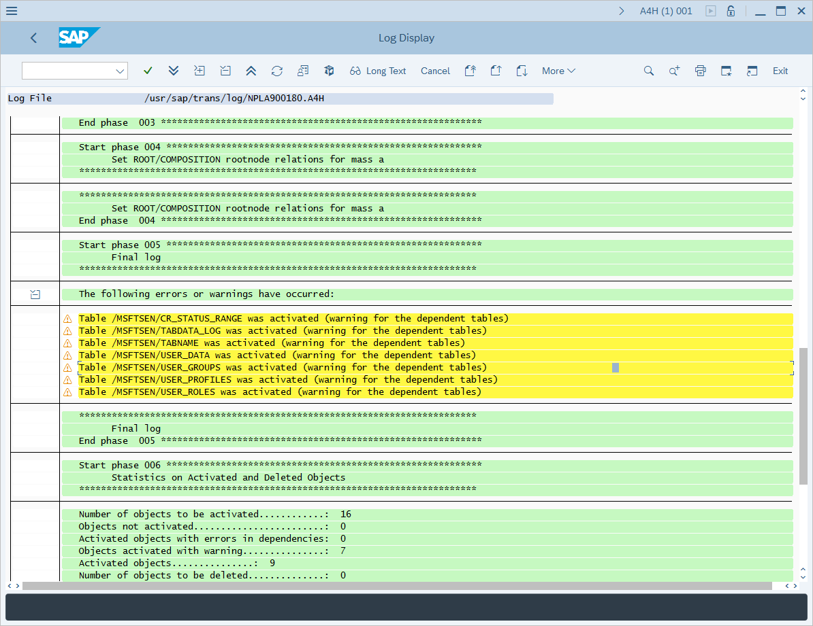

# Deploy SAP Change Requests (CRs) and configure authorization

[!INCLUDE [Banner for top of topics](../includes/banner.md)]

This article shows you how to deploy the SAP Change Requests (CRs) necessary to prepare the environment for the installation of the SAP agent, so that it can properly connect to your SAP systems.

> [!IMPORTANT]
> The Microsoft Sentinel SAP solution is currently in PREVIEW. The [Azure Preview Supplemental Terms](https://azure.microsoft.com/support/legal/preview-supplemental-terms/) include additional legal terms that apply to Azure features that are in beta, preview, or otherwise not yet released into general availability.

## Deployment milestones

Track your SAP solution deployment journey through this series of articles:

1. [Deployment overview](deployment-overview.md)

1. [Prerequisites](prerequisites-for-deploying-sap-continuous-threat-monitoring.md)

1. **Deploy SAP CRs and configure authorization (*You are here*)**

1. [Deploy and configure the data connector agent container](deploy_data_connector_agent_container.md)

1. [Deploy SAP security content](deploy_sap_security_content.md)

1. Optional deployment steps
   - [Configure auditing](configure_audit.md)
   - [Configure SAP data connector to use SNC](configure_snc.md)


> [!IMPORTANT]
> - This article presents a [**step-by-step guide**](#change-request-and-authorization-configuration-step-by-step-guide) to deploying the required CRs. It's recommended for SOC engineers or implementers who may not necessarily be SAP experts.
> - Experienced SAP administrators that are familiar with CR deployment process should obtain the appropriate CRs from the [**SAP environment validation steps**](prerequisites-for-deploying-sap-continuous-threat-monitoring.md#sap-environment-validation-steps) section of the guide and deploy them. Note that the *NPLK900163* CR deploys a sample role and should not be used in this case. Instead, the administrator should manually define the role according to the information in the [**Required ABAP authorizations**](#required-abap-authorizations) section below.

> [!NOTE]
> 
> It is *strongly recommended* that the deployment of SAP CRs be carried out by an experienced SAP system administrator.
>
> The steps below may differ according to the version of the SAP system and should be considered for demonstration purposes only.
> 
> Make sure you've copied the details of the **SAP system version**, **SID**, **System number**, **Client number**, **IP address**, **administrative username** and **password** before beginning the deployment process.
>
> For the following example, the following details are assumed:
> - **SAP system version:** `SAP ABAP Platform 1909 Developer edition`
> - **SID:** `A4H`
> - **System number:** `00`
> - **Client number:** `001`
> - **IP address:** `192.168.136.4`
> - **Administrator user:** `a4hadm`, however, the SSH connection to the SAP system is established with `root` user credentials. 

The deployment of Microsoft Sentinel's Continuous Threat Monitoring for SAP solution requires the installation of several CRs. More details about the required CRs can be found in the [SAP environment validation steps](prerequisites-for-deploying-sap-continuous-threat-monitoring.md#sap-environment-validation-steps) section of this guide.

To deploy the CRs, follow the steps outlined below:

### Change request and authorization configuration step-by-step guide

#### Set up the files

1. Sign in to the SAP system using SSH.

1. Transfer the CR files to the SAP system.  
    Alternatively, you can download the files directly onto the SAP system from the SSH prompt. Use the following commands:  
    - Download NLPK900202
        ```bash
        wget https://raw.githubusercontent.com/Azure/Azure-Sentinel/master/Solutions/SAP/CR/K900202.NPL
        wget https://raw.githubusercontent.com/Azure/Azure-Sentinel/master/Solutions/SAP/CR/R900202.NPL
        ```

    - Download NLPK900201
        ```bash
        wget https://raw.githubusercontent.com/Azure/Azure-Sentinel/master/Solutions/SAP/CR/K900201.NPL
        wget https://raw.githubusercontent.com/Azure/Azure-Sentinel/master/Solutions/SAP/CR/R900201.NPL
        ```

    - Download NLPK900206
        ```bash
        wget https://raw.githubusercontent.com/Azure/Azure-Sentinel/master/Solutions/SAP/CR/K900206.NPL
        wget https://raw.githubusercontent.com/Azure/Azure-Sentinel/master/Solutions/SAP/CR/R900206.NPL
        ```

    Note that each CR consists of two files, one beginning with K and one with R.

1. Change the ownership of the files to user *\<sid\>adm* and group *sapsys*.

    ```bash
    chown <sid>adm:sapsys *.NPL
    ```

1. Copy the cofiles (those beginning with *K*) to the `/usr/sap/trans/cofiles` folder. Preserve the permissions while copying, using the `cp` command with the `-p` switch.

    ```bash
    cp -p K*.NPL /usr/sap/trans/cofiles/
    ```

1. Copy the data files (those beginning with R) to the `/usr/sap/trans/data` folder.  Preserve the permissions while copying, using the `cp` command with the `-p` switch.

    ```bash
    cp -p R*.NPL /usr/sap/trans/data/
    ```

#### Set up the applications

1. Launch the **SAP Logon** application and sign in to the SAP GUI console.

1. Run the **STMS_IMPORT** transaction:

    Type `STMS_IMPORT` in the field in the upper left corner of the screen and press the **Enter** key.

    :::image type="content" source="media/preparing-sap/stms-import.png" alt-text="Screenshot of running the S T M S import transaction.":::

    > [!CAUTION]
    > If an error occurs at this step, then you need to configure the SAP transport management system before proceeding any further. [**See this article for instructions**](configure-transport.md).

1. In the **Import Queue** window that appears, select **More > Extras > Other Requests > Add**.

    :::image type="content" source="media/preparing-sap/import-queue-add.png" alt-text="Screenshot of adding an import queue.":::

1. In the **Add Transport Requests to Import Queue** pop-up that appears, select the boxes next to the **Transp. Request** field.

1. The **Transport requests** window will appear and display a list of CRs available to be deployed. Select a CR and select the green checkmark button.

1. Back in the **Add Transport Request to Import Queue** window, select **Continue** (the green checkmark) or press the Enter key.

1. In the **Add Transport Request** confirmation dialog, select **Yes**.

1. Repeat the procedure in the preceding 5 steps to add the remaining Change Requests to be deployed.

1. In the **Import Queue** window, select the **Import All Requests** icon:

    :::image type="content" source="media/preparing-sap/import-all-requests.png" alt-text="Screenshot of importing all requests." lightbox="media/preparing-sap/import-all-requests-lightbox.png":::

1. In **Start Import** window, click on boxes next to **Target Client** field and select client to deploy the CRs to, then click green checkbox in **Input Help..** window, then select **Options** tab and select **Ignore Invalid Component Version** checkbox, then click the green checkbox at the bottom<br>

    

1. In the **Start Import** window click **Yes** to confirm the import

1. In the **Import Queue** window click **Refresh** button, wait until the import operation completes and import queue becomes empty

1. To review import status, in the **Import History** window click **More**, select **Go To**, select **Import History**

    

1. NPLK900180 Change request is expected to end with a Warning, click on the entry to verify that the warning is associated with Table \<tablename\> was activated

    

    


### Role configuration step-by-step guide

After the NPLK900163 CR (change request) is deployed, a **/MSFTSEN/SENTINEL_CONNECTOR** role is created in SAP. If the role is created manually, it may bear a different name.
In this guide, it will be assumed that the role created has a name **/MSFTSEN/SENTINEL_CONNECTOR**
<br>

The next step is to generate an active role profile

1. Run the **PFCG** transaction<br>
To run the transaction, in main SAP GUI window type **PFCG** in the top-left corner and press **Enter**
1. In **Role Maintenance** window in the **Role** textbox type the role name `/MSFTSEN/SENTINEL_CONNECTOR` and click  **Change** button
1. In **Change Roles** window select the **Authorizations** tab
1. In the **Change Roles** **Authorizations** window select **Change Authorization Data**<br>

1. In the **Information** window click the green checkbox
1. In the **Change Role: Authorizations** window click **Generate**
<br>
<br>Notice that after clicking, **Status** field changes from **Unchanged** to **generated**
1. In the **Change Role: Authorizations** window click **Back**
8. In the **Change Roles** window validate **Authorizations** tab displays a green box, then click **Save** button
<br>

### User creation step-by-step guide

Sentinel continuous protection for SAP requires a user account to connect to SAP system

The following steps outline the basics on how to create a user account and assign it to the role that was created in the previous step.
This step-by-step guide will assume the role name is `/MSFTSEN/SENTINEL_CONNECTOR`

1. In SAP GUI run the **SU01** transaction<br>
To run the transaction, in SAP GUI type **SU01** in top-left corner and press **Enter**
2. In **User Maintenance: Initial Screen** screen type in the name of the new user in the **User** field and press **Create Technical User button**
3. In **Maintain Users** screen select **User Type** of **System**, compose and enter a complicated password in **New Password** and **Repeat Password** fields, then select the **Roles** tab
4. In **Roles** tab, in the **Role Assignments** section, write down the full name of the role and press **Enter**
<br>After pressing **Enter**, verify that the right-hand side of the **Role Assignments** section populates with data, such as **Change Start Date**
5. Navigate to **Profiles** tab, verify profile for role is populated in the **Assigned Authorization Profiles** section and press **Save**


### Required ABAP authorizations

The following table lists the ABAP authorizations required to ensure SAP logs can be correctly retreived by the account used by Microsoft Sentinel data connector.

Required authorizations are listed by log type. Only authorizations listed for the types of logs that are planneed to be ingested into Microsoft Sentinel are required.

> [!TIP]
> To create the role with all required authorizations, deploy the SAP change request NPLK900163 on the SAP system. 
> Change request NPLK900163 creates the **/MSFTSEN/SENTINEL_CONNECTOR** role that has all the relevant permissions for the data connector to operate.

| Authorization Object | Field | Value |
| -------------------- | ----- | ----- |
| **All RFC logs** | | |
| S_RFC | FUGR | /OSP/SYSTEM_TIMEZONE |
| S_RFC | FUGR | ARFC |
| S_RFC | FUGR | STFC |
| S_RFC | FUGR | RFC1 |
| S_RFC | FUGR | SDIFRUNTIME  |
| S_RFC | FUGR | SMOI |
| S_RFC | FUGR | SYST |
| S_RFC | FUGR/FUNC | SRFC/RFC_SYSTEM_INFO |
| S_RFC | FUGR/FUNC | THFB/TH_SERVER_LIST |
| S_TCODE | TCD | SM51 |
| **ABAP Application Log**  | | |
| S_APPL_LOG | ACTVT | Display |
| S_APPL_LOG | ALG_OBJECT | * |
| S_APPL_LOG | ALG_SUBOBJ | * |
| S_RFC | FUGR | SXBP_EXT |
| S_RFC | FUGR | /MSFTSEN/_APPLOG |
| **ABAP Change Documents Log** | | |
| S_RFC | FUGR | /MSFTSEN/_CHANGE_DOCS |
| **ABAP CR Log** | | |
| S_RFC | FUGR | CTS_API |
| S_RFC | FUGR | /MSFTSEN/_CR |
| S_TRANSPRT | ACTVT | Display |
| S_TRANSPRT | TTYPE | * |
| **ABAP DB Table Data Log** | | |
| S_RFC | FUGR | /MSFTSEN/_TD |
| S_TABU_DIS | ACTVT | Display |
| S_TABU_DIS | DICBERCLS | &NC& |
| S_TABU_DIS | DICBERCLS | + Any object required for logging |
| S_TABU_NAM | ACTVT | Display |
| S_TABU_NAM | TABLE | + Any object required for logging |
| S_TABU_NAM | TABLE | DBTABLOG |
| **ABAP Job Log** | | |
| S_RFC | FUGR | SXBP |
| S_RFC | FUGR | /MSFTSEN/_JOBLOG |
| **ABAP Job Log, ABAP Application Log** | | |
| S_XMI_PRD | INTERFACE | XBP |
| **ABAP Security Audit Log - XAL** | | |
| All RFC | S_RFC | FUGR |
| S_ADMI_FCD | S_ADMI_FCD | AUDD |
| S_RFC | FUGR | SALX |
| S_USER_GRP | ACTVT | Display |
| S_USER_GRP | CLASS | * |
| S_XMI_PRD | INTERFACE | XAL |
| **ABAP Security Audit Log - XAL, ABAP Job Log, ABAP Application Log** | | |
| S_RFC | FUGR | SXMI |
| S_XMI_PRD | EXTCOMPANY | Microsoft |
| S_XMI_PRD | EXTPRODUCT | Microsoft Sentinel |
| **ABAP Security Audit Log - SAL** | | |
| S_RFC | FUGR | RSAU_LOG |
| S_RFC | FUGR | /MSFTSEN/_AUDITLOG |
| **ABAP Spool Log, ABAP Spool Output Log** | | |
| S_RFC | FUGR | /MSFTSEN/_SPOOL |
| **ABAP Workflow Log** | | |
| S_RFC | FUGR | SWRR |
| S_RFC | FUGR | /MSFTSEN/_WF |
| **User Data** | | |
| S_RFC | FUNC | RFC_READ_TABLE |
| | |


## Next steps

After the steps above are complete, the CRs required for Sentinel continuous protection for SAP operation are deployed, sample role is provisioned and a user account is created with necessary role profile assigned.
The next step is to deploy the data connector agent container.

> [!div class="nextstepaction"]
> [Deploy and configure the data connector agent container](deploy_data_connector_agent_container.md)


