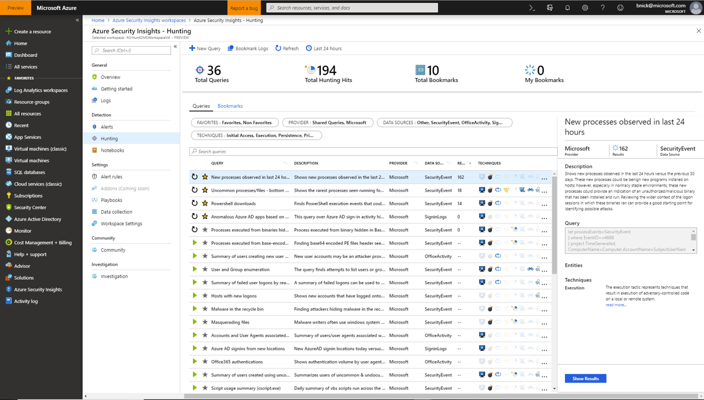

# Keep track of data during hunting
 
Threat hunting typically requires reviewing mountains of log data looking for evidence of malicious behavior. During this process, investigators often find interesting events they want to remember, revisit, and analyze in the context of other events found during an investigation. This is all part of validating potential hypotheses and recording the full story of a compromise.
Hunting bookmarks help you do this, by preserving the queries you ran with query results that you deem relevant. You can also record your contextual observations and reference your findings by adding notes and tags. Bookmarked data is visible to you and your teammates for easy collaboration. This is accomplished using Log Analytics.  

You can revisit your bookmarked data at any time on the **Bookmark** tab of the **Hunting** page. You can use filtering and search options to quickly find specific data for your current investigation. Alternatively, you can view your bookmarked data directly in the **HuntingBookmark** table in Log Analytics. This enables you to filter, summarize, and join bookmarked data with other data sources, making it easy to look for corroborating evidence.

You can also visualize your bookmarked data, by clicking **Investigate**. This launches the investigation experience in which you can view, investigate, and visually communicate your findings using an interactive entity-graph diagram and timeline.

## Add a bookmark

1. In the Azure Sentinel portal, click **Hunting** to run queries for suspicious and anomalous behavior.

1. Select one of the hunting queries and on the left, review the results. The window on the right provides a description of the query, the query syntax itself, a summary of the entities collected, and a summary of the Mitre attack pattern techniques that can be detected when the query is run. 

1. Click **Show results** to view the query results in Log Analytics.
  

1. Add **Bookmarks** to further investigate any row for suspicious activity using a graph-based investigation experience. You can add tags and notes to add contextual information. Tags and comments are shared with other investigators and is a first step toward collaborative investigation experience.
  
2. Select one of the hunting queries that you see on the right, and click **Show results** to view the query results in Log Analytics. 
   > [!NOTE]
   > You will not be able to add a bookmark if you launch Log Analytics from outside of Azure Sentinel.

3. In the Log Analytics query results list, expand the row containing the information that you find interesting.

4. Click the three dots at the end of the row, and select **Add hunting bookmarks**.
5. On the right, in the **Details** page, update the name, and add tags, and notes to help you identify what was interesting about the item.
6. Click **Save** to commit your changes. 

## View and update bookmarks 

1. In the Azure Sentinel portal, click **Hunting**. 
2. Click the **Bookmarks** tab in the middle of the page to view the list of bookmarks.
3. Use the search box or filter options to find a specific bookmark.
4. Select individual bookmarks in the grid below to view the bookmark details in the right hand details pane.
5. To update tags and notes, click on the editable text boxes and click **Save** to preserve your changes.

## View bookmarked data in Log Analytics 

There are multiple options to viewing your bookmarked data in Log Analytics. 

The easiest way to view bookmarked queries, results, or history is by selecting the desired bookmark in the **Bookmarks** table and use the links provided in the details pane. Options include: 
- Click on **View query** to view the source query in Log Analytics.  
- Click on **View bookmark history** to see all bookmark metadata including: who made the update, the updated values, and the time the update occurred. 

- You can also view the raw bookmark data for all bookmarks by clicking on **Bookmark logs** above the bookmark grid. This view will show the all your bookmarks in the hunting bookmark table with associated metadata. You can use KQL queries to filter down to the latest version of the specific bookmark you are looking for.  
You can extract the specific query used in a bookmark, see example below:

You can extract the specific values from a saved result row, see example below:

You can join a bookmark with events from another data source, see example below:

> [!NOTE]
> There can be significant delay (measured in minutes) between the creation of a bookmark and when it is displayed in the **HuntingBookmark** table. It is recommended to create your bookmarks first, then analyze them after the data is ingested. 

## Delete a bookmark
If you want to delete a bookmark do the following: 
1.	Open th **Hunting bookmark** tab. 
2.	Select the target bookmark.
3.	Click on the three dots at the end of the row and select **Delete bookmark**.
	
Deleting the bookmark removes the bookmark from the list in the **Bookmark** tab.  The Log Analytics “HuntingBookmark” table will still continue to contain previous bookmark entries, but the latest entry will change the **SoftDelete** value to true, making it easy to filter out old bookmarks.  Deleting a bookmark does not remove any entities from the investigation experience that are associated with other bookmarks or alerts. 

## Next steps

In this article, you learned how to run a hunting investigation using bookmarks in Azure Sentinel. To learn more about Azure Sentinel, see the following articles:

* [Azure Security Blog](https://blogs.msdn.com/b/azuresecurity/): Find blog posts about Azure security and compliance.