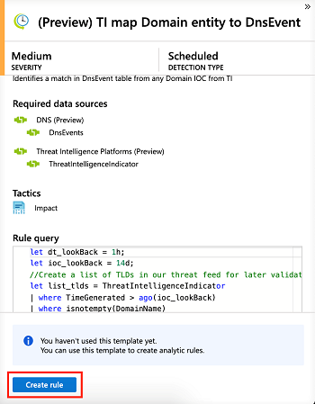

---
title: Investigate alerts with Azure Sentinel| Microsoft Docs
description: Use this tutorial to learn how to investigate alerts with Azure Sentinel.
services: sentinel
documentationcenter: na
author: yelevin
manager: rkarlin
editor: ''

ms.service: azure-sentinel
ms.subservice: azure-sentinel
ms.devlang: na
ms.topic: conceptual
ms.tgt_pltfrm: na
ms.workload: na
ms.date: 09/23/2019
ms.author: yelevin

---
# Tutorial: Detect threats out-of-the-box

> [!IMPORTANT]
> Out-of-the-box threat detection is currently in public preview.
> This feature is provided without a service level agreement, and it's not recommended for production workloads.
> For more information, see [Supplemental Terms of Use for Microsoft Azure Previews](https://azure.microsoft.com/support/legal/preview-supplemental-terms/).

After you [connected your data sources](quickstart-onboard.md) to Azure Sentinel, you want to be notified when something suspicious happens. To enable you to do this, Azure Sentinel provides you with out-of-the-box built-in templates. These templates were designed by Microsoft's team of security experts and analysts based on known threats, common attack vectors, and suspicious activity escalation chains. After enabling these templates, they will automatically search for any activity that looks suspicious across your environment. Many of the templates can be customized to search for, or filter out, activities, according to your needs. The alerts generated by these templates will create incidents that you can assign and investigate in your environment.

This tutorial helps you detect threats with Azure Sentinel:

> [!div class="checklist"]
> * Use out-of-the-box detections
> * Automate threat responses

## About out-of-the-box detections

To view all the out-of-the-box detections, go to **Analytics** and then **Rule templates**. This tab contains all the Azure Sentinel built-in rules.

   

The following template types are available:

- **Microsoft security** - Microsoft security templates automatically create Azure Sentinel incidents from the alerts generated in other Microsoft security solutions, in real time. You can use Microsoft security rules as a template to create new rules with similar logic. For more information about security rules, see [Automatically create incidents from Microsoft security alerts](create-incidents-from-alerts.md).
- **Fusion** - Based on Fusion technology, advanced multistage attack detection in Azure Sentinel uses scalable machine learning algorithms that can correlate many low-fidelity alerts and events across multiple products into high-fidelity and actionable incidents. Fusion is enabled by default. Because the logic is hidden, you cannot use this as a template to create more than one rule.
- **Machine learning behavioral analytics** - These templates are based on proprietary Microsoft machine learning algorithms, so you cannot see the internal logic of how they work and when they run. Because the logic is hidden, you cannot use this as a template to create more than one rule.
-   **Scheduled** – Scheduled analytic rules are scheduled queries written by Microsoft security experts. You can see the query logic and make changes to it. You can use scheduled rules as a template to create new rules with similar logic.

## Use out-of-the-box detections

1. In order to use a built-in template, click on **Create rule** to create a new active rule based on that template. Each entry has a list of required data sources that are automatically checked and this can result in **Create rule** being disabled.
  
   
 
1. This opens the rule creation wizard, based on the selected template. All the details are autofilled, and for **Scheduled rules** or **Microsoft security rules**, you can customize the logic to better suit your organization, or create additional rules based on the built-in template. After following the steps in the rule creation wizard and finished creating a rule based on the template, the new rule appears in the **Active rules** tab.

For more information on the fields in the wizard, see [Tutorial: Create custom analytic rules to detect suspicious threats](tutorial-detect-threats-custom.md).

## Next steps
In this tutorial, you learned how to get started detecting threats using Azure Sentinel. 

To learn how to automate your responses to threats, [Set up automated threat responses in Azure Sentinel](tutorial-respond-threats-playbook.md).

