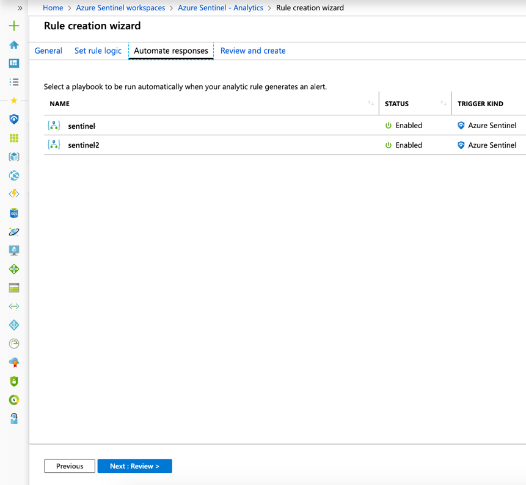
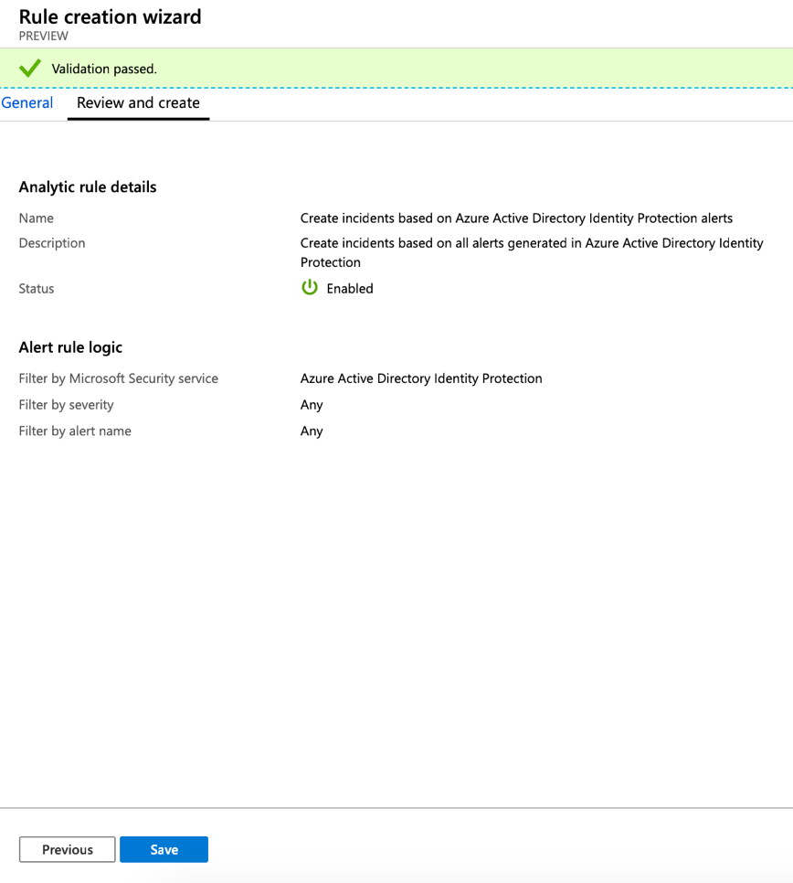

---
title: Create custom analytic rules to detect suspicious threats with Azure Sentinel| Microsoft Docs
description: Use this tutorial to learn how to Create custom analytic rules to detect suspicious threats with Azure Sentinel.
services: sentinel
documentationcenter: na
author: rkarlin
manager: rkarlin
editor: ''

ms.service: azure-sentinel
ms.subservice: azure-sentinel
ms.devlang: na
ms.topic: conceptual
ms.tgt_pltfrm: na
ms.workload: na
ms.date: 09/23/2019
ms.author: rkarlin

---
# Tutorial: Create custom analytic rules to detect suspicious threats

After you [connected your data sources](quickstart-onboard.md) to Azure Sentinel, you can create custom rules that can search for specific criteria across your environment and generate incidents when the criteria are matched so that you can investigate them. This tutorial helps you create custom rules to detect threats with Azure Sentinel.

This tutorial helps you detect threats with Azure Sentinel.
> [!div class="checklist"]
> * Create analytic rules
> * Automate threat responses

## Create custom analytic rules

You can create custom analytic rules to help you search for the types of threats and anomalies that are suspicious in your environment. The rule makes sure you are notified right away, so that you can triage, investigate, and remediate the threats.

1. In the Azure portal under Azure Sentinel, select **Analytics**.

1. In the top menu bar, select **+Create** and select **Scheduled query rule**. This opens the **Custom rule creation wizard**.

    

1. In the **General** tab, provide a descriptive name, and description. Set the **Alert severity** as necessary. When you create the rule you can enable it, which will cause it to run immediately after you finish creating it. If you create it as disabled, the rule will be added to your **Active rules** tab and you can enable it from there when you need it.

    

1. In the **Settings** tab, you can either write a query directly, or create the query in Log Analytics, and then paste it into the **Search query** field. As you change and configure your query, Azure Sentinel simulates the query results in the **Results preview** window, on the right. This enables you to gain insight into how much data would be generated over a specific time interval for the alert you are creating. The amount depends on what you set for **Run query every** and **Lookup data from the last**. If you see that, on average, your alert would trigger alerts too frequently, you can set the number of results higher, so that it's above your average baseline.

   

   Here's a sample query that would alert you when an anomalous number of resources is created in Azure Activity.

    `AzureActivity
    \| where OperationName == "Create or Update Virtual Machine" or OperationName =="Create Deployment"
    \| where ActivityStatus == "Succeeded"
    \| make-series dcount(ResourceId)  default=0 on EventSubmissionTimestamp in range(ago(7d), now(), 1d) by Caller`

   > [!NOTE]
   > The query length should be between 1 and 10,000 characters and cannot contain “search \*” or “union \*”.

    1. Under **Query scheduling**, set the following parameters:

        1.  Set **Run query every** to set the **Frequency** for how often the query is run - as frequently as every 5 minutes or as infrequently as once a day.

        1.  Set **Lookup data from the last** to control the time window for how much data the query runs on - for example, it can run every hour, across 60 minutes of data.

        1. You can set Azure Sentinel to **Stop running the query after alert is generated** if you only want to get alert once after it occurs. You must set the window during which the query should stop running, up to 24 hours.

    1. Define alert trigger conditions under **Alert trigger**. Under **Entity mapping**, you can map the columns in your query to entity fields recognized by Azure Sentinel. For each field, map the relevant column in the query you created in Log Analytics to the appropriate entity field. Each entity includes multiple fields, for example SID and GUID. You can map the entity according to any  fields, not just the upper level entity.

1.  In the **Automate responses** tab, select any playbooks you want to run automatically when an alert is generated by the custom rule. For more information on creating and automating playbooks, see [Respond to threats](tutorial-respond-threats-playbook.md).

    

1. Select **Review** to review all the settings for your new alert rule and then select **Create to initialize your alert rule**.

   

1.  After the alert is created, a custom rule is added to the table under **Active rules**. From this list you can enable, disable, or delete each rule.

1.  To view the results of the alert rules you create, go to the **Incidents** page, where you can triage, [investigate incidents](tutorial-investigate-cases.md), and remediate the threats.

> [!NOTE]
> Alerts generated in Azure Sentinel are available through [Microsoft Graph Security](https://aka.ms/securitygraphdocs). For more information, see the [Microsoft Graph Security alerts documentation](https://aka.ms/graphsecurityreferencebetadocs).

## Next steps

In this tutorial, you learned how to get started detecting threats using Azure Sentinel.

To learn how to automate your responses to threats, [Set up automated threat responses in Azure Sentinel](tutorial-respond-threats-playbook.md).

