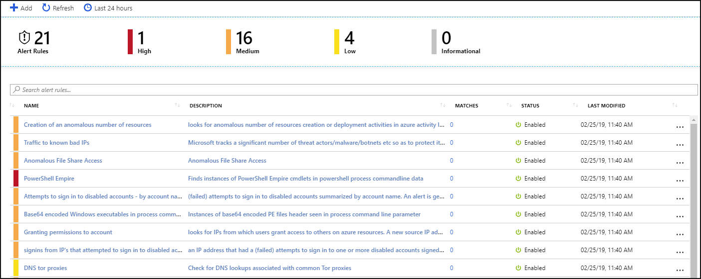

# Tutorial: Detect threats with Azure Sentinel

This tutorial helps you detect threats with Azure Sentinel.

After you [connected your data sources](qs-onboard.md) to Azure Sentinel, you want to be notified when something suspicious happens. To enable you to do this, Azure Sentinel lets you create advanced alert rules, that generate cases that you can assign and use to deeply investigate anomalies and threats in your environment. 

## Create detection rules

To investigate cases, you first have to create detection rules based on the types of threats and anomalies that could be suspicious in your environment that you want to know about right away so they are surfaced, investigated, and remediated. 

1. In the Azure portal under Azure Sentinel, select **Security analytics**.

  

2. In the top menu bar, click **+Add**.  

  

3. Under **Create alert rule**, provide a descriptive name, and set the **Severity** as necessary. 

4. Create the query in Log Analytics, and then paste it into the **Set alert rule** field. Here's a sample query that would alert you when an anomalous number of resources is created in Azure Activity.

        AzureActivity
        | where OperationName == "Create or Update Virtual Machine" or OperationName == "Create Deployment"
        | where ActivityStatus == "Succeeded"
        | make-series dcount(ResourceId)  default=0 on EventSubmissionTimestamp in range(ago(7d), now(), 1d) by Caller

5. In the **Entity mapping** section, use the fields under **Entity type** to map the columns in your query to entity fields recognized by Azure Sentinel. For each field, map the relevant column in the query you created in Log Analytics, to the appropriate entity field. Select the relevant column name under the **Property**. Each entity includes multiple fields, for example SID, GUID, etc. You can map the entity according to any of the fields, not just the upper level entity.

6. Define alert trigger conditions under **Alert trigger**. This defines the conditions that trigger the alert. 

7. Set the **Frequency** for how often the query is run - as frequently as every 5 minutes or as infrequently as once a day. 

8. Set the **Period** to control the time window for how much data the query runs on - for example, it can run every hour across 60 minutes of data.

9. You can also set the **Suppression**. Suppression is useful when you want to stop duplicate alerts from being triggered for the same incident. In this way, you can stop alerts from being triggered during a specific period. This can help you avoid duplicate alerts for the same incident and allow you to suppress consecutive alerts for a period of time. For example, if the **Alert scheduling** **Frequency** is set to 60 minutes, and the **Alert scheduling Period** is set to two hours, and the query results surpassed the defined threshold, it will trigger an alert twice, once when it is first detected over the last 60 minutes, and again when it is in the first 60 minutes of the 2-hour data being sampled. We recommend that if an alert is triggered, the suppression should be for the amount of time set in the alert period. In our example, you might want to set suppression for 60 minutes, so that alerts are only triggered for events that happened during the most recent hour.

8. After you paste your query into the **Set alert rule** field, you can immediately see a simulation of the alert under **Logic alert simulation** so that you can gain understanding of how much data will be generated over a specific time interval for the alert you created. This will depend on what you set for **Frequency** and **Threshold**. If you see that on average, your alert will be triggered too frequently, you will want to set the number of results higher so that it's above your average baseline.

9. Click **Create** to initialize your alert rule. After the alert is created, a case is created that contains the alert. You can see the defined detection rules as rows in the **Security Analytics** tab. You can also see the number of matches for each rule - the alerts triggered. From this list you can enable, disable, or delete each rule. You can also right-click on the three dots at the end of the row for each alert to edit, disable, clone, show matches, or delete a rule. The **Security analytics** page is a gallery of all your active alert rules, including templates you enable and alert rules you create based on templates.

1. The results of the alert rules can be seen in the **Cases** page, where you can triage, investigate, and remediate the threats.

## Investigate cases

A case can include multiple alerts. It's an aggregation of all the relevant evidence for a specific investigation. A case is created based alerts you defined in the **Security analytics** page. The properties related to the alerts, such as severity and status are set at the case level. 
After you let Azure Sentinel know what kinds of threats you're looking for and how to find them, you can monitor threats that are detected. 

1. Select **Cases**. The **Cases** page lets you know how many cases you have, how many are open, how many you've set to **In progress** and how many are closed. For each case, you can see the time it occurred, and the status of the case. Look at the severity to decide what to handle first. In the **Cases** page, click the **Alerts** tab to see all the alerts that are related to a case. Entities that you mapped earlier as part of the case can be viewed in the **Entities** tab.  You can filter the cases as needed, for example by status or severity. When you look at the **Cases** tab, you'll see open cases that contain alerts triggered by your detection rules defined in **Security analytics**. Across the top you'll see your active cases, new cases and in progress cases. You can also see an overview of all your cases by severity.

    

2. To begin an investigation, click on a specific case. On the right, you can see detailed information for the case including its severity, summary of the number of entities involved (based on your mapping). Each case has a unique ID. The severity of the case is determined according to the most severe alert included in the case.  

1. To view more details about the alerts and entities in the case, click on **View full details** in the case page and review the relevant tabs that summarize the case information.  The full case view consolidates all the evidence in the alert, the associated alerts, and entities.

1. In the **Alerts** tab, review the alert itself - when it was triggered and by how much it exceeded the thresholds you set. You can see all relevant information about the alert – the query that triggered the alert, the number of results returned per query, and the ability to run playbooks on the alerts. To drill down even further into the case, click on the number of hits. This opens the query that generated the results adn the results that triggered the alert in Log Analytics.

3. In the **Entities** tab, you can see all the entities that you mapped as part of the alert rule definition. 

4. If you're actively investigating a case, it's a good idea to set the case status to **In progress** until you close it. You can also close the case, where closed resolved  is the status for cases that indicate an incident tha was handled, while **closed dismissed**  is the status for cases that don't require handling. You have to give an explanation for what your reasoning is to close a case.

5. Cases can be assigned to a user. They all start unassigned and you can set as **Assign to me**.  You can go into the cases and filter by your name to see all the cases that are assigned to you.

5. Click **Investigate** to view the investigation map and scope of the breach with remediation steps. 

## Respond to threats

Azure Sentinel gives you two primary options for responding to threats using playbooks. You can set a playbook to run automatically when an alert is triggered, or you can manually run a playbook in response to an alert.

- You can set a playbook to run automatically when an alert is triggered when you configure the playbook. 

- You can manually run a playbook from inside the alert, by clicking **View playbooks** and then selecting a playbook to run.

## Next steps
In this document, you learned how to investigate alerts with Azure Sentinel. To learn more about Azure Sentinel, see the following articles:

* [Azure Security blog](https://blogs.msdn.com/b/azuresecurity/) — Get the latest Azure security news and information.
