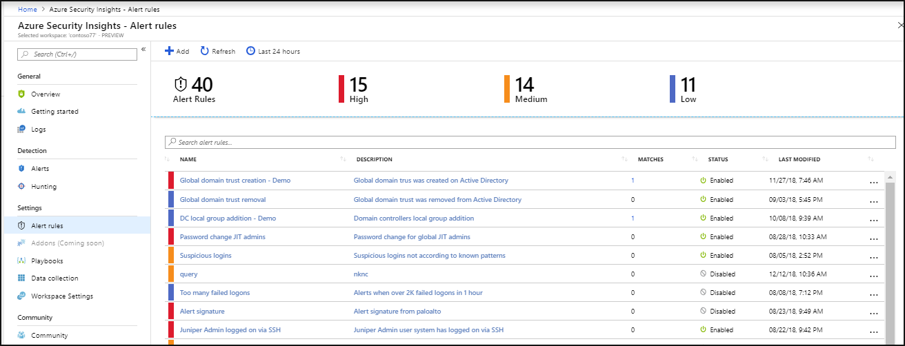
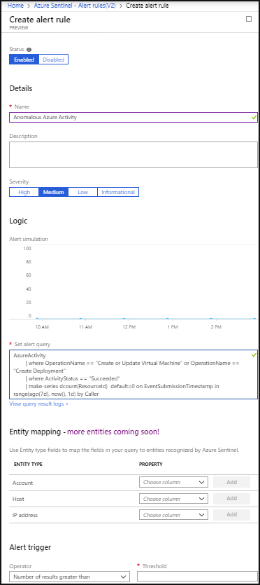
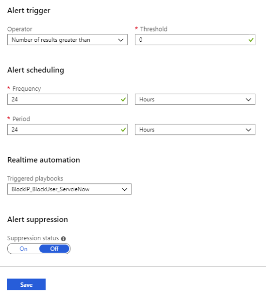

# Tutorial: Detect threats with Azure Sentinel Preview

> [!IMPORTANT]
> Azure Sentinel is currently in public preview.
> This preview version is provided without a service level agreement, and it's not recommended for production workloads. Certain features might not be supported or might have constrained capabilities. 
> For more information, see [Supplemental Terms of Use for Microsoft Azure Previews](https://azure.microsoft.com/support/legal/preview-supplemental-terms/).

After you [connected your data sources](quickstart-onboard.md) to Azure Sentinel, you want to be notified when something suspicious happens. To enable you to do this, Azure Sentinel lets you create advanced alert rules, that generate incidents that you can assign and use to deeply investigate anomalies and threats in your environment. 

This tutorial helps you detect threats with Azure Sentinel.
> [!div class="checklist"]
> * Create detection rules
> * Automate threat responses

## Create detection rules

To investigate incidents, you first have to create detection rules. 

> [!NOTE]
> Alerts generated in Azure Sentinel are available through [Microsoft Graph Security](https://aka.ms/securitygraphdocs). Refer to the [Microsoft Graph Security alerts documentation](https://aka.ms/graphsecurityreferencebetadocs) for further details and integration partners.

Detection rules are based on the types of threats and anomalies that could be suspicious in your environment that you want to know about right away, ensuring they are surfaced, investigated, and remediated. 

1. In the Azure portal under Azure Sentinel, select **Analytics**.

   

2. In the top menu bar, click **+Add**.  

   

3. Under **Create alert rule**, provide a descriptive name, and set the **Severity** as necessary. 

4. Create the query in Log Analytics, and then paste it into the **Set alert rule** field. Here's a sample query that would alert you when an anomalous number of resources is created in Azure Activity.

        AzureActivity
        | where OperationName == "Create or Update Virtual Machine" or OperationName == "Create Deployment"
        | where ActivityStatus == "Succeeded"
        | make-series dcount(ResourceId)  default=0 on EventSubmissionTimestamp in range(ago(7d), now(), 1d) by Caller

   > [!NOTE]
   > The query length should be between 1 to 10000 characters and cannot contain “search *” and “union *”.

5. In the **Entity mapping** section, use the fields under **Entity type** to map the columns in your query to entity fields recognized by Azure Sentinel. For each field, map the relevant column in the query you created in Log Analytics, to the appropriate entity field. Select the relevant column name under the **Property**. Each entity includes multiple fields, for example SID, GUID, etc. You can map the entity according to any of the fields, not just the upper level entity.

6. Define alert trigger conditions under **Alert trigger**. This defines the conditions that trigger the alert. 

7. Set the **Frequency** for how often the query is run - as frequently as every 5 minutes or as infrequently as once a day. 

8. Set the **Period** to control the time window for how much data the query runs on - for example, it can run every hour across 60 minutes of data.

9. You can also set the **Suppression**. Suppression is useful when you want to stop duplicate alerts from being triggered for the same incident. In this way, you can stop alerts from being triggered during a specific period. This can help you avoid duplicate alerts for the same incident and allow you to suppress consecutive alerts for a period of time. For example, if the **Alert scheduling** **Frequency** is set to 60 minutes, and the **Alert scheduling Period** is set to two hours, and the query results surpassed the defined threshold, it will trigger an alert twice, once when it is first detected over the last 60 minutes, and again when it is in the first 60 minutes of the 2-hours of data being sampled. We recommend that if an alert is triggered, the suppression should be for the amount of time set in the alert period. In our example, you might want to set suppression for 60 minutes, so that alerts are only triggered for events that happened during the most recent hour.

8. After you paste your query into the **Set alert rule** field, you can immediately see a simulation of the alert under **Logic alert simulation** so that you can gain understanding of how much data will be generated over a specific time interval for the alert you created. This will depend on what you set for **Frequency** and **Threshold**. If you see that on average, your alert will be triggered too frequently, you will want to set the number of results higher so that it's above your average baseline.

9. Click **Create** to initialize your alert rule. After the alert is created, an incident is created that contains the alert. You can see the defined detection rules as rows in the **Security Analytics** tab. You can also see the number of matches for each rule - the alerts triggered. From this list you can enable, disable, or delete each rule. You can also right-select the ellipsis (...) at the end of the row for each alert to edit, disable, clone, show matches, or delete a rule. The **Analytics** page is a gallery of all your active alert rules, including templates you enable and alert rules you create based on templates.

1. The results of the alert rules can be seen in the **incidents** page, where you can triage, [investigate incidents](tutorial-investigate-cases.md), and remediate the threats.

## Automate threat responses

SIEM/SOC teams can be inundated with security alerts on a regular basis. The volume of alerts generated is so huge, that available security admins are overwhelmed. This results all too often in situations where many alerts can't be investigated, leaving the organization vulnerable to attacks that go unnoticed. 

Many, if not most, of these alerts conform to recurring patterns that can be addressed by specific and defined remediation actions. Azure Sentinel already enables you to define your remediation in playbooks. It is also possible to set real-time automation as part of your playbook definition to enable you to fully automate a defined response to particular security alerts. Using real-time automation, response teams can significantly reduce their workload by fully automating the routine responses to recurring types of alerts, allowing you to concentrate more on unique alerts, analyzing patterns, threat hunting, and more.

To automate responses:

1. Choose the alert for which you want to automate the response.
1. From the Azure Sentinel workspace navigation menu, select **Analytics**.
1. Select the alert you want to automate. 
1. In the **Edit alert rule** page, under **Real-time automation**, choose the **Triggered playbook** you want to run when this alert rule is matched.
1. Select **Save**.

   

In addition, you can manually remediate an alert by running a playbook from inside the alert, by clicking **View playbooks** and then selecting a playbook to run. To learn how to create a new playbook or edit an existing one, see [Working with playbooks in Azure Sentinel](tutorial-respond-threats-playbook.md).

## Next steps
In this tutorial, you learned how to get started detecting threats using Azure Sentinel. 

To learn how to automate your responses to threats, [how to respond to threats using automated playbooks](tutorial-respond-threats-playbook.md).
> [!div class="nextstepaction"]
> [Respond to threats](tutorial-respond-threats-playbook.md) to automate your responses to threats.

