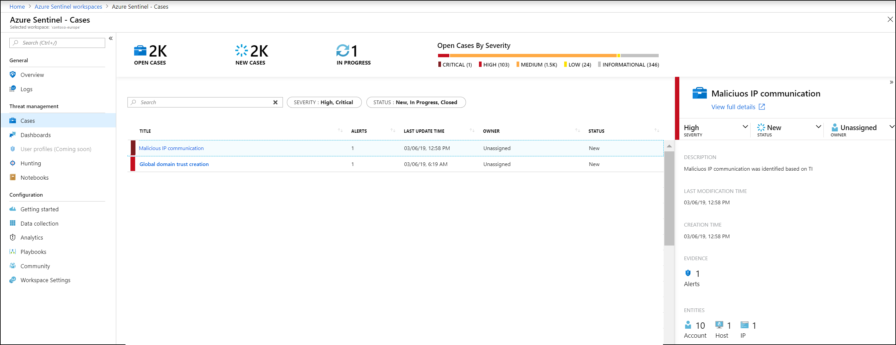

# Tutorial: Investigate incidents with Azure Sentinel Preview

> [!IMPORTANT]
> Azure Sentinel is currently in public preview.
> This preview version is provided without a service level agreement, and it's not recommended for production workloads. Certain features might not be supported or might have constrained capabilities. 
> For more information, see [Supplemental Terms of Use for Microsoft Azure Previews](https://azure.microsoft.com/support/legal/preview-supplemental-terms/).

This tutorial helps you detect threats with Azure Sentinel.

After you [connected your data sources](quickstart-onboard.md) to Azure Sentinel, you want to be notified when something suspicious happens. To enable you to do this, Azure Sentinel lets you create advanced alert rules, that generate incidents that you can assign and use to deeply investigate anomalies and threats in your environment. 

> [!div class="checklist"]
> * Create incidents
> * Investigate incidents
> * Respond to threats

## Investigate incidents

an incident can include multiple alerts. It's an aggregation of all the relevant evidence for a specific investigation. an incident is created based on alerts you defined in the **Analytics** page. The properties related to the alerts, such as severity and status are set at the incident level. 
After you let Azure Sentinel know what kinds of threats you're looking for and how to find them, you can monitor threats that are detected by investigating incidents. 

1. Select **Incidents**. The **Incidents** page lets you know how many incidents you have, how many are open, how many you've set to **In progress**, and how many are closed. For each incident, you can see the time it occurred, and the status of the incident. Look at the severity to decide what to handle first. In the **Incidents** page, click the **Alerts** tab to see all the alerts that are related to an incident. Entities that you mapped earlier as part of the incident can be viewed in the **Entities** tab.  You can filter the incidents as needed, for example by status or severity. When you look at the **Incidents** tab, you'll see open incidents that contain alerts triggered by your detection rules defined in **Analytics**. Across the top you'll see your active incidents, new incidents and in progress incidents. You can also see an overview of all your incidents by severity.

   

2. To begin an investigation, click on a specific incident. On the right, you can see detailed information for the incident including its severity, summary of the number of entities involved (based on your mapping). Each incident has a unique ID. The severity of the incident is determined according to the most severe alert included in the incident.  

1. To view more details about the alerts and entities in the incident, click on **View full details** in the incident page and review the relevant tabs that summarize the incident information.  Full incident view consolidates all evidence in the alert, the associated alerts, and entities.

1. In the **Alerts** tab, review the alert itself - when it was triggered and by how much it exceeded the thresholds you set. You can see all relevant information about the alert – the query that triggered the alert, the number of results returned per query, and the ability to run playbooks on the alerts. To drill down even further into the incident, click on the number of hits. This opens the query that generated the results and the results that triggered the alert in Log Analytics.

3. In the **Entities** tab, you can see all the entities that you mapped as part of the alert rule definition. 

4. If you're actively investigating an incident, it's a good idea to set the incident status to **In progress** until you close it. You can also close the incident, where **closed resolved** is the status for incidents that indicate that an incident was handled, while **closed dismissed**  is the status for incidents that don't require handling. Explanations are required explaining your reasoning for closing an incident.

5. Incidents can be assigned to a specific user. For each incident you can assign an owner, by setting the incident **owner** field. All incidents start as unassigned. You can go into the incidents and filter by your name to see all the incidents that you own. 

5. Click **Investigate** to view the investigation map and scope of the breach with remediation steps. 

## Respond to threats

Azure Sentinel gives you two primary options for responding to threats using playbooks. You can set a playbook to run automatically when an alert is triggered, or you can manually run a playbook in response to an alert.

- You can set a playbook to run automatically when an alert is triggered when you configure the playbook. 

- You can manually run a playbook from inside the alert, by clicking **View playbooks** and then selecting a playbook to run.

## Next steps
In this tutorial, you learned how to get started investigating incidents using Azure Sentinel. Continue to the tutorial for [how to respond to threats using automated playbooks](tutorial-respond-threats-playbook.md).
> [!div class="nextstepaction"]
> [Respond to threats](tutorial-respond-threats-playbook.md) to automate your responses to threats.

