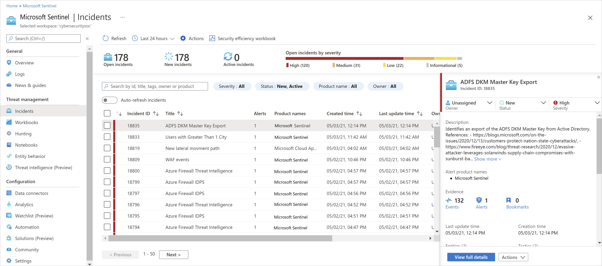
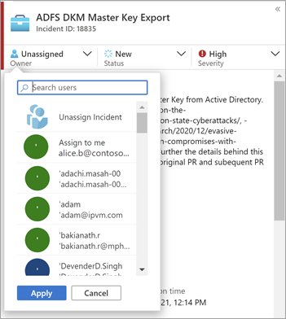
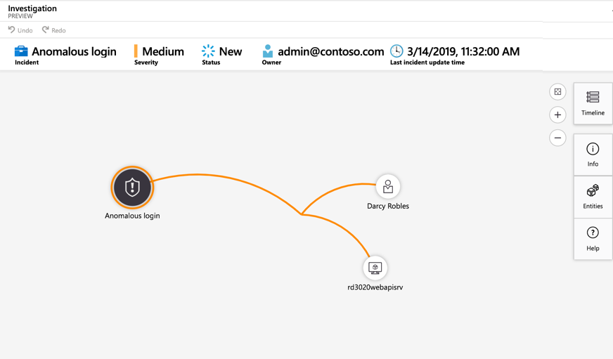
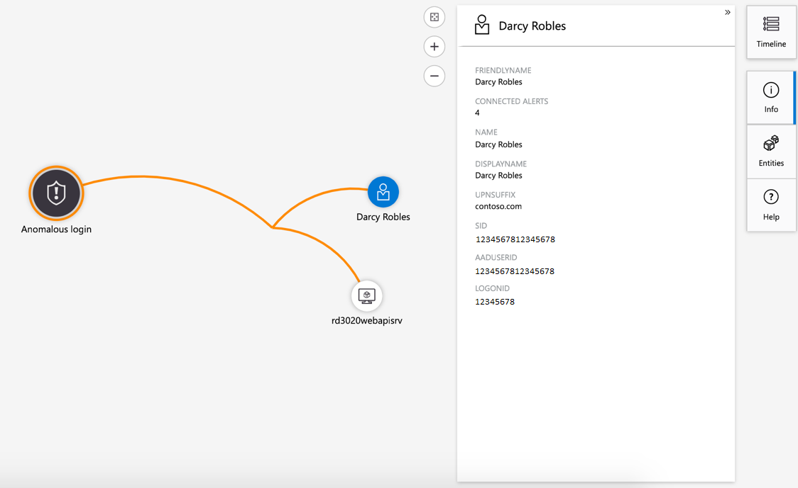
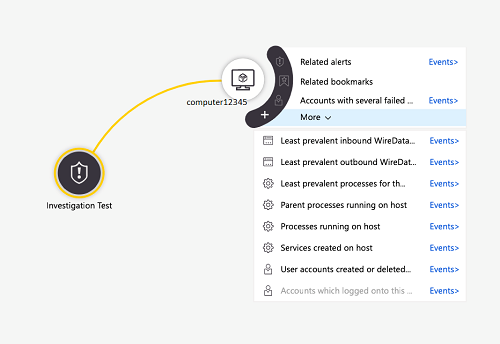
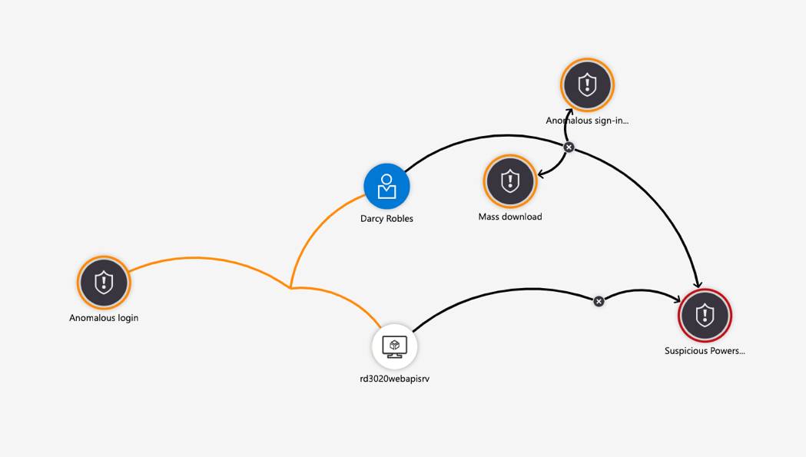
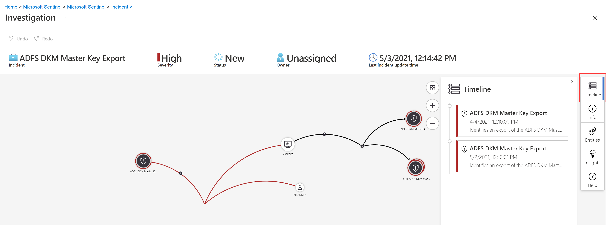
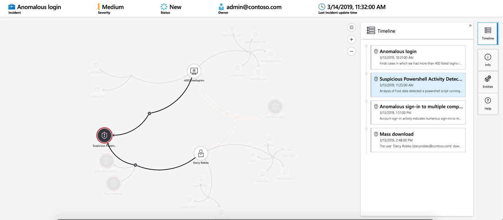

---
title: Investigate incidents with Azure Sentinel| Microsoft Docs
description: In this tutorial, learn how to use Azure Sentinel to create advanced alert rules that generate incidents you can assign and investigate.
services: sentinel
documentationcenter: na
author: yelevin
manager: rkarlin
editor: ''

ms.service: azure-sentinel
ms.subservice: azure-sentinel
ms.devlang: na
ms.topic: conceptual
ms.tgt_pltfrm: na
ms.workload: na
ms.date: 09/23/2019
ms.author: yelevin

---
# Tutorial: Investigate incidents with Azure Sentinel

> [!IMPORTANT]
> The investigation graph is currently in public preview.
> This feature is provided without a service level agreement, and it's not recommended for production workloads.
> For more information, see [Supplemental Terms of Use for Microsoft Azure Previews](https://azure.microsoft.com/support/legal/preview-supplemental-terms/).

This tutorial helps you investigate incidents with Azure Sentinel. After you connected your data sources to Azure Sentinel, you want to be notified when something suspicious happens. To enable you to do this, Azure Sentinel lets you create advanced alert rules, that generate incidents that you can assign and investigate.

This article covers:
> [!div class="checklist"]
> * Investigate incidents
> * Use the investigation graph
> * Respond to threats

An incident can include multiple alerts. It's an aggregation of all the relevant evidence for a specific investigation. An incident is created based on analytic rules that you created in the **Analytics** page. The properties related to the alerts, such as severity, and status, are set at the incident level. After you let Azure Sentinel know what kinds of threats you're looking for and how to find them, you can monitor detected threats by investigating incidents.

## Prerequisites
You'll only be able to investigate the incident if you used the entity mapping fields when you set up your analytic rule. The investigation graph requires that your original incident includes entities.

## How to investigate incidents

1. Select **Incidents**. The **Incidents** page lets you know how many incidents you have, how many are open, how many you've set to **In progress**, and how many are closed. For each incident, you can see the time it occurred, and the status of the incident. Look at the severity to decide which incidents to handle first.

    

1. You can filter the incidents as needed, for example by status or severity.

1. To begin an investigation, select a specific incident. On the right, you can see detailed information for the incident including its severity, summary of the number of entities involved, the raw events that triggered this incident, and the incident’s unique ID.

1. To view more details about the alerts and entities in the incident, select **View full details** in the incident page and review the relevant tabs that summarize the incident information. In the **Alerts** tab, review the alert itself. You can see all relevant information about the alert – the query that triggered the alert, the number of results returned per query, and the ability to run playbooks on the alerts. To drill down even further into the incident, select the number of **Events**. This opens the query that generated the results and the events that triggered the alert in Log Analytics. In the **Entities** tab, you can see all the entities that you mapped as part of the alert rule definition.

    

1. If you're actively investigating an incident, it's a good idea to set the incident's status to **In progress** until you close it.

1. Incidents can be assigned to a specific user. For each incident you can assign an owner, by setting the **Incident owner** field. All incidents start as unassigned. You can also add comments so that other analysts will be able to understand what you investigated and what your concerns are around the incident.

    

1. Select **Investigate** to view the investigation map.

## Use the investigation graph to deep dive

The investigation graph enables analysts to ask the right questions for each investigation. The investigation graph helps you understand the scope, and identify the root cause, of a potential security threat by correlating relevant data with any involved entity. You can dive deeper and investigate any entity presented in the graph by selecting it and choosing between different expansion options.  
  
The investigation graph provides you with:

- **Visual context from raw data**: The live, visual graph displays entity relationships extracted automatically from the raw data. This enables you to easily see connections across different data sources.

- **Full investigation scope discovery**: Expand your investigation scope using built-in exploration queries to surface the full scope of a breach.

- **Built-in investigation steps**: Use predefined exploration options to make sure you are asking the right questions in the face of a threat.

To use the investigation graph:

1. Select an incident, then select **Investigate**. This takes you to the investigation graph. The graph provides an illustrative map of the entities directly connected to the alert and each resource connected further.

   > [!IMPORTANT] 
   > You'll only be able to investigate the incident if you used the entity mapping fields when you set up your analytic rule. The investigation graph requires that your original incident includes entities.

   

1. Select an entity to open the **Entities** pane so you can review information on that entity.

    
  
1. Expand your investigation by hovering over each entity to reveal a list of questions that was designed by our security experts and analysts per entity type to deepen your investigation. We call these options **exploration queries**.

    

   For example, on a computer you can request related alerts. If you select an exploration query, the resulting entitles are added back to the graph. In this example, selecting **Related alerts** returned the following alerts into the graph:

    

1. For each exploration query, you can select the option to open the raw event results and the query used in Log Analytics, by selecting **Events\>**.

1. In order to understand the incident, the graph gives you a parallel timeline.

    

1. Hover over the timeline to see which things on the graph occurred at what point in time.

    

## Closing an incident

Once you have resolved a particular incident (for example, when your investigation has reached its conclusion), you should set the incident’s status to **Closed**. When you do so, you will be asked to classify the incident by specifying the reason you are closing it. This step is mandatory. Click **Select classification** and choose one of the following from the drop-down list:

- True Positive - suspicious activity
- Benign Positive - suspicious but expected
- False Positive - incorrect alert logic
- False Positive - incorrect data
- Undetermined

:::image type="content" source="media/tutorial-investigate-cases/closing-reasons-dropdown.png" alt-text="{alt-text}":::

After choosing the appropriate classification, add some descriptive text in the **Comment** field. This will be useful in the event you need to refer back to this incident. Click **Apply** when you’re done, and the incident will be closed.

:::image type="content" source="media/tutorial-investigate-cases/closing-reasons-comment-apply.png" alt-text="{alt-text}":::

## Next steps
In this tutorial, you learned how to get started investigating incidents using Azure Sentinel. Continue to the tutorial for [how to respond to threats using automated playbooks](tutorial-respond-threats-playbook.md).
> [!div class="nextstepaction"]
> [Respond to threats](tutorial-respond-threats-playbook.md) to automate your responses to threats.

