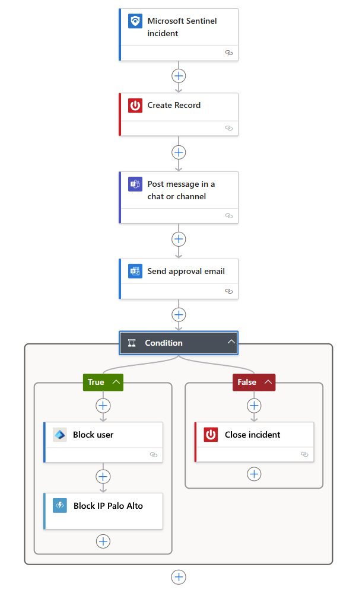

# Tutorial: Use playbooks to automate threat responses in Azure Sentinel

This tutorial helps you to use playbooks in Azure Sentinel to set automated threat responses to security-related issues detected by Azure Sentinel. When you complete this tutorial you will be able to:

> [!div class="checklist"]
> * Understand playbooks
> * Create a playbook
> * Run a playbook
> * Automate threat responses

## What is a playbook in Azure Sentinel?

A Playbook is a collection of procedures that can be run from Azure Sentinel in response to an alert or incident. A playbook can help automate and orchestrate your response, and can be run manually or set to run automatically when specific alerts or incidents are created. Playbooks in Azure Sentinel are based on workflows built in [Azure Logic Apps](../logic-apps/logic-apps-overview.md), which means that you get all the power, customizability, and built-in templates of Logic Apps. Each playbook is created for the specific subscription to which it belongs, but the Playbooks page shows you all the playbooks available across any selected subscriptions.

> [!NOTE]
> Playbooks make use of Azure Logic Apps, so additional charges may apply. Visit the [Azure Logic Apps](https://azure.microsoft.com/pricing/details/logic-apps/) pricing page for more details.

For example, if you're worried about malicious attackers accessing your network resources, you can set an alert that looks for malicious IP addresses accessing your network. Then, you can create a playbook that does the following:

1. When the alert is triggered, open a ticket in ServiceNow or any other IT ticketing system.

1. Send a message to your security operations channel in Microsoft Teams or Slack to make sure your security analysts are aware of the incident.

1. Send all the information in the alert to your senior network admin and security admin. The email message will include **Block** and **Ignore** user option buttons.

1. The playbook waits until a response is received from the admins, then continues with its next steps.

1. If the admins choose **Block**, the IP address is blocked in the firewall and the user is disabled in Azure AD.

1. If the admins choose **Ignore**, the alert is closed in Azure Sentinel and the incident is closed in ServiceNow.

Playbooks can be run either manually or automatically. Running them manually means that when you get an alert, you can choose to run a playbook on-demand as a response to the selected alert. Running them automatically means that while creating the analytics rule, you set it to automatically run one or more playbooks when the alert is triggered.

[Get a more complete and detailed introduction to automating threat response with playbooks in Azure Sentinel](automate-responses-with-playbooks.md).

## Create a playbook

Follow these steps to create a new playbook in Azure Sentinel:

### Prepare the playbook and Logic App

1. From the **Azure Sentinel** navigation menu, select **Automation**.

1. On the top menu, select **Create** and **Add new playbook**.

    :::image type="content" source="./media/tutorial-respond-threats-playbook/add-new-playbook.png" alt-text="Create a new playbook":::

    A new browser tab will open and take you to the **Create a logic app** wizard.

   :::image type="content" source="./media/tutorial-respond-threats-playbook/create-playbook.png" alt-text="Create a new playbook":::

1. Enter your **Subscription** and **Resource group**, and give your playbook a name under **Logic app name**.

1. For **Region**, select the Azure region where your Logic App information is to be stored.

1. If you want to monitor this playbook's activity for diagnostic purposes, mark the **Enable log analytics** check box, and enter your **Log Analytics workspace** name.

1. If you want to apply tags to your playbook, click **Next : Tags >** ([Learn more about tags](../azure-resource-manager/management/tag-resources.md)). Otherwise, click **Review + Create**. Confirm the details you provided, and click **Create**.

1. While your playbook is being created and deployed (this will take a few minutes), you will be taken to a screen called **Microsoft.EmptyWorkflow**. When the "Your deployment is complete" message appears, click **Go to resource.** 

1. You will be taken to your new playbook's [Logic Apps Designer](../logic-apps/logic-apps-overview.md), where you can start designing the workflow. You'll see a screen with a short introductory video and some commonly used Logic App triggers and templates.

1. Select the **Blank Logic App** template.

   :::image type="content" source="./media/tutorial-respond-threats-playbook/choose-playbook-template.png" alt-text="Logic Apps Designer template gallery":::

### Choose the trigger

Every playbook must start with a trigger. The trigger defines the action that will start the playbook and the schema that the playbook will expect to receive.

1. In the search bar, look for Azure Sentinel. Select **Azure Sentinel** when it appears in the results.

1. In the resulting **Triggers** tab, you will see the two triggers offered by Azure Sentinel:
    - When a response to an Azure Sentinel Alert is triggered
    - When Azure Sentinel incident creation rule was triggered

   Choose the trigger that matches the type of playbook you are creating.

    :::image type="content" source="./media/tutorial-respond-threats-playbook/choose-trigger.png" alt-text="Choose a trigger for your playbook":::
======================================================================
1. You are taken to the Logic App Designer template builder, where you can either build a new template or edit an existing one. [Learn more](../logic-apps/logic-apps-create-logic-apps-from-templates.md) about creating a playbook with Logic Apps.

1. If you are creating a blank playbook, type *Azure Sentinel* in the **Search connectors and triggers** field, and select **When a response to an Azure Sentinel alert is triggered** from the search results. 

   After it is created, the new playbook appears in the **Playbooks** list. If it doesn’t appear, click **Refresh**.

1. Use the **Get entities** functions, which enable you to get the relevant entities from inside the **Entities** list, such as accounts, IP addresses and hosts. This will enable you to run actions on specific entities.

1. Now you can define what happens when you trigger the playbook. You can add an action, logical condition, switch case conditions, or loops.

   

## How to run a security playbook

You can run a playbook on demand.

To run a playbook on-demand:

1. In the **incidents** page, select an incident and click on **View full details**.

2. In the **Alerts** tab, click on the alert you want to run the playbook on, and scroll all the way to the right and click **View playbooks** and select a playbook to **run** from the list of available playbooks on the subscription. 

## Automate threat responses

SIEM/SOC teams can be inundated with security alerts on a regular basis. The volume of alerts generated is so huge, that available security admins are overwhelmed. This results all too often in situations where many alerts can't be investigated, leaving the organization vulnerable to attacks that go unnoticed. 

Many, if not most, of these alerts conform to recurring patterns that can be addressed by specific and defined remediation actions. Azure Sentinel already enables you to define your remediation in playbooks. It is also possible to set real-time automation as part of your playbook definition to enable you to fully automate a defined response to particular security alerts. Using real-time automation, response teams can significantly reduce their workload by fully automating the routine responses to recurring types of alerts, allowing you to concentrate more on unique alerts, analyzing patterns, threat hunting, and more.

To automate responses:

1. Select the alert for which you want to automate the response.
1. In the **Edit alert rule** page, under **Real-time automation**, choose the **Triggered playbook** you want to run when this alert rule is matched.
1. Select **Save**.

   

## Next steps

In this tutorial, you learned how to run a playbook in Azure Sentinel. Continue to the [how to proactively hunt for threats](hunting.md) using Azure Sentinel.