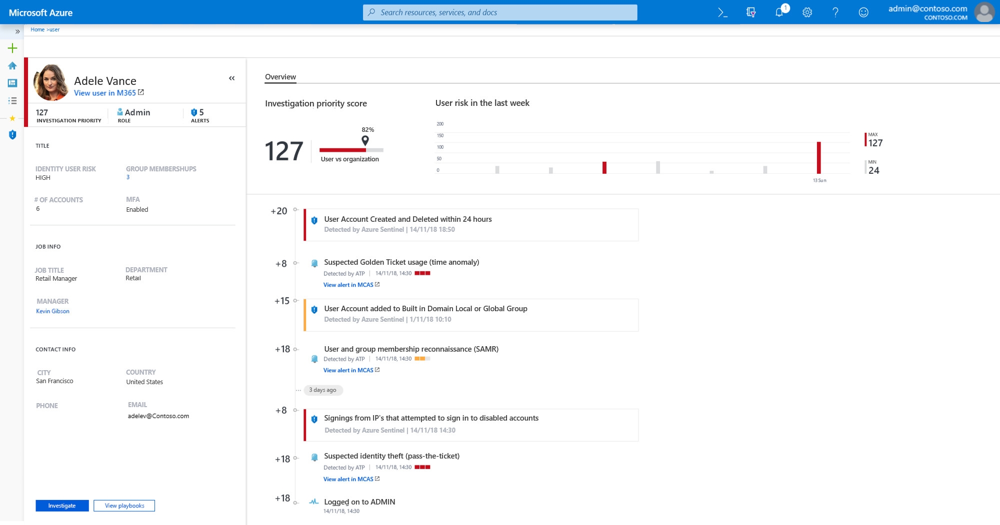
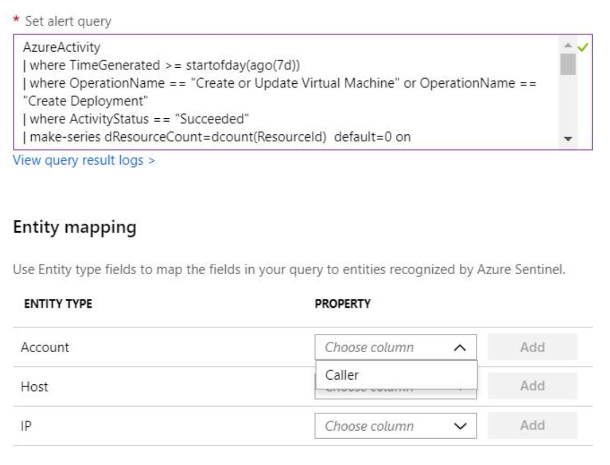

# Investigate users with user analytics

> [!IMPORTANT]
> Azure Sentinel is currently in public preview.
> This preview version is provided without a service level agreement, and it's not recommended for production workloads. Certain features might not be supported or might have constrained capabilities. 
> For more information, see [Supplemental Terms of Use for Microsoft Azure Previews](https://azure.microsoft.com/support/legal/preview-supplemental-terms/).

Users are entities you want to monitor closely. To help you get insights into your users, Azure Sentinel seamlessly integrates with Azure Advanced Threat Protection. This integration lets you analyze user behavior and prioritize which users you should investigate first, based on their alerts, and suspicious activity patterns across Azure Sentinel and Microsoft 365.

Azure Sentinel enriches your user data with analytics from Microsoft 365 to enable comprehensive user analytics and risk analysis for all users in Azure Active Directory. 

## How it works

1. Based on the your security analytic rules, when a match is detected, Azure Sentinel sends the alerts to Azure ATP.
1. Azure ATP checks which user entities are related to the alerts, and calculates the investigation priority for those users.
3. Azure ATP then recalculates the score of the users after it is enriched with data from your analytics rules for Azure Sentinel.

## Prerequisites

- An Azure Advanced Threat Protection license 
- To enable the feature, you need global admin permissions on the tenant in which you installed Azure Sentinel

> [!NOTE]
> - For each Azure ATP tenant, you can connect one Azure Sentinel instance.
> - User analytics is currently available only for Azure Active Directory users. 

## Enable user analytics

1. To enable user analytics in Azure Sentinel, in the portal go to the **User analytics** page, and click **Enable**. This sends information about the workspace to Azure ATP.

1. Then, it takes you to Azure ATP. Under **Security extensions** in the **Microsoft Azure Sentinel** tab, click the **+plus** to add and then select the workspace. 
1. Click **Connect**.

## Investigate a user

1. In the Azure Sentinel menu under **User analytics**, review the list of users according to their investigation priority. The score is based on Azure Sentinel alerts, and Microsoft 365 alerts.

2. Search for a user that you want to investigate. Click on the user to get to the user page. Review the user's activities and alerts, over time, on the timeline. You can see all activities from Microsoft 365 and Azure Sentinel. You can also reach the user page by drilling down into the users from within a case.
      
    

 
3. For this to work well, you have to properly set up the [custom alert rule](tutorial-detect-threats.md) to map the right user identifiers to the **account** entity.

    - For Windows events, map **Account** to the **SID**
    - Azure AD data (which can be found in many logs including Azure Activity) or Office 365 data, map the **Account** property to the **GUID**, or the **User Principal Name**. 

   

For example: 
> [!NOTE]
> In activity logs of Azure Activity, the caller entity includes the UPN.

1. This query searches for creation of an anomalous number of resources or deployment activities in Azure Activity Log.

        AzureActivity      
        | where TimeGenerated >= startofday(ago(7d))        
        | where OperationName == "Create or Update Virtual Machine" or OperationName == "Create Deployment"        
        | where ActivityStatus == "Succeeded"        
        | make-series dResourceCount=dcount(ResourceId)  default=0 on EventSubmissionTimestamp in range(startofday(ago(7d)), now(), 1d) by Caller        
        | extend (RSquare,Slope,Variance,RVariance,Interception,LineFit)=series_fit_line(dResourceCount)        
        | where Slope > 0.2        
        | join kind=leftsemi (        
        // Last day's activity is anomalous        
        AzureActivity        
        | where TimeGenerated >= startofday(ago(1d))        
        | where OperationName == "Create or Update Virtual Machine" or OperationName == "Create Deployment"        
        | where ActivityStatus == "Succeeded"        
        | make-series dResourceCount=dcount(ResourceId)  default=0 on EventSubmissionTimestamp in range(startofday(ago(1d)), now(), 1d) by Caller        
        | extend (RSquare,Slope,Variance,RVariance,Interception,LineFit)=series_fit_line(dResourceCount)        
        | where Slope >0.2        
        ) on Caller        
        | extend AccountCustomEntity = Caller
 
2. In the custom alert rule, map the **Account** property to **Caller**.
   
   

3. Investigate the user in the user investigation window. For advice about how to investigate users, see [Tutorial: Investigate a user](https://docs.microsoft.com/azure-advanced-threat-protection/investigate-a-user).

## Next steps

In this document, you learned how to connect your Threat Intelligence provider to Azure Sentinel. To learn more about Azure Sentinel, see the following articles.

- To get started with Azure Sentinel, you need a subscription to Microsoft Azure. If you do not have a subscription, you can sign up for a [free trial](https://azure.microsoft.com/free/).
- Learn how to [onboard your data to Azure Sentinel](quickstart-onboard.md), and [get visibility into your data, and potential threats](quickstart-get-visibility.md).
