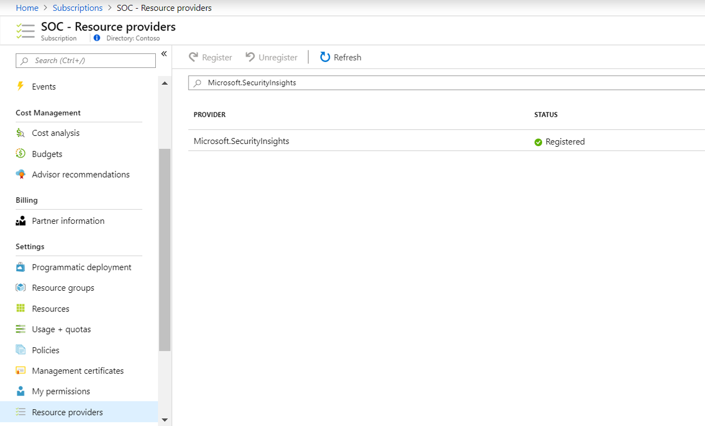
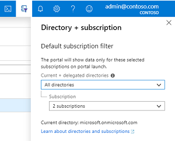

# Using Azure Sentinel across workspaces and tenants

## The need to use multiple Azure Sentinel workspaces

Azure Sentinel is built on top of a Log Analytics workspace. As such, the first thing you'll do in setting up Azure Sentinel will be selecting the Log Analytics workspace you wish to work with.

You can benefit from the full Azure Sentinel experience when using a single workspace. However, there are some reasons to have multiple workspaces. The following table lists situations that may require the use of multiple Azure Sentinel workspaces, and, when possible, suggests how the requirement may be satisfied with a single workspace:

| Requirement | Description | Ways to reduce workspace count |
|-------------|-------------|--------------------------------|
| Sovereignty and regulatory compliance | A workspace is deployed in a region. If data needs to be kept in a different geography due to regulatory requirements, it needs to be split to multiple workspaces. |  |
| Data ownership | Data ownership, for example by subsidiaries or affiliated companies, is better delineated using workspace boundaries. |  |
| Multiple Azure tenants | Azure Sentinel supports collection from Microsoft and Azure resources only within an Azure AD tenant boundary. Therefore, each Azure AD tenant requires a separate workspace. |  |
| Granular data access control | Some organizations may need to provide access to some of the data collected by Azure Sentinel to different groups in, or outside of, the organization. For example: <ul><li>Provide access to resource owners to data pertaining to their resources.</li><li>Providing a regional or subsidiary SOC access to data relevant to their part of the organization.</li></ul> | Use [resource RBAC](https://techcommunity.microsoft.com/t5/azure-sentinel/controlling-access-to-azure-sentinel-data-resource-rbac/ba-p/1301463) or [table level RBAC](https://techcommunity.microsoft.com/t5/azure-sentinel/table-level-rbac-in-azure-sentinel/ba-p/965043) |
| Granular retention settings | Historically, multiple workspaces were used to set different retention periods to different data types. This is no longer needed in many cases due to the introduction of table level retention settings. | Use [table level retention setting](https://techcommunity.microsoft.com/t5/azure-sentinel/new-per-data-type-retention-is-now-available-for-azure-sentinel/ba-p/917316) or automate [data deletion](https://docs.microsoft.com/en-gb/azure/azure-monitor/platform/personal-data-mgmt#how-to-export-and-delete-private-data) |
| Split billing | By placing workspaces in separate subscriptions, they can be billed to different parties. | Usage reporting and cross-charging |
| Legacy architecture | The use of multiple workspaces may stem from a historical design that took into consideration limitations or best practices which do not hold true anymore. It might also be an arbitrary design choice that can be modified to better accommodate Azure Sentinel.  Examples include: <ul><li>Using a per-subscription default workspace when deploying Azure Security Center</li><li>The need for granular access control or retention settings, the solutions for which are relatively new</li></ul> | Re-architect workspaces |

### Managed Security Service Provider (MSSP)

A particular use case that mandates multiple workspaces is an MSSP Azure Sentinel service. In this case, many if not all of the above requirements apply, making multiple workspaces, across tenants, the best practice.

## Azure Sentinel multiple workspace architecture

In some scenarios, as implied by the requirements above, multiple Azure Sentinel workspaces, potentially across Azure AD tenants, need to be centrally monitored and managed by a single SOC.

- An MSSP Azure Sentinel Service.
- A global SOC serving multiple subsidiaries, each with their own local SOC.
- A SOC monitoring multiple Azure AD tenants within an organization.

To address this requirement, Azure Sentinel offers multi-workspace capabilities that enable central monitoring, configuration, and management, providing a single pane of glass across multiple workspaces, as presented in the diagram below.

=============================================================================

If you're a managed security service provider (MSSP) and you're using [Azure Lighthouse](../lighthouse/overview.md) to manage your customers' security operations centers (SOC), you will be able to manage your customers' Azure Sentinel resources without connecting directly to the customer's tenant, from your own Azure tenant. 

## Prerequisites
- [Onboard Azure Lighthouse](../lighthouse/how-to/onboard-customer.md)
- For this to work properly, your tenant must be registered to the Azure Sentinel Resource Provider on at least one subscription. If you have a registered Azure Sentinel in your tenant, you are ready to get started. If not, select **Subscriptions** from the Azure portal, followed by **Resource providers**.  Then, from the **SOC - Resource providers** screen, search for and select `Microsoft.OperationalInsights` and `Microsoft.SecurityInsights`, and select **Register**.
   
## How to access Azure Sentinel from other tenants
1. Under **Directory + subscription**, select the delegated directories, and the subscriptions where your customer's Azure Sentinel workspaces are located.

   

1. Open Azure Sentinel. You will see all the workspaces in the selected subscriptions, and you'll be able to work with them seamlessly, like any workspace in your own tenant.

> [!NOTE]
> You will not be able to deploy connectors in Azure Sentinel from within a managed workspace. To deploy a connector, you must directly sign into the tenant on which you want to deploy a connector and authenticate there with the required permissions.

## Next steps
In this document, you learned how to manage multiple Azure Sentinel tenants seamlessly. To learn more about Azure Sentinel, see the following articles:
- Learn how to [get visibility into your data, and potential threats](quickstart-get-visibility.md).
- Get started [detecting threats with Azure Sentinel](tutorial-detect-threats-built-in.md).

