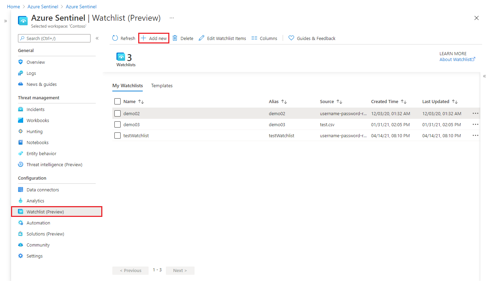
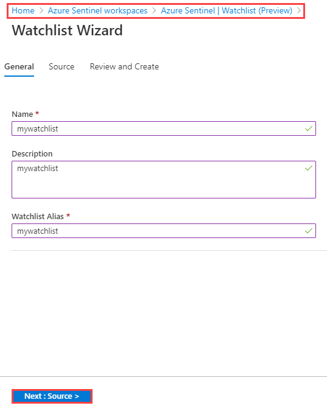
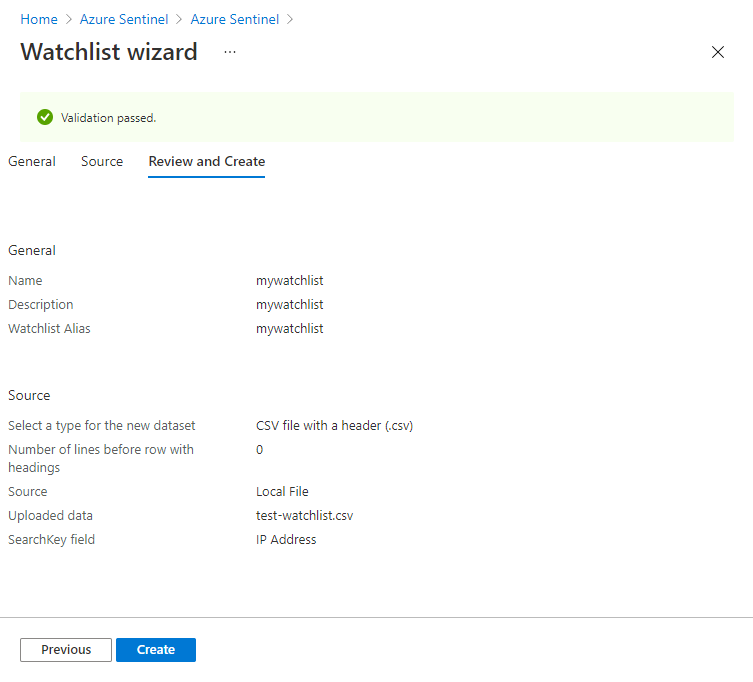
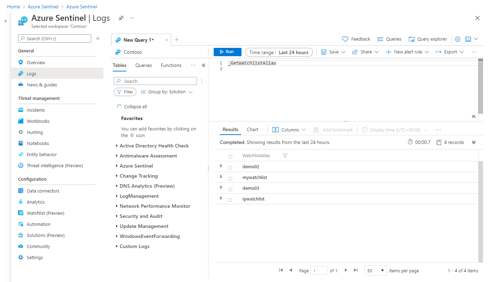

# Use Azure Sentinel watchlists

> [!IMPORTANT]
> The watchlists feature is currently in **PREVIEW**. See the [Supplemental Terms of Use for Microsoft Azure Previews](https://azure.microsoft.com/support/legal/preview-supplemental-terms/) for additional legal terms that apply to Azure features that are in beta, preview, or otherwise not yet released into general availability.

Azure Sentinel watchlists enable the collection of data from external data sources for correlation with the events in your Azure Sentinel environment. Once created, you can use watchlists in your search, detection rules, threat hunting, and response playbooks. Watchlists are stored in your Azure Sentinel workspace as name-value pairs and are cached for optimal query performance and low latency.

Common scenarios for using watchlists include:

- **Investigating threats** and responding to incidents quickly with the rapid import of IP addresses, file hashes, and other data from CSV files. Once imported, you can use watchlist name-value pairs for joins and filters in alert rules, threat hunting, workbooks, notebooks, and general queries.

- **Importing business data** as a watchlist. For example, import user lists with privileged system access, or terminated employees, and then use the watchlist to create allow and deny lists used to detect or prevent those users from logging in to the network.

- **Reducing alert fatigue**. Create allow lists to suppress alerts from a group of users, such as users from authorized IP addresses that perform tasks that would normally trigger the alert, and prevent benign events from becoming alerts.

- **Enriching event data**. Use watchlists to enrich your event data with name-value combinations derived from external data sources.

## Create a new watchlist

1. From the Azure portal, navigate to **Azure Sentinel** > **Configuration** > **Watchlist** and then select **Add new**.

    > [!div class="mx-imgBorder"]
    > 

1. On the **General** page, provide the name, description, and alias for the watchlist, and then select **Next**.

    > [!div class="mx-imgBorder"]
    > 

1. On the **Source** page, select the dataset type, upload a file, and then select **Next**.

    :::image type="content" source="./media/watchlists/sentinel-watchlist-source.png" alt-text="watchlist source page" lightbox="./media/watchlists/sentinel-watchlist-source.png":::

    > [!NOTE]
    >
    > File uploads are currently limited to files of up to 3.8 MB in size.

1. Review the information, verify that it is correct, and then select **Create**.

    > [!div class="mx-imgBorder"]
    > 

    A notification appears once the watchlist is created.

    :::image type="content" source="./media/watchlists/sentinel-watchlist-complete.png" alt-text="watchlist successful creation notification" lightbox="./media/watchlists/sentinel-watchlist-complete.png":::

## Use watchlists in queries

1. From the Azure portal, navigate to **Azure Sentinel** > **Configuration** > **Watchlist**, select the watchlist you want to use, and then select **View in Log Analytics**.

    :::image type="content" source="./media/watchlists/sentinel-watchlist-queries-list.png" alt-text="use watchlists in queries" lightbox="./media/watchlists/sentinel-watchlist-queries-list.png":::

1. The items in your watchlist are automatically extracted for your query, and will appear on the **Results** tab. The example below shows the results of the extraction of the **ServerName** and **IpAddress** fields.

    > [!NOTE]
    > The timestamp on your queries will be ignored in both the query UI and in scheduled alerts.

    :::image type="content" source="./media/watchlists/sentinel-watchlist-queries-fields.png" alt-text="queries with watchlist fields" lightbox="./media/watchlists/sentinel-watchlist-queries-fields.png":::
    
1. You can query data in any table against data from a watchlist by treating the watchlist as a table for joins and lookups.

    ```kusto
    Heartbeat
    | lookup kind=leftouter _GetWatchlist('IPlist') 
     on $left.ComputerIP == $right.IPAddress
    ```
    :::image type="content" source="./media/watchlists/sentinel-watchlist-queries-join.png" alt-text="queries against watchlist as lookup":::

## Use watchlists in analytics rules

To use watchlists in analytics rules, from the Azure portal, navigate to **Azure Sentinel** > **Configuration** > **Analytics**, and create a rule using the `_GetWatchlist('<watchlist>')` function in the query.

1. In this example, create a watchlist called “ipwatchlist” with the following values:

    :::image type="content" source="./media/watchlists/create-watchlist.png" alt-text="list of four items for watchlist":::

    :::image type="content" source="./media/watchlists/sentinel-watchlist-new-2.png" alt-text="create watchlist with four items":::

1. Next, create the analytics rule.  In this example, we only include events from IP addresses in the watchlist:

    ```kusto
    //Watchlist as a variable
    let watchlist = (_GetWatchlist('ipwatchlist') | project IPAddress);
    Heartbeat
    | where ComputerIP in (watchlist)
    ```
    ```kusto
    //Watchlist inline with the query
    Heartbeat
    | where ComputerIP in ( 
        (_GetWatchlist('ipwatchlist')
        | project IPAddress)
    )
    ```

:::image type="content" source="./media/watchlists/sentinel-watchlist-analytics-rule-2.png" alt-text="use watchlists in analytics rules":::

## View list of watchlists aliases

To get a list of watchlist aliases, from the Azure portal, navigate to **Azure Sentinel** > **General** > **Logs**, and run the following query: `_GetWatchlistAlias`. You can see the list of aliases in the **Results** tab.

> [!div class="mx-imgBorder"]
> 

## Next steps
In this document, you learned how to use watchlists in Azure Sentinel to enrich data and improve investigations. To learn more about Azure Sentinel, see the following articles:
- Learn how to [get visibility into your data, and potential threats](quickstart-get-visibility.md).
- Get started [detecting threats with Azure Sentinel](./tutorial-detect-threats-built-in.md).
- [Use workbooks](tutorial-monitor-your-data.md) to monitor your data.
