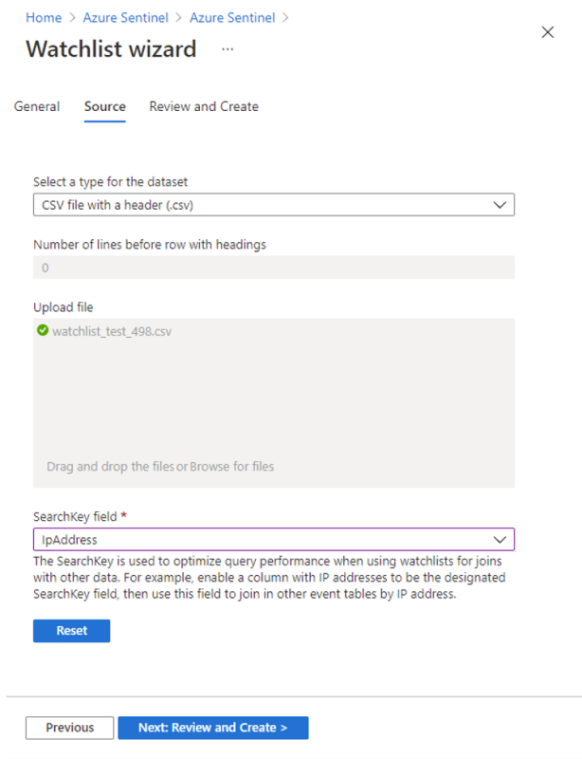
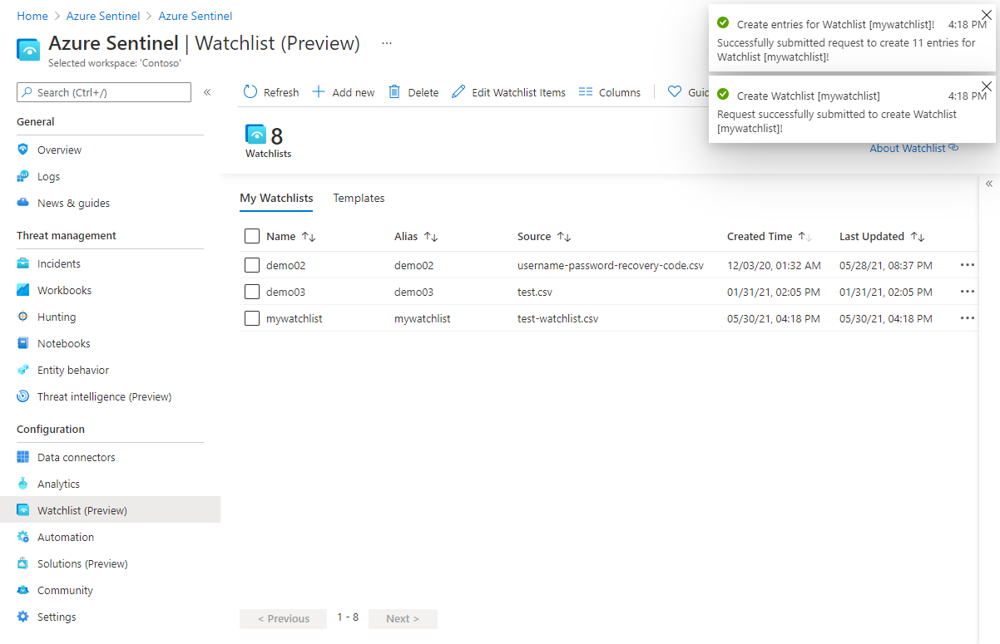
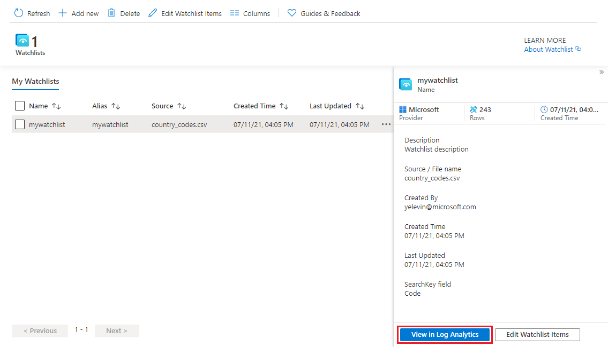
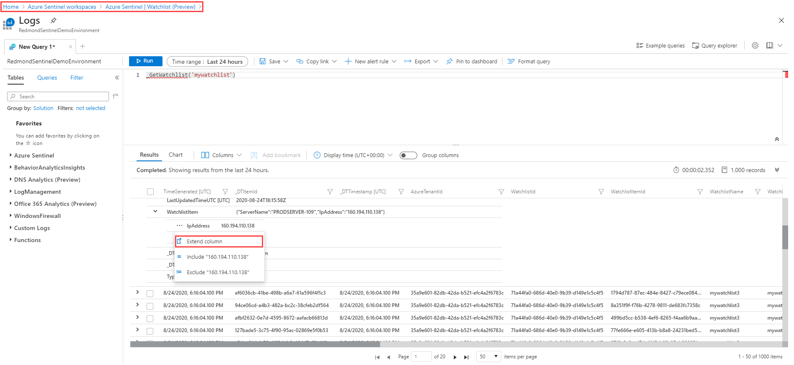
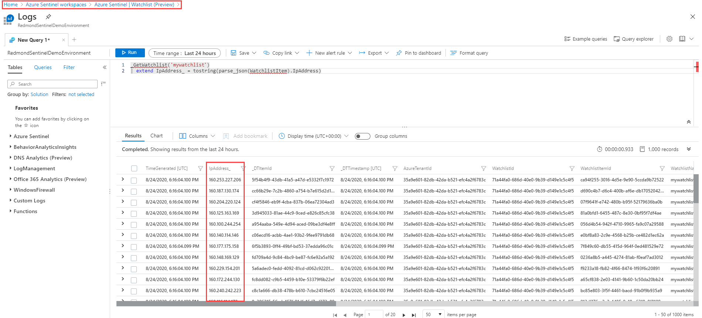
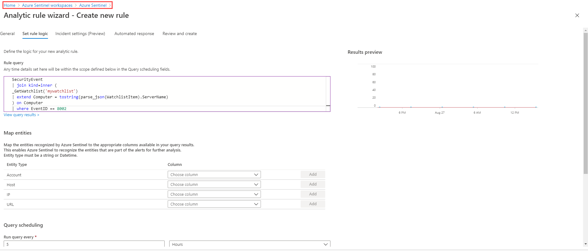

# Use Azure Sentinel watchlists

Azure Sentinel watchlists enable the collection of data from external data sources for correlation with the events in your Azure Sentinel environment. Once created, you can use watchlists in your search, detection rules, threat hunting, and response playbooks. Watchlists are stored in your Azure Sentinel workspace as name-value pairs and are cached for optimal query performance and low latency.

Common scenarios for using watchlists include:

- **Investigating threats** and responding to incidents quickly with the rapid import of IP addresses, file hashes, and other data from CSV files. Once imported, you can use watchlist name-value pairs for joins and filters in alert rules, threat hunting, workbooks, notebooks, and general queries.

- **Importing business data** as a watchlists. For example, import user lists with privileged system access, or terminated employees, and then use the watchlist to create allow and deny lists used to detect or prevent those users from logging in to the network.

- **Reducing alert fatigue**. Create allow lists to suppress alerts from a group of users, such as users from authorized IP addresses that perform tasks that would normally trigger the alert, and prevent benign events from becoming alerts.

- **Enriching event data**. Use watchlists to enrich your event data with name-value combinations derived from external data sources.

## Create a new watchlist

1. From the Azure portal, navigate to **Azure Sentinel** > **Configuration** > **Watchlist** and then select **Add new**.

    > [!div class="mx-imgBorder"]
    > 

1. On the **General** page, provide the name, description, and alias for the watchlist, and then select **Next**.

    > [!div class="mx-imgBorder"]
    > 

1. On the **Source** page, select the dataset type, upload a file, and then select **Next**.

    > [!div class="mx-imgBorder"]
    > 

1. Review the information, verify that it is correct, and then select **Create**.

    > [!div class="mx-imgBorder"]
    > 

    A notification appears once the watchlist is created.

    > [!div class="mx-imgBorder"]
    > 

## Use watchlists in queries

1. From the Azure portal, navigate to **Azure Sentinel** > **Configuration** > **Watchlist**, select the watchlist you want to use, and then select **View in Log Analytics**.

    > [!div class="mx-imgBorder"]
    > 

1. To extract the contents of the **IpAddress** field for your query, on the **Results** tab, expand the **WatchlistItem** field, and to the left of the **IpAddress** field, select the more menu (...), and then select **Extend column**.

    > [!NOTE]
    > The timestamp on your queries will be ignored in both the query UI and in scheduled alerts.

    > [!div class="mx-imgBorder"]
    > 

Once the query runs, you should see a new column with the **IpAddress** field.

> [!div class="mx-imgBorder"]
> 

## Use watchlists in analytics rules

To use watchlists in analytics rules, from the Azure portal, navigate to **Azure Sentinel** > **Configuration** > **Analytics**, and create a rule using the `_GetWatchlist('<watchlist>')` function in the query.

> [!div class="mx-imgBorder"]
> 

## View list of watchlists aliases

To get a list of watchlist aliases, from the Azure portal, navigate to **Azure Sentinel** > **General** > **Logs**, and run the following query: `_GetWatchlistAlias`. You can see the list of aliases in the **Results** tab.

> [!div class="mx-imgBorder"]
> 
