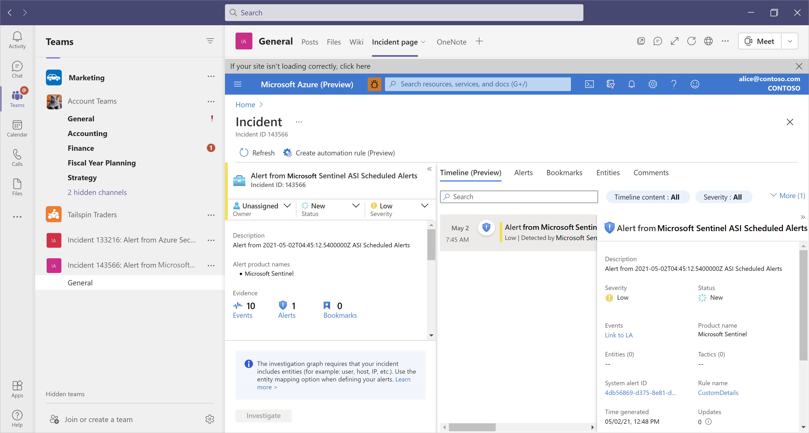

# Archive for What's new in Microsoft Sentinel

The primary [What's new in Sentinel](whats-new.md) release notes page contains updates for the last six months, while this page contains older items.

For information about earlier features delivered, see our [Tech Community blogs](https://techcommunity.microsoft.com/t5/microsoft-sentinel-blog/bg-p/MicrosoftSentinelBlog/label-name/What's%20New).

Noted features are currently in PREVIEW. The [Azure Preview Supplemental Terms](https://azure.microsoft.com/support/legal/preview-supplemental-terms/) include additional legal terms that apply to Azure features that are in beta, preview, or otherwise not yet released into general availability.

> [!TIP]
> Our threat hunting teams across Microsoft contribute queries, playbooks, workbooks, and notebooks to the [Microsoft Sentinel Community](https://github.com/Azure/Azure-Sentinel), including specific [hunting queries](https://github.com/Azure/Azure-Sentinel) that your teams can adapt and use.
>
> You can also contribute! Join us in the [Microsoft Sentinel Threat Hunters GitHub community](https://github.com/Azure/Azure-Sentinel/wiki).

## December 2021

- [Apache Log4j Vulnerability Detection solution](#apache-log4j-vulnerability-detection-solution-public-preview)
- [IoT OT Threat Monitoring with Defender for IoT solution](#iot-ot-threat-monitoring-with-defender-for-iot-solution-public-preview)
- [Continuous Threat Monitoring for GitHub solution](#ingest-github-logs-into-your-microsoft-sentinel-workspace-public-preview)

### Apache Log4j Vulnerability Detection solution

Remote code execution vulnerabilities related to Apache Log4j were disclosed on 9 December 2021. The vulnerability allows for unauthenticated remote code execution, and it's triggered when a specially crafted string, provided by the attacker through a variety of different input vectors, is parsed and processed by the Log4j 2 vulnerable component.

The [Apache Log4J Vulnerability Detection](sentinel-solutions-catalog.md#domain-solutions) solution was added to the Microsoft Sentinel content hub to help customers monitor, detect, and investigate signals related to the exploitation of this vulnerability, using Microsoft Sentinel.

For more information, see the [Microsoft Security Response Center blog](https://msrc-blog.microsoft.com/2021/12/11/microsofts-response-to-cve-2021-44228-apache-log4j2/) and [Centrally discover and deploy Microsoft Sentinel out-of-the-box content and solutions](sentinel-solutions-deploy.md).

### IoT OT Threat Monitoring with Defender for IoT solution (Public preview)

The new **IoT OT Threat Monitoring with Defender for IoT** solution available in the [Microsoft Sentinel content hub](sentinel-solutions-deploy.md) provides further support for the Microsoft Sentinel integration with Microsoft Defender for IoT, bridging gaps between IT and OT security challenges, and empowering SOC teams with enhanced abilities to efficiently and effectively detect and respond to OT threats.

For more information, see [Tutorial: Investigate Microsoft Defender for IoT devices with Microsoft Sentinel](iot-advanced-threat-monitoring.md).

### Ingest GitHub logs into your Microsoft Sentinel workspace (Public preview)

Use the new [Continuous Threat Monitoring for GitHub](https://azuremarketplace.microsoft.com/marketplace/apps/microsoftcorporation1622712991604.sentinel4github?tab=Overview) solution and [data connector](data-connectors-reference.md#github-preview) to ingest your GitHub logs into your Microsoft Sentinel workspace.

The **Continuous Threat Monitoring for GitHub** solution includes a data connector, relevant analytics rules, and a workbook that you can use to visualize your log data.

For example, view the number of users that were added or removed from GitHub repositories, how many repositories were created, forked, or cloned, in the selected time frame.

> [!NOTE]
> The **Continuous Threat Monitoring for GitHub** solution is supported for GitHub enterprise licenses only.
>

For more information, see [Centrally discover and deploy Microsoft Sentinel out-of-the-box content and solutions (Public preview)](sentinel-solutions-deploy.md) and [instructions](data-connectors-reference.md#github-preview) for installing the GitHub data connector.

### Apache Log4j Vulnerability Detection solution (Public preview)

Remote code execution vulnerabilities related to Apache Log4j were disclosed on 9 December 2021. The vulnerability allows for unauthenticated remote code execution, and it's triggered when a specially crafted string, provided by the attacker through a variety of different input vectors, is parsed and processed by the Log4j 2 vulnerable component. 

The [Apache Log4J Vulnerability Detection](sentinel-solutions-catalog.md#domain-solutions) solution was added to the Microsoft Sentinel content hub to help customers monitor, detect, and investigate signals related to the exploitation of this vulnerability, using Microsoft Sentinel.

For more information, see the [Microsoft Security Response Center blog](https://msrc-blog.microsoft.com/2021/12/11/microsofts-response-to-cve-2021-44228-apache-log4j2/) and [Centrally discover and deploy Microsoft Sentinel out-of-the-box content and solutions](sentinel-solutions-deploy.md).

## November 2021

- [Incident advanced search now available in GA](#incident-advanced-search-now-available-in-ga)
- [Amazon Web Services S3 connector now available (Public preview)](#amazon-web-services-s3-connector-now-available-public-preview)
- [Windows Forwarded Events connector now available (Public preview)](#windows-forwarded-events-connector-now-available-public-preview)
- [Near-real-time (NRT) threat detection rules now available (Public preview)](#near-real-time-nrt-threat-detection-rules-now-available-public-preview)
- [Fusion engine now detects emerging and unknown threats (Public preview)](#fusion-engine-now-detects-emerging-and-unknown-threats-public-preview)
- [Fine-tuning recommendations for your analytics rules (Public preview)](#get-fine-tuning-recommendations-for-your-analytics-rules-public-preview)
- [Free trial updates](#free-trial-updates)
- [Content hub and new solutions (Public preview)](#content-hub-and-new-solutions-public-preview)
- [Continuous deployment from your content repositories (Public preview)](#enable-continuous-deployment-from-your-content-repositories-public-preview)
- [Enriched threat intelligence with Geolocation and WhoIs data (Public preview)](#enriched-threat-intelligence-with-geolocation-and-whois-data-public-preview)
- [Use notebooks with Azure Synapse Analytics in Microsoft Sentinel (Public preview)](#use-notebooks-with-azure-synapse-analytics-in-microsoft-sentinel-public-preview)
- [Enhanced Notebooks area in Microsoft Sentinel](#enhanced-notebooks-area-in-microsoft-sentinel)
- [Microsoft Sentinel renaming](#microsoft-sentinel-renaming)
- [Deploy and monitor Azure Key Vault honeytokens with Microsoft Sentinel](#deploy-and-monitor-azure-key-vault-honeytokens-with-microsoft-sentinel)

### Incident advanced search now available in GA

Searching for incidents using the advanced search functionality is now generally available.

The advanced incident search provides the ability to search across more data, including alert details, descriptions, entities, tactics, and more.

For more information, see [Search for incidents](investigate-cases.md#search-for-incidents).

### Amazon Web Services S3 connector now available (Public preview)

You can now connect Microsoft Sentinel to your Amazon Web Services (AWS) S3 storage bucket, in order to ingest logs from a variety of AWS services.

For now, you can use this connection to ingest VPC Flow Logs and GuardDuty findings, as well as AWS CloudTrail.

For more information, see [Connect Microsoft Sentinel to S3 Buckets to get Amazon Web Services (AWS) data](connect-aws.md).

### Windows Forwarded Events connector now available (Public preview)

You can now stream event logs from Windows Servers connected to your Microsoft Sentinel workspace using Windows Event Collection / Windows Event Forwarding (WEC / WEF), thanks to this new data connector. The connector uses the new Azure Monitor Agent (AMA), which provides a number of advantages over the legacy Log Analytics agent (also known as the MMA):

- **Scalability:** If you've enabled Windows Event Collection (WEC), you can install the Azure Monitor Agent (AMA) on the WEC machine to collect logs from many servers with a single connection point.

- **Speed:** The AMA can send data at an improved rate of 5 K EPS, allowing for faster data refresh.

- **Efficiency:** The AMA allows you to design complex Data Collection Rules (DCR) to filter the logs at their source, choosing the exact events to stream to your workspace. DCRs help lower your network traffic and your ingestion costs by leaving out undesired events.

- **Coverage:** WEC / WEF enables the collection of Windows Event logs from legacy (on-premises and physical) servers and also from high-usage or sensitive machines, such as domain controllers, where installing an agent is undesired.

We recommend using this connector with the [Microsoft Sentinel Information Model (ASIM)](normalization.md) parsers installed to ensure full support for data normalization.

Learn more about the [Windows Forwarded Events connector](data-connectors-reference.md#windows-forwarded-events-preview).

### Near-real-time (NRT) threat detection rules now available (Public preview)

When you're faced with security threats, time and speed are of the essence. You need to be aware of threats as they materialize so you can analyze and respond quickly to contain them. Microsoft Sentinel's near-real-time (NRT) analytics rules offer you faster threat detection - closer to that of an on-premises SIEM - and the ability to shorten response times in specific scenarios.

Microsoft Sentinel’s [near-real-time analytics rules](detect-threats-built-in.md#nrt) provide up-to-the-minute threat detection out-of-the-box. This type of rule was designed to be highly responsive by running its query at intervals just one minute apart.

Learn more about [NRT rules](near-real-time-rules.md) and [how to use them](create-nrt-rules.md).

### Fusion engine now detects emerging and unknown threats (Public preview)

In addition to detecting attacks based on [predefined scenarios](fusion-scenario-reference.md), Microsoft Sentinel's ML-powered Fusion engine can help you find the emerging and unknown threats in your environment by applying extended ML analysis and by correlating a broader scope of anomalous signals, while keeping the alert fatigue low.

The Fusion engine's ML algorithms constantly learn from existing attacks and apply analysis based on how security analysts think. It can therefore discover previously undetected threats from millions of anomalous behaviors across the kill-chain throughout your environment, which helps you stay one step ahead of the attackers.

Learn more about [Fusion for emerging threats](fusion.md#fusion-for-emerging-threats).

Also, the [Fusion analytics rule is now more configurable](configure-fusion-rules.md), reflecting its increased functionality.

### Get fine-tuning recommendations for your analytics rules (Public preview)

Fine-tuning threat detection rules in your SIEM can be a difficult, delicate, and continuous process of balancing between maximizing your threat detection coverage and minimizing false positive rates. Microsoft Sentinel simplifies and streamlines this process by using machine learning to analyze billions of signals from your data sources as well as your responses to incidents over time, deducing patterns and providing you with actionable recommendations and insights that can significantly lower your tuning overhead and allow you to focus on detecting and responding to actual threats.

[Tuning recommendations and insights](detection-tuning.md) are now built in to your analytics rules.

### Free trial updates

Microsoft Sentinel's free trial continues to support new or existing Log Analytics workspaces at no additional cost for the first 31 days.

We're evolving our free trial experience to include the following updates:

- **New Log Analytics workspaces** can ingest up to 10 GB / day of log data for the first 31-days at no cost. New workspaces include workspaces that are less than three days old.

   Both Log Analytics data ingestion and Microsoft Sentinel charges are waived during the 31-day trial period. This free trial is subject to a 20-workspace limit per Azure tenant.

- **Existing Log Analytics workspaces** can enable Microsoft Sentinel at no additional cost. Existing workspaces include any workspaces created more than three days ago.

   Only the Microsoft Sentinel charges are waived during the 31-day trial period.

Usage beyond these limits will be charged per the pricing listed on the [Microsoft Sentinel pricing](https://azure.microsoft.com/pricing/details/microsoft-sentinel/) page. Charges related to additional capabilities for [automation](automation.md) and [bring your own machine learning](bring-your-own-ml.md) are still applicable during the free trial.

> [!TIP]
> During your free trial, find resources for cost management, training, and more on the **News & guides > Free trial** tab in Microsoft Sentinel. This tab also displays details about the dates of your free trial, and how many days you've left until it expires.
>

For more information, see [Plan and manage costs for Microsoft Sentinel](billing.md).

### Content hub and new solutions (Public preview)

Microsoft Sentinel now provides a **Content hub**, a centralized location to find and deploy Microsoft Sentinel out-of-the-box (built-in) content and solutions to your Microsoft Sentinel workspace. Find the content you need by filtering for content type, support models, categories and more, or use the powerful text search.

Under **Content management**, select **Content hub**. Select a solution to view more details on the right, and then click **Install** to install it in your workspace.

:::image type="content" source="media/whats-new/solutions-list.png" alt-text="Screenshot of the new Microsoft Sentinel content hub." lightbox="media/whats-new/solutions-list.png":::

The following list includes highlights of new, out-of-the-box solutions added to the Content hub:

:::row:::
   :::column span="":::
      - Microsoft Sentinel Training Lab
      - Cisco ASA
      - Cisco Duo Security
      - Cisco Meraki
      - Cisco StealthWatch
      - Digital Guardian
      - 365 Dynamics
      - GCP Cloud DNS
   :::column-end:::
   :::column span="":::
      - GCP CloudMonitor
      - GCP Identity and Access Management
      - FalconForce
      - FireEye NX
      - Flare Systems Firework
      - Forescout
      - Fortinet Fortigate
      - Imperva Cloud FAW
   :::column-end:::
   :::column span="":::
      - Insider Risk Management (IRM)
      - IronNet CyberSecurity Iron Defense
      - Lookout
      - McAfee Network Security Platform
      - Microsoft MITRE ATT&CK Solution for Cloud
      - Palo Alto PAN-OS
   :::column-end:::
   :::column span="":::
      - Rapid7 Nexpose / Insight VM
      - ReversingLabs
      - RSA SecurID
      - Semperis
      - Tenable Nessus Scanner
      - Vectra Stream
      - Zero Trust
   :::column-end:::
:::row-end:::

For more information, see:

- [Learn about Microsoft Sentinel solutions](sentinel-solutions.md)
- [Discover and deploy Microsoft Sentinel solutions](sentinel-solutions-deploy.md)
- [Microsoft Sentinel solutions catalog](sentinel-solutions-catalog.md)

### Enable continuous deployment from your content repositories (Public preview)

The new Microsoft Sentinel **Repositories** page provides the ability to manage and deploy your custom content from GitHub or Azure DevOps repositories, as an alternative to managing them in the Azure portal. This capability introduces a more streamlined and automated approach for managing and deploying content across Microsoft Sentinel workspaces.

If you store your custom content in an external repository in order to maintain it outside of Microsoft Sentinel, now you can connect that repository to your Microsoft Sentinel workspace. Content you add, create, or edit in your repository is automatically deployed to your Microsoft Sentinel workspaces, and will be visible from the various Microsoft Sentinel galleries, such as the **Analytics**, **Hunting**, or **Workbooks** pages.

For more information, see [Deploy custom content from your repository](ci-cd.md).

### Enriched threat intelligence with Geolocation and WhoIs data (Public preview)

Now, any threat intelligence data that you bring in to Microsoft Sentinel via data connectors and logic app playbooks, or create in Microsoft Sentinel, is automatically enriched with GeoLocation and WhoIs information.

GeoLocation and WhoIs data can provide more context for investigations where the selected indicator of compromise (IOC) is found.

For example, use GeoLocation data to find details like *Organization* or *Country* for the indicator, and WhoIs data to find data like *Registrar* and *Record creation* data.

You can view GeoLocation and WhoIs data on the **Threat Intelligence** pane for each indicator of compromise that you've imported into Microsoft Sentinel. Details for the indicator are shown on the right, including any Geolocation and WhoIs data available.

For example:

:::image type="content" source="media/whats-new/geolocation-whois-ti.png" alt-text="Screenshot of indicator details including GeoLocation and WhoIs data." lightbox="media/whats-new/geolocation-whois-ti.png":::

> [!TIP]
> The Geolocation and WhoIs information come from the Microsoft Threat Intelligence service, which you can also access via API. For more information, see [Enrich entities with geolocation data via API](geolocation-data-api.md).
>

For more information, see:

- [Understand threat intelligence in Microsoft Sentinel](understand-threat-intelligence.md)
- [Understand threat intelligence integrations](threat-intelligence-integration.md)
- [Work with threat indicators in Microsoft Sentinel](work-with-threat-indicators.md)
- [Connect threat intelligence platforms](connect-threat-intelligence-tip.md)

### Use notebooks with Azure Synapse Analytics in Microsoft Sentinel (Public preview)

Microsoft Sentinel now integrates Jupyter notebooks with Azure Synapse for large-scale security analytics scenarios.

Until now, Jupyter notebooks in Microsoft Sentinel have been integrated with Azure Machine Learning. This functionality supports users who want to incorporate notebooks, popular open-source machine learning toolkits, and libraries such as TensorFlow, as well as their own custom models, into security workflows.

The new Azure Synapse integration provides extra analytic horsepower, such as:

- **Security big data analytics**, using cost-optimized, fully managed Azure Synapse Apache Spark compute pool.

- **Cost-effective Data Lake access** to build analytics on historical data via Azure Data Lake Storage Gen2, which is a set of capabilities dedicated to big data analytics, built on top of Azure Blob Storage.

- **Flexibility to integrate data sources** into security operation workflows from multiple sources and formats.

- **PySpark, a Python-based API** for using the Spark framework in combination with Python, reducing the need to learn a new programming language if you're already familiar with Python.

To support this integration, we added the ability to create and launch an Azure Synapse workspace directly from Microsoft Sentinel. We also added new, sample notebooks to guide you through configuring the Azure Synapse environment, setting up a continuous data export pipeline from Log Analytics into Azure Data Lake Storage, and then hunting on that data at scale.

For more information, see [Integrate notebooks with Azure Synapse](notebooks-with-synapse.md).

### Enhanced Notebooks area in Microsoft Sentinel

The **Notebooks** area in Microsoft Sentinel also now has an **Overview** tab, where you can find basic information about notebooks, and a new **Notebook types** column in the **Templates** tab to indicate the type of each notebook displayed. For example, notebooks might have types of **Getting started**, **Configuration**, **Hunting**, and now **Synapse**.

For example:

:::image type="content" source="media/whats-new/notebooks-synapse.png" alt-text="Screenshot of the new Azure Synapse functionality on the Notebooks page." lightbox="media/whats-new/notebooks-synapse.png":::

For more information, see [Use Jupyter notebooks to hunt for security threats](notebooks.md).

### Microsoft Sentinel renaming

Starting in November 2021, Microsoft Sentinel is being renamed to Microsoft Sentinel, and you'll see upcoming updates in the portal, documentation, and other resources in parallel.

Earlier entries in this article and the older [Archive for What's new in Sentinel](whats-new-archive.md) continue to use the name *Azure* Sentinel, as that was the service name when those features were new.

For more information, see our [blog on recent security enhancements](https://aka.ms/secblg11).

### Deploy and monitor Azure Key Vault honeytokens with Microsoft Sentinel

The new **Microsoft Sentinel Deception** solution helps you watch for malicious activity in your key vaults by helping you to deploy decoy keys and secrets, called *honeytokens*, to selected Azure key vaults.

Once deployed, any access or operation with the honeytoken keys and secrets generate incidents that you can investigate in Microsoft Sentinel.

Since there's no reason to actually use honeytoken keys and secrets, any similar activity in your workspace may be malicious and should be investigated.

The **Microsoft Sentinel Deception** solution includes a workbook to help you deploy the honeytokens, either at scale or one at a time, watchlists to track the honeytokens created, and analytics rules to generate incidents as needed.

For more information, see [Deploy and monitor Azure Key Vault honeytokens with Microsoft Sentinel (Public preview)](monitor-key-vault-honeytokens.md).

## October 2021

- [Windows Security Events connector using Azure Monitor Agent now in GA](#windows-security-events-connector-using-azure-monitor-agent-now-in-ga)
- [Defender for Office 365 events now available in the Microsoft 365 Defender connector (Public preview)](#defender-for-office-365-events-now-available-in-the-microsoft-365-defender-connector-public-preview)
- [Playbook templates and gallery now available (Public preview)](#playbook-templates-and-gallery-now-available-public-preview)
- [Template versioning for your scheduled analytics rules (Public preview)](#manage-template-versions-for-your-scheduled-analytics-rules-public-preview)
- [DHCP normalization schema (Public preview)](#dhcp-normalization-schema-public-preview)

### Windows Security Events connector using Azure Monitor Agent now in GA

The new version of the Windows Security Events connector, based on the Azure Monitor Agent, is now generally available. For more information, see [Connect to Windows servers to collect security events](connect-windows-security-events.md?tabs=AMA).

### Defender for Office 365 events now available in the Microsoft 365 Defender connector (Public preview)

In addition to those from Microsoft Defender for Endpoint, you can now ingest raw [advanced hunting events](/microsoft-365/security/defender/advanced-hunting-overview) from [Microsoft Defender for Office 365](/microsoft-365/security/office-365-security/overview) through the [Microsoft 365 Defender connector](connect-microsoft-365-defender.md). [Learn more](microsoft-365-defender-sentinel-integration.md#advanced-hunting-event-collection).

### Playbook templates and gallery now available (Public preview)

A playbook template is a pre-built, tested, and ready-to-use workflow that can be customized to meet your needs. Templates can also serve as a reference for best practices when developing playbooks from scratch, or as inspiration for new automation scenarios.

Playbook templates have been developed by the Sentinel community, independent software vendors (ISVs), and Microsoft's own experts, and you can find them in the **Playbook templates** tab (under **Automation**), as part of an [Microsoft Sentinel solution](sentinel-solutions.md), or in the [Microsoft Sentinel GitHub repository](https://github.com/Azure/Azure-Sentinel/tree/master/Playbooks).

For more information, see [Create and customize playbooks from built-in templates](use-playbook-templates.md).

### Manage template versions for your scheduled analytics rules (Public preview)

When you create analytics rules from [built-in Microsoft Sentinel rule templates](detect-threats-built-in.md), you effectively create a copy of the template. Past that point, the active rule is ***not*** dynamically updated to match any changes that get made to the originating template.

However, rules created from templates ***do*** remember which templates they came from, which allows you two advantages:

- If you made changes to a rule when creating it from a template (or at any time after that), you can always revert the rule back to its original version (as a copy of the template).

- If a template is updated, you'll be notified and you can choose to update your rules to the new version of their templates, or leave them as they are.

[Learn how to manage these tasks](manage-analytics-rule-templates.md), and what to keep in mind. These procedures apply to any [Scheduled](detect-threats-built-in.md#scheduled) analytics rules created from templates.

### DHCP normalization schema (Public preview)

The Advanced Security Information Model (ASIM) now supports a DHCP normalization schema, which is used to describe events reported by a DHCP server and is used by Microsoft Sentinel to enable source-agnostic analytics. 

Events described in the DHCP normalization schema include serving requests for DHCP IP address leased from client systems and updating a DNS server with the leases granted.

For more information, see:

- [Microsoft Sentinel DHCP normalization schema reference (Public preview)](dhcp-normalization-schema.md)
- [Normalization and the Microsoft Sentinel Information Model (ASIM)](normalization.md)

## September 2021

- [Data connector health enhancements (Public preview)](#data-connector-health-enhancements-public-preview)
- [New in docs: scaling data connector documentation](#new-in-docs-scaling-data-connector-documentation)
- [Azure Storage account connector changes](#azure-storage-account-connector-changes)

### Data connector health enhancements (Public preview)

Microsoft Sentinel now provides the ability to enhance your data connector health monitoring with a new *SentinelHealth* table. The *SentinelHealth* table is created after you [turn on the Microsoft Sentinel health feature](monitor-sentinel-health.md) in your Microsoft Sentinel workspace, at the first success or failure health event generated.

For more information, see [Monitor the health of your data connectors with this Microsoft Sentinel workbook](monitor-data-connector-health.md).

> [!NOTE]
> The *SentinelHealth* data table is currently supported only for selected data connectors. For more information, see [Supported data connectors](monitor-data-connector-health.md#supported-data-connectors).
>

### New in docs: scaling data connector documentation

As we continue to add more and more built-in data connectors for Microsoft Sentinel, we reorganized our data connector documentation to reflect this scaling.

For most data connectors, we replaced full articles that describe an individual connector with a series of generic procedures and a full reference of all currently supported connectors.

Check the [Microsoft Sentinel data connectors reference](data-connectors-reference.md) for details about your connector, including references to the relevant generic procedure, as well as extra information and configurations required.

For more information, see:

- **Conceptual information**: [Connect data sources](connect-data-sources.md)

- **Generic how-to articles**:

   - [Connect to Azure, Windows, Microsoft, and Amazon services](connect-azure-windows-microsoft-services.md)
   - [Connect your data source to the Microsoft Sentinel Data Collector API to ingest data](connect-rest-api-template.md)
   - [Get CEF-formatted logs from your device or appliance into Microsoft Sentinel](connect-common-event-format.md)
   - [Collect data from Linux-based sources using Syslog](connect-syslog.md)
   - [Collect data in custom log formats to Microsoft Sentinel with the Log Analytics agent](connect-custom-logs.md)
   - [Use Azure Functions to connect your data source to Microsoft Sentinel](connect-azure-functions-template.md)
   - [Resources for creating Microsoft Sentinel custom connectors](create-custom-connector.md)

### Azure Storage account connector changes

Due to some changes made within the Azure Storage account resource configuration itself, the connector also needs to be reconfigured.
The storage account (parent) resource has within it other (child) resources for each type of storage: files, tables, queues, and blobs.

When configuring diagnostics for a storage account, you must select and configure, in turn:
- The parent account resource, exporting the **Transaction** metric.
- Each of the child storage-type resources, exporting all the logs and metrics (see the table above).

You'll only see the storage types that you actually have defined resources for.

:::image type="content" source="media/whats-new/storage-diagnostics.png" alt-text="Screenshot of Azure Storage diagnostics configuration.":::

## August 2021

- [Advanced incident search (Public preview)](#advanced-incident-search-public-preview)
- [Fusion detection for Ransomware (Public preview)](#fusion-detection-for-ransomware-public-preview)
- [Watchlist templates for UEBA data](#watchlist-templates-for-ueba-data-public-preview)
- [File event normalization schema (Public preview)](#file-event-normalization-schema-public-preview)
- [New in docs: Best practice guidance](#new-in-docs-best-practice-guidance)

### Advanced incident search (Public preview)

By default, incident searches run across the **Incident ID**, **Title**, **Tags**, **Owner**, and **Product name** values only. Microsoft Sentinel now provides [advanced search options](investigate-cases.md#search-for-incidents) to search across more data, including alert details, descriptions, entities, tactics, and more.

For example:

:::image type="content" source="media/investigate-cases/advanced-search.png" alt-text="Screenshot of the Incidents page advanced search options.":::

For more information, see [Search for incidents](investigate-cases.md#search-for-incidents).

### Fusion detection for Ransomware (Public preview)

Microsoft Sentinel now provides new Fusion detections for possible Ransomware activities, generating incidents titled as **Multiple alerts possibly related to Ransomware activity detected**.

Incidents are generated for alerts that are possibly associated with Ransomware activities, when they occur during a specific time-frame, and are associated with the Execution and Defense Evasion stages of an attack. You can use the alerts listed in the incident to analyze the techniques possibly used by attackers to compromise a host / device and to evade detection.

Supported data connectors include:

- [Azure Defender (Azure Security Center)](connect-defender-for-cloud.md)
- [Microsoft Defender for Endpoint](./data-connectors-reference.md#microsoft-defender-for-endpoint)
- [Microsoft Defender for Identity](./data-connectors-reference.md#microsoft-defender-for-identity)
- [Microsoft Cloud App Security](./data-connectors-reference.md#microsoft-defender-for-cloud-apps)
- [Microsoft Sentinel scheduled analytics rules](detect-threats-built-in.md#scheduled)

For more information, see [Multiple alerts possibly related to Ransomware activity detected](fusion.md#fusion-for-ransomware).

### Watchlist templates for UEBA data (Public preview)

Microsoft Sentinel now provides built-in watchlist templates for UEBA data, which you can customize for your environment and use during investigations.

After UEBA watchlists are populated with data, you can correlate that data with analytics rules, view it in the entity pages and investigation graphs as insights, create custom uses such as to track VIP or sensitive users, and more.

Watchlist templates currently include:

- **VIP Users**. A list of user accounts of employees that have high impact value in the organization.
- **Terminated Employees**. A list of user accounts of employees that have been, or are about to be, terminated.
- **Service Accounts**. A list of service accounts and their owners.
- **Identity Correlation**. A list of related user accounts that belong to the same person.
- **High Value Assets**. A list of devices, resources, or other assets that have critical value in the organization.
- **Network Mapping**. A list of IP subnets and their respective organizational contexts.

For more information, see [Create watchlists in Microsoft Sentinel](watchlists-create.md) and [Built-in watchlist schemas](watchlist-schemas.md).

### File Event normalization schema (Public preview)

The Microsoft Sentinel Information Model (ASIM) now supports a File Event normalization schema, which is used to describe file activity, such as creating, modifying, or deleting files or documents. File events are reported by operating systems, file storage systems such as Azure Files, and document management systems such as Microsoft SharePoint.

For more information, see:

- [Microsoft Sentinel File Event normalization schema reference (Public preview)](file-event-normalization-schema.md)
- [Normalization and the Microsoft Sentinel Information Model (ASIM)](normalization.md)

### New in docs: Best practice guidance

In response to multiple requests from customers and our support teams, we added a series of best practice guidance to our documentation.

For more information, see:

- [Prerequisites for deploying Microsoft Sentinel](prerequisites.md)
- [Best practices for Microsoft Sentinel](best-practices.md)
- [Microsoft Sentinel workspace architecture best practices](best-practices-workspace-architecture.md)
- [Design your Microsoft Sentinel workspace architecture](design-your-workspace-architecture.md)
- [Microsoft Sentinel sample workspace designs](sample-workspace-designs.md)
- [Data collection best practices](best-practices-data.md)

> [!TIP]
> You can find more guidance added across our documentation in relevant conceptual and how-to articles. For more information, see [Best practice references](best-practices.md#best-practice-references).
>

## July 2021

- [Microsoft Threat Intelligence Matching Analytics (Public preview)](#microsoft-threat-intelligence-matching-analytics-public-preview)
- [Use Azure AD data with Microsoft Sentinel's IdentityInfo table (Public preview)](#use-azure-ad-data-with-microsoft-sentinels-identityinfo-table-public-preview)
- [Enrich Entities with geolocation data via API (Public preview)](#enrich-entities-with-geolocation-data-via-api-public-preview)
- [Support for ADX cross-resource queries (Public preview)](#support-for-adx-cross-resource-queries-public-preview)
- [Watchlists are in general availability](#watchlists-are-in-general-availability)
- [Support for data residency in more geos](#support-for-data-residency-in-more-geos)
- [Bidirectional sync in Azure Defender connector (Public preview)](#bidirectional-sync-in-azure-defender-connector-public-preview)

### Microsoft Threat Intelligence Matching Analytics (Public preview)

Microsoft Sentinel now provides the built-in **Microsoft Threat Intelligence Matching Analytics** rule, which matches Microsoft-generated threat intelligence data with your logs. This rule generates high-fidelity alerts and incidents, with appropriate severities based on the context of the logs detected. After a match is detected, the indicator is also published to your Microsoft Sentinel threat intelligence repository.

The **Microsoft Threat Intelligence Matching Analytics** rule currently matches domain indicators against the following log sources:

- [CEF](connect-common-event-format.md)
- [DNS](./data-connectors-reference.md#windows-dns-server-preview)
- [Syslog](connect-syslog.md)

For more information, see [Detect threats using matching analytics (Public preview)](use-matching-analytics-to-detect-threats.md).

### Use Azure AD data with Microsoft Sentinel's IdentityInfo table (Public preview)

As attackers often use the organization's own user and service accounts, data about those user accounts, including the user identification and privileges, are crucial for the analysts in the process of an investigation.

Now, having [UEBA enabled](enable-entity-behavior-analytics.md) in your Microsoft Sentinel workspace also synchronizes Azure AD data into the new **IdentityInfo** table in Log Analytics. Synchronizations between your Azure AD and the **IdentifyInfo** table create a snapshot of your user profile data that includes user metadata, group information, and the Azure AD roles assigned to each user.

Use the **IdentityInfo** table during investigations and when fine-tuning analytics rules for your organization to reduce false positives.

For more information, see [IdentityInfo table](ueba-reference.md#identityinfo-table) in the UEBA enrichments reference and [Use UEBA data to analyze false positives](investigate-with-ueba.md#use-ueba-data-to-analyze-false-positives).

### Enrich entities with geolocation data via API (Public preview)

Microsoft Sentinel now offers an API to enrich your data with geolocation information. Geolocation data can then be used to analyze and investigate security incidents.

For more information, see [Enrich entities in Microsoft Sentinel with geolocation data via REST API (Public preview)](geolocation-data-api.md) and [Classify and analyze data using entities in Microsoft Sentinel](entities.md).

### Support for ADX cross-resource queries (Public preview)

The hunting experience in Microsoft Sentinel now supports [ADX cross-resource queries](../azure-monitor/logs/azure-monitor-data-explorer-proxy.md#cross-query-your-log-analytics-or-application-insights-resources-and-azure-data-explorer).
 
Although Log Analytics remains the primary data storage location for performing analysis with Microsoft Sentinel, there are cases where ADX is required to store data due to cost, retention periods, or other factors. This capability enables customers to hunt over a wider set of data and view the results in the [Microsoft Sentinel hunting experiences](hunting.md), including hunting queries, [livestream](livestream.md), and the Log Analytics search page.

To query data stored in ADX clusters, use the adx() function to specify the ADX cluster, database name, and desired table. You can then query the output as you would any other table. See more information in the pages linked above.

### Watchlists are in general availability

The [watchlists](watchlists.md) feature is now generally available. Use watchlists to enrich alerts with business data, to create allowlists or blocklists against which to check access events, and to help investigate threats and reduce alert fatigue.

### Support for data residency in more geos

Microsoft Sentinel now supports full data residency in the following additional geos:

Brazil, Norway, South Africa, Korea, Germany, United Arab Emirates (UAE), and Switzerland.

See the [complete list of supported geos](quickstart-onboard.md#geographical-availability-and-data-residency) for data residency.

### Bidirectional sync in Azure Defender connector (Public preview)

The Azure Defender connector now supports bi-directional syncing of alerts' status between Defender and Microsoft Sentinel. When you close a Sentinel incident containing a Defender alert, the alert will automatically be closed in the Defender portal as well.

See this [complete description of the updated Azure Defender connector](connect-defender-for-cloud.md).

## June 2021

- [Upgrades for normalization and the Microsoft Sentinel Information Model](#upgrades-for-normalization-and-the-microsoft-sentinel-information-model)
- [Updated service-to-service connectors](#updated-service-to-service-connectors)
- [Export and import analytics rules (Public preview)](#export-and-import-analytics-rules-public-preview)
- [Alert enrichment: alert details (Public preview)](#alert-enrichment-alert-details-public-preview)
- [More help for playbooks!](#more-help-for-playbooks)
- [New documentation reorganization](#new-documentation-reorganization)

### Upgrades for normalization and the Microsoft Sentinel Information Model

The Microsoft Sentinel Information Model enables you to use and create source-agnostic content, simplifying your analysis of the data in your Microsoft Sentinel workspace.

In this month's update, we've enhanced our normalization documentation, providing new levels of detail and full DNS, process event, and authentication normalization schemas.

For more information, see:

- [Normalization and the Microsoft Sentinel Information Model (ASIM)](normalization.md) (updated)
- [Microsoft Sentinel Authentication normalization schema reference (Public preview)](authentication-normalization-schema.md) (new!)
- [Microsoft Sentinel data normalization schema reference](./network-normalization-schema.md)
- [Microsoft Sentinel DNS normalization schema reference (Public preview)](dns-normalization-schema.md) (new!)
- [Microsoft Sentinel Process Event normalization schema reference (Public preview)](process-events-normalization-schema.md) (new!)
- [Microsoft Sentinel Registry Event normalization schema reference (Public preview)](registry-event-normalization-schema.md) (new!)

### Updated service-to-service connectors

Two of our most-used connectors have been the beneficiaries of major upgrades.

- The [Windows security events connector (Public preview)](connect-windows-security-events.md) is now based on the new Azure Monitor Agent (AMA), allowing you far more flexibility in choosing which data to ingest, and giving you maximum visibility at minimum cost.

- The [Azure activity logs connector](./data-connectors-reference.md#azure-activity) is now based on the diagnostics settings pipeline, giving you more complete data, greatly reduced ingestion lag, and better performance and reliability.

The upgrades are not automatic. Users of these connectors are encouraged to enable the new versions.

### Export and import analytics rules (Public preview)

You can now export your analytics rules to JSON-format Azure Resource Manager (ARM) template files, and import rules from these files, as part of managing and controlling your Microsoft Sentinel deployments as code. Any type of [analytics rule](detect-threats-built-in.md) - not just **Scheduled** - can be exported to an ARM template. The template file includes all the rule's information, from its query to its assigned MITRE ATT&CK tactics.

For more information, see [Export and import analytics rules to and from ARM templates](import-export-analytics-rules.md).

### Alert enrichment: alert details (Public preview)

In addition to enriching your alert content with entity mapping and custom details, you can now custom-tailor the way alerts - and by extension, incidents - are presented and displayed, based on their particular content. Like the other alert enrichment features, this is configurable in the [analytics rule wizard](detect-threats-custom.md).

For more information, see [Customize alert details in Microsoft Sentinel](customize-alert-details.md).

### More help for playbooks!

Two new documents can help you get started or get more comfortable with creating and working with playbooks.
- [Authenticate playbooks to Microsoft Sentinel](authenticate-playbooks-to-sentinel.md) helps you understand the different authentication methods by which Logic Apps-based playbooks can connect to and access information in Microsoft Sentinel, and when it's appropriate to use each one.
- [Use triggers and actions in playbooks](playbook-triggers-actions.md) explains the difference between the **incident trigger** and the **alert trigger** and which to use when, and shows you some of the different actions you can take in playbooks in response to incidents, including how to access the information in [custom details](playbook-triggers-actions.md#work-with-custom-details).

Playbook documentation also explicitly addresses the multi-tenant MSSP scenario.

### New documentation reorganization

This month we've reorganized our [Microsoft Sentinel documentation](index.yml), restructuring into intuitive categories that follow common customer journeys. Use the filtered docs search and updated landing page to navigate through Microsoft Sentinel docs.

:::image type="content" source="media/whats-new/new-docs.png" alt-text="New Microsoft Sentinel documentation reorganization." lightbox="media/whats-new/new-docs.png":::

## May 2021

- [Microsoft Sentinel PowerShell module](#microsoft-sentinel-powershell-module)
- [Alert grouping enhancements](#alert-grouping-enhancements)
- [Microsoft Sentinel solutions (Public preview)](#microsoft-sentinel-solutions-public-preview)
- [Continuous Threat Monitoring for SAP solution (Public preview)](#continuous-threat-monitoring-for-sap-solution-public-preview)
- [Threat intelligence integrations (Public preview)](#threat-intelligence-integrations-public-preview)
- [Fusion over scheduled alerts (Public preview)](#fusion-over-scheduled-alerts-public-preview)
- [SOC-ML anomalies (Public preview)](#soc-ml-anomalies-public-preview)
- [IP Entity page (Public preview)](#ip-entity-page-public-preview)
- [Activity customization (Public preview)](#activity-customization-public-preview)
- [Hunting dashboard (Public preview)](#hunting-dashboard-public-preview)
- [Incident teams - collaborate in Microsoft Teams (Public preview)](#microsoft-sentinel-incident-team---collaborate-in-microsoft-teams-public-preview)
- [Zero Trust (TIC3.0) workbook](#zero-trust-tic30-workbook)

### Microsoft Sentinel PowerShell module

The official Microsoft Sentinel PowerShell module to automate daily operational tasks has been released as GA!

You can download it here: [PowerShell Gallery](https://www.powershellgallery.com/packages/Az.SecurityInsights/).

For more information, see the PowerShell documentation: [Az.SecurityInsights](/powershell/module/az.securityinsights/)

### Alert grouping enhancements

Now you can configure your analytics rule to group alerts into a single incident, not only when they match a specific entity type, but also when they match a specific alert name, severity, or other custom details for a configured entity. 

In the **Incidents settings** tab of the analytics rule wizard, select to turn on alert grouping, and then select the **Group alerts into a single incident if the selected entity types and details match** option. 

Then, select your entity type and the relevant details you want to match:

:::image type="content" source="media/whats-new/alert-grouping-details.png" alt-text="Group alerts by matching entity details.":::

For more information, see [Alert grouping](detect-threats-custom.md#alert-grouping).

### Microsoft Sentinel solutions (Public preview)

Microsoft Sentinel now offers **packaged content** [solutions](sentinel-solutions-catalog.md) that include combinations of one or more data connectors, workbooks, analytics rules, playbooks, hunting queries, parsers, watchlists, and other components for Microsoft Sentinel.

Solutions provide improved in-product discoverability, single-step deployment, and end-to-end product scenarios. For more information, see [Centrally discover and deploy built-in content and solutions](sentinel-solutions-deploy.md).

### Continuous Threat Monitoring for SAP solution (Public preview)

Microsoft Sentinel now includes the **Continuous Threat Monitoring for SAP** solution, enabling you to monitor SAP systems for sophisticated threats within the business and application layers.

The SAP data connector streams a multitude of 14 application logs from the entire SAP system landscape, and collects logs from both Advanced Business Application Programming (ABAP) via NetWeaver RFC calls and file storage data via OSSAP Control interface. The SAP data connector adds to Microsoft Sentinels ability to monitor the SAP underlying infrastructure.

To ingest SAP logs into Microsoft Sentinel, you must have the Microsoft Sentinel SAP data connector installed on your SAP environment. After the SAP data connector is deployed, deploy the rich SAP solution security content to smoothly gain insight into your organization's SAP environment and improve any related security operation capabilities.

For more information, see [Deploying SAP continuous threat monitoring](sap/deployment-overview.md).

### Threat intelligence integrations (Public preview)

Microsoft Sentinel gives you a few different ways to [use threat intelligence](./understand-threat-intelligence.md) feeds to enhance your security analysts' ability to detect and prioritize known threats.

You can now use one of many newly available integrated threat intelligence platform (TIP) products, connect to TAXII servers to take advantage of any STIX-compatible threat intelligence source, and make use of any custom solutions that can communicate directly with the [Microsoft Graph Security tiIndicators API](/graph/api/resources/tiindicator).

You can also connect to threat intelligence sources from playbooks, in order to enrich incidents with TI information that can help direct investigation and response actions.

For more information, see [Threat intelligence integration in Microsoft Sentinel](threat-intelligence-integration.md).

### Fusion over scheduled alerts (Public preview)

The **Fusion** machine-learning correlation engine can now detect multi-stage attacks using alerts generated by a set of [scheduled analytics rules](detect-threats-custom.md) in its correlations, in addition to the alerts imported from other data sources.

For more information, see [Advanced multistage attack detection in Microsoft Sentinel](fusion.md).

### SOC-ML anomalies (Public preview)

Microsoft Sentinel's SOC-ML machine learning-based anomalies can identify unusual behavior that might otherwise evade detection.

SOC-ML uses analytics rule templates that can be put to work right out of the box. While anomalies don't necessarily indicate malicious or even suspicious behavior by themselves, they can be used to improve the fidelity of detections, investigations, and threat hunting.

For more information, see [Use SOC-ML anomalies to detect threats in Microsoft Sentinel](soc-ml-anomalies.md).

### IP Entity page (Public preview)

Microsoft Sentinel now supports the IP address entity, and you can now view IP entity information in the new IP entity page.

Like the user and host entity pages, the IP page includes general information about the IP, a list of activities the IP has been found to be a part of, and more, giving you an ever-richer store of information to enhance your investigation of security incidents.

For more information, see [Entity pages](entity-pages.md).

### Activity customization (Public preview)

Speaking of entity pages, you can now create new custom-made activities for your entities, that will be tracked and displayed on their respective entity pages alongside the out-of-the-box activities you’ve seen there until now.

For more information, see [Customize activities on entity page timelines](customize-entity-activities.md).

### Hunting dashboard (Public preview)

The **Hunting** blade has gotten a refresh. The new dashboard lets you run all your queries, or a selected subset, in a single click.

Identify where to start hunting by looking at result count, spikes, or the change in result count over a 24-hour period. You can also sort and filter by favorites, data source, MITRE ATT&CK tactic and technique, results, or results delta. View the queries that do not yet have the necessary data sources connected, and get recommendations on how to enable these queries.

For more information, see [Hunt for threats with Microsoft Sentinel](hunting.md).

### Microsoft Sentinel incident team - collaborate in Microsoft Teams (public preview)

Microsoft Sentinel now supports a direct integration with Microsoft Teams, enabling you to collaborate seamlessly across the organization and with external stakeholders.

Directly from the incident in Microsoft Sentinel, create a new *incident team* to use for central communication and coordination.

Incident teams are especially helpful when used as a dedicated conference bridge for high-severity, ongoing incidents. Organizations that already use Microsoft Teams for communication and collaboration can use the Microsoft Sentinel integration to bring security data directly into their conversations and daily work.

In Microsoft Teams, the new team's **Incident page** tab always has the most updated and recent data from Microsoft Sentinel, ensuring that your teams have the most relevant data right at hand.

For more information, see [Collaborate in Microsoft Teams (Public preview)](collaborate-in-microsoft-teams.md).

### Zero Trust (TIC3.0) workbook

The new, Microsoft Sentinel Zero Trust (TIC3.0) workbook provides an automated visualization of [Zero Trust](/security/zero-trust/) principles, cross-walked to the [Trusted Internet Connections](https://www.cisa.gov/trusted-internet-connections) (TIC) framework.

We know that compliance isn’t just an annual requirement, and organizations must monitor configurations over time like a muscle. Microsoft Sentinel's Zero Trust workbook uses the full breadth of Microsoft security offerings across Azure, Office 365, Teams, Intune, Azure Virtual Desktop, and many more.

**The Zero Trust workbook**:

- Enables Implementers, SecOps Analysts, Assessors, Security and Compliance Decision Makers, MSSPs, and others to gain situational awareness for cloud workloads' security posture.
- Features over 75 control cards, aligned to the TIC 3.0 security capabilities, with selectable GUI buttons for navigation.
- Is designed to augment staffing through automation, artificial intelligence, machine learning, query/alerting generation, visualizations, tailored recommendations, and respective documentation references.

For more information, see [Visualize and monitor your data](monitor-your-data.md).

## April 2021

- [Azure Policy-based data connectors](#azure-policy-based-data-connectors)
- [Incident timeline (Public preview)](#incident-timeline-public-preview)

### Azure Policy-based data connectors

Azure Policy allows you to apply a common set of diagnostics logs settings to all (current and future) resources of a particular type whose logs you want to ingest into Microsoft Sentinel.

Continuing our efforts to bring the power of [Azure Policy](../governance/policy/overview.md) to the task of data collection configuration, we are now offering another Azure Policy-enhanced data collector, for [Azure Storage account](./data-connectors-reference.md#azure-storage-account) resources, released to public preview.

Also, two of our in-preview connectors, for [Azure Key Vault](./data-connectors-reference.md#azure-key-vault) and [Azure Kubernetes Service](./data-connectors-reference.md#azure-kubernetes-service-aks), have now been released to general availability (GA), joining our [Azure SQL Databases](./data-connectors-reference.md#azure-sql-databases) connector.

### Incident timeline (Public preview)

The first tab on an incident details page is now the **Timeline**, which shows a timeline of alerts and bookmarks in the incident. An incident's timeline can help you understand the incident better and reconstruct the timeline of attacker activity across the related alerts and bookmarks.

- Select an item in the timeline to see its details, without leaving the incident context
- Filter the timeline content to show alerts or bookmarks only, or items of a specific severity or MITRE tactic.
- You can select the **System alert ID** link to view the entire record or the **Events** link to see the related events in the **Logs** area.

For example:

:::image type="content" source="media/investigate-cases/incident-timeline.png" alt-text="Incident timeline tab":::

For more information, see [Tutorial: Investigate incidents with Microsoft Sentinel](investigate-cases.md).

## March 2021

- [Set workbooks to automatically refresh while in view mode](#set-workbooks-to-automatically-refresh-while-in-view-mode)
- [New detections for Azure Firewall](#new-detections-for-azure-firewall)
- [Automation rules and incident-triggered playbooks (Public preview)](#automation-rules-and-incident-triggered-playbooks-public-preview) (including all-new playbook documentation)
- [New alert enrichments: enhanced entity mapping and custom details (Public preview)](#new-alert-enrichments-enhanced-entity-mapping-and-custom-details-public-preview)
- [Print your Microsoft Sentinel workbooks or save as PDF](#print-your-microsoft-sentinel-workbooks-or-save-as-pdf)
- [Incident filters and sort preferences now saved in your session (Public preview)](#incident-filters-and-sort-preferences-now-saved-in-your-session-public-preview)
- [Microsoft 365 Defender incident integration (Public preview)](#microsoft-365-defender-incident-integration-public-preview)
- [New Microsoft service connectors using Azure Policy](#new-microsoft-service-connectors-using-azure-policy)

### Set workbooks to automatically refresh while in view mode

Microsoft Sentinel users can now use the new [Azure Monitor ability](https://techcommunity.microsoft.com/t5/azure-monitor/azure-workbooks-set-it-to-auto-refresh/ba-p/2228555) to automatically refresh workbook data during a view session.

In each workbook or workbook template, select :::image type="icon" source="media/whats-new/auto-refresh-workbook.png" border="false"::: **Auto refresh** to display your interval options. Select the option you want to use for the current view session, and select **Apply**.

- Supported refresh intervals range from **5 minutes** to **1 day**.
- By default, auto refresh is turned off. To optimize performance, auto refresh is also turned off each time you close a workbook, and does not run in the background. Turn auto refresh back on as needed the next time you open the workbook.
- Auto refresh is paused while you're editing a workbook, and auto refresh intervals are restarted each time you switch back to view mode from edit mode.

    Intervals are also restarted if you manually refresh the workbook by selecting the :::image type="icon" source="media/whats-new/manual-refresh-button.png" border="false"::: **Refresh** button.

For more information, see [Visualize and monitor your data](monitor-your-data.md) and the [Azure Monitor documentation](../azure-monitor/visualize/workbooks-overview.md).

### New detections for Azure Firewall

Several out-of-the-box detections for Azure Firewall have been added to the [Analytics](./understand-threat-intelligence.md) area in Microsoft Sentinel. These new detections allow security teams to get alerts if machines on the internal network attempt to query or connect to internet domain names or IP addresses that are associated with known IOCs, as defined in the detection rule query.

The new detections include:

- [Solorigate Network Beacon](https://github.com/Azure/Azure-Sentinel/blob/master/Detections/MultipleDataSources/Solorigate-Network-Beacon.yaml)
- [Known GALLIUM domains and hashes](https://github.com/Azure/Azure-Sentinel/blob/master/Detections/MultipleDataSources/GalliumIOCs.yaml)
- [Known IRIDIUM IP](https://github.com/Azure/Azure-Sentinel/blob/master/Detections/MultipleDataSources/IridiumIOCs.yaml)
- [Known Phosphorus group domains/IP](https://github.com/Azure/Azure-Sentinel/blob/master/Detections/MultipleDataSources/PHOSPHORUSMarch2019IOCs.yaml)
- [THALLIUM domains included in DCU takedown](https://github.com/Azure/Azure-Sentinel/blob/master/Detections/MultipleDataSources/ThalliumIOCs.yaml)
- [Known ZINC related malware hash](https://github.com/Azure/Azure-Sentinel/blob/master/Detections/MultipleDataSources/ZincJan272021IOCs.yaml)
- [Known STRONTIUM group domains](https://github.com/Azure/Azure-Sentinel/blob/master/Detections/MultipleDataSources/STRONTIUMJuly2019IOCs.yaml)
- [NOBELIUM - Domain and IP IOCs - March 2021](https://github.com/Azure/Azure-Sentinel/blob/master/Detections/MultipleDataSources/NOBELIUM_DomainIOCsMarch2021.yaml)

Detections for Azure Firewalls are continuously added to the built-in template gallery. To get the most recent detections for Azure Firewall, under **Rule Templates**, filter the **Data Sources** by **Azure Firewall**:

:::image type="content" source="media/whats-new/new-detections-analytics-efficiency-workbook.jpg" alt-text="New detections in the Analytics efficiency workbook":::

For more information, see [New detections for Azure Firewall in Microsoft Sentinel](https://techcommunity.microsoft.com/t5/azure-network-security/new-detections-for-azure-firewall-in-azure-sentinel/ba-p/2244958).

### Automation rules and incident-triggered playbooks (Public preview)

Automation rules are a new concept in Microsoft Sentinel, allowing you to centrally manage the automation of incident handling. Besides letting you assign playbooks to incidents (not just to alerts as before), automation rules also allow you to automate responses for multiple analytics rules at once, automatically tag, assign, or close incidents without the need for playbooks, and control the order of actions that are executed. Automation rules will streamline automation use in Microsoft Sentinel and will enable you to simplify complex workflows for your incident orchestration processes.

Learn more with this [complete explanation of automation rules](automate-incident-handling-with-automation-rules.md).

As mentioned above, playbooks can now be activated with the incident trigger in addition to the alert trigger. The incident trigger provides your playbooks a bigger set of inputs to work with (since the incident includes all the alert and entity data as well), giving you even more power and flexibility in your response workflows. Incident-triggered playbooks are activated by being called from automation rules.

Learn more about [playbooks' enhanced capabilities](automate-responses-with-playbooks.md), and how to [craft a response workflow](tutorial-respond-threats-playbook.md) using playbooks together with automation rules.

### New alert enrichments: enhanced entity mapping and custom details (Public preview)

Enrich your alerts in two new ways to make them more usable and more informative.

Start by taking your entity mapping to the next level. You can now map almost 20 kinds of entities, from users, hosts, and IP addresses, to files and processes, to mailboxes, Azure resources, and IoT devices. You can also use multiple identifiers for each entity, to strengthen their unique identification. This gives you a much richer data set in your incidents, providing for broader correlation and more powerful investigation. [Learn the new way to map entities](map-data-fields-to-entities.md) in your alerts.

[Read more about entities](entities.md) and see the [full list of available entities and their identifiers](entities-reference.md).

Give your investigative and response capabilities an even greater boost by customizing your alerts to surface details from your raw events. Bring event content visibility into your incidents, giving you ever greater power and flexibility in responding to and investigating security threats. [Learn how to surface custom details](surface-custom-details-in-alerts.md) in your alerts.

### Print your Microsoft Sentinel workbooks or save as PDF

Now you can print Microsoft Sentinel workbooks, which also enables you to export to them to PDFs and save locally or share.

In your workbook, select the options menu > :::image type="icon" source="media/whats-new/print-icon.png" border="false"::: **Print content**. Then select your printer, or select **Save as PDF** as needed.

:::image type="content" source="media/whats-new/print-workbook.png" alt-text="Print your workbook or save as PDF.":::

For more information, see [Visualize and monitor your data](monitor-your-data.md).

### Incident filters and sort preferences now saved in your session (Public preview)

Now your incident filters and sorting is saved throughout your Microsoft Sentinel session, even while navigating to other areas of the product.
As long as you're still in the same session, navigating back to the [Incidents](investigate-cases.md) area in Microsoft Sentinel shows your filters and sorting just as you left it.

> [!NOTE]
> Incident filters and sorting are not saved after leaving Microsoft Sentinel or refreshing your browser.

### Microsoft 365 Defender incident integration (Public preview)

Microsoft Sentinel's [Microsoft 365 Defender (M365D)](/microsoft-365/security/mtp/microsoft-threat-protection) incident integration allows you to stream all M365D incidents into Microsoft Sentinel and keep them synchronized between both portals. Incidents from M365D (formerly known as Microsoft Threat Protection or MTP) include all associated alerts, entities, and relevant information, providing you with enough context to perform triage and preliminary investigation in Microsoft Sentinel. Once in Sentinel, Incidents will remain bi-directionally synced with M365D, allowing you to take advantage of the benefits of both portals in your incident investigation.

Using both Microsoft Sentinel and Microsoft 365 Defender together gives you the best of both worlds. You get the breadth of insight that a SIEM gives you across your organization's entire scope of information resources, and also the depth of customized and tailored investigative power that an XDR delivers to protect your Microsoft 365 resources, both of these coordinated and synchronized for seamless SOC operation.

For more information, see [Microsoft 365 Defender integration with Microsoft Sentinel](microsoft-365-defender-sentinel-integration.md).

### New Microsoft service connectors using Azure Policy

[Azure Policy](../governance/policy/overview.md) is an Azure service which allows you to use policies to enforce and control the properties of a resource. The use of policies ensures that resources stay compliant with your IT governance standards.

Among the properties of resources that can be controlled by policies are the creation and handling of diagnostics and auditing logs. Microsoft Sentinel now uses Azure Policy to allow you to apply a common set of diagnostics logs settings to all (current and future) resources of a particular type whose logs you want to ingest into Microsoft Sentinel. Thanks to Azure Policy, you'll no longer have to set diagnostics logs settings resource by resource.

Azure Policy-based connectors are now available for the following Azure services:
- [Azure Key Vault](./data-connectors-reference.md#azure-key-vault) (public preview)
- [Azure Kubernetes Service](./data-connectors-reference.md#azure-kubernetes-service-aks) (public preview)
- [Azure SQL databases/servers](./data-connectors-reference.md#azure-sql-databases) (GA)

Customers will still be able to send the logs manually for specific instances and don’t have to use the policy engine.

## February 2021

- [Cybersecurity Maturity Model Certification (CMMC) workbook](#cybersecurity-maturity-model-certification-cmmc-workbook)
- [Third-party data connectors](#third-party-data-connectors)
- [UEBA insights in the entity page (Public preview)](#ueba-insights-in-the-entity-page-public-preview)
- [Improved incident search (Public preview)](#improved-incident-search-public-preview)

### Cybersecurity Maturity Model Certification (CMMC) workbook

The Microsoft Sentinel CMMC Workbook provides a mechanism for viewing log queries aligned to CMMC controls across the Microsoft portfolio, including Microsoft security offerings, Office 365, Teams, Intune, Azure Virtual Desktop and many more.

The CMMC workbook enables security architects, engineers, security operations analysts, managers, and IT professionals to gain situational awareness visibility for the security posture of cloud workloads. There are also recommendations for selecting, designing, deploying, and configuring Microsoft offerings for alignment with respective CMMC requirements and practices.

Even if you aren’t required to comply with CMMC, the CMMC workbook is helpful in building Security Operations Centers, developing alerts, visualizing threats, and providing situational awareness of workloads.

Access the CMMC workbook in the Microsoft Sentinel **Workbooks** area. Select **Template**, and then search for **CMMC**.

:::image type="content" source="media/whats-new/cmmc-guide-toggle.gif" alt-text="GIF recording of the C M M C workbook guide toggled on and off." lightbox="media/whats-new/cmmc-guide-toggle.gif":::

For more information, see:

- [Microsoft Sentinel Cybersecurity Maturity Model Certification (CMMC) Workbook](https://techcommunity.microsoft.com/t5/public-sector-blog/azure-sentinel-cybersecurity-maturity-model-certification-cmmc/ba-p/2110524)
- [Visualize and monitor your data](monitor-your-data.md)

### Third-party data connectors

Our collection of third-party integrations continues to grow, with thirty connectors being added in the last two months. Here's a list:

- [Agari Phishing Defense and Brand Protection](./data-connectors-reference.md#agari-phishing-defense-and-brand-protection-preview)
- [Akamai Security Events](./data-connectors-reference.md#akamai-security-events-preview)
- [Alsid for Active Directory](./data-connectors-reference.md#alsid-for-active-directory)
- [Apache HTTP Server](./data-connectors-reference.md#apache-http-server)
- [Aruba ClearPass](./data-connectors-reference.md#aruba-clearpass-preview)
- [Blackberry CylancePROTECT](connect-data-sources.md)
- [Broadcom Symantec DLP](./data-connectors-reference.md#broadcom-symantec-data-loss-prevention-dlp-preview)
- [Cisco Firepower eStreamer](connect-data-sources.md)
- [Cisco Meraki](./data-connectors-reference.md#cisco-meraki-preview)
- [Cisco Umbrella](./data-connectors-reference.md#cisco-umbrella-preview)
- [Cisco Unified Computing System (UCS)](./data-connectors-reference.md#cisco-unified-computing-system-ucs-preview)
- [ESET Enterprise Inspector](connect-data-sources.md)
- [ESET Security Management Center](connect-data-sources.md)
- [Google Workspace (formerly G Suite)](./data-connectors-reference.md#google-workspace-g-suite-preview)
- [Imperva WAF Gateway](./data-connectors-reference.md#imperva-waf-gateway-preview)
- [Juniper SRX](./data-connectors-reference.md#juniper-srx-preview)
- [Netskope](connect-data-sources.md)
- [NXLog DNS Logs](./data-connectors-reference.md#nxlog-dns-logs-preview)
- [NXLog Linux Audit](./data-connectors-reference.md#nxlog-linuxaudit-preview)
- [Onapsis Platform](connect-data-sources.md)
- [Proofpoint On Demand Email Security (POD)](./data-connectors-reference.md#proofpoint-on-demand-pod-email-security-preview)
- [Qualys Vulnerability Management Knowledge Base](connect-data-sources.md)
- [Salesforce Service Cloud](./data-connectors-reference.md#salesforce-service-cloud-preview)
- [SonicWall Firewall](connect-data-sources.md)
- [Sophos Cloud Optix](./data-connectors-reference.md#sophos-cloud-optix-preview)
- [Squid Proxy](./data-connectors-reference.md#squid-proxy-preview)
- [Symantec Endpoint Protection](connect-data-sources.md)
- [Thycotic Secret Server](./data-connectors-reference.md#thycotic-secret-server-preview)
- [Trend Micro XDR](connect-data-sources.md)
- [VMware ESXi](./data-connectors-reference.md#vmware-esxi-preview)

### UEBA insights in the entity page (Public preview)

The Microsoft Sentinel entity details pages provide an [Insights pane](entity-pages.md#entity-insights), which displays behavioral insights on the entity and help to quickly identify anomalies and security threats.

If you have [UEBA enabled](ueba-reference.md), and have selected a timeframe of at least four days, this Insights pane will now also include the following new sections for UEBA insights:

|Section  |Description  |
|---------|---------|
|**UEBA Insights**     | Summarizes anomalous user activities:  - Across geographical locations, devices, and environments - Across time and frequency horizons, compared to user's own history  - Compared to peers' behavior  - Compared to the organization's behavior     |
|**User Peers Based on Security Group Membership**     |   Lists the user's peers based on Azure AD Security Groups membership, providing security operations teams with a list of other users who share similar permissions.  |
|**User Access Permissions to Azure Subscription**     |     Shows the user's access permissions to the Azure subscriptions accessible directly, or via Azure AD groups / service principals.   |
|**Threat Indicators Related to The User**     |  Lists a collection of known threats relating to IP addresses represented in the user’s activities. Threats are listed by threat type and family, and are enriched by Microsoft’s threat intelligence service.       |

### Improved incident search (Public preview)

We've improved the Microsoft Sentinel incident searching experience, enabling you to navigate faster through incidents as you investigate a specific threat.

When searching for incidents in Microsoft Sentinel, you're now able to search by the following incident details:

- ID
- Title
- Product
- Owner
- Tag

## January 2021

- [Analytics rule wizard: Improved query editing experience (Public preview)](#analytics-rule-wizard-improved-query-editing-experience-public-preview)
- [Az.SecurityInsights PowerShell module (Public preview)](#azsecurityinsights-powershell-module-public-preview)
- [SQL database connector](#sql-database-connector)
- [Dynamics 365 connector (Public preview)](#dynamics-365-connector-public-preview)
- [Improved incident comments](#improved-incident-comments)
- [Dedicated Log Analytics clusters](#dedicated-log-analytics-clusters)
- [Logic apps managed identities](#logic-apps-managed-identities)
- [Improved rule tuning with the analytics rule preview graphs](#improved-rule-tuning-with-the-analytics-rule-preview-graphs-public-preview)

### Analytics rule wizard: Improved query editing experience (Public preview)

The Microsoft Sentinel Scheduled analytics rule wizard now provides the following enhancements for writing and editing queries:

-	An expandable editing window, providing you with more screen space to view your query.
-	Key word highlighting in your query code.
-	Expanded autocomplete support.
-	Real-time query validations. Errors in your query now show as a red block in the scroll bar, and as a red dot in the **Set rule logic** tab name. Additionally, a query with errors cannot be saved.

For more information, see [Create custom analytics rules to detect threats](detect-threats-custom.md).
### Az.SecurityInsights PowerShell module (Public preview)

Microsoft Sentinel now supports the new [Az.SecurityInsights](https://www.powershellgallery.com/packages/Az.SecurityInsights/) PowerShell module.

The **Az.SecurityInsights** module supports common Microsoft Sentinel use cases, like interacting with incidents to change statues, severity, owner, and so on, adding comments and labels to incidents, and creating bookmarks.

Although we recommend using [Azure Resource Manager (ARM)](../azure-resource-manager/templates/index.yml) templates for your CI/CD pipeline, the **Az.SecurityInsights** module is useful for post-deployment tasks, and is targeted for SOC automation.  For example, your SOC automation might include steps to configure data connectors, create analytics rules, or add automation actions to analytics rules.

For more information, including a full list and description of the available cmdlets, parameter descriptions, and examples, see the [Az.SecurityInsights PowerShell documentation](/powershell/module/az.securityinsights/).

### SQL database connector

Microsoft Sentinel now provides an Azure SQL database connector, which you to stream your databases' auditing and diagnostic logs into Microsoft Sentinel and continuously monitor activity in all your instances.

Azure SQL is a fully managed, Platform-as-a-Service (PaaS) database engine that handles most database management functions, such as upgrading, patching, backups, and monitoring, without user involvement.

For more information, see [Connect Azure SQL database diagnostics and auditing logs](./data-connectors-reference.md#azure-sql-databases).

### Dynamics 365 connector (Public preview)

Microsoft Sentinel now provides a connector for Microsoft Dynamics 365, which lets you collect your Dynamics 365 applications' user, admin, and support activity logs into Microsoft Sentinel. You can use this data to help you audit the entirety of data processing actions taking place and analyze it for possible security breaches.

For more information, see [Connect Dynamics 365 activity logs to Microsoft Sentinel](./data-connectors-reference.md#dynamics-365).

### Improved incident comments

Analysts use incident comments to collaborate on incidents, documenting processes and steps manually or as part of a playbook. 

Our improved incident commenting experience enables you to format your comments and edit or delete existing comments.

For more information, see [Automatically create incidents from Microsoft security alerts](create-incidents-from-alerts.md).
### Dedicated Log Analytics clusters

Microsoft Sentinel now supports dedicated Log Analytics clusters as a deployment option. We recommend considering a dedicated cluster if you:

- **Ingest over 1 Tb per day** into your Microsoft Sentinel workspace
- **Have multiple Microsoft Sentinel workspaces** in your Azure enrollment

Dedicated clusters enable you to use features like customer-managed keys, lockbox, double encryption, and faster cross-workspace queries when you have multiple workspaces on the same cluster.

For more information, see [Azure Monitor logs dedicated clusters](../azure-monitor/logs/logs-dedicated-clusters.md).

### Logic apps managed identities

Microsoft Sentinel now supports managed identities for the Microsoft Sentinel Logic Apps connector, enabling you to grant permissions directly to a specific playbook to operate on Microsoft Sentinel instead of creating extra identities.

- **Without a managed identity**, the Logic Apps connector requires a separate identity with an Microsoft Sentinel RBAC role in order to run on Microsoft Sentinel. The separate identity can be an Azure AD user or a Service Principal, such as an Azure AD registered application.

- **Turning on managed identity support in your Logic App** registers the Logic App with Azure AD and provides an object ID. Use the object ID in Microsoft Sentinel to assign the Logic App with an Azure RBAC role in your Microsoft Sentinel workspace. 

For more information, see:

- [Authenticating with Managed Identity in Azure Logic Apps](../logic-apps/create-managed-service-identity.md)
- [Microsoft Sentinel Logic Apps connector documentation](/connectors/azuresentinel) 

### Improved rule tuning with the analytics rule preview graphs (Public preview)

Microsoft Sentinel now helps you better tune your analytics rules, helping you to increase their accuracy and decrease noise.

After editing an analytics rule on the **Set rule logic** tab, find the **Results simulation** area on the right. 

Select **Test with current data** to have Microsoft Sentinel run a simulation of the last 50 runs of your analytics rule. A graph is generated to show the average number of alerts that the rule would have generated, based on the raw event data evaluated. 

For more information, see [Define the rule query logic and configure settings](detect-threats-custom.md#define-the-rule-query-logic-and-configure-settings).

## December 2020

- [80 new built-in hunting queries](#80-new-built-in-hunting-queries)
- [Log Analytics agent improvements](#log-analytics-agent-improvements)

### 80 new built-in hunting queries
 
Microsoft Sentinel's built-in hunting queries empower SOC analysts to reduce gaps in current detection coverage and ignite new hunting leads.

This update for Microsoft Sentinel includes new hunting queries that provide coverage across the MITRE ATT&CK framework matrix:

- **Collection**
- **Command and Control**
- **Credential Access**
- **Discovery**
- **Execution**
- **Exfiltration**
- **Impact**
- **Initial Access**
- **Persistence**
- **Privilege Escalation**

The added hunting queries are designed to help you find suspicious activity in your environment. While they may return legitimate activity and potentially malicious activity, they can be useful in guiding your hunting. 

If after running these queries, you are confident with the results, you may want to convert them to analytics rules or add hunting results to existing or new incidents.

All of the added queries are available via the Microsoft Sentinel Hunting page. For more information, see [Hunt for threats with Microsoft Sentinel](hunting.md).

### Log Analytics agent improvements

Microsoft Sentinel users benefit from the following Log Analytics agent improvements:

- **Support for more operating systems**, including CentOS 8, RedHat 8, and SUSE Linux 15.
- **Support for Python 3** in addition to Python 2

Microsoft Sentinel uses the Log Analytics agent to sent events to your workspace, including Windows Security events, Syslog events, CEF logs, and more.

> [!NOTE]
> The Log Analytics agent is sometimes referred to as the OMS Agent or the Microsoft Monitoring Agent (MMA). 
> 

For more information, see the [Log Analytics documentation](../azure-monitor/agents/log-analytics-agent.md) and the [Log Analytics agent release notes](https://github.com/microsoft/OMS-Agent-for-Linux/releases).
## November 2020

- [Monitor your Playbooks' health in Microsoft Sentinel](#monitor-your-playbooks-health-in-microsoft-sentinel)
- [Microsoft 365 Defender connector (Public preview)](#microsoft-365-defender-connector-public-preview)

### Monitor your Playbooks' health in Microsoft Sentinel

Microsoft Sentinel playbooks are based on workflows built in [Azure Log Apps](../logic-apps/index.yml), a cloud service that helps you schedule, automate, and orchestrate tasks, business processes, and workflows. Playbooks can be automatically invoked when an incident is created, or when triaging and working with incidents. 

To provide insights into the health, performance, and usage of your playbooks, we've added a [workbook](../azure-monitor/visualize/workbooks-overview.md) named **Playbooks health monitoring**. 

Use the **Playbooks health monitoring** workbook to monitor the health of your playbooks, or look for anomalies in the amount of succeeded or failed runs. 

The **Playbooks health monitoring** workbook is now available in the Microsoft Sentinel Templates gallery:

:::image type="content" source="media/whats-new/playbook-monitoring-workbook.gif" alt-text="Sample Playbooks health monitoring workbook":::

For more information, see:

- [Logic Apps documentation](../logic-apps/monitor-logic-apps-log-analytics.md#set-up-azure-monitor-logs)

- [Azure Monitor documentation](../azure-monitor/essentials/activity-log.md#send-to-log-analytics-workspace)

### Microsoft 365 Defender connector (Public preview)
 
The Microsoft 365 Defender connector for Microsoft Sentinel enables you to stream advanced hunting logs (a type of raw event data) from Microsoft 365 Defender into Microsoft Sentinel. 

With the integration of [Microsoft Defender for Endpoint (MDATP)](/windows/security/threat-protection/) into the [Microsoft 365 Defender](/microsoft-365/security/mtp/microsoft-threat-protection) security umbrella, you can now collect your Microsoft Defender for Endpoint advanced hunting events using the Microsoft 365 Defender connector, and stream them straight into new purpose-built tables in your Microsoft Sentinel workspace. 

The Microsoft Sentinel tables are built on the same schema that's used in the Microsoft 365 Defender portal, and provide you with complete access to the full set of advanced hunting logs. 

For more information, see [Connect data from Microsoft 365 Defender to Microsoft Sentinel](connect-microsoft-365-defender.md).

> [!NOTE]
> Microsoft 365 Defender was formerly known as Microsoft Threat Protection or MTP. Microsoft Defender for Endpoint was formerly known as Microsoft Defender Advanced Threat Protection or MDATP.
> 

## Next steps

> [!div class="nextstepaction"]
>[On-board Microsoft Sentinel](quickstart-onboard.md)

> [!div class="nextstepaction"]
>[Get visibility into alerts](get-visibility.md)
