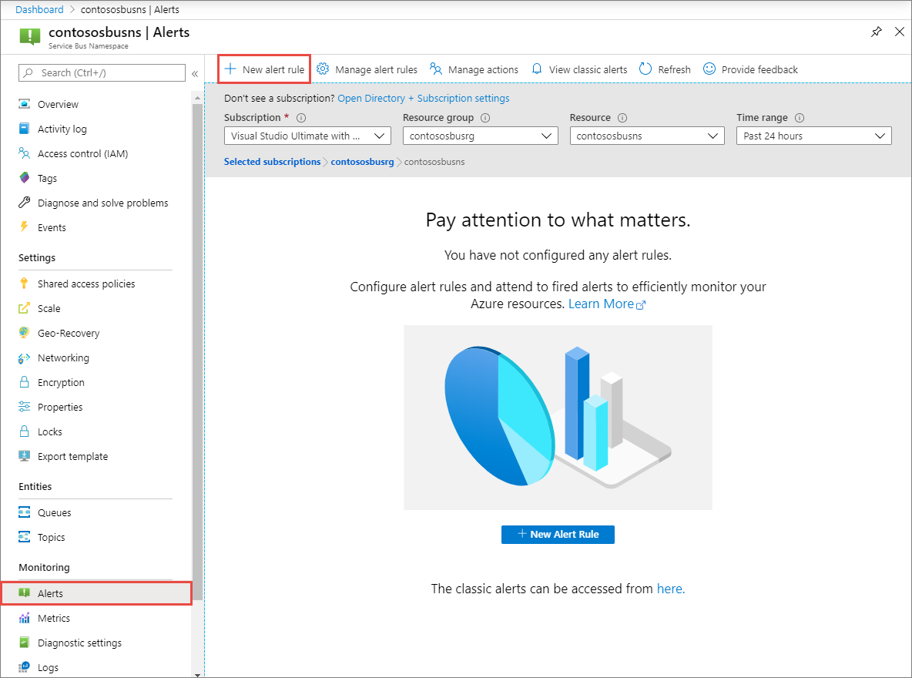
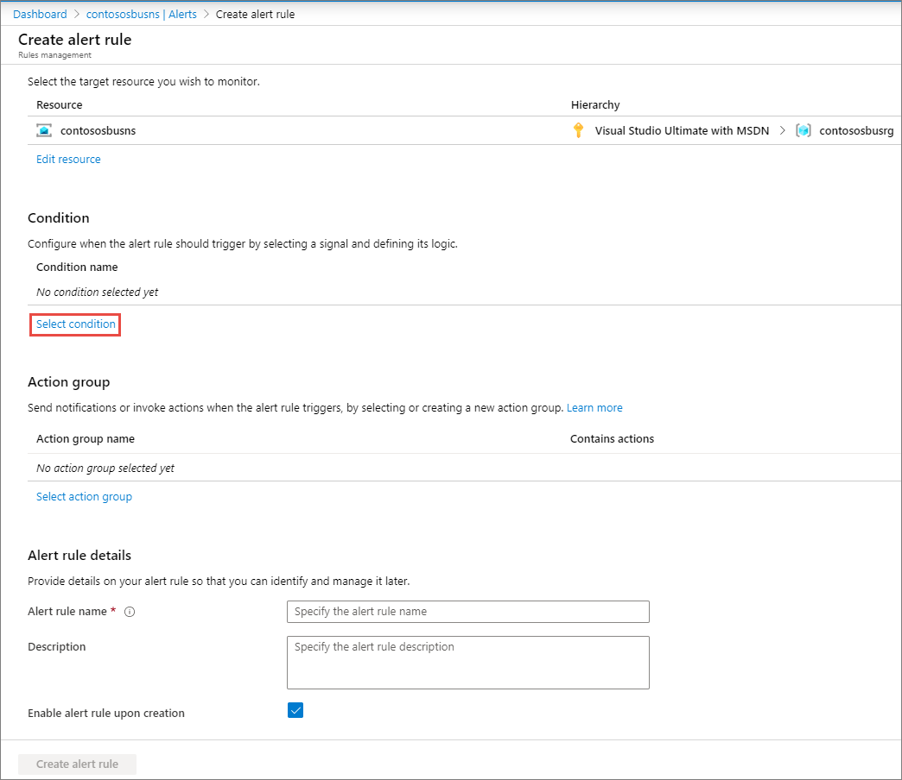
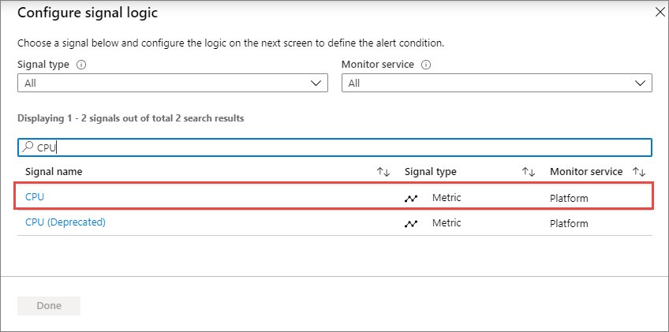
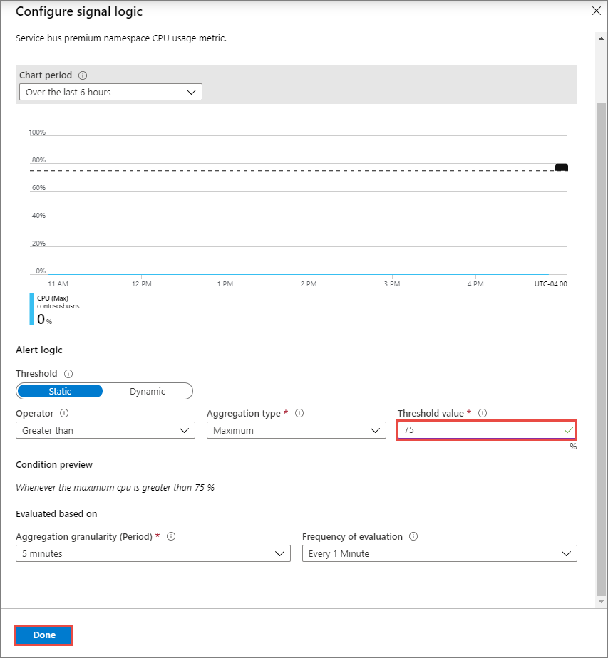
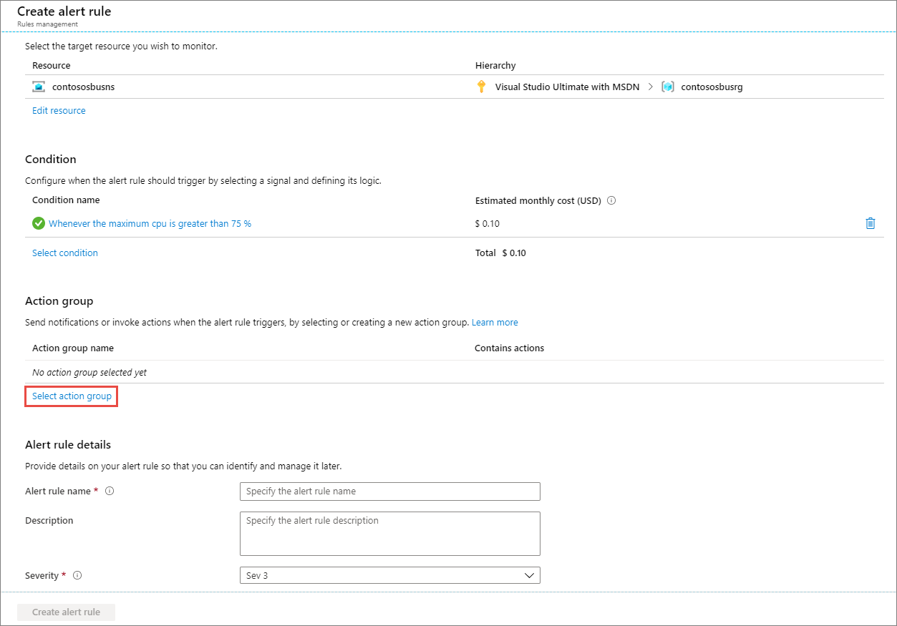
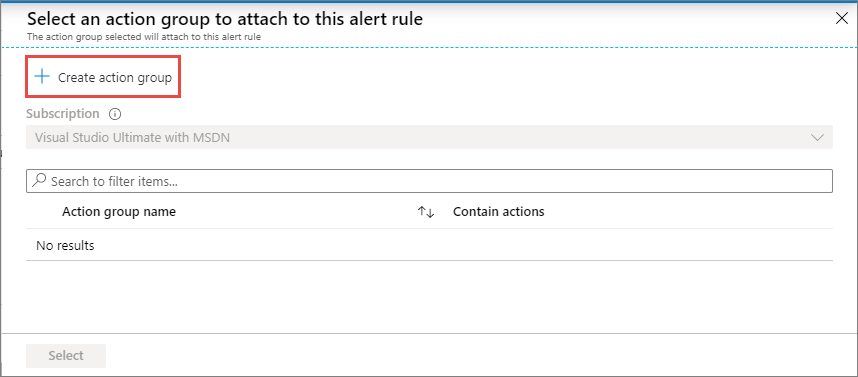
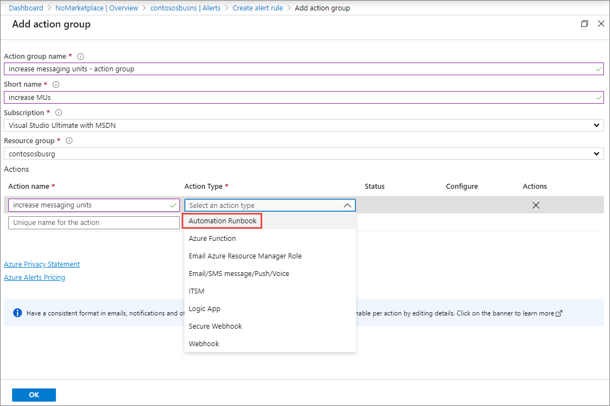
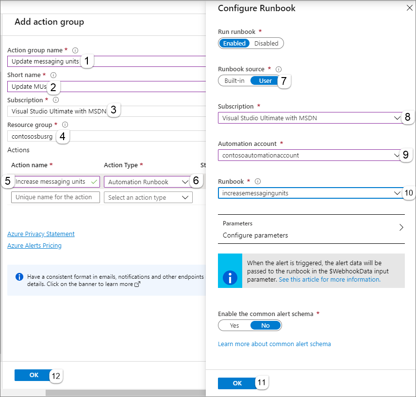
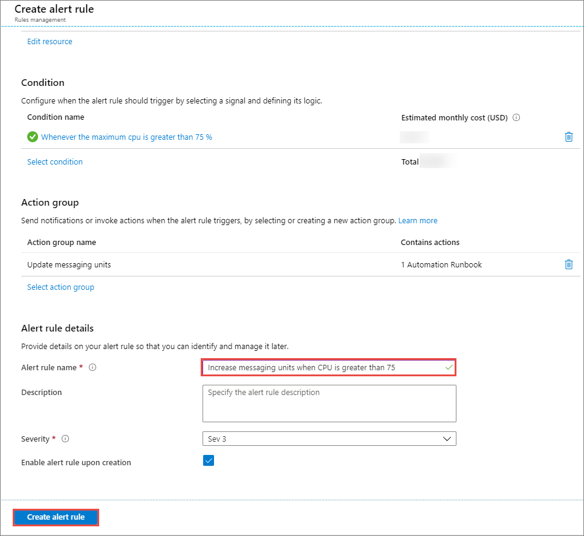

# Automatically update messaging units of an Azure Service Bus namespace 
This article shows you how you can automatically update [messaging units](service-bus-premium-messaging.md) of a Service Bus namespace based on resource (CPU or memory) usage. 

The example in this article shows how to increase messaging units for a Service Bus namespace when the CPU usage of the namespace goes above 75%. The high-level steps are:

1. Create an Azure Automation runbook with PowerShell script that scales up (increases) messaging units for a Service Bus namespace. 
2. Create a CPU usage alert on the Service Bus namespace, which invokes the PowerShell script when the namespace CPU usage goes above 75%. 

> [!IMPORTANT]
> This article applies to only the **premium** tier of Azure Service Bus. 


## Create a Service Bus namespace
Create a premier tier Service Bus namespace. Follow steps from the [Create a namespace in the Azure portal](service-bus-quickstart-portal.md#create-a-namespace-in-the-azure-portal) article to create the namespace. 

## Create an Azure Automation account
Create an Azure Automation account by following instructions from the [Create an Azure Automation account](../automation/automation-quickstart-create-account.md) article. 

## Import Az.Service module from gallery
Import `Az.Accounts` and `Az.ServiceBus` modules from the gallery into the automation account. The `Az.ServiceBus` module depends on `Az.Accounts` module, so it must be installed first. 

For step-by-step instructions, see [Import a module from the module gallery](../automation/automation-runbook-gallery.md#import-a-module-from-the-module-gallery-with-the-azure-portal).

## Create and publish a PowerShell runbook

1. Create a PowerShell runbook by follow instructions in the [Create a PowerShell runbook](../automation/automation-quickstart-create-runbook.md) article. 

    Here's a sample PowerShell script you can use to increase messaging units for a Service Bus namespace. This PowerShell script in an automation runbook increases MUs from 1 to 2, 2 to 4, or 4 to 8. The allowed values for this property are: 1, 2, 4, and 8. You can create another runbook to decrease the messaging units.

    The **namespaceName** and **resourceGroupName** parameters are used for testing the script separately from alerting scenario. 
    
    The **WebHookData** parameter is for the alert to pass information such as resource group name, resource name, etc. at runtime. 

    ```powershell
    [OutputType("PSAzureOperationResponse")]
    param
    (
        [Parameter (Mandatory=$false)]
        [object] $WebhookData,
    
        [Parameter (Mandatory = $false)]
        [String] $namespaceName,
    
        [Parameter (Mandatory = $false)]
        [String] $resourceGroupName
    )
    
    
    if ($WebhookData)
    {
        # Get the data object from WebhookData
        $WebhookBody = (ConvertFrom-Json -InputObject $WebhookData.RequestBody)
    
        # Get the alert schema ID
        $schemaId = $WebhookBody.schemaId

        # If it's a metric alert
        if ($schemaId -eq "AzureMonitorMetricAlert") {

            # Get the resource group name from the alert context
            $resourceGroupName = $WebhookBody.resourceGroupName
            
            # Get the namespace name from the alert context
            $namespaceName = $WebhookBody.resourceName
        }
    }
    
    # Connect to Azure account
    $connection = Get-AutomationConnection -Name AzureRunAsConnection
    
    while(!($connectionResult) -And ($logonAttempt -le 10))
    {
        $LogonAttempt++
        # Logging in to Azure...
        $connectionResult =    Connect-AzAccount `
                                    -ServicePrincipal `
                                    -Tenant $connection.TenantID `
                                    -ApplicationId $connection.ApplicationID `
                                    -CertificateThumbprint $connection.CertificateThumbprint
    
        Start-Sleep -Seconds 30
    }
    
    # Get the current capacity (number of messaging units) of the namespace
    $sbusns=Get-AzServiceBusNamespace `
        -Name $namespaceName `
        -ResourceGroupName $resourceGroupName
    
    $currentCapacity = $sbusns.Sku.Capacity
    
    # Increase the capacity
    # Capacity can be one of these values: 1, 2, 4, 8
    if ($currentCapacity -eq 1) {
        $newMU = 2
    }
    elseif ($currentCapacity -eq 2) {
        $newMU = 4
    }
    elseif ($currentCapacity -eq 4) {
        $newMU = 8    
    }
    else {
    
    }
    
    # Update the capacity of the namespace
    Set-AzServiceBusNamespace `
            -Location eastus `
            -SkuName Premium `
            -Name $namespaceName `
            -SkuCapacity $newMU `
            -ResourceGroupName $resourceGroupName

    ```
2. [Test the workbook](../automation/manage-runbooks.md#test-a-runbook) by specifying values for the **namespaceName** and **resourceGroupName** parameters. Confirm that the messaging units on the namespace are updated. 
3. After you test successfully, [publish the workbook](..//automation/manage-runbooks.md#publish-a-runbook) so that it's available to add as an action for an alert on the namespace later. 

## Create an alert on the namespace to trigger the runbook
See [Use an alert to trigger an Azure Automation runbook](../automation/automation-create-alert-triggered-runbook.md) article to configure an alert on your Service Bus namespace to trigger the automation runbook you created. For example, you can create an alert on **CPU usage per namespace** or **Memory size usage per namespace** metric, and add an action to trigger the automation runbook you created. For details about these metrics, see [Resource usage metrics](service-bus-metrics-azure-monitor.md#resource-usage-metrics).

The following procedure shows how to create an alert that triggers the automation runbook when the namespace **CPU usage** goes above **75%**.

1. On the **Service Bus Namespace** page for your namespace, select **Alerts** on the left menu, and then select **+ New alert rule** on the toolbar. 
    
    
2. On the **Create alert rule** page, click **Select condition**. 

     
3. On the **Configure signal logic** page, select **CPU** for the signal. 

    
4. Enter a **threshold value** (in this example, it's **75%**), and select **Done**. 

    
5. Now, on the **Create alert page**, click **Select action group**.
    
    
6. Select **Create action group** button on the toolbar. 

    
7. On the **Add action group** page, do the following steps:
    1. Enter a **name** for the action group. 
    2. Enter a **short name** for the action group.
    3. Select the **subscription**  in which you want to create this action group.
    4. Select the **resource group**. 
    5. In the **Actions** section, enter a **name for the action**, and select **Automation Runbook** for **Action type**. 

        
8. On the **Configure Runbook** page, do the following steps:
    1. For **Runbook source**, select **User**. 
    2. For **Subscription**, select your Azure **subscription** that contains the automation account. 
    3. For **Automation account**, select your **automation account**.
    4. For **Runbook**, select your runbook. 
    5. Select **OK** on the **Configure Runbook** page. 
        
9. Select **OK** on the **Add action group** page. 
5. Now, on the **Create alert rule** page, enter a **name for the rule**, and then select **Create alert rule**. 
    

    > [!NOTE]
    > Now, when the namespace CPU usage goes above 75, the alert triggers the automation runbook, which increases messaging units of the Service Bus namespace. Similarly, you can create an alert for another automation runbook, which decreases the messaging units if the namespace CPU usage goes below 25. 

## Next steps
To learn about messaging units, see the [Premium messaging](service-bus-premium-messaging.md)
