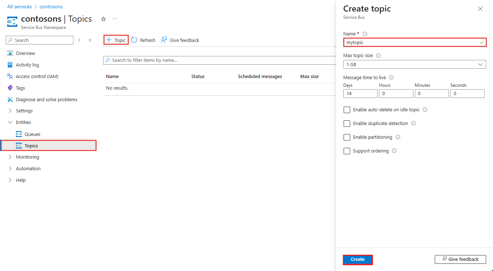
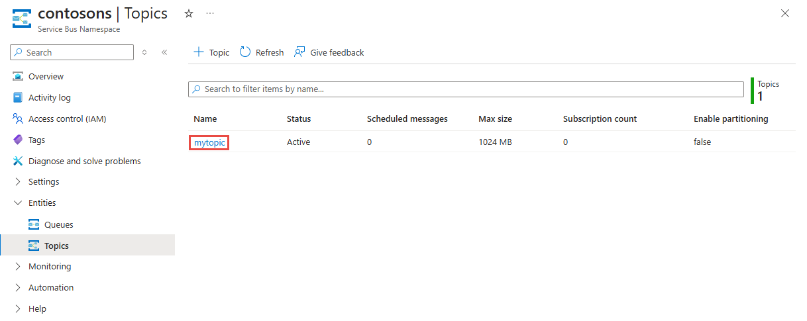
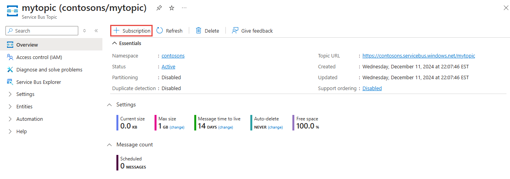

## Create a topic using the Azure portal
1. On the **Service Bus Namespace** page, select **Topics** on the left menu.
2. Select **+ Topic** on the toolbar. 
4. Enter a **name** for the topic. Leave the other options with their default values.
5. Select **Create**.

    

## Create subscriptions to the topic
1. Select the **topic** that you created in the previous section. 
    
    
2. On the **Service Bus Topic** page, select **Subscriptions** from the left menu, and then select **+ Subscription** on the toolbar. 
    
    
3. On the **Create subscription** page, enter **S1** for **name** for the subscription, and then select **Create**. 

    
4. Repeat the previous step twice to create subscriptions named **S2** and **S3**.