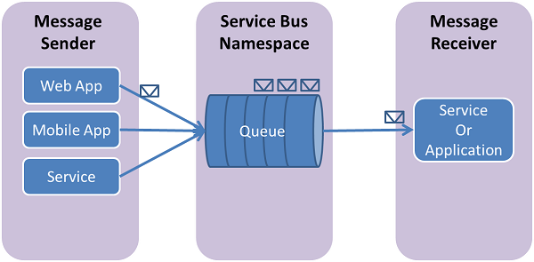

## What are Service Bus queues?
Service Bus queues support a **brokered messaging** communication model. When you use queues, components of a distributed application don't communicate directly with each other; instead they exchange messages via a queue, which acts as an intermediary (broker). A message producer (sender) hands off a message to the queue and then continues its processing. Asynchronously, a message consumer (receiver) pulls the message from the queue and processes it. The producer doesn't have to wait for a reply from the consumer in order to continue to process and send further messages. Queues offer **First In, First Out (FIFO)** message delivery to one or more competing consumers. That is, messages are typically received and processed by the receivers in the order in which they were added to the queue, and each message is received and processed by only one message consumer.

Service Bus queues are a general-purpose technology that can be used for a wide variety of scenarios:

* Communication between web and worker roles in a multi-tier Azure application.
* Communication between on-premises apps and Azure-hosted apps in a hybrid solution.
* Communication between components of a distributed application running on-premises in different organizations or departments of an organization.

Using queues enables you to scale your applications more easily, and enable more resiliency to your architecture.

