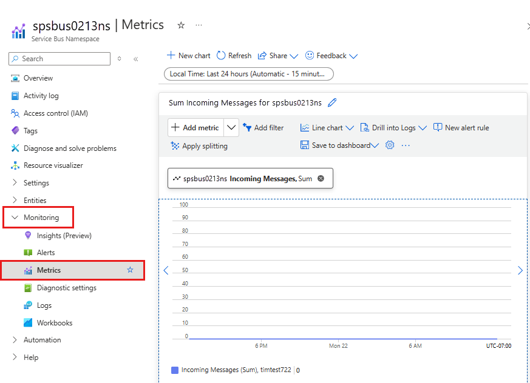

# Monitor Azure Service Bus
When you have critical applications and business processes relying on Azure resources, you want to monitor those resources for their availability, performance, and operation. This article describes the monitoring data generated by Azure Service Bus and how to analyze and alert on this data with Azure Monitor.

## What is Azure Monitor?
Azure Service Bus creates monitoring data using [Azure Monitor](../azure-monitor/overview.md), which is a full stack monitoring service in Azure. Azure Monitor provides a complete set of features to monitor your Azure resources. It can also monitor resources in other clouds and on-premises.

Start with the article [Monitoring Azure resources with Azure Monitor](../azure-monitor/essentials/monitor-azure-resource.md), which describes the following concepts:

- What is Azure Monitor?
- Costs associated with monitoring
- Monitoring data collected in Azure
- Configuring data collection
- Standard tools in Azure for analyzing and alerting on monitoring data

The following sections build on this article by describing the specific data gathered for Azure Service Bus. These sections also provide examples for configuring data collection and analyzing this data with Azure tools.

> [!TIP]
> To understand costs associated with Azure Monitor, see [Azure Monitor cost and usage](../azure-monitor/cost-usage.md). To understand the time it takes for your data to appear in Azure Monitor, see [Log data ingestion time](../azure-monitor/logs/data-ingestion-time.md).

## Monitoring data from Azure Service Bus
Azure Service Bus collects the same kinds of monitoring data as other Azure resources that are described in [Monitoring data from Azure resources](../azure-monitor/essentials/monitor-azure-resource.md#monitoring-data). 

See [Azure Service Bus monitoring data reference](monitor-service-bus-reference.md) for a detailed reference of the logs and metrics created by Azure Service Bus.

## Collection and routing
Platform metrics and the activity log are collected and stored automatically, but can be routed to other locations by using a diagnostic setting.  

Resource Logs aren't collected and stored until you create a diagnostic setting and route them to one or more locations.

See [Create diagnostic setting to collect platform logs and metrics in Azure](../azure-monitor/essentials/diagnostic-settings.md) for the detailed process for creating a diagnostic setting using the Azure portal, CLI, or PowerShell. When you create a diagnostic setting, you specify which categories of logs to collect. The categories for Azure Service Bus are listed in [Azure Service Bus monitoring data reference](monitor-service-bus-reference.md#resource-logs).

> [!NOTE]
> Azure Monitor doesn't include dimensions in the exported metrics data, that's sent to a destination like Azure Storage, Azure Event Hubs, Log Analytics, etc.


### Azure Storage 
The diagnostic logging information is stored in containers named **insights-logs-operationlogs** and **insights-metrics-pt1m**.

Sample URL for an operation log: `https://<Azure Storage account>.blob.core.windows.net/insights-logs-operationallogs/resourceId=/SUBSCRIPTIONS/<Azure subscription ID>/RESOURCEGROUPS/<Resource group name>/PROVIDERS/MICROSOFT.SERVICEBUS/NAMESPACES/<Namespace name>/y=<YEAR>/m=<MONTH-NUMBER>/d=<DAY-NUMBER>/h=<HOUR>/m=<MINUTE>/PT1H.json`. The URL for a metric log is similar. 

### Azure Event Hubs
The diagnostic logging information is stored in event hubs named **insights-logs-operationlogs** and **insights-metrics-pt1m**. You can also select your own event hub. 

### Log Analytics 
The diagnostic logging information is stored in tables named **AzureDiagnostics** and **AzureMetrics**. 

### Sample operational log output (formatted)

```json
{
	"Environment": "PROD",
	"Region": "East US",
	"ScaleUnit": "PROD-BL2-002",
	"ActivityId": "a097a88a-33e5-4c9c-9c64-20f506ec1375",
	"EventName": "Retrieve Namespace",
	"resourceId": "/SUBSCRIPTIONS/<Azure subscription ID>/RESOURCEGROUPS/SPSBUS0213RG/PROVIDERS/MICROSOFT.SERVICEBUS/NAMESPACES/SPSBUS0213NS",
	"SubscriptionId": "<Azure subscription ID>",
	"EventTimeString": "5/18/2021 3:25:55 AM +00:00",
	"EventProperties": "{\"SubscriptionId\":\"<Azure subscription ID>\",\"Namespace\":\"spsbus0213ns\",\"Via\":\"https://spsbus0213ns.servicebus.windows.net/$Resources/topics?api-version=2017-04&$skip=0&$top=100\",\"TrackingId\":\"a097a88a-33e5-4c9c-9c64-20f506ec1375_M8CH3_M8CH3_G8\"}",
	"Status": "Succeeded",
	"Caller": "rpfrontdoor",
	"category": "OperationalLogs"
}
```

### Sample metric log output (formatted)

```json
{
	"count": 1,
	"total": 4,
	"minimum": 4,
	"maximum": 4,
	"average": 4,
	"resourceId": "/SUBSCRIPTIONS/<Azure subscription ID>/RESOURCEGROUPS/SPSBUS0213RG/PROVIDERS/MICROSOFT.SERVICEBUS/NAMESPACES/SPSBUS0213NS",
	"time": "2021-05-18T03:27:00.0000000Z",
	"metricName": "IncomingMessages",
	"timeGrain": "PT1M"
}
```

> [!IMPORTANT]
> Enabling these settings requires additional Azure services (storage account, event hub, or Log Analytics), which may increase your cost. To calculate an estimated cost, visit the [Azure pricing calculator](https://azure.microsoft.com/pricing/calculator).

> [!NOTE]
> When you enable metrics in a diagnostic setting, dimension information is not currently included as part of the information sent to a storage account, event hub, or log analytics.

The metrics and logs you can collect are discussed in the following sections.

## Analyzing metrics
You can analyze metrics for Azure Service Bus, along with metrics from other Azure services, by selecting **Metrics** from the **Azure Monitor** section on the home page for your Service Bus namespace. See [Analyze metrics with Azure Monitor metrics explorer](../azure-monitor/essentials/analyze-metrics.md) for details on using this tool. For a list of the platform metrics collected, see [Monitoring Azure Service Bus data reference metrics](monitor-service-bus-reference.md#metrics).



For reference, you can see a list of [all resource metrics supported in Azure Monitor](../azure-monitor/essentials/metrics-supported.md).

> [!TIP]
> Azure Monitor metrics data is available for 90 days. However, when creating charts only 30 days can be visualized. For example, if you want to visualize a 90 day period, you must break it into three charts of 30 days within the 90 day period.

### Filtering and splitting
For metrics that support dimensions, you can apply filters using a dimension value. For example, add a filter with `EntityName` set to the name of a queue or a topic. You can also split a metric by dimension to visualize how different segments of the metric compare with each other. For more information of filtering and splitting, see [Advanced features of Azure Monitor](../azure-monitor/essentials/metrics-charts.md).

## Analyzing logs
Using Azure Monitor Log Analytics requires you to create a diagnostic configuration and enable __Send information to Log Analytics__. For more information, see the [Collection and routing](#collection-and-routing) section. Data in Azure Monitor Logs is stored in tables, with each table having its own set of unique properties. Azure Service Bus stores data in the following tables: **AzureDiagnostics** and **AzureMetrics**.

> [!IMPORTANT]
> When you select **Logs** from the Azure Service Bus menu, Log Analytics is opened with the query scope set to the current workspace. This means that log queries will only include data from that resource. If you want to run a query that includes data from other databases or data from other Azure services, select **Logs** from the **Azure Monitor** menu. See [Log query scope and time range in Azure Monitor Log Analytics](../azure-monitor/logs/scope.md) for details.


For a detailed reference of the logs and metrics, see [Azure Service Bus monitoring data reference](monitor-service-bus-reference.md).

### Sample Kusto queries

> [!IMPORTANT]
> When you select **Logs** from the Azure Service Bus menu, Log Analytics is opened with the query scope set to the current Azure Service Bus namespace. This means that log queries will only include data from that resource. If you want to run a query that includes data from other workspaces or data from other Azure services, select **Logs** from the **Azure Monitor** menu. See [Log query scope and time range in Azure Monitor Log Analytics](../azure-monitor/logs/scope.md) for details.

Following are sample queries that you can use to help you monitor your Azure Service Bus resources: 

### [AzureDiagnostics](#tab/AzureDiagnostics)

+ Get management operations in the last 7 days. 

    ```kusto
    AzureDiagnostics
    | where TimeGenerated > ago(7d)
    | where ResourceProvider =="MICROSOFT.SERVICEBUS"
    | where Category == "OperationalLogs"
    | summarize count() by EventName_s, _ResourceId
    ```
+ Get runtime audit logs generated in the last one hour. 

    ```kusto
    AzureDiagnostics
    | where TimeGenerated > ago(1h)
    | where ResourceProvider =="MICROSOFT.SERVICEBUS"
    | where Category == "RuntimeAuditLogs"    
    ```
+ Get access attempts to a key vault that resulted in "key not found" error.

    ```kusto
    AzureDiagnostics
    | where ResourceProvider == "MICROSOFT.SERVICEBUS" 
    | where Category == "Error" and OperationName == "wrapkey"
    | project Message, _ResourceId
    ```

+ Get errors from the past 7 days

    ```kusto
    AzureDiagnostics
    | where TimeGenerated > ago(7d)
    | where ResourceProvider =="MICROSOFT.SERVICEBUS"
    | where Category == "Error" 
    | summarize count() by EventName_s, _ResourceId
    ```

+ Get operations performed with a key vault to disable or restore the key.

    ```kusto
    AzureDiagnostics
    | where ResourceProvider == "MICROSOFT.SERVICEBUS"
    | where (Category == "info" and (OperationName == "disable" or OperationName == "restore"))
    | project Message, _ResourceId
    ```

+ Get all the entities that have been autodeleted

    ```kusto
    AzureDiagnostics
    | where ResourceProvider == "MICROSOFT.SERVICEBUS"
    | where Category == "OperationalLogs"
    | where EventName_s startswith "AutoDelete"
    | summarize count() by EventName_s, _ResourceId    
    ```
 ### [Resource Specific Table](#tab/Resourcespecifictable)

+ Get deny connection events for namespace

  ```kusto
   AZMSVNetConnectionEvents
   | extend NamespaceName = tostring(split(_ResourceId, "/")[8])
   | where Provider =~ "ServiceBus"
   | where Action == "Deny Connection"
   | project Action, SubscriptionId, NamespaceName, AddressIp, Reason, Count
   | summarize by Action, NamespaceName 
    ```

+ Get failed operation logs  for namespace

  ```kusto
   AZMSOperationalLogs
   | extend NamespaceName = tostring(split(_ResourceId, "/")[8])
   | where Provider =~ "ServiceBus"
   | where isnotnull(NamespaceName) and Status != "Succeeded"
   | project NamespaceName, ResourceId, EventName, Status, Caller, SubscriptionId
   | summarize by NamespaceName, EventName
    ```

+ Get Send message events for namespace

  ```kusto
  AZMSRunTimeAuditLogs
  | extend NamespaceInfo = tostring(split(_ResourceId, "/")[8])
  | where Provider =~ "ServiceBus"
  | where isnotnull(NamespaceInfo) and ActivityName = "SendMessage"
  | project NamespaceInfo, ActivityName, Protocol, NetworkType, ClientIp, ResourceId
  | summarize by NamespaceInfo, ActivityName
    ```
+ Get Failed authorization results for AAD

  ```kusto
  AZMSRunTimeAuditLogs
  | extend NamespaceInfo = tostring(split(_ResourceId, "/")[8])
  | where Provider =~ "ServiceBus"
  | where isnotnull(NamespaceInfo) and isnotnull(AuthKey) and AuthType == "AAD" and Status != "Success" 
  | project NamespaceInfo, AuthKey, ActivityName, Protocol, NetworkType, ClientIp, ResourceId
  | summarize by NamespaceInfo, AuthKey, ActivityName
   ```

## Alerts
You can access alerts for Azure Service Bus by selecting **Alerts** from the **Azure Monitor** section on the home page for your Service Bus namespace. See [Create, view, and manage metric alerts using Azure Monitor](../azure-monitor/alerts/alerts-metric.md) for details on creating alerts.


## Next steps

- For a reference of the logs and metrics, see [Monitoring Azure Service Bus data reference](monitor-service-bus-reference.md).
- For details on monitoring Azure resources, see [Monitoring Azure resources with Azure Monitor](../azure-monitor/essentials/monitor-azure-resource.md).
