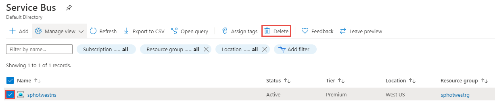

# Move an Azure Service Bus namespace to another region
There are various scenarios in which you'd want to move your existing Service Bus namespace from one region to another. For example, you may want to create a namespace with the same configuration for testing. You may also want to create a secondary namespace in another region as part of [disaster recovery planning](service-bus-geo-dr.md).

Here are the high-level steps:

1. Export the Service Bus namespace in the current region to an Azure Resource Manager template. 
1. Update location for resources in the template. Also, remove the default subscription filter from the template because you can't create a default rule as it's automatically created for you. 
1. Use the template to deploy the Service Bus namespace to the target region. 
1. Verify the deployment to ensure that the namespace, queues, topics, and subscriptions for topics are all created in the target region. 
1. Complete the move by deleting the namespace from the source region after processing all messages. 

## Prerequisites
Ensure that Azure Service Bus and features that your account uses are supported in the target region.
 
## Prepare
To get started, export a Resource Manager template. This template contains settings that describe your Service Bus namespace.

1. Sign in to the [Azure portal](https://portal.azure.com).
2. Select **All resources** and then select your Service Bus namespace.
3. On the **Service Bus Namespace** page, select **Export template** under **Automation** in the left menu. 
4. Choose **Download** in the **Export template** page.

    :::image type="content" source="./media/move-across-regions/download-template.png" alt-text="Download Resource Manager template":::
5. Locate the .zip file that you downloaded from the portal, and unzip that file to a folder of your choice. This zip file contains the template and parameters JSON files. 
1. Open the template.json file in the extracted folder. 
1. Search for `location`, and replace the value for the property with the new name for the region or location. To obtain location codes, see [Azure locations](https://azure.microsoft.com/global-infrastructure/locations/). The code for a region is the region name with no spaces, for example, `West US` is equal to `westus`.
1. Remove definitions of resources of type: `Microsoft.ServiceBus/namespaces/topics/subscriptions/rules`. Don't forget to remove the comma (`,`) character preceding this section to keep JSON valid.  

    > [!NOTE]
    > You can't create a default rule for a subscription by using a Resource Manager template. The default rule is automatically created when the subscription is created in the target region. 

## Move
Deploy the template to create a Service Bus namespace in the target region. 

1. In the Azure portal, select **Create a resource**.
2. In **Search the Marketplace**, type **template deployment** for the search text, select **Template deployment (deploy using custom templates)**, and then press **ENTER**.

    :::image type="content" source="./media/move-across-regions/new-template-deployment.png" alt-text="New template deployment":::    
1. On the **Template deployment** page, select **Create**.

    :::image type="content" source="./media/move-across-regions/template-deployment-create-button.png" alt-text="New template deployment - create button":::        
1. On the **Custom deployment** page, select **Build your own template in the editor**.

    :::image type="content" source="./media/move-across-regions/build-template-link.png" alt-text="Build your own template in the editor - link":::            
1. On the **Edit template** page, select **Load file** on the toolbar, and then follow the instructions to load the **template.json** file that you downloaded in the last section.

    :::image type="content" source="./media/move-across-regions/select-template.png" alt-text="Select template":::                
1. Select **Save** to save the template. 

    :::image type="content" source="./media/move-across-regions/save-template.png" alt-text="Save template":::                    
1. On the **Custom deployment** page, follow these steps: 
    1. Select an Azure **subscription**. 
    2. Select an existing **resource group** or create one. 
    3. Select the target **location** or region. If you selected an existing resource group, this setting is read-only. 
    4. Enter a new **name for the namespace**.
    1. Select **Review + create**. 

        :::image type="content" source="./media/move-across-regions/deploy-template.png" alt-text="Deploy Resource Manager template":::
    1. On the **Review + create** page, select **Create** at the bottom of the page. 
    
## Verify
1. After the deployment is successful, select **Go to resource group**.

    :::image type="content" source="./media/move-across-regions/resource-group-navigation-link.png" alt-text="Go to resource group link":::    
1. On the **Resource group** page, select the Service Bus namespace. 

    :::image type="content" source="./media/move-across-regions/select-namespace.png" alt-text="Select Service Bus namespace":::    
1. On the **Service Bus namespace** page, verify that you see the queues, topics, and subscriptions from the source region. 
    1. You see **queues** in the namespace at the bottom of the right pane.         
    
        :::image type="content" source="./media/move-across-regions/queue-namespace.png" alt-text="Queues in the namespace":::
    2. Switch to the **Topics** tab to see topics in the namespace
    
        :::image type="content" source="./media/move-across-regions/topics-namespace.png" alt-text="Topics in the namespace":::
    3. Select the topic to verify subscriptions are created. 

        :::image type="content" source="./media/move-across-regions/topic-subscriptions.png" alt-text="Topic subscriptions":::      
    
    

## Discard or clean up
After the deployment, if you want to start over, you can delete the **target Service Bus namespace**, and repeat the steps described in the [Prepare](#prepare) and [Move](#move) sections of this article.

To commit the changes and complete the move of a Service Bus namespace, delete the **source Service Bus namespace**. Make sure that you process all messages before deleting the namespace. 

To delete a Service Bus namespace (source or target) by using the Azure portal:

1. In the search window at the top of Azure portal, type **Service Bus**, and select **Service Bus** from search results. You see the Service Bus namespaces in a list.
2. Select the target namespace to delete, and select **Delete** from the toolbar. 

    
3. On the **Delete Resources** page, verify the selected resources, and confirm the deletion by typing **yes**, and then select **Delete**. 

    Other option is to delete the resource group that has the Service Bus namespace. On the **Resource group** page, select **Delete resource group** on the toolbar, and then confirm the deletion. 

## Next steps

In this tutorial, you moved an Azure Service Bus namespace from one region to another and cleaned up the source resources.  To learn more about moving resources between regions and disaster recovery in Azure, refer to:

- [Move resources to a new resource group or subscription](../azure-resource-manager/management/move-resource-group-and-subscription.md)
