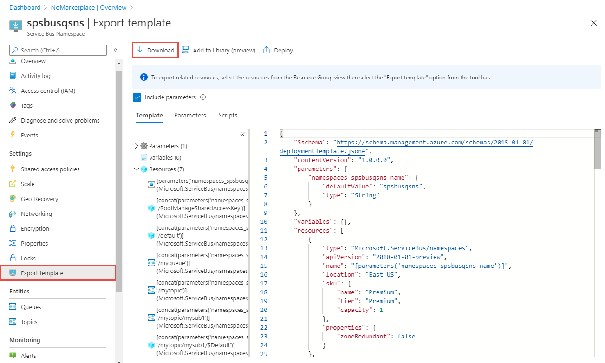
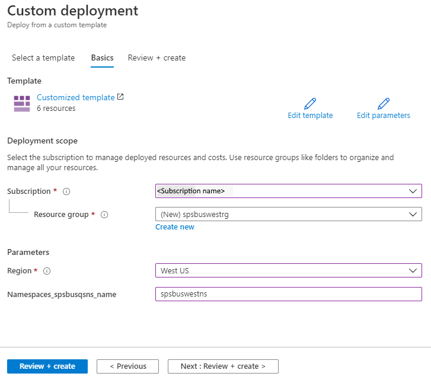

# Move an Azure Service Bus namespace to another region
There are various scenarios in which you'd want to move your existing Service Bus namespace from one region to another. For example, you may want to create a namespace with the same configuration for testing. You may also want to create a secondary namespace in another region as part of [disaster recovery planning](event-hubs-geo-dr.md#setup-and-failover-flow).

> [!NOTE]
> - This article shows you how to export an Azure Resource Manager template for an existing Service Bus namespace and then use the template to create a namespace with same configuration settings in another region. However, this process doesn't move messages. You need to process messages from the original namespace before deleting it.
> - The default rule of a subscription is exported to the template, but you can't import the template to create resources in the target region unless you remove the default rule from the template. After the subscription is moved, you need to override the default rule manually. 

## Prerequisites
Ensure that Azure Service Bus and features that your account uses are supported in the target region.
 

## Prepare
To get started, export a Resource Manager template. This template contains settings that describe your Service Bus namespace.

1. Sign in to the [Azure portal](https://portal.azure.com).
2. Select **All resources** and then select your Service Bus namespace.
3. Select > **Settings** > **Export template**.
4. Choose **Download** in the **Export template** page.

    
5. Locate the .zip file that you downloaded from the portal, and unzip that file to a folder of your choice. This zip file contains the template and parameters JSON files. 
1. Open the template.json file in the extracted folder. 
1. Search for `location`, and replace the value for the property with the new name for the region or location. To obtain location codes, see [Azure locations](https://azure.microsoft.com/global-infrastructure/locations/). The code for a region is the region name with no spaces, for example, `West US` is equal to `westus`.
1. Remove the definition of the resource of type: `Microsoft.ServiceBus/namespaces/topics/subscriptions/rules`. Don't forget to remove the comma (`,`) character preceding this section to keep JSON valid.  

    You can't create a default rule for a subscription by using a Resource Manager template. The default rule is automatically created when the subscription is created in the target region. 

## Move

Deploy the template to create a Service Bus namespace in the target region. 

1. In the Azure portal, select **Create a resource**.
2. In **Search the Marketplace**, type **template deployment**, and then press **ENTER**.
3. Select **Template deployment**.
4. Select **Create**.
5. Select **Build your own template in the editor**.
6. Select **Load file**, and then follow the instructions to load the **template.json** file that you downloaded in the last section.
7. Select **Save** to save the template. 
8. On the **Custom deployment** page, follow these steps: 
    1. Select an Azure **subscription**. 
    2. Select an existing **resource group** or create one. 
    3. Select the target **location** or region. If you selected an existing resource group, this setting is read-only. 
    4. Enter a new **name for the namespace**.
    1. Select **Review + create**. 

        
    1. On the **Review + create** page, select **Create** at the bottom of the page. 

> [!NOTE]
> Creaet any overriden default subscription rules from the source region.
    
## Verify
1. After the deployment is successful, select **Go to resource group**.
1. On the **Resource group** page, select the Service Bus namespace. 
1. On the **Service Bus namespace** page, verify that you see the queues, topics, and subscriptions from the source region. 

## Discard or clean up
After the deployment, if you want to start over, you can delete the **target Service Bus namespace**, and repeat the steps described in the [Prepare](#prepare) and [Move](#move) sections of this article.

To commit the changes and complete the move of a Service Bus namespace, delete the **source Service Bus namespace**. Make sure that you processed all messages before deleting the namespace. 

To delete a Service Bus namespace (source or target) by using the Azure portal:

1. In the search window at the top of Azure portal, type **Service Bus**, and select **Service Bus** from search results. You see the Service Bus namespaces in a list.
2. Select the target namespace to delete, and select **Delete** from the toolbar. 

    
3. On the **Delete Resources*** page, verify the selected resources, and confirm the deletion by typing **yes**, and then select **Delete**. 

## Next steps

In this tutorial, you moved an Azure Service Bus namespace from one region to another and cleaned up the source resources.  To learn more about moving resources between regions and disaster recovery in Azure, refer to:

- [Move resources to a new resource group or subscription](../azure-resource-manager/management/move-resource-group-and-subscription.md)
