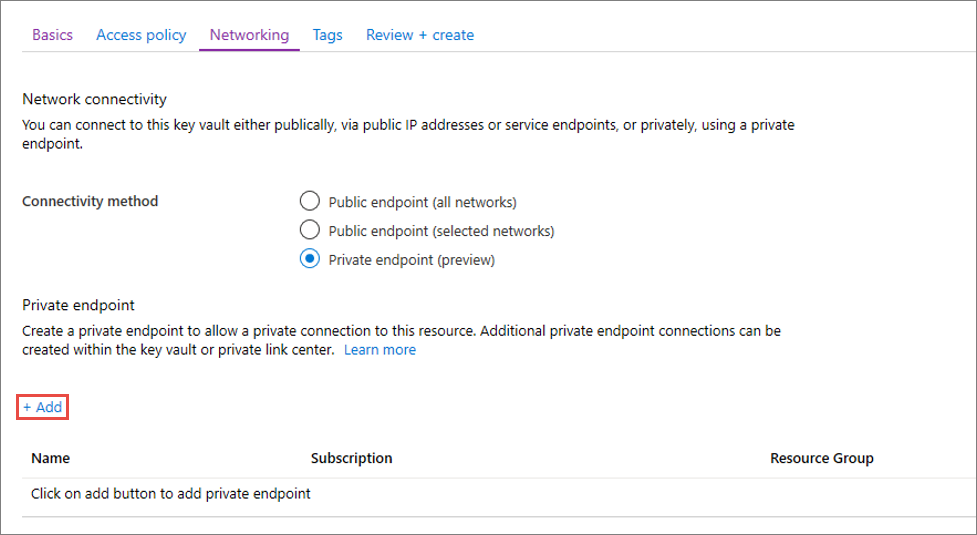
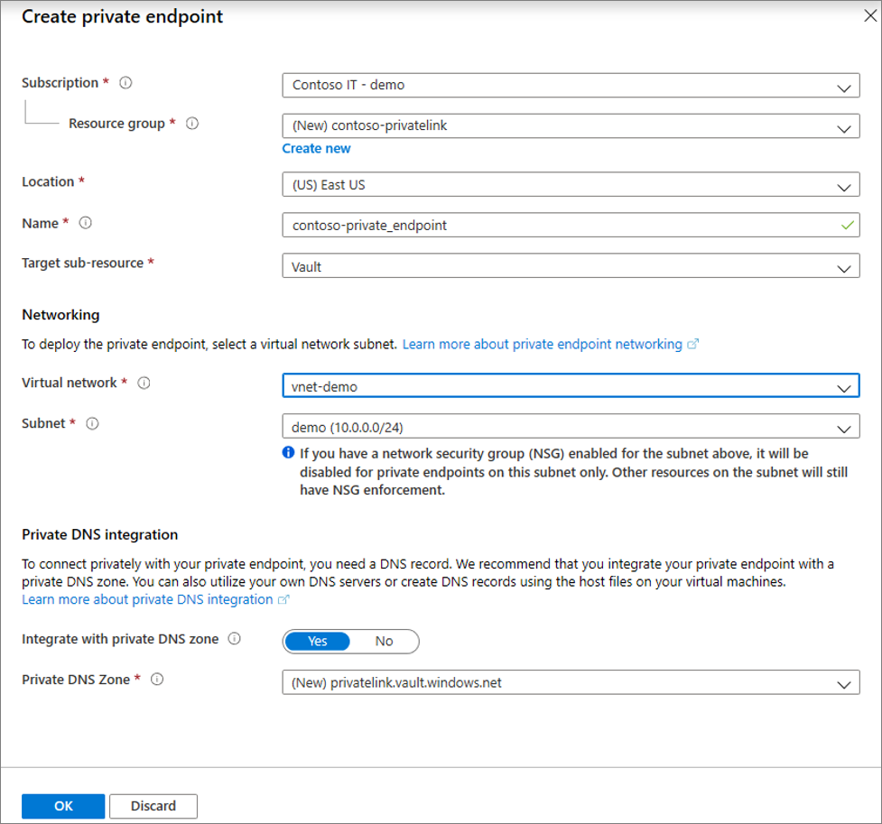

# Integrate Azure Service Bus with Azure Private Link (Preview)

Azure Private Link Service enables you to access Azure Services (for example, Azure Service Bus, Azure Storage, and Azure Cosmos DB) and Azure hosted customer/partner services over a **private endpoint** in your virtual network.

A private endpoint is a network interface that connects you privately and securely to a service powered by Azure Private Link. The private endpoint uses a private IP address from your VNet, effectively bringing the service into your VNet. All traffic to the service can be routed through the private endpoint, so no gateways, NAT devices, ExpressRoute or VPN connections, or public IP addresses are needed. Traffic between your virtual network and the service traverses over the Microsoft backbone network, eliminating exposure from the public Internet. You can connect to an instance of an Azure resource, giving you the highest level of granularity in access control.

For more information, see [What is Azure Private Link (Preview)?](../private-link/private-link-overview.md)

## Prerequisites

To integrate a Service Bus namespace with Azure Private Link (Preview), you'll need the following entities or permissions:

- A Service Bus namespace.
- An Azure virtual network.
- A subnet in the virtual network.
- Owner or contributor permissions for both the Service Bus namespace and the virtual network.

Your private endpoint and virtual network must be in the same region. When you select a region for the private endpoint using the portal, it will automatically filter only virtual networks that are in that region. Your Service Bus namespace can be in a different region.

Your private endpoint uses a private IP address in your virtual network.

## Establish a private link connection to an Service Bus namespace

First, create a virtual network by following the steps in [Create a virtual network using the Azure portal](../virtual-network/quick-create-portal.md)

You can then either create a new Service Bus namespace, or establish a private link connection to an existing namespace.

### Create a new Service Bus namespace and establish a private link connection

For step-by-step instructions on creating a new Service Bus namespace and entities in it, see [Create a Service Bus namespace using the Azure portal](service-bus-create-namespace-portal.md).

After configuring the namespace basics, select the **Networking** tab and follow these steps:

1. Select the **Private Endpoint (preview)** radio button in the **Networking** tab.
2. Click the **+ Add** Button to add a private endpoint.

     
3. In the **Location** field of the **Create Private Endpoint** page, select the **region** in which your virtual network is located. 
4. In the **Name** field, create a descriptive name that will allow you to identify this private endpoint. 
5. Select the **virtual network** and **subnet** you want this private endpoint to be created in from the dropdown menu. 
6. Leave **integrate with the private zone DNS** option unchanged.  
7. Select **Ok**.

    

    You can see the configured private endpoint now. You now have the option to delete and edit this private endpoint. 
8. Select the **Review + Create** button and create the namespace. It will take 5-10 minutes for the deployment to complete. 

### Establish a private link connection to a namespace

If you already have an existing namespace, you can create a private link connection by following these steps:

1. Sign in to the [Azure portal](https://portal.azure.com). 
2. In the search bar, type in **Service Bus**.
3. Select the **namespace** from the list to which you want to add a private endpoint.
4. Select the **Networking** tab under **Settings**.
5. Select the **Private endpoint connections (preview)** tab at the top of the page
6. Select the **+ Private Endpoint** button at the top of the page.

    
7. On the **Basics** page, follow these steps: 
    1. Select the **Azure subscription** in which you want to create the private endpoint. 
    2. Select the **resource group** for the private endpoint resource.
    3. Enter a **name** for the private endpoint. 
    5. Select a **region** for the private endpoint. Your private endpoint must be in the same region as your virtual network, but can be in a different region fro the private link resource that you are connecting to. 
    6. Select **Next: Resource >** button at the bottom of the page.

        
8. On the **Resource** page, follow these steps:
    1. For connection method, select **Connect to an Azure resource in my directory**. This example shows how to connect to an Azure resource in your directory. You can also connect to someone else's resource with a resource ID or alias that they've shared with you. 
    2. Select the **Azure subscription** in which your **Service Bus namespace** exists. 
    3. For **Resource type**, Select **Microsoft.ServiceBus/namespaces** for the **Resource type**.
    4. For **Resource**, select a Service Bus namespace from the drop-down list. 
    5. Confirm that the **Target subresource** is set to **topic** or **domain** (based on the resource type you selected).
    6. Select **Next: Configuration >** button at the bottom of the page. 
        
            
9. On the **Configuration** page, you select the subnet in a virtual network to where you want to deploy the private endpoint. 
    1. Select a **virtual network**. Only virtual networks in the currently selected subscription and location are listed in the drop-down list. 
    2. Select a **subnet** in the virtual network you selected. 
    3. Select **Next: Tags >** button at the bottom of the page. 

        
10. On the **Tags** page, create any tags (names and values) that you want to associate with the private endpoint resource. Then, select **Review + create** button at the bottom of the page. 
11. On the **Review + create**, review all the settings, and select **Create** to create the private endpoint.
    
    


## Manage private link connection

When you create a private endpoint, the connection must be approved. If the resource for which you're creating a private endpoint is in your directory, you can approve the connection request provided you have sufficient permissions. If you're connecting to an Azure resource in another directory, you must wait for the owner of that resource to approve your connection request.

There are four provisioning states:

| Service action | Service consumer private endpoint state | Description |
|--|--|--|
| None | Pending | Connection is created manually and is pending approval from the Private Link resource owner. |
| Approve | Approved | Connection was automatically or manually approved and is ready to be used. |
| Reject | Rejected | Connection was rejected by the private link resource owner. |
| Remove | Disconnected | Connection was removed by the private link resource owner, the private endpoint becomes informative and should be deleted for cleanup. |
 
###  How to manage a private endpoint connection to Service Bus namespace

1. Sign in to the Azure portal.
1. In the search bar, type in **Service Bus**.
1. Select the **namespace** that you want to manage.
1. Select the **Networking** tab.
1. If there are any connections that are pending, you will see a connection listed with **Pending** in the provisioning state. 
1. Select the **private endpoint** you wish to approve
1. Select the **Approve** button.
1. If there are any private endpoint connections you want to reject, whether it is a pending request or existing connection, select the connection and click the **Reject** button.

    

## Validate that the private link connection works

You should validate that the resources within the same subnet of the private endpoint resource are connecting to your Service Bus namespace over a private IP address, and that they have the correct private DNS zone integration.

First, create a virtual machine by following the steps in [Create a Windows virtual machine in the Azure portal](../virtual-machines/windows/quick-create-portal.md)

In the **Networking** tab:

1. Specify **Virtual network** and **Subnet**. You can create a new virtual network or select an existing one. If selecting an existing one, make sure the region matches.
1. Specify a **public IP** resource.
1. For **NIC network security group**, select **None**.
1. For **Load balancing**, select **No**.

Open the command line and run the following command:

```console
nslookup <your-service-bus-namespace-name>.servicebus.azure.net
```

If you run the ns lookup command to resolve the IP address of a Service Bus namespace over a public endpoint, you will see a result that looks like this:

```console
c:\ >nslookup <your-service-bus-namespace-name>.servicebus.azure.net

Non-authoritative answer:
Name:    
Address:  (public IP address)
Aliases:  <your-service-bus-namespace-name>.servicebus.azure.net
```

If you run the ns lookup command to resolve the IP address of a Service Bus namespace over a private endpoint, you will see a result that looks like this:

```console
c:\ >nslookup your_service-bus-namespace-name.servicebus.azure.net

Non-authoritative answer:
Name:    
Address:  10.1.0.5 (private IP address)
Aliases:  <your-service-bus-namespace-name>.servicebus.azure.net
```

## Limitations and Design Considerations

**Pricing**: For pricing information, see [Azure Private Link (preview) pricing](https://azure.microsoft.com/pricing/details/private-link/).

**Limitations**:  Private Endpoint for Azure Service Bus is in public preview. This feature is available in all Azure public regions.

**Maximum Number of Private Endpoints per Service Bus namespace**: 64.

**Maximum Number of Service Bus namespaces with private endpoints per Subscription**: 64.

For more, see [Azure Private Link service: Limitations](../private-link/private-link-service-overview.md#limitations)

## Next Steps

- Learn more about [Azure Private Link (Preview)](../private-link/private-link-service-overview.md)
- Learn more about [Azure Service Bus](service-bus-messaging-overview.md)
