# Integrate Azure Service Bus with Azure Private Link

Azure Private Link Service enables you to access Azure services (for example, Azure Service Bus, Azure Storage, and Azure Cosmos DB) and Azure hosted customer/partner services over a **private endpoint** in your virtual network.

A private endpoint is a network interface that connects you privately and securely to a service powered by Azure Private Link. The private endpoint uses a private IP address from your VNet, effectively bringing the service into your VNet. All traffic to the service can be routed through the private endpoint, so no gateways, NAT devices, ExpressRoute or VPN connections, or public IP addresses are needed. Traffic between your virtual network and the service traverses over the Microsoft backbone network, eliminating exposure from the public Internet. You can connect to an instance of an Azure resource, giving you the highest level of granularity in access control.

For more information, see [What is Azure Private Link?](../private-link/private-link-overview.md)

>[!WARNING]
> Implementing private endpoints can prevent other Azure services from interacting with Service Bus.
>
> Trusted Microsoft services are not supported when using Virtual Networks.
>
> Common Azure scenarios that don't work with Virtual Networks (note that the list is **NOT** exhaustive) -
> - Integration with Azure Event Grid
> - Azure IoT Hub Routes
> - Azure IoT Device Explorer
>
> The below Microsoft services are required to be on a virtual network
> - Azure App Service
> - Azure Functions

> [!IMPORTANT]
> This feature is supported with the **premium** tier of Azure Service Bus. For more information about the premium tier, see the [Service Bus Premium and Standard messaging tiers](service-bus-premium-messaging.md) article.


## Add a private endpoint using Azure portal

### Prerequisites

To integrate a Service Bus namespace with Azure Private Link, you'll need the following entities or permissions:

- A Service Bus namespace.
- An Azure virtual network.
- A subnet in the virtual network.
- Owner or contributor permissions for both the Service Bus namespace and the virtual network.

Your private endpoint and virtual network must be in the same region. When you select a region for the private endpoint using the portal, it will automatically filter only virtual networks that are in that region. Your Service Bus namespace can be in a different region. And, Your private endpoint uses a private IP address in your virtual network.

### steps

If you already have an existing namespace, you can create a private endpoint by following these steps:

1. Sign in to the [Azure portal](https://portal.azure.com). 
2. In the search bar, type in **Service Bus**.
3. Select the **namespace** from the list to which you want to add a private endpoint.
4. Select the **Networking** tab under **Settings**.
5. Select the **Private endpoint connections** tab at the top of the page
6. Select the **+ Private Endpoint** button at the top of the page.

    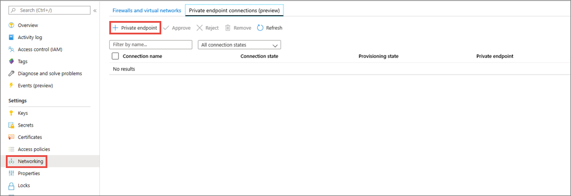
7. On the **Basics** page, follow these steps: 
    1. Select the **Azure subscription** in which you want to create the private endpoint. 
    2. Select the **resource group** for the private endpoint resource.
    3. Enter a **name** for the private endpoint. 
    5. Select a **region** for the private endpoint. Your private endpoint must be in the same region as your virtual network, but can be in a different region from the private link resource that you are connecting to. 
    6. Select **Next: Resource >** button at the bottom of the page.

        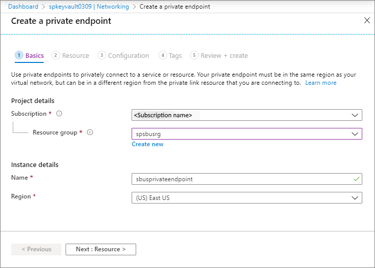
8. On the **Resource** page, follow these steps:
    1. For connection method, if you select **Connect to an Azure resource in my directory**, follow these steps:   
        1. Select the **Azure subscription** in which your **Service Bus namespace** exists. 
        2. For **Resource type**, Select **Microsoft.ServiceBus/namespaces** for the **Resource type**.
        3. For **Resource**, select a Service Bus namespace from the drop-down list. 
        4. Confirm that the **Target subresource** is set to **namespace**.
        5. Select **Next: Configuration >** button at the bottom of the page. 
        
            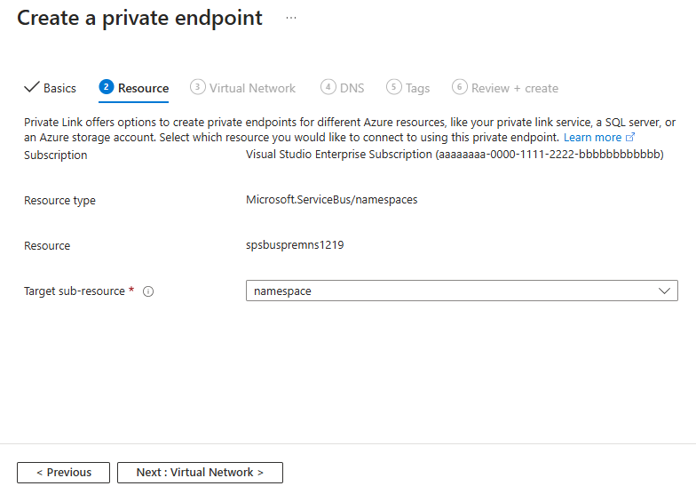
    2. If you select **Connect to an Azure resource by resource ID or alias**, follow these steps:
        1. Enter the **resource ID** or **alias**. It can be the resource ID or alias that someone has shared with you. The easiest way to get the resource ID is to navigate to the Service Bus namespace in the Azure portal and copy the portion of URI starting from `/subscriptions/`. See the following image for an example. 
        2. For **Target sub-resource**, enter **namespace**. It's the type of the sub-resource that your private endpoint can access. 
        3. (optional) Enter a **request message**. The resource owner sees this message while managing private endpoint connection. 
        4. Then, select **Next: Configuration >** button at the bottom of the page. 

            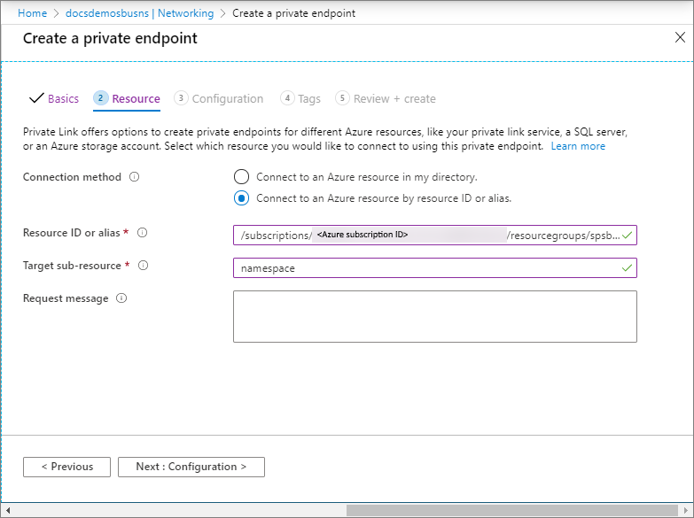
9. On the **Configuration** page, you select the subnet in a virtual network to where you want to deploy the private endpoint. 
    1. Select a **virtual network**. Only virtual networks in the currently selected subscription and location are listed in the drop-down list. 
    2. Select a **subnet** in the virtual network you selected. 
    3. Select **Next: Tags >** button at the bottom of the page. 

        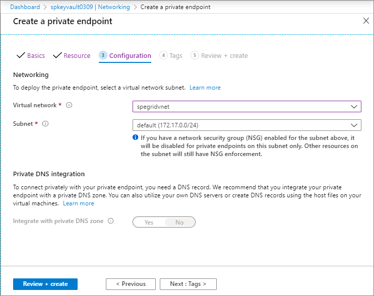
10. On the **Tags** page, create any tags (names and values) that you want to associate with the private endpoint resource. Then, select **Review + create** button at the bottom of the page. 
11. On the **Review + create**, review all the settings, and select **Create** to create the private endpoint.
    
    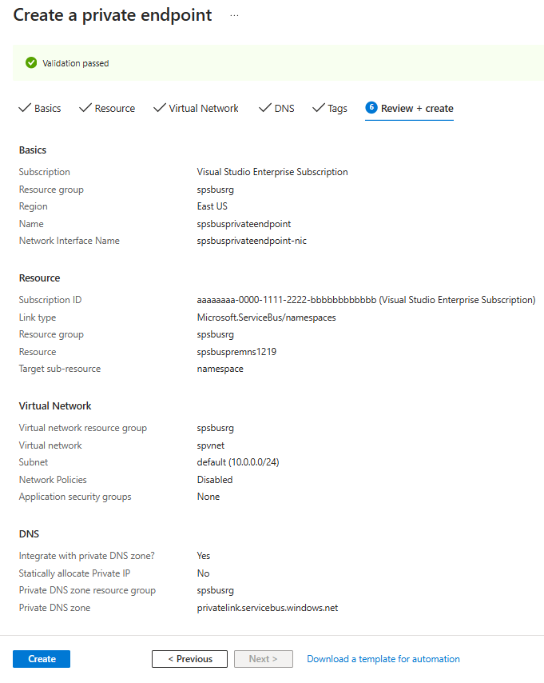
12. Confirm that the private endpoint is created. If you are the owner of the resource and had selected **Connect to an Azure resource in my directory** option for the **Connection method**, the endpoint connection should be **auto-approved**. If it's in the **pending** state, see the [Manage private endpoints using Azure portal](#manage-private-endpoints-using-azure-portal) section.

    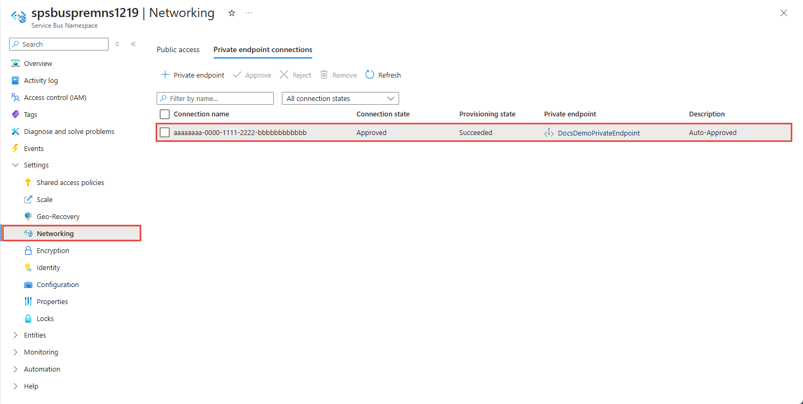

## Add a private endpoint using PowerShell
The following example shows you how to use Azure PowerShell to create a private endpoint connection to a Service Bus namespace.

Your private endpoint and virtual network must be in the same region. Your Service Bus namespace can be in a different region. And, Your private endpoint uses a private IP address in your virtual network.

```azurepowershell-interactive

$rgName = "<RESOURCE GROUP NAME>"
$vnetlocation = "<VNET LOCATION>"
$vnetName = "<VIRTUAL NETWORK NAME>"
$subnetName = "<SUBNET NAME>"
$namespaceLocation = "<NAMESPACE LOCATION>"
$namespaceName = "<NAMESPACE NAME>"
$peConnectionName = "<PRIVATE ENDPOINT CONNECTION NAME>"

# create resource group
az group create -l $vnetLocation -n $rgName

# create virtual network
$virtualNetwork = New-AzVirtualNetwork `
                    -ResourceGroupName $rgName `
                    -Location $vnetlocation `
                    -Name $vnetName `
                    -AddressPrefix 10.0.0.0/16

# create subnet with endpoint network policy disabled
$subnetConfig = Add-AzVirtualNetworkSubnetConfig `
                    -Name $subnetName `
                    -AddressPrefix 10.0.0.0/24 `
                    -PrivateEndpointNetworkPoliciesFlag "Disabled" `
                    -VirtualNetwork $virtualNetwork

# update virtual network
$virtualNetwork | Set-AzVirtualNetwork

# create premium service bus namespace
$namespaceResource = New-AzResource -Location $namespaceLocation -ResourceName $namespaceName -ResourceGroupName $rgName -Sku @{name = "Premium"; capacity = 1} -Properties @{} -ResourceType "Microsoft.ServiceBus/namespaces" -

# create a private link service connection
$privateEndpointConnection = New-AzPrivateLinkServiceConnection `
                                -Name $peConnectionName `
                                -PrivateLinkServiceId $namespaceResource.ResourceId `
                                -GroupId "namespace"

# get subnet object that you will use in the next step                                
$virtualNetwork = Get-AzVirtualNetwork -ResourceGroupName  $rgName -Name $vnetName
$subnet = $virtualNetwork | Select -ExpandProperty subnets `
                                | Where-Object  {$_.Name -eq $subnetName}  
   
# now, create private endpoint   
$privateEndpoint = New-AzPrivateEndpoint -ResourceGroupName $rgName  `
                                -Name $vnetName   `
                                -Location $vnetlocation `
                                -Subnet  $subnet   `
                                -PrivateLinkServiceConnection $privateEndpointConnection

(Get-AzResource -ResourceId $namespaceResource.ResourceId -ExpandProperties).Properties


```


## Manage private endpoints using Azure portal

When you create a private endpoint, the connection must be approved. If the resource for which you're creating a private endpoint is in your directory, you can approve the connection request provided you have sufficient permissions. If you're connecting to an Azure resource in another directory, you must wait for the owner of that resource to approve your connection request.

There are four provisioning states:

| Service action | Service consumer private endpoint state | Description |
|--|--|--|
| None | Pending | Connection is created manually and is pending approval from the Private Link resource owner. |
| Approve | Approved | Connection was automatically or manually approved and is ready to be used. |
| Reject | Rejected | Connection was rejected by the private link resource owner. |
| Remove | Disconnected | Connection was removed by the private link resource owner, the private endpoint becomes informative and should be deleted for cleanup. |
 
###  Approve, reject, or remove a private endpoint connection

1. Sign in to the Azure portal.
1. In the search bar, type in **Service Bus**.
1. Select the **namespace** that you want to manage.
1. Select the **Networking** tab.
5. Go to the appropriate section below based on the operation you want to: approve, reject, or remove. 

### Approve a private endpoint connection

1. If there are any connections that are pending, you will see a connection listed with **Pending** in the provisioning state. 
2. Select the **private endpoint** you wish to approve
3. Select the **Approve** button.

    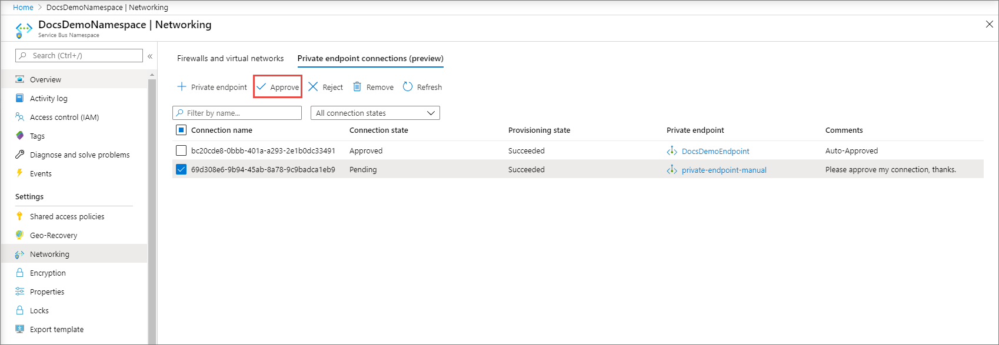
4. On the **Approve connection** page, enter an optional **comment**, and select **Yes**. If you select **No**, nothing happens. 

    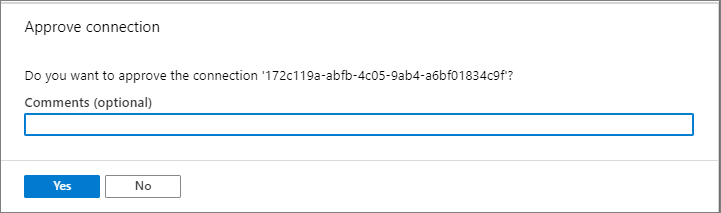
5. You should see the status of the connection in the list changed to **Approved**. 

    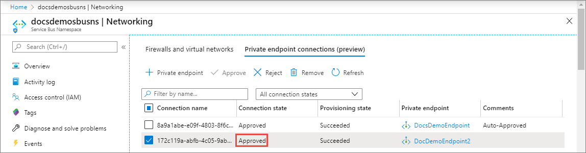

### Reject a private endpoint connection

1. If there are any private endpoint connections you want to reject, whether it is a pending request or existing connection that was approved earlier, select the endpoint connection and click the **Reject** button.

    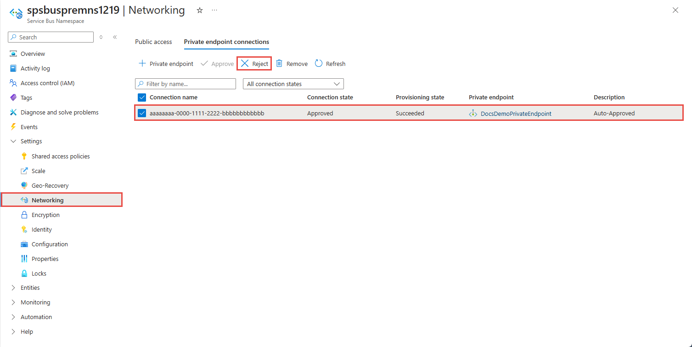
2. On the **Reject connection** page, enter an optional comment, and select **Yes**. If you select **No**, nothing happens. 

    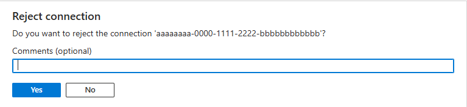
3. You should see the status of the connection in the list changed **Rejected**. 

    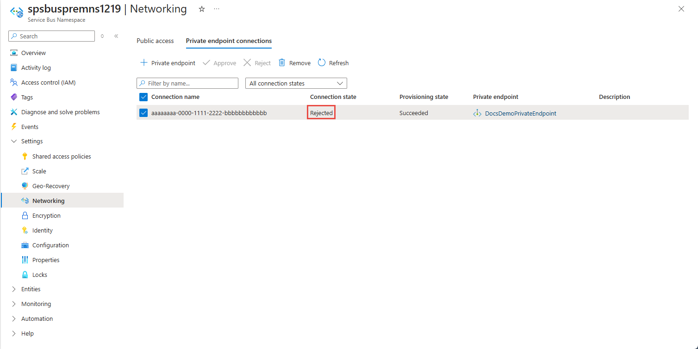


### Remove a private endpoint connection

1. To remove a private endpoint connection, select it in the list, and select **Remove** on the toolbar. 

    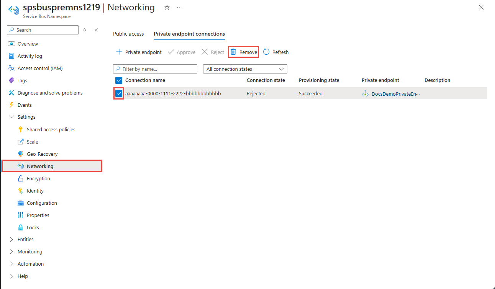
2. On the **Delete connection** page, select **Yes** to confirm the deletion of the private endpoint. If you select **No**, nothing happens. 

    
3. You should see the status changed to **Disconnected**. Then, you will see the endpoint disappear from the list. 

## Validate that the private link connection works

You should validate that the resources within the same subnet of the private endpoint resource are connecting to your Service Bus namespace over a private IP address, and that they have the correct private DNS zone integration.

First, create a virtual machine by following the steps in [Create a Windows virtual machine in the Azure portal](../virtual-machines/windows/quick-create-portal.md)

In the **Networking** tab: 

1. Specify **Virtual network** and **Subnet**. You must select the Virtual Network on which you deployed the private endpoint.
2. Specify a **public IP** resource.
3. For **NIC network security group**, select **None**.
4. For **Load balancing**, select **No**.

Connect to the VM, open the command line, and run the following command:

```console
nslookup <service-bus-namespace-name>.servicebus.windows.net
```

You should see a result that looks like the following. 

```console
Non-authoritative answer:
Name:    <service-bus-namespace-name>.privatelink.servicebus.windows.net
Address:  10.0.0.4 (private IP address associated with the private endpoint)
Aliases:  <service-bus-namespace-name>.servicebus.windows.net
```

## Limitations and Design Considerations

**Pricing**: For pricing information, see [Azure Private Link pricing](https://azure.microsoft.com/pricing/details/private-link/).

**Limitations**:  This feature is available in all Azure public regions.

**Maximum number of private endpoints per Service Bus namespace**: 120.

For more, see [Azure Private Link service: Limitations](../private-link/private-link-service-overview.md#limitations)

## Next Steps

- Learn more about [Azure Private Link](../private-link/private-link-service-overview.md)
- Learn more about [Azure Service Bus](service-bus-messaging-overview.md)
