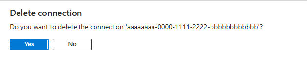

# Allow access to Azure Service Bus namespaces via private endpoints
Azure Private Link Service enables you to access Azure services (for example, Azure Service Bus, Azure Storage, and Azure Cosmos DB) and Azure hosted customer/partner services over a **private endpoint** in your virtual network.

A private endpoint is a network interface that connects you privately and securely to a service powered by Azure Private Link. The private endpoint uses a private IP address from your VNet, effectively bringing the service into your VNet. All traffic to the service can be routed through the private endpoint, so no gateways, NAT devices, ExpressRoute or VPN connections, or public IP addresses are needed. Traffic between your virtual network and the service traverses over the Microsoft backbone network, eliminating exposure from the public Internet. You can connect to an instance of an Azure resource, giving you the highest level of granularity in access control.

For more information, see [What is Azure Private Link?](../private-link/private-link-overview.md)

## Important points
- This feature is supported with the **premium** tier of Azure Service Bus. For more information about the premium tier, see the [Service Bus Premium and Standard messaging tiers](service-bus-premium-messaging.md) article.
- Implementing private endpoints can prevent other Azure services from interacting with Service Bus. As an exception, you can allow access to Service Bus resources from certain **trusted services** even when private endpoints are enabled. For a list of trusted services, see [Trusted services](#trusted-microsoft-services).

    The following Microsoft services are required to be on a virtual network
    - Azure App Service
    - Azure Functions
- Specify **at least one IP rule or virtual network rule** for the namespace to allow traffic only from the specified IP addresses or subnet of a virtual network. If there are no IP and virtual network rules, the namespace can be accessed over the public internet (using the access key). 


## Add a private endpoint using Azure portal

### Prerequisites

To integrate a Service Bus namespace with Azure Private Link, you need the following entities or permissions:

- A Service Bus namespace.
- An Azure virtual network.
- A subnet in the virtual network. You can use the **default** subnet. 
- Owner or contributor permissions for both the Service Bus namespace and the virtual network.

Your private endpoint and virtual network must be in the same region. When you select a region for the private endpoint using the portal, it will automatically filter only virtual networks that are in that region. Your Service Bus namespace can be in a different region. And, Your private endpoint uses a private IP address in your virtual network.

### Configure private access when creating a namespace
When creating a namespace, you can either allow public only (from all networks) or private only (only via private endpoints) access to the namespace.

If you select the **Private access** option on the **Networking** page of the namespace creation wizard, you can add a private endpoint on the page by selecting **+ Private endpoint** button. See the next section for the detailed steps for adding a private endpoint. 

:::image type="content" source="./media/private-link-service/create-namespace-private-access.png" alt-text="Screenshot showing the Networking page of the Create namespace wizard with Private access option selected.":::


### Configure private access for an existing namespace

If you already have an existing namespace, you can create a private endpoint by following these steps:

1. Sign in to the [Azure portal](https://portal.azure.com).
2. In the search bar, type in **Service Bus**.
3. Select the **namespace** from the list to which you want to add a private endpoint.
2. On the left menu, select **Networking** option under **Settings**.  

    > [!NOTE]
    > You see the **Networking** tab only for **premium** namespaces.  
1. On the **Networking** page, for **Public network access**, select **Disabled** if you want the namespace to be accessed only via private endpoints. 
1. For **Allow trusted Microsoft services to bypass this firewall**, select **Yes** if you want to allow [trusted Microsoft services](#trusted-microsoft-services) to bypass this firewall. 

    :::image type="content" source="./media/private-link-service/public-access-disabled.png" alt-text="Screenshot of the Networking page with public network access as Disabled.":::
1. To allow access to the namespace via private endpoints, select the **Private endpoint connections** tab at the top of the page
1. Select the **+ Private Endpoint** button at the top of the page.

    
7. On the **Basics** page, follow these steps: 
    1. Select the **Azure subscription** in which you want to create the private endpoint. 
    2. Select the **resource group** for the private endpoint resource.
    3. Enter a **name** for the private endpoint. 
    1. Enter a **name for the network interface**. 
    1. Select a **region** for the private endpoint. Your private endpoint must be in the same region as your virtual network, but can be in a different region from the private link resource that you're connecting to. 
    1. Select **Next: Resource >** button at the bottom of the page.

        :::image type="content" source="./media/private-link-service/create-private-endpoint-basics-page.png" alt-text="Screenshot showing the Basics page of the Create private endpoint wizard.":::
8. On the **Resource** page, review settings, and select **Next: Virtual Network** at the bottom of the page.

    :::image type="content" source="./media/private-link-service/create-private-endpoint-resource-page.png" alt-text="Screenshot showing the Resource page of the Create private endpoint wizard.":::
9. On the **Virtual Network** page, you select the subnet in a virtual network to where you want to deploy the private endpoint. 
    1. Select a **virtual network**. Only virtual networks in the currently selected subscription and location are listed in the drop-down list. 
    2. Select a **subnet** in the virtual network you selected. 
    1. Notice that the **network policy for private endpoints** is disabled. If you want to enable it, select **edit**, update the setting, and select **Save**. 
    1. For **Private IP configuration**, by default, **Dynamically allocate IP address** option is selected. If you want to assign a static IP address, select **Statically allocate IP address***.  
    1. For **Application security group**, select an existing application security group or create one that's to be associated with the private endpoint. 
    1. Select **Next: DNS >** button at the bottom of the page. 

    :::image type="content" source="./media/private-link-service/create-private-endpoint-configuration-page.png" alt-text="Screenshot showing the Virtual Network page of the Create private endpoint wizard.":::
10. On the **DNS** page, select whether you want the private endpoint to be integrated with a private DNS zone, and then select **Next: Tags**.  

    :::image type="content" source="./media/private-link-service/create-private-endpoint-dns-page.png" alt-text="Screenshot showing the DNS page of the Create private endpoint wizard.":::
1. On the **Tags** page, create any tags (names and values) that you want to associate with the private endpoint resource. Then, select **Review + create** button at the bottom of the page. 
1. On the **Review + create**, review all the settings, and select **Create** to create the private endpoint.
    
    :::image type="content" source="./media/private-link-service/create-private-endpoint-review-create-page.png" alt-text="Screenshot showing the Review and Create page of the Create private endpoint wizard.":::
12. Confirm that the private endpoint is created. If you're the owner of the resource and had selected **Connect to an Azure resource in my directory** option for the **Connection method**, the endpoint connection should be **auto-approved**. If it's in the **pending** state, see the [Manage private endpoints using Azure portal](#manage-private-endpoints-using-azure-portal) section.

    

[!INCLUDE [service-bus-trusted-services](./includes/service-bus-trusted-services.md)]

To allow trusted services to access your namespace, switch to the **Public Access** tab on the **Networking** page, and select **Yes** for **Allow trusted Microsoft services to bypass this firewall?**. 


## Add a private endpoint using PowerShell
The following example shows you how to use Azure PowerShell to create a private endpoint connection to a Service Bus namespace.

Your private endpoint and virtual network must be in the same region. Your Service Bus namespace can be in a different region. And, Your private endpoint uses a private IP address in your virtual network.

```azurepowershell-interactive

$rgName = "<RESOURCE GROUP NAME>"
$vnetlocation = "<VNET LOCATION>"
$vnetName = "<VIRTUAL NETWORK NAME>"
$subnetName = "<SUBNET NAME>"
$namespaceLocation = "<NAMESPACE LOCATION>"
$namespaceName = "<NAMESPACE NAME>"
$peConnectionName = "<PRIVATE ENDPOINT CONNECTION NAME>"

# create resource group
New-AzResourceGroup -Name $rgName -Location $vnetLocation 

# create virtual network
$virtualNetwork = New-AzVirtualNetwork `
                    -ResourceGroupName $rgName `
                    -Location $vnetlocation `
                    -Name $vnetName `
                    -AddressPrefix 10.0.0.0/16

# create subnet with endpoint network policy disabled
$subnetConfig = Add-AzVirtualNetworkSubnetConfig `
                    -Name $subnetName `
                    -AddressPrefix 10.0.0.0/24 `
                    -PrivateEndpointNetworkPoliciesFlag "Disabled" `
                    -VirtualNetwork $virtualNetwork

# update virtual network
$virtualNetwork | Set-AzVirtualNetwork

# create premium service bus namespace
$namespaceResource = New-AzResource -Location $namespaceLocation -ResourceName $namespaceName -ResourceGroupName $rgName -Sku @{name = "Premium"; capacity = 1} -Properties @{} -ResourceType "Microsoft.ServiceBus/namespaces" -

# create a private link service connection
$privateEndpointConnection = New-AzPrivateLinkServiceConnection `
                                -Name $peConnectionName `
                                -PrivateLinkServiceId $namespaceResource.ResourceId `
                                -GroupId "namespace"

# get subnet object that you will use in the next step                                
$virtualNetwork = Get-AzVirtualNetwork -ResourceGroupName  $rgName -Name $vnetName
$subnet = $virtualNetwork | Select -ExpandProperty subnets `
                                | Where-Object  {$_.Name -eq $subnetName}  
   
# now, create private endpoint   
$privateEndpoint = New-AzPrivateEndpoint -ResourceGroupName $rgName  `
                                -Name $vnetName   `
                                -Location $vnetlocation `
                                -Subnet  $subnet   `
                                -PrivateLinkServiceConnection $privateEndpointConnection

(Get-AzResource -ResourceId $namespaceResource.ResourceId -ExpandProperties).Properties


```


## Manage private endpoints using Azure portal

When you create a private endpoint, the connection must be approved. If the resource for which you're creating a private endpoint is in your directory, you can approve the connection request provided you have sufficient permissions. If you're connecting to an Azure resource in another directory, you must wait for the owner of that resource to approve your connection request.

There are four provisioning states:

| Service action | Service consumer private endpoint state | Description |
|--|--|--|
| None | Pending | Connection is created manually and is pending approval from the Private Link resource owner. |
| Approve | Approved | Connection was automatically or manually approved and is ready to be used. |
| Reject | Rejected | Connection was rejected by the private link resource owner. |
| Remove | Disconnected | Connection was removed by the private link resource owner, the private endpoint becomes informative and should be deleted for cleanup. |
 
###  Approve, reject, or remove a private endpoint connection

1. Sign in to the Azure portal.
1. In the search bar, type in **Service Bus**.
1. Select the **namespace** that you want to manage.
1. Select the **Networking** tab.
5. Go to the appropriate section below based on the operation you want to: approve, reject, or remove. 

### Approve a private endpoint connection

1. If there are any connections that are pending, you see a connection listed with **Pending** in the provisioning state. 
2. Select the **private endpoint** you wish to approve
3. Select the **Approve** button.

    
4. On the **Approve connection** page, enter an optional **comment**, and select **Yes**. If you select **No**, nothing happens. 

    
5. You should see the status of the connection in the list changed to **Approved**. 

    

### Reject a private endpoint connection

1. If there are any private endpoint connections you want to reject, whether it's a pending request or existing connection that was approved earlier, select the endpoint connection and select the **Reject** button.

    
2. On the **Reject connection** page, enter an optional comment, and select **Yes**. If you select **No**, nothing happens. 

    
3. You should see the status of the connection in the list changed **Rejected**. 

    


### Remove a private endpoint connection

1. To remove a private endpoint connection, select it in the list, and select **Remove** on the toolbar. 

    
2. On the **Delete connection** page, select **Yes** to confirm the deletion of the private endpoint. If you select **No**, nothing happens. 

    
3. You should see the status changed to **Disconnected**. Then, the endpoint disappears from the list. 

## Validate that the private link connection works

You should validate that resources within the virtual network of the private endpoint are connecting to your Service Bus namespace over a private IP address, and that they have the correct private DNS zone integration.

First, create a virtual machine by following the steps in [Create a Windows virtual machine in the Azure portal](../virtual-machines/windows/quick-create-portal.md)

In the **Networking** tab: 

1. Specify **Virtual network** and **Subnet**. You must select the Virtual Network on which you deployed the private endpoint.
2. Specify a **public IP** resource.
3. For **NIC network security group**, select **None**.
4. For **Load balancing**, select **No**.

Connect to the VM, open the command line, and run the following command:

```console
nslookup <service-bus-namespace-name>.servicebus.windows.net
```

You should see a result that looks like the following. 

```console
Non-authoritative answer:
Name:    <service-bus-namespace-name>.privatelink.servicebus.windows.net
Address:  10.0.0.4 (private IP address associated with the private endpoint)
Aliases:  <service-bus-namespace-name>.servicebus.windows.net
```

## Limitations and Design Considerations

**Pricing**: For pricing information, see [Azure Private Link pricing](https://azure.microsoft.com/pricing/details/private-link/).

**Limitations**:  This feature is available in all Azure public regions.

**Maximum number of private endpoints per Service Bus namespace**: 120.

For more, see [Azure Private Link service: Limitations](../private-link/private-link-service-overview.md#limitations)

## Next steps

- Learn more about [Azure Private Link](../private-link/private-link-service-overview.md)
- Learn more about [Azure Service Bus](service-bus-messaging-overview.md)
