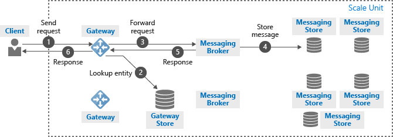

<properties 
    pageTitle="Service Bus architecture | Microsoft Azure"
    description="Describes the message and relay processing architecture of Azure Service Bus."
    services="service-bus"
    documentationCenter="na"
    authors="sethmanheim"
    manager="timlt"
    editor="" />
<tags 
    ms.service="service-bus"
    ms.devlang="na"
    ms.topic="get-started-article"
    ms.tgt_pltfrm="na"
    ms.workload="na"
    ms.date="07/11/2016"
    ms.author="sethm" />

# Service Bus architecture

This article describes the message and relay processing architecture of Azure Service Bus.

## Service Bus scale units

Service Bus is organized by *scale units*. A scale unit is a unit of deployment and contains all components required run the service. Each region deploys one or more Service Bus scale units.

A Service Bus namespace is mapped to a scale unit. The scale unit handles all types of Service Bus entities: relays and brokered messaging entities (queues, topics, subscriptions). A Service Bus scale unit consists of the following components:

- **A set of gateway nodes.** Gateway nodes authenticate incoming requests and handle relay requests. Each gateway node has a public IP address.

- **A set of messaging broker nodes.** Messaging broker nodes process requests concerning messaging entities.

- **One gateway store.** The gateway store holds the data for every entity that is defined in this scale unit. The gateway store is implemented on top of a SQL Azure database.

- **Multiple messaging stores.** Messaging stores hold the messages of all queues, topics and subscriptions that are defined in this scale unit. It also contains all subscription data. Unless [partitioned messaging entities](service-bus-partitioning.md) is enabled, a queue or topic is mapped to one messaging store. Subscriptions are stored in the same messaging store as their parent topic. Except for Service Bus [Premium Messaging](service-bus-premium-messaging.md), the messaging stores are implemented on top of SQL Azure databases.

## Containers

Each messaging entity is assigned a specific container. A container is a logical construct that uses exactly one messaging store to store all relevant data for this container. Each container is assigned to a messaging broker node. Typically, there are more containers than messaging broker nodes. Therefore, each messaging broker node loads multiple containers. The distribution of containers to a messaging broker node is organized such that all messaging broker nodes are equally loaded. If the load pattern changes (for example, one of the containers gets very busy), or if a messaging broker node becomes temporarily unavailable, the containers are redistributed among the messaging broker nodes.

## Processing of incoming messaging requests

When a client sends a request to Service Bus, the Azure load balancer routes it to any of the gateway nodes. The gateway node authorizes the request. If the request concerns a messaging entity (queue, topic, subscription), the gateway node looks up the entity in the gateway store and determines in which messaging store the entity is located. It then looks up which messaging broker node is currently servicing this container, and sends the request to that messaging broker node. The messaging broker node processes the request and updates the entity state in the container store. The messaging broker node then sends the response back to the gateway node, which sends an appropriate response back to the client that issued the original request.

## Processing of incoming relay requests

When a client sends a request to Service Bus, the Azure load balancer routes it to any of the gateway nodes. If the request is a listening request, the gateway node creates a new relay. If the request is a connection request to a specific relay, the gateway node forwards the connection request to the gateway node that owns the relay. The gateway node that owns the relay sends a rendezvous request to the listening client, asking the listener to create a temporary channel to the gateway node that received the connection request.

When the relay connection is established, the clients can exchange messages via the gateway node that is used for the rendezvous.

## Next steps

Now that you've read an overview of Service Bus architecture, to get started visit the following links:

- [Service Bus messaging overview](service-bus-messaging-overview.md)
- [Service Bus fundamentals](service-bus-fundamentals-hybrid-solutions.md)
- [A queued messaging solution using Service Bus queues](service-bus-dotnet-multi-tier-app-using-service-bus-queues.md)
