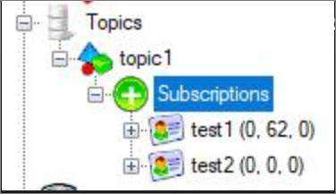

# Overview of Service Bus dead-letter queues

Azure Service Bus queues and topic subscriptions provide a secondary subqueue, called a *dead-letter queue* (DLQ). The dead-letter queue doesn't need to be explicitly created and can't be deleted or otherwise managed independent of the main entity.

This article describes dead-letter queues in Service Bus. Much of the discussion is illustrated by the [Dead-Letter queues sample](https://github.com/Azure/azure-service-bus/tree/master/samples/DotNet/Microsoft.ServiceBus.Messaging/DeadletterQueue) on GitHub.
 
## The dead-letter queue

The purpose of the dead-letter queue is to hold messages that can't be delivered to any receiver, or messages that couldn't be processed. Messages can then be removed from the DLQ and inspected. An application might, with help of an operator, correct issues and resubmit the message, log the fact that there was an error, and take corrective action. 

From an API and protocol perspective, the DLQ is mostly similar to any other queue, except that messages can only be submitted via the dead-letter operation of the parent entity. In addition, time-to-live isn't observed, and you can't dead-letter a message from a DLQ. The dead-letter queue fully supports peek-lock delivery and transactional operations.

There's no automatic cleanup of the DLQ. Messages remain in the DLQ until you explicitly retrieve them from the DLQ and call [Complete()](/dotnet/api/microsoft.azure.servicebus.queueclient.completeasync) on the dead-letter message.

## DLQ message count
It's not possible to obtain count of messages in the dead-letter queue at the topic level. That's because messages don't sit at the topic level unless Service Bus throws an internal error. Instead, when a sender sends a message to a topic, the message is forwarded to subscriptions for the topic within milliseconds and thus no longer resides at the topic level. So, you can see messages in the DLQ associated with the subscription for the topic. In the following example, **Service Bus Explorer** shows that there are 62 messages currently in the DLQ for the subscription "test1". 



You can also get the count of DLQ messages by using Azure CLI command: [`az servicebus topic subscription show`](/cli/azure/servicebus/topic/subscription?view=azure-cli-latest#az-servicebus-topic-subscription-show). 

## Moving messages to the DLQ

There are several activities in Service Bus that cause messages to get pushed to the DLQ from within the messaging engine itself. An application can also explicitly move messages to the DLQ. 

As the message gets moved by the broker, two properties are added to the message as the broker calls its internal version of the [DeadLetter](/dotnet/api/microsoft.azure.servicebus.queueclient.deadletterasync) method on the message: `DeadLetterReason` and `DeadLetterErrorDescription`.

Applications can define their own codes for the `DeadLetterReason` property, but the system sets the following values.

| DeadLetterReason | DeadLetterErrorDescription |
| --- | --- |
|HeaderSizeExceeded |The size quota for this stream has been exceeded. |
|TTLExpiredException |The message expired and was dead lettered. See the [Exceeding TimeToLive](#exceeding-timetolive) section for details. |
|Session ID is null. |Session enabled entity doesn't allow a message whose session identifier is null. |
|MaxTransferHopCountExceeded | The maximum number of allowed hops when forwarding between queues. Value is set to 4. |
| MaxDeliveryCountExceededExceptionMessage | Message could not be consumed after maximum delivery attempts. See the [Exceeding MaxDeliveryCount](#exceeding-maxdeliverycount) section for details. |

## Exceeding MaxDeliveryCount

Queues and subscriptions each have a [QueueDescription.MaxDeliveryCount](/dotnet/api/microsoft.servicebus.messaging.queuedescription.maxdeliverycount) and [SubscriptionDescription.MaxDeliveryCount](/dotnet/api/microsoft.servicebus.messaging.subscriptiondescription.maxdeliverycount) property respectively; the default value is 10. Whenever a message has been delivered under a lock ([ReceiveMode.PeekLock](/dotnet/api/microsoft.azure.servicebus.receivemode)), but has been either explicitly abandoned or the lock has expired, the message [BrokeredMessage.DeliveryCount](/dotnet/api/microsoft.servicebus.messaging.brokeredmessage) is incremented. When [DeliveryCount](/dotnet/api/microsoft.servicebus.messaging.brokeredmessage) exceeds [MaxDeliveryCount](/dotnet/api/microsoft.servicebus.messaging.queuedescription.maxdeliverycount), the message is moved to the DLQ, specifying the `MaxDeliveryCountExceeded` reason code.

This behavior can't be disabled, but you can set [MaxDeliveryCount](/dotnet/api/microsoft.servicebus.messaging.queuedescription.maxdeliverycount) to a large number.

## Exceeding TimeToLive

When the [QueueDescription.EnableDeadLetteringOnMessageExpiration](/dotnet/api/microsoft.servicebus.messaging.queuedescription) or [SubscriptionDescription.EnableDeadLetteringOnMessageExpiration](/dotnet/api/microsoft.servicebus.messaging.subscriptiondescription) property is set to **true** (the default is **false**), all expiring messages are moved to the DLQ, specifying the  `TTLExpiredException` reason code.

Expired messages are only purged and moved to the DLQ when there is at least one active receiver pulling from the main queue or subscription; that behavior is by design.

## Errors while processing subscription rules

When the [SubscriptionDescription.EnableDeadLetteringOnFilterEvaluationExceptions](/dotnet/api/microsoft.servicebus.messaging.subscriptiondescription) property is enabled for a subscription, any errors that occur while a subscription's SQL filter rule executes are captured in the DLQ along with the offending message.

## Application-level dead-lettering

In addition to the system-provided dead-lettering features, applications can use the DLQ to explicitly reject unacceptable messages. They can include messages that can't be properly processed because of any sort of system issue, messages that hold malformed payloads, or messages that fail authentication when some message-level security scheme is used.

## Dead-lettering in ForwardTo or SendVia scenarios

Messages will be sent to the transfer dead-letter queue under the following conditions:

- A message passes through more than four queues or topics that are [chained together](service-bus-auto-forwarding.md).
- The destination queue or topic is disabled or deleted.
- The destination queue or topic exceeds the maximum entity size.

To retrieve these dead-lettered messages, you can create a receiver using the [FormatTransferDeadletterPath](/dotnet/api/microsoft.azure.servicebus.entitynamehelper.formattransferdeadletterpath) utility method.

## Example

The following code snippet creates a message receiver. In the receive loop for the main queue, the code retrieves the message with [Receive(TimeSpan.Zero)](/dotnet/api/microsoft.servicebus.messaging.messagereceiver), which asks the broker to instantly return any message readily available, or to return with no result. If the code receives a message, it immediately abandons it, which increments the  `DeliveryCount`. Once the system moves the message to the DLQ, the main queue is empty and the loop exits, as [ReceiveAsync](/dotnet/api/microsoft.servicebus.messaging.messagereceiver) returns **null**.

```csharp
var receiver = await receiverFactory.CreateMessageReceiverAsync(queueName, ReceiveMode.PeekLock);
while(true)
{
    var msg = await receiver.ReceiveAsync(TimeSpan.Zero);
    if (msg != null)
    {
        Console.WriteLine("Picked up message; DeliveryCount {0}", msg.DeliveryCount);
        await msg.AbandonAsync();
    }
    else
    {
        break;
    }
}
```

## Path to the dead-letter queue
You can access the dead-letter queue by using the following syntax:

```
<queue path>/$deadletterqueue
<topic path>/Subscriptions/<subscription path>/$deadletterqueue
```

If you're using the .NET SDK, you can get the path to the dead-letter queue by using the SubscriptionClient.FormatDeadLetterPath() method. This method takes the topic name/subscription name and suffixes with **/$DeadLetterQueue**.


## Next steps

See the following articles for more information about Service Bus queues:

* [Get started with Service Bus queues](service-bus-dotnet-get-started-with-queues.md)
* [Azure Queues and Service Bus queues compared](service-bus-azure-and-service-bus-queues-compared-contrasted.md)

