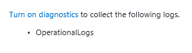
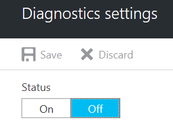

# Enable diagnostics logs for Service Bus

When you start using your Azure Service Bus namespace, you might want to monitor how and when your namespace is created, deleted, or accessed. This article provides an overview of all the operational and diagnostics logs that are available.

Azure Service Bus currently supports activity and operational logs, which capture *management operations* that are performed on the Azure Service Bus namespace. Specifically, these logs capture the operation type, including queue creation, resources used, and the status of the operation.

## Operational logs schema

All logs are stored in JavaScript Object Notation (JSON) format in the following two locations:

- **AzureActivity**: Displays logs from operations and actions that are conducted against your namespace in the Azure portal or through Azure Resource Manager template deployments.
- **AzureDiagnostics**: Displays logs from operations and actions that are conducted against your namespace by using the API, or through management clients on the language SDK.

Operational log JSON strings include the elements listed in the following table:

| Name | Description |
| ------- | ------- |
| ActivityId | Internal ID, used to identify the specified activity |
| EventName | Operation name |
| ResourceId | Azure Resource Manager resource ID |
| SubscriptionId | Subscription ID |
| EventTimeString | Operation time |
| EventProperties | Operation properties |
| Status | Operation status |
| Caller | Caller of operation (the Azure portal or management client) |
| Category | OperationalLogs |

Here's an example of an operational log JSON string:

```json
{
  "ActivityId": "6aa994ac-b56e-4292-8448-0767a5657cc7",
  "EventName": "Create Queue",
  "resourceId": "/SUBSCRIPTIONS/1A2109E3-9DA0-455B-B937-E35E36C1163C/RESOURCEGROUPS/DEFAULT-SERVICEBUS-CENTRALUS/PROVIDERS/MICROSOFT.SERVICEBUS/NAMESPACES/SHOEBOXEHNS-CY4001",
  "SubscriptionId": "1a2109e3-9da0-455b-b937-e35e36c1163c",
  "EventTimeString": "9/28/2016 8:40:06 PM +00:00",
  "EventProperties": "{\"SubscriptionId\":\"1a2109e3-9da0-455b-b937-e35e36c1163c\",\"Namespace\":\"shoeboxehns-cy4001\",\"Via\":\"https://shoeboxehns-cy4001.servicebus.windows.net/f8096791adb448579ee83d30e006a13e/?api-version=2016-07\",\"TrackingId\":\"5ee74c9e-72b5-4e98-97c4-08a62e56e221_G1\"}",
  "Status": "Succeeded",
  "Caller": "ServiceBus Client",
  "category": "OperationalLogs"
}
```

## Events and operations captured in operational logs

Operational logs capture all management operations that are performed on the Azure Service Bus namespace. Data operations are not captured, because of the high volume of data operations that are conducted on Azure Service Bus.

> [!NOTE]
> To help you better track data operations, we recommend using client-side tracing.

The following management operations are captured in operational logs: 

| Scope | Operation|
|-------| -------- |
| Namespace | <ul> <li> Create Namespace</li> <li> Update Namespace </li> <li> Delete Namespace </li> <li> Update Namespace SharedAccess Policy </li> </ul> | 
| Queue | <ul> <li> Create Queue</li> <li> Update Queue</li> <li> Delete Queue </li> <li> AutoDelete Delete Queue </li> </ul> | 
| Topic | <ul> <li> Create Topic </li> <li> Update Topic </li> <li> Delete Topic </li> <li> AutoDelete Delete Topic </li> </ul> |
| Subscription | <ul> <li> Create Subscription </li> <li> Update Subscription </li> <li> Delete Subscription </li> <li> AutoDelete Delete Subscription </li> </ul> |

> [!NOTE]
> Currently, *Read* operations are not tracked in the operational logs.

## Enable operational logs

Operational logs are disabled by default. To enable diagnostics logs, do the following:

1. In the [Azure portal](https://portal.azure.com), go to your Azure Service Bus namespace and then, under **Monitoring**, select  **Diagnostic settings**.

   

1. In the **Diagnostics settings** pane, select **Add diagnostic setting**.  

   

1. Configure the diagnostics settings by doing the following:

   a. In the **Name** box, enter a name for the diagnostics settings.  

   b. Select one of the following three destinations for your diagnostics logs:  
   - If you select **Archive to a storage account**, you need to configure the storage account where the diagnostics logs will be stored.  
   - If you select **Stream to an event hub**, you need to configure the event hub that you want to stream the diagnostics logs to.
   - If you select **Send to Log Analytics**, you need to specify which instance of Log Analytics the diagnostics will be sent to.  

   c. Select the **OperationalLogs** check box.

    

1. Select **Save**.

The new settings take effect in about 10 minutes. The logs are displayed in the configured archival target, in the **Diagnostics logs** pane.

For more information about configuring diagnostics settings, see the [overview of Azure diagnostics logs](../azure-monitor/platform/diagnostic-logs-overview.md).

## Next steps

To learn more about Service Bus, see:

* [Introduction to Service Bus](service-bus-messaging-overview.md)
* [Get started with Service Bus](service-bus-dotnet-get-started-with-queues.md)
