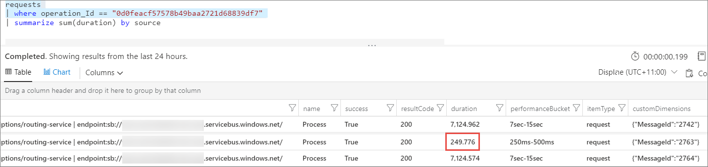

# Distributed tracing and correlation through Service Bus messaging

One of the common problems in micro services development is the ability to trace operation from a client through all the services that are involved in processing. It's useful for debugging, performance analysis, A/B testing, and other typical diagnostics scenarios.
One part of this problem is tracking logical pieces of work. It includes message processing result and latency and external dependency calls. Another part is correlation of these diagnostics events beyond process boundaries.

When a producer sends a message through a queue, it typically happens in the scope of some other logical operation, initiated by some other client or service. The same operation is continued by consumer once it receives a message. Both producer and consumer (and other services that process the operation), presumably emit telemetry events to trace the operation flow and result. In order to correlate such events and trace operation end-to-end, each service that reports telemetry has to stamp every event with a trace context.

Microsoft Azure Service Bus messaging has defined payload properties that producers and consumers should use to pass such trace context.
The protocol is based on the [W3C Trace-Context](https://www.w3.org/TR/trace-context/).

# [Azure.Messaging.ServiceBus SDK (Latest)](#tab/net-standard-sdk-2)
| Property Name        | Description                                                 |
|----------------------|-------------------------------------------------------------|
|  Diagnostic-Id       | Unique identifier of an external call from producer to the queue. Refer to [W3C Trace-Context traceparent header](https://www.w3.org/TR/trace-context/#traceparent-header) for the format |

## Service Bus .NET Client autotracing
The `ServiceBusProcessor` class of [Azure Messaging Service Bus client for .NET](/dotnet/api/azure.messaging.servicebus.servicebusprocessor) provides tracing instrumentation points that can be hooked by tracing systems, or piece of client code. The instrumentation allows tracking all calls to the Service Bus messaging service from client side. If message processing is done by using [`ProcessMessageAsync` of `ServiceBusProcessor`](/dotnet/api/azure.messaging.servicebus.servicebusprocessor.processmessageasync) (message handler pattern), the message processing is also instrumented.

### Tracking with Azure Application Insights

[Microsoft Application Insights](https://azure.microsoft.com/services/application-insights/) provides rich performance monitoring capabilities including automagical request and dependency tracking.

Depending on your project type, install Application Insights SDK:
- [ASP.NET](../azure-monitor/app/asp-net.md) - install version 2.5-beta2 or higher
- [ASP.NET Core](../azure-monitor/app/asp-net-core.md) - install version 2.2.0-beta2 or higher.
These links provide details on installing SDK, creating resources, and configuring SDK (if needed). For non-ASP.NET applications, refer to [Azure Application Insights for Console Applications](../azure-monitor/app/console.md) article.

If you use [`ProcessMessageAsync` of `ServiceBusProcessor`](/dotnet/api/azure.messaging.servicebus.servicebusprocessor.processmessageasync) (message handler pattern) to process messages, the message processing is also instrumented. All Service Bus calls done by your service are automatically tracked and correlated with other telemetry items. Otherwise refer to the following example for manual message processing tracking.

#### Trace message processing

```csharp
async Task ProcessAsync(ProcessMessageEventArgs args)
{
    ServiceBusReceivedMessage message = args.Message;
    if (message.ApplicationProperties.TryGetValue("Diagnostic-Id", out var objectId) && objectId is string diagnosticId)
    {
        var activity = new Activity("ServiceBusProcessor.ProcessMessage");
        activity.SetParentId(diagnosticId);
        // If you're using Microsoft.ApplicationInsights package version 2.6-beta or higher, you should call StartOperation<RequestTelemetry>(activity) instead
        using (var operation = telemetryClient.StartOperation<RequestTelemetry>("Process", activity.RootId, activity.ParentId))
        {
            telemetryClient.TrackTrace("Received message");
            try 
            {
            // process message
            }
            catch (Exception ex)
            {
                telemetryClient.TrackException(ex);
                operation.Telemetry.Success = false;
                throw;
            }

            telemetryClient.TrackTrace("Done");
        }
    }
}
```

In this example, request telemetry is reported for each processed message, having a timestamp, duration, and result (success). The telemetry also has a set of correlation properties. Nested traces and exceptions reported during message processing are also stamped with correlation properties representing them as 'children' of the `RequestTelemetry`.

In case you make calls to supported external components during message processing, they're also automatically tracked and correlated. Refer to [Track custom operations with Application Insights .NET SDK](../azure-monitor/app/custom-operations-tracking.md) for manual tracking and correlation.

If you're running any external code in addition to the Application Insights SDK, expect to see longer **duration** when viewing Application Insights logs. 



It doesn't mean that there was a delay in receiving the message. In this scenario, the message has already been received since the message is passed in as a parameter to the SDK code. And, the **name** tag in the App Insights logs (**Process**) indicates that the message is now being processed by your external event processing code. This issue isn't Azure-related. Instead, these metrics refer to the efficiency of your external code given that the message has already been received from Service Bus. 

### Tracking with OpenTelemetry
Service Bus .NET Client library version 7.5.0 and later supports OpenTelemetry in experimental mode. For more information, see [Distributed tracing in .NET SDK](https://github.com/Azure/azure-sdk-for-net/blob/main/sdk/core/Azure.Core/samples/Diagnostics.md#opentelemetry-with-azure-monitor-zipkin-and-others).

### Tracking without tracing system
In case your tracing system doesn't support automatic Service Bus calls tracking you may be looking into adding such support into a tracing system or into your application. This section describes diagnostics events sent by Service Bus .NET client.  

Service Bus .NET Client is instrumented using .NET tracing primitives [System.Diagnostics.Activity](https://github.com/dotnet/corefx/blob/master/src/System.Diagnostics.DiagnosticSource/src/ActivityUserGuide.md) and [System.Diagnostics.DiagnosticSource](https://github.com/dotnet/corefx/blob/master/src/System.Diagnostics.DiagnosticSource/src/DiagnosticSourceUsersGuide.md).

`Activity` serves as a trace context while `DiagnosticSource` is a notification mechanism. 

If there's no listener for the DiagnosticSource events, instrumentation is off, keeping zero instrumentation costs. DiagnosticSource gives all control to the listener:
- listener controls which sources and events to listen to
- listener controls event rate and sampling
- events are sent with a payload that provides full context so you can access and modify Message object during the event

Familiarize yourself with [DiagnosticSource User Guide](https://github.com/dotnet/corefx/blob/master/src/System.Diagnostics.DiagnosticSource/src/DiagnosticSourceUsersGuide.md) before proceeding with implementation.

Let's create a listener for Service Bus events in ASP.NET Core app that writes logs with Microsoft.Extension.Logger.
It uses [System.Reactive.Core](https://www.nuget.org/packages/System.Reactive.Core) library to subscribe to DiagnosticSource (it's also easy to subscribe to DiagnosticSource without it)

```csharp
public void Configure(IApplicationBuilder app, IHostingEnvironment env, ILoggerFactory factory, IApplicationLifetime applicationLifetime)
{
    // configuration...

    var serviceBusLogger = factory.CreateLogger("Azure.Messaging.ServiceBus");

    IDisposable innerSubscription = null;
    IDisposable outerSubscription = DiagnosticListener.AllListeners.Subscribe(delegate (DiagnosticListener listener)
    {
        // subscribe to the Service Bus DiagnosticSource
        if (listener.Name == "Azure.Messaging.ServiceBus")
        {
            // receive event from Service Bus DiagnosticSource
            innerSubscription = listener.Subscribe(delegate (KeyValuePair<string, object> evnt)
            {
                // Log operation details once it's done
                if (evnt.Key.EndsWith("Stop"))
                {
                    Activity currentActivity = Activity.Current;
                    serviceBusLogger.LogInformation($"Operation {currentActivity.OperationName} is finished, Duration={currentActivity.Duration}, Id={currentActivity.Id}, StartTime={currentActivity.StartTimeUtc}");
                }
            });
        }
    });

    applicationLifetime.ApplicationStopping.Register(() =>
    {
        outerSubscription?.Dispose();
        innerSubscription?.Dispose();
    });
}
```

In this example, listener logs duration, result, unique identifier, and start time for each Service Bus operation.

### Events
All events will have the following properties that conform with the open telemetry specification: https://github.com/open-telemetry/opentelemetry-specification/blob/master/specification/trace/api.md.

- `message_bus.destination` – queue/topic/subscription path
- `peer.address` – fully qualified namespace
- `kind` – either producer, consumer, or client. Producer is used when sending messages, consumer when receiving, and client when settling.
- `component` – `servicebus`

All events also have `Entity` and `Endpoint` properties.
  * `Entity` -  - Name of the entity (queue, topic, and so on.)
  * `Endpoint` - Service Bus endpoint URL

### Instrumented operations
Here's the full list of instrumented operations:

| Operation Name | Tracked API |
| -------------- | ----------- | 
| ServiceBusSender.Send | ServiceBusSender.SendMessageAsync<br/>ServiceBusSender.SendMessagesAsync |
| ServiceBusSender.Schedule | ServiceBusSender.ScheduleMessageAsync<br/>ServiceBusSender.ScheduleMessagesAsync | 
| ServiceBusSender.Cancel | ServiceBusSender.CancelScheduledMessageAsync<br/>ServiceBusSender.CancelScheduledMessagesAsync |
| ServiceBusReceiver.Receive | ServiceBusReceiver.ReceiveMessageAsync<br/>ServiceBusReceiver.ReceiveMessagesAsync |
| ServiceBusReceiver.ReceiveDeferred | ServiceBusReceiver.ReceiveDeferredMessagesAsync |
| ServiceBusReceiver.Peek | ServiceBusReceiver.PeekMessageAsync<br/>ServiceBusReceiver.PeekMessagesAsync |
| ServiceBusReceiver.Abandon | ServiceBusReceiver.AbandonMessagesAsync |
| ServiceBusReceiver.Complete | ServiceBusReceiver.CompleteMessagesAsync |
| ServiceBusReceiver.DeadLetter | ServiceBusReceiver.DeadLetterMessagesAsync |
| ServiceBusReceiver.Defer |  ServiceBusReceiver.DeferMessagesAsync |
| ServiceBusReceiver.RenewMessageLock | ServiceBusReceiver.RenewMessageLockAsync |
| ServiceBusSessionReceiver.RenewSessionLock | ServiceBusSessionReceiver.RenewSessionLockAsync |
| ServiceBusSessionReceiver.GetSessionState | ServiceBusSessionReceiver.GetSessionStateAsync |
| ServiceBusSessionReceiver.SetSessionState | ServiceBusSessionReceiver.SetSessionStateAsync |
| ServiceBusProcessor.ProcessMessage | Processor callback set on ServiceBusProcessor. ProcessMessageAsync property |
| ServiceBusSessionProcessor.ProcessSessionMessage | Processor callback set on ServiceBusSessionProcessor. ProcessMessageAsync property |

### Filtering and sampling

In some cases, it's desirable to log only part of the events  to reduce performance overhead or storage consumption. You could log 'Stop' events only (as in preceding example) or sample percentage of the events. 
`DiagnosticSource` provide way to achieve it with `IsEnabled` predicate. For more information, see [Context-Based Filtering in DiagnosticSource](https://github.com/dotnet/corefx/blob/master/src/System.Diagnostics.DiagnosticSource/src/DiagnosticSourceUsersGuide.md#context-based-filtering).

`IsEnabled` may be called multiple times for a single operation to minimize performance impact.

`IsEnabled` is called in following sequence:

1. `IsEnabled(<OperationName>, string entity, null)` for example, `IsEnabled("ServiceBusSender.Send", "MyQueue1")`. Note there's no 'Start' or 'Stop' at the end. Use it to filter out particular operations or queues. If the callback method returns `false`, events for the operation aren't sent.

   * For the 'Process' and 'ProcessSession' operations, you also receive `IsEnabled(<OperationName>, string entity, Activity activity)` callback. Use it to filter events based on `activity.Id` or Tags properties.
  
2. `IsEnabled(<OperationName>.Start)` for example, `IsEnabled("ServiceBusSender.Send.Start")`. Checks whether 'Start' event should be fired. The result only affects 'Start' event, but further instrumentation doesn't depend on it.

There's no `IsEnabled` for 'Stop' event.

If some operation result is exception, `IsEnabled("ServiceBusSender.Send.Exception")` is called. You could only subscribe to 'Exception' events and prevent the rest of the instrumentation. In this case, you still have to handle such exceptions. Since other instrumentation is disabled, you shouldn't expect trace context to flow with the messages from consumer to producer.

You can use `IsEnabled` also implement sampling strategies. Sampling based on the `Activity.Id` or `Activity.RootId` ensures consistent sampling across all tires (as long as it's propagated by tracing system or by your own code).

In presence of multiple `DiagnosticSource` listeners for the same source, it's enough for just one listener to accept the event, so there's no guarantee that `IsEnabled` is called.


# [Microsoft.Azure.ServiceBus SDK](#tab/net-standard-sdk)

[!INCLUDE [service-bus-track-0-and-1-sdk-support-retirement](../../includes/service-bus-track-0-and-1-sdk-support-retirement.md)]

| Property Name        | Description                                                 |
|----------------------|-------------------------------------------------------------|
|  Diagnostic-Id       | Unique identifier of an external call from producer to the queue. Refer to [Request-Id in HTTP protocol](https://github.com/dotnet/runtime/blob/master/src/libraries/System.Diagnostics.DiagnosticSource/src/HttpCorrelationProtocol.md#request-id) for the rationale, considerations, and format |
|  Correlation-Context | Operation context, which is propagated across all services involved in operation processing. For more information, see [Correlation-Context in HTTP protocol](https://github.com/dotnet/runtime/blob/master/src/libraries/System.Diagnostics.DiagnosticSource/src/HttpCorrelationProtocol.md#correlation-context) |

## Service Bus .NET Client autotracing

Starting with version 3.0.0 [Microsoft Azure ServiceBus Client for .NET](/dotnet/api/microsoft.azure.servicebus.queueclient) provides tracing instrumentation points that can be hooked by tracing systems, or piece of client code.
The instrumentation allows tracking all calls to the Service Bus messaging service from client side. If message processing is done with the [message handler pattern](/dotnet/api/microsoft.azure.servicebus.queueclient.registermessagehandler), message processing is also instrumented

### Tracking with Azure Application Insights

[Microsoft Application Insights](https://azure.microsoft.com/services/application-insights/) provides rich performance monitoring capabilities including automagical request and dependency tracking.

Depending on your project type, install Application Insights SDK:
- [ASP.NET](../azure-monitor/app/asp-net.md) - install version 2.5-beta2 or higher
- [ASP.NET Core](../azure-monitor/app/asp-net-core.md) - install version 2.2.0-beta2 or higher.
These links provide details on installing SDK, creating resources, and configuring SDK (if needed). For non-ASP.NET applications, refer to [Azure Application Insights for Console Applications](../azure-monitor/app/console.md) article.

If you use [message handler pattern](/dotnet/api/microsoft.azure.servicebus.queueclient.registermessagehandler) to process messages, you're done: all Service Bus calls done by your service are automatically tracked and correlated with other telemetry items. Otherwise refer to the following example for manual message processing tracking.

#### Trace message processing

```csharp
private readonly TelemetryClient telemetryClient;

async Task ProcessAsync(Message message)
{
    var activity = message.ExtractActivity();
    
    // If you're using Microsoft.ApplicationInsights package version 2.6-beta or higher, you should call StartOperation<RequestTelemetry>(activity) instead
    using (var operation = telemetryClient.StartOperation<RequestTelemetry>("Process", activity.RootId, activity.ParentId))
    {
        telemetryClient.TrackTrace("Received message");
        try 
        {
           // process message
        }
        catch (Exception ex)
        {
             telemetryClient.TrackException(ex);
             operation.Telemetry.Success = false;
             throw;
        }

        telemetryClient.TrackTrace("Done");
   }
}
```

In this example, `RequestTelemetry` is reported for each processed message, having a timestamp, duration, and result (success). The telemetry also has a set of correlation properties.
Nested traces and exceptions reported during message processing are also stamped with correlation properties representing them as 'children' of the `RequestTelemetry`.

In case you make calls to supported external components during message processing, they're also automatically tracked and correlated. Refer to [Track custom operations with Application Insights .NET SDK](../azure-monitor/app/custom-operations-tracking.md) for manual tracking and correlation.

If you're running any external code in addition to the Application Insights SDK, expect to see longer **duration** when viewing Application Insights logs. 


It doesn't mean that there was a delay in receiving the message. In this scenario, the message has already been received since the message is passed in as a parameter to the SDK code. And, the **name** tag in the App Insights logs (**Process**) indicates that the message is now being processed by your external event processing code. This issue isn't Azure-related. Instead, these metrics refer to the efficiency of your external code given that the message has already been received from Service Bus. See [this file on GitHub](https://github.com/Azure/azure-sdk-for-net/blob/4bab05144ce647cc9e704d46d3763de5f9681ee0/sdk/servicebus/Microsoft.Azure.ServiceBus/src/ServiceBusDiagnosticsSource.cs) to see where the **Process** tag is generated and assigned once the message has been received from Service Bus. 

### Tracking without tracing system
In case your tracing system doesn't support automatic Service Bus calls tracking you may be looking into adding such support into a tracing system or into your application. This section describes diagnostics events sent by Service Bus .NET client.  

Service Bus .NET Client is instrumented using .NET tracing primitives [System.Diagnostics.Activity](https://github.com/dotnet/corefx/blob/master/src/System.Diagnostics.DiagnosticSource/src/ActivityUserGuide.md) and [System.Diagnostics.DiagnosticSource](https://github.com/dotnet/corefx/blob/master/src/System.Diagnostics.DiagnosticSource/src/DiagnosticSourceUsersGuide.md).

`Activity` serves as a trace context while `DiagnosticSource` is a notification mechanism. 

If there's no listener for the DiagnosticSource events, instrumentation is off, keeping zero instrumentation costs. DiagnosticSource gives all control to the listener:
- listener controls which sources and events to listen to
- listener controls event rate and sampling
- events are sent with a payload that provides full context so you can access and modify Message object during the event

Familiarize yourself with [DiagnosticSource User Guide](https://github.com/dotnet/corefx/blob/master/src/System.Diagnostics.DiagnosticSource/src/DiagnosticSourceUsersGuide.md) before proceeding with implementation.

Let's create a listener for Service Bus events in ASP.NET Core app that writes logs with Microsoft.Extension.Logger.
It uses [System.Reactive.Core](https://www.nuget.org/packages/System.Reactive.Core) library to subscribe to DiagnosticSource (it's also easy to subscribe to DiagnosticSource without it)

```csharp
public void Configure(IApplicationBuilder app, IHostingEnvironment env, ILoggerFactory factory, IApplicationLifetime applicationLifetime)
{
    // configuration...

    var serviceBusLogger = factory.CreateLogger("Microsoft.Azure.ServiceBus");

    IDisposable innerSubscription = null;
    IDisposable outerSubscription = DiagnosticListener.AllListeners.Subscribe(delegate (DiagnosticListener listener)
    {
        // subscribe to the Service Bus DiagnosticSource
        if (listener.Name == "Microsoft.Azure.ServiceBus")
        {
            // receive event from Service Bus DiagnosticSource
            innerSubscription = listener.Subscribe(delegate (KeyValuePair<string, object> evnt)
            {
                // Log operation details once it's done
                if (evnt.Key.EndsWith("Stop"))
                {
                    Activity currentActivity = Activity.Current;
                    TaskStatus status = (TaskStatus)evnt.Value.GetProperty("Status");
                    serviceBusLogger.LogInformation($"Operation {currentActivity.OperationName} is finished, Duration={currentActivity.Duration}, Status={status}, Id={currentActivity.Id}, StartTime={currentActivity.StartTimeUtc}");
                }
            });
        }
    });

    applicationLifetime.ApplicationStopping.Register(() =>
    {
        outerSubscription?.Dispose();
        innerSubscription?.Dispose();
    });
}
```

In this example, listener logs duration, result, unique identifier, and start time for each Service Bus operation.

#### Events

For every operation, two events are sent: 'Start' and 'Stop'. 
Most probably, you're only interested in 'Stop' events. They provide the result of operation, and start time and duration as Activity properties.

Event payload provides a listener with the context of the operation, it replicates API incoming parameters and return value. 'Stop' event payload has all the properties of 'Start' event payload, so you can ignore 'Start' event completely.

All events also have 'Entity' and 'Endpoint' properties.
  * `string Entity` -  - Name of the entity (queue, topic, etc.)
  * `Uri Endpoint` - Service Bus endpoint URL

Each 'Stop' event has `Status` property with `TaskStatus` async operation was completed with, that is also omitted in the following table for simplicity.

Here's the full list of instrumented operations:

| Operation Name | Tracked API | Specific Payload Properties|
|----------------|-------------|---------|
| Microsoft.Azure.ServiceBus.Send | [MessageSender.SendAsync](/dotnet/api/microsoft.azure.servicebus.core.messagesender.sendasync) | `IList<Message> Messages` - List of messages being sent |
| Microsoft.Azure.ServiceBus.ScheduleMessage | [MessageSender.ScheduleMessageAsync](/dotnet/api/microsoft.azure.servicebus.core.messagesender.schedulemessageasync) | `Message Message` - Message being processed<br/>`DateTimeOffset ScheduleEnqueueTimeUtc` - Scheduled message offset<br/>`long SequenceNumber` - Sequence number of scheduled message ('Stop' event payload) |
| Microsoft.Azure.ServiceBus.Cancel | [MessageSender.CancelScheduledMessageAsync](/dotnet/api/microsoft.azure.servicebus.core.messagesender.cancelscheduledmessageasync) | `long SequenceNumber` - Sequence number of the message to be canceled | 
| Microsoft.Azure.ServiceBus.Receive | [MessageReceiver.ReceiveAsync](/dotnet/api/microsoft.azure.servicebus.core.messagereceiver.receiveasync) | `int RequestedMessageCount` - The maximum number of messages that could be received.<br/>`IList<Message> Messages` - List of received messages ('Stop' event payload) |
| Microsoft.Azure.ServiceBus.Peek | [MessageReceiver.PeekAsync](/dotnet/api/microsoft.azure.servicebus.core.messagereceiver.peekasync) | `int FromSequenceNumber` - The starting point from which to browse a batch of messages.<br/>`int RequestedMessageCount` - The number of messages to retrieve.<br/>`IList<Message> Messages` - List of received messages ('Stop' event payload) |
| Microsoft.Azure.ServiceBus.ReceiveDeferred | [MessageReceiver.ReceiveDeferredMessageAsync](/dotnet/api/microsoft.azure.servicebus.core.messagereceiver.receivedeferredmessageasync) | `IEnumerable<long> SequenceNumbers` - The list containing the sequence numbers to receive.<br/>`IList<Message> Messages` - List of received messages ('Stop' event payload) |
| Microsoft.Azure.ServiceBus.Complete | [MessageReceiver.CompleteAsync](/dotnet/api/microsoft.azure.servicebus.core.messagereceiver.completeasync) | `IList<string> LockTokens` - The list containing the lock tokens of the corresponding messages to complete.|
| Microsoft.Azure.ServiceBus.Abandon | [MessageReceiver.AbandonAsync](/dotnet/api/microsoft.azure.servicebus.core.messagereceiver.abandonasync) | `string LockToken` - The lock token of the corresponding message to abandon. |
| Microsoft.Azure.ServiceBus.Defer | [MessageReceiver.DeferAsync](/dotnet/api/microsoft.azure.servicebus.core.messagereceiver.deferasync) | `string LockToken` - The lock token of the corresponding message to defer. | 
| Microsoft.Azure.ServiceBus.DeadLetter | [MessageReceiver.DeadLetterAsync](/dotnet/api/microsoft.azure.servicebus.core.messagereceiver.deadletterasync) | `string LockToken` - The lock token of the corresponding message to dead letter. | 
| Microsoft.Azure.ServiceBus.RenewLock | [MessageReceiver.RenewLockAsync](/dotnet/api/microsoft.azure.servicebus.core.messagereceiver.renewlockasync) | `string LockToken` - The lock token of the corresponding message to renew lock on.<br/>`DateTime LockedUntilUtc` - New lock token expiry date and time in UTC format. ('Stop' event payload)|
| Microsoft.Azure.ServiceBus.Process | Message Handler lambda function provided in [IReceiverClient.RegisterMessageHandler](/dotnet/api/microsoft.azure.servicebus.core.ireceiverclient.registermessagehandler) | `Message Message` - Message being processed. |
| Microsoft.Azure.ServiceBus.ProcessSession | Message Session Handler lambda function provided in [IQueueClient.RegisterSessionHandler](/dotnet/api/microsoft.azure.servicebus.iqueueclient.registersessionhandler) | `Message Message` - Message being processed.<br/>`IMessageSession Session` - Session being processed |
| Microsoft.Azure.ServiceBus.AddRule | [SubscriptionClient.AddRuleAsync](/dotnet/api/microsoft.azure.servicebus.subscriptionclient.addruleasync) | `RuleDescription Rule` - The rule description that provides the rule to add. |
| Microsoft.Azure.ServiceBus.RemoveRule | [SubscriptionClient.RemoveRuleAsync](/dotnet/api/microsoft.azure.servicebus.subscriptionclient.removeruleasync) | `string RuleName` - Name of the rule to remove. |
| Microsoft.Azure.ServiceBus.GetRules | [SubscriptionClient.GetRulesAsync](/dotnet/api/microsoft.azure.servicebus.subscriptionclient.getrulesasync) | `IEnumerable<RuleDescription> Rules` - All rules associated with the subscription. ('Stop' payload only) |
| Microsoft.Azure.ServiceBus.AcceptMessageSession | [ISessionClient.AcceptMessageSessionAsync](/dotnet/api/microsoft.azure.servicebus.isessionclient.acceptmessagesessionasync) | `string SessionId` - The sessionId present in the messages. |
| Microsoft.Azure.ServiceBus.GetSessionState | [IMessageSession.GetStateAsync](/dotnet/api/microsoft.azure.servicebus.imessagesession.getstateasync) | `string SessionId` - The sessionId present in the messages.<br/>`byte [] State` - Session state ('Stop' event payload) |
| Microsoft.Azure.ServiceBus.SetSessionState | [IMessageSession.SetStateAsync](/dotnet/api/microsoft.azure.servicebus.imessagesession.setstateasync) | `string SessionId` - The sessionId present in the messages.<br/>`byte [] State` - Session state |
| Microsoft.Azure.ServiceBus.RenewSessionLock | [IMessageSession.RenewSessionLockAsync](/dotnet/api/microsoft.azure.servicebus.imessagesession.renewsessionlockasync) | `string SessionId` - The sessionId present in the messages. |
| Microsoft.Azure.ServiceBus.Exception | any instrumented API| `Exception Exception` - Exception instance |

In every event, you can access `Activity.Current` that holds current operation context.

#### Logging more properties

`Activity.Current` provides detailed context of current operation and its parents. For more information, see [Activity documentation](https://github.com/dotnet/corefx/blob/master/src/System.Diagnostics.DiagnosticSource/src/ActivityUserGuide.md).
Service Bus instrumentation provides more information in the `Activity.Current.Tags` - they hold `MessageId` and `SessionId` whenever they're available.

Activities that track 'Receive', 'Peek' and 'ReceiveDeferred' event also may have `RelatedTo` tag. It holds distinct list of `Diagnostic-Id`(s) of messages that were received as a result.
Such operation may result in several unrelated messages to be received. Also, the `Diagnostic-Id` isn't known when operation starts, so 'Receive' operations could be correlated to 'Process' operations using this Tag only. It's useful when analyzing performance issues to check how long it took to receive the message.

Efficient way to log Tags is to iterate over them, so adding Tags to the preceding example looks like 

```csharp
Activity currentActivity = Activity.Current;
TaskStatus status = (TaskStatus)evnt.Value.GetProperty("Status");

var tagsList = new StringBuilder();
foreach (var tags in currentActivity.Tags)
{
    tagsList.Append($", {tags.Key}={tags.Value}");
}

serviceBusLogger.LogInformation($"{currentActivity.OperationName} is finished, Duration={currentActivity.Duration}, Status={status}, Id={currentActivity.Id}, StartTime={currentActivity.StartTimeUtc}{tagsList}");
```

#### Filtering and sampling

In some cases, it's desirable to log only part of the events  to reduce performance overhead or storage consumption. You could log 'Stop' events only (as in preceding example) or sample percentage of the events. 
`DiagnosticSource` provide way to achieve it with `IsEnabled` predicate. For more information, see [Context-Based Filtering in DiagnosticSource](https://github.com/dotnet/corefx/blob/master/src/System.Diagnostics.DiagnosticSource/src/DiagnosticSourceUsersGuide.md#context-based-filtering).

`IsEnabled` may be called multiple times for a single operation to minimize performance impact.

`IsEnabled` is called in following sequence:

1. `IsEnabled(<OperationName>, string entity, null)` for example, `IsEnabled("Microsoft.Azure.ServiceBus.Send", "MyQueue1")`. Note there's no 'Start' or 'Stop' at the end. Use it to filter out particular operations or queues. If the callback method returns `false`, events for the operation aren't sent

   * For the 'Process' and 'ProcessSession' operations, you also receive `IsEnabled(<OperationName>, string entity, Activity activity)` callback. Use it to filter events based on `activity.Id` or Tags properties.
  
2. `IsEnabled(<OperationName>.Start)` for example, `IsEnabled("Microsoft.Azure.ServiceBus.Send.Start")`. Checks whether 'Start' event should be fired. The result only affects 'Start' event, but further instrumentation doesn't depend on it.

There's no `IsEnabled` for 'Stop' event.

If some operation result is exception, `IsEnabled("Microsoft.Azure.ServiceBus.Exception")` is called. You could only subscribe to 'Exception' events and prevent the rest of the instrumentation. In this case, you still have to handle such exceptions. Since other instrumentation is disabled, you shouldn't expect trace context to flow with the messages from consumer to producer.

You can use `IsEnabled` also implement sampling strategies. Sampling based on the `Activity.Id` or `Activity.RootId` ensures consistent sampling across all tires (as long as it's propagated by tracing system or by your own code).

In presence of multiple `DiagnosticSource` listeners for the same source, it's enough for just one listener to accept the event, so there's no guarantee that `IsEnabled` is called.

---

## Next steps

* [Application Insights Correlation](../azure-monitor/app/distributed-tracing-telemetry-correlation.md)
* [Application Insights Monitor Dependencies](../azure-monitor/app/asp-net-dependencies.md) to see if REST, SQL, or other external resources are slowing you down.
* [Track custom operations with Application Insights .NET SDK](../azure-monitor/app/custom-operations-tracking.md)
