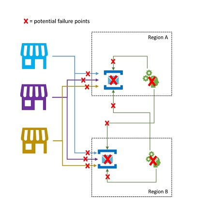

# Message replication and cross-region federation

Within namespaces, Azure Service Bus supports [creating topologies of chained queues and topic subscriptions using autoforwarding](#service-bus-auto-forwarding.md) to allow for the implementation of various routing patterns. For instance, you can provide partners with dedicated queues to which they have send or receive permissions and which can be temporarily suspended if needed, and flexibly connect those to other entities that are private to the application. You can also create complex multi-stage routing topologies, or you can create mailbox-style queues which drain the queue-like subscriptions of topics and allow for more storage capacity per subscriber. 

![Auto-forwarding scenario][1]

Many sophisticated solutions also require messages to be replicated across namespace boundaries in order to implement these and other patterns. Messages may have to flow between namespaces associated with multiple, different application tenants, or across multiple, different Azure regions. 

Your solution will maintain multiple Service Bus namespaces in different regions and replicate messages between Queues and Topics, and/or that you will exchange messages with sources and targets like [Azure Event Hubs](../event-hubs/event-hubs-about.md), [Azure IoT Hub](../iot-fundamentals/iot-introduction.md), or [Apache Kafka](https://kafka.apache.org). 

These scenarios are the focus of this article. 

## Federation Patterns

There are numerous potential motivations for why you may want to move messages between Service Bus entities like Queues or Topics, or between Service Bus and other sources and targets. 

Compared with the similar set of patterns for [Event Hubs](../event-hubs/event-hubs-federation-overview.md),  federation for queue-like entities is generally more complex because message queues promise their consumers exclusive ownership over any single message, are expected to preserve arrival order in message delivery, and for the broker to coordinate fair distribution of messages between competing consumers. 

There are practical impediments, including the constraints of the [CAP theorem](https://en.wikipedia.org/wiki/CAP_theorem), that make it difficult to provide a unified view of a queue that is simultaneously available in multiple regions, and which allows for regionally distributed, competing consumers to take exclusive ownership of messages. Such a geo-distributed queue would require fully consistent replication not only of messages, but also of the delivery state of every message before messages can be made available to consumers. 

The CAP theorem dictates that a goal of a fully consistent model for a hypothetical, regionally distributed queue is in direct conflict with the key goal that practically all Azure Service Bus customers have when considering federation scenarios: Maximum availability and reliability for their solutions. 

The patterns presented here therefore focus on these goals while also aiming to best avoid both information loss and duplicate handling of messages. 

### Resiliency against regional availability events 

While maximum availability and reliability are the top operational priorities for Service Bus, there are nevertheless a lot of ways in which a producer or consumer might be prevented from talking to its assigned "primary" Service Bus due to networking or name resolution issues, or where Service Bus entity might indeed be temporarily unresponsive or returning errors. The designated message processor might also become unavailable.

Such conditions are generally not "disastrous" such that you will want to abandon the regional deployment altogether as you might do in a disaster recovery situation, but the business scenario of some applications might already be impacted by availability events that last not more than a few minutes or even seconds. 

Service Bus is often used in hybrid cloud environments and with clients that reside at the network edge, for instance in retail stores, restaurant, banking branches, manufacturing sites, logistics facilities, and airports. It is quite possible for a network routing or congestion issue to impact a site's ability to reach its assigned Service Bus endpoint while a secondary endpoint in a different region might be reachable. At the same time, systems processing messages arriving from these sites may still have unimpeded access to both the primary and the secondary Service Bus endpoints. 

There are many practical examples of such hybrid cloud and edge applications with a very low business tolerance for impact of network routing issues or of transient availability issues of a Service Bus entity. Those include processing of payments at retail sites, boarding at airport gates, and mobile phone orders at restaurants, all of which come to an instant and complete standstill whenever the reliable communication path is not available.

In this category, we discuss three distinct distributed queue patterns: All-Active Queues, Spillover Queues, and Active-Passive Queues. While all patterns provide queue-like functionality, they lean on Service Bus Topics for implementation. 

#### All-Active Queues

The "All-Active Queue" pattern allows for an active replica of the same logical queue to be available in multiple namespaces (and regions), and for all messages to become available in all replicas, irrespective of where they have been enqueued. The pattern generally preserves the order of messages relative to any publisher. Since each replica holds a copy of every message, 

Synchronized topics with transfer subscription. All messages available everywhere.

#### Spillover Queues

Deadletter replication into secondary. Unprocessed messages available in secondary.

#### Active-passive Queues

Synchronized topics with transfer subscription. Subset of messages available in secondary.

### Latency optimization 

  

Event streams are written once by producers, but may be read any number of times by event consumers. For scenarios where an event stream in a region is shared by multiple consumers, and needs to be accessed repeatedly during analytics processing residing in a different region, or with throughout demands that would starve out concurrent consumers, it may be beneficial to place a copy of the event stream near the analytics processor in order to reduce the roundtrip latency. 

### Validation, reduction, and enrichment

  

Event streams may be submitted into an Event Hub by clients external to your own solution. Such event streams may require for externally submitted events to be checked for compliance with a given schema, and for non-compliant events to be dropped. Some events may have to be reduced in complexity by omitting data and some may have to be enriched by adding data based on reference data lookups. 

### Integration with analytics services

Several of Azure's cloud-native analytics services like Azure Stream Analytics or Azure Synapse work best with streamed or pre-batched data served up from Azure Event Hubs, and Azure Event Hubs also enables integration with several open-source analytics packages such as Apache Samza, Apache Flink, Apache Spark, and Apache Storm. Federation integration also makes data flows otherwise routed in Azure Service Bus available for analytics processing with these services and packages. 

### Consolidation and normalization of event streams

Global solutions are often composed of regional footprints that are largely independent including having their own analytics capabilities, but supra-regional and global analytics perspectives will require an integrated perspective and therefore a central consolidation of the same event streams that are evaluated in the respective regional footprints for the local perspective. 

Normalization is a flavor of the consolidation scenario, whereby two or more incoming event streams carry the same kind of events, but with different structures or different encodings, and the events most be transcoded or transformed before they can be consumed. 

Normalization may also include cryptographic work such as decrypting end-to-end encrypted payloads and re-encrypting it with different keys and algorithms for the downstream consumer audience. 

### Splitting and routing of event streams

Azure Event Hubs is occasionally used in "publish-subscribe" style scenarios where an incoming torrent of ingested events far exceeds the capacity of Azure Service Bus or Azure Event Grid, both of which have native publish-subscribe filtering and distribution capabilities and are generally preferred for this pattern. 

While a true "publish-subscribe" capability leaves it to subscribers to pick the events they want, the splitting pattern has the producer map events to partitions by a predetermined distribution model and designated consumers then exclusively pull from "their" partition. With the Event Hub buffering the overall traffic, the content of a particular partition, representing a fraction of he original throughput volume, may then be replicated into a queue for reliable, transactional, competing consumer consumption.

Many scenarios where Event Hubs is primarily used for moving events within an application within a region have some cases where select events, maybe just from a single partition, also have to be made available elsewhere. This is similar to the splitting scenario, but might use a scalable router that considers all the messages arriving in an Event Hub and cherry-picks just a few for onward routing and might differentiate routing targets by event metadata or content. 

## Event and message replication tasks

For many of the federation patterns explained above, events are copied without changes, but you will occasionally also need to create and run custom transcoding and/or transformation tasks.

Plain copies aside, replication task mights perform one or a combination of actions on events  before forwarding, for instance:

- *Transcoding* - If the event content (also referred to as "body" or "payload") arrives from the source encoded using the Apache Avro format or some proprietary serialization format, but the expectation of the system owning the target is for the content to be JSON encoded, a transcoding replication task will first deserialize the payload from Apache Avro into an in-memory object graph and then serialize that graph into the JSON format for the event that is being forwarded. Transcoding also includes content compression and decompression tasks.
- *Transformation* - Events that contain structured data may require reshaping of that data for easier consumption by downstream consumers. This may involve work like flattening nested structures, pruning extraneous data elements, or reshaping the payload to exactly fit a given schema.
- *Batching* - Events may be received in batches (multiple events in a single transfer) from a source, but have to be forwarded singly to a target, or vice versa. A task may therefore forward multiple events based on a single input event transfer or aggregate a set of events that are then transferred together. 
- *Validation* - Event data from external sources often need to be checked for whether they are in compliance with a set of rules before they may be forwarded. The rules may be expressed using schemas or code. Events that are found not to be in compliance may be dropped, with the issue noted in logs, or may be forwarded to a special target destination to handle them further.   
- *Enrichment* - Event data coming from some sources may require enrichment with further context for it to be usable in target systems. This may involve looking up reference data and embedding that data with the event, or adding information about the source that is known to the replication task, but not contained in the events. 
- *Filtering* - Some events arriving from a source might have to be withheld from the target based on some rule. A filter tests the event against a rule and drops the event if the event does not match the rule. Filtering out duplicate events by observing certain criteria and dropping subsequent events with the same values is a form of filtering.
- *Routing and Partitioning* - Some replication tasks may allow for two or more alternative targets, and define rules for which replication target is chosen for any particular event based on the metadata or content of the event. A special form of routing is partitioning, where the task explicitly assigns partitions in one replication target based on rules.
- *Cryptography* - A replication task may have to decrypt content arriving from the source and/or encrypt content forwarded onwards to a target, and/or it may have to verify the integrity of content and metadata relative to a signature carried in the event, or attach such a signature. 
- *Attestation* - A replication task may attach metadata, potentially protected by a digital signature, to an event that attests that the event has been received through a specific channel or at a specific time.     
- *Chaining* - A replication task may apply signatures to sequences of events such that the integrity of the sequence is protected and missing events can be detected.

### Replication applications in Azure Functions

Implementing the patterns above requires a scalable and reliable execution environment for the replication tasks that you want to configure and run. On Azure, the runtime environment that is best suited for these tasks is [Azure Functions](../azure-functions/functions-overview.md). 

Azure Functions can run under a [Azure managed identity](../active-directory/managed-identities-azure-resources/overview.md) such that the replication tasks can integrate with the role-based access control rules of the source and target services without you having to manage secrets along the replication path. For replication sources and targets that require explicit credentials, Azure Functions can hold the configuration values for those credentials in tightly access-controlled storage inside of [Azure Key Vault](../key-vault/general/overview.md).

Azure Functions furthermore allows the replication tasks to directly integrate with Azure virtual networks and [service endpoints](../virtual-network/virtual-network-service-endpoints-overview.md) for all Azure messaging services, and it is readily integrated with [Azure Monitor](../azure-monitor/overview.md).

Most importantly, Azure Functions has prebuilt, scalable triggers and output bindings for [Azure Event Hubs](../azure-functions/functions-bindings-event-hubs.md), [Azure IoT Hub](../azure-functions/functions-bindings-event-iot), [Azure Service Bus](../azure-functions/functions-bindings-service-bus.md), [Azure Event Grid](../azure-functions/functions-bindings-event-grid.md), and [Azure Queue Storage](/azure-functions/functions-bindings-storage-queue.md), as well as custom extensions for [RabbitMQ](https://github.com/azure/azure-functions-rabbitmq-extension), and [Apache Kafka](https://github.com/azure/azure-functions-kafka-extension). Most triggers will dynamically adapt to the throughput needs by scaling the number of concurrently executing instance up and down based on documented metrics. 

With the Azure Functions consumption plan, the prebuilt triggers can even scale down to zero while no messages are available for replication, which means you incur no costs for keeping the configuration ready to scale back up; the key downside of using the consumption plan is that the latency for replication tasks "waking up" from this state is significantly higher than with the hosting plans where the infrastructure is kept running.  

In contrast to all of this, most common replication engines for messaging and eventing, such as Apache Kafka's [MirrorMaker](http://kafka.apache.org/documentation/#basic_ops_mirror_maker) require you to provide a hosting environment and manage scaling the replication engine yourself. That includes configuring and integrating the security and networking features and facilitating the flow of monitoring data, and then you usually still don't have an opportunity to inject custom replication tasks into the flow. 

## Next Steps

In this article, we explored a range of federation patterns and explained the role of Azure Functions as the event and messaging replication runtime in Azure. 

Next, you might want to read up how to set up a replicator application with Azure Functions and then how to replicate event flows between Event Hubs and various other eventing and messaging systems:

- [Event replicator applications in Azure Functions](event-hubs-federation-replicator-functions.md)
- Replicating events between Event Hubs, and from IoT Hub
- Replicating events from and to Apache Kafka
- Routing events from and to Azure Event Grid 
- Routing events from and to Azure Service Bus 
- Routing events from and to Queue Storage
- Routing events to Notification Hubs

[1]: ./media/service-bus-auto-forwarding/IC628632.gif 
