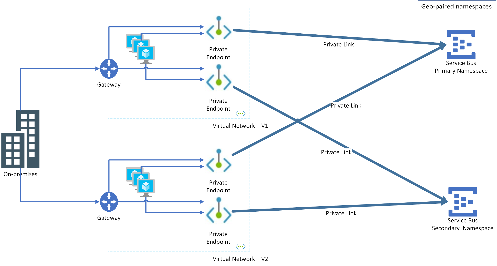

# Azure Service Bus Geo-disaster recovery

Resilience against disastrous outages of data processing resources is a requirement for many enterprises and in some cases even required by industry regulations. 

Azure Service Bus already spreads the risk of catastrophic failures of individual machines or even complete racks across clusters that span multiple failure domains within a datacenter and it implements transparent failure detection and failover mechanisms such that the service continues to operate within the assured service-levels and typically without noticeable interruptions when such failures occur. A premium namespace can have two or more messaging units and these messaging units are spread across multiple failure domains within a datacenter, supporting an all-active Service Bus cluster model. 

For a premium tier namespace, the outage risk is further spread across three physically separated facilities ([availability zones](#availability-zones)), and the service has enough capacity reserves to instantly cope with the complete, catastrophic loss of a datacenter. The all-active Azure Service Bus cluster model within a failure domain along with the availability zone support is superior to any on-premises message broker product in terms of resiliency against grave hardware failures and even catastrophic loss of entire datacenter facilities. Still, there might be grave situations with widespread physical destruction that even those measures can't sufficiently defend against. 

The Service Bus Geo-disaster recovery feature is designed to make it easier to recover from a disaster of this magnitude and abandon a failed Azure region for good and without having to change your application configurations. Abandoning an Azure region typically involves several services and this feature primarily aims at helping to preserve the integrity of the composite application configuration. The feature is globally available for the Service Bus Premium SKU. 

The Geo-Disaster recovery feature ensures that the entire configuration of a namespace (queues, topics, subscriptions, filters) is continuously replicated from a primary namespace to a secondary namespace when paired, and it allows you to initiate a once-only failover move from the primary to the secondary at any time. The failover move re-points the chosen alias name for the namespace to the secondary namespace and then break the pairing. The failover is nearly instantaneous once initiated. 

## Important points to consider

- The feature enables instant continuity of operations with the same configuration, but **doesn't replicate the messages held in queues or topic subscriptions or dead-letter queues**. To preserve queue semantics, such a replication requires not only the replication of message data, but of every state change in the broker. For most Service Bus namespaces, the required replication traffic would far exceed the application traffic and with high-throughput queues, most messages would still replicate to the secondary while they're already being deleted from the primary, causing excessively wasteful traffic. For high-latency replication routes, which applies to many pairings you would choose for Geo-disaster recovery, it might also be impossible for the replication traffic to sustainably keep up with the application traffic due to latency-induced throttling effects.
- Microsoft Entra role-based access control (RBAC) assignments to Service Bus entities in the primary namespace aren't replicated to the secondary namespace. Create role assignments manually in the secondary namespace to secure access to them. 
- The following configurations aren't replicated. 
    - Virtual network configurations
    - Private endpoint connections
    - All networks access enabled
    - Trusted service access enabled
    - Public network access
    - Default network action
    - Identities and encryption settings (customer-managed key encryption or bring your own key (BYOK) encryption)
    - Enable auto scale
    - Disable local authentication
- Pairing a [partitioned namespace](enable-partitions-premium.md) with a non-partitioned namespace isn't supported.
-  if `AutoDeleteOnIdle` is turned on an entity, the entity might not be present in the secondary namespace when the failover occurs.
 
> [!TIP]
> For replicating the contents of queues and topic subscriptions and operating corresponding namespaces in active/active configurations to cope with outages and disasters, don't lean on this Geo-disaster recovery feature set, but follow the [replication guidance](service-bus-federation-overview.md).  

## Outages and disasters

It's important to note the distinction between "outages" and "disasters." 

An *outage* is the temporary unavailability of Azure Service Bus, and can affect some components of the service, such as a messaging store, or even the entire datacenter. However, after the problem is fixed, Service Bus becomes available again. Typically, an outage doesn't cause the loss of messages or other data. An example of such an outage might be a power failure in the datacenter. Some outages are only short connection losses because of transient or network issues. 

A *disaster* is defined as the permanent, or longer-term loss of a Service Bus cluster, Azure region, or datacenter. The region or datacenter might or might not become available again, or might be down for hours or days. Examples of such disasters are fire, flooding, or earthquake. A disaster that becomes permanent might cause the loss of some messages, events, or other data. However, in most cases there should be no data loss and messages can be recovered once the data center comes back up.

The Geo-disaster recovery feature of Azure Service Bus is a disaster recovery solution. The concepts and workflow described in this article apply to disaster scenarios, and not to transient, or temporary outages. For a detailed discussion of disaster recovery in Microsoft Azure, see [this article](/azure/architecture/resiliency/disaster-recovery-azure-applications).   

## Basic concepts and terms

The disaster recovery feature implements metadata disaster recovery, and relies on primary and secondary disaster recovery namespaces. The Geo-disaster recovery feature is available for the [Premium SKU](service-bus-premium-messaging.md) only. You don't need to make any connection string changes, as the connection is made via an alias.

The following terms are used in this article:

-  *Alias*: The name for a disaster recovery configuration that you set up. The alias provides a single stable Fully Qualified Domain Name (FQDN) connection string. Applications use this alias connection string to connect to a namespace. Using an alias ensures that the connection string is unchanged when the failover is triggered.

-  *Primary/secondary namespace*: The namespaces that correspond to the alias. The primary namespace is "active" and receives messages (it can be an existing or new namespace). The secondary namespace is "passive" and doesn't receive messages. The metadata between both is in sync, so both can seamlessly accept messages without any application code or connection string changes. To ensure that only the active namespace receives messages, you must use the alias. 
-  *Metadata*: Entities such as queues, topics, and subscriptions; and their properties of the service that are associated with the namespace. Only entities and their settings are replicated automatically. Messages aren't replicated.
-  *Failover*: The process of activating the secondary namespace.

## Setup

The following section is an overview to set up pairing between the namespaces.

:::image type="content" source="./media/service-bus-geo-dr/geodr_setup_pairing.png" alt-text="Image showing how geo-disaster recovery works.":::

You first create or use an existing primary namespace, and a new secondary namespace, then pair the two. This pairing gives you an alias that you can use to connect. Because you use an alias, you don't have to change connection strings. Only new namespaces can be added to your failover pairing. 

1. Create the primary premium-tier namespace.
1. Create the secondary premium-tier namespace in a different region. This step is optional. You can create the secondary namespace while creating the pairing in the next step. 
1. In the Azure portal, navigate to your primary namespace.
1. Select **Geo-recovery** on the left menu, and select **Initiate pairing** on the toolbar. 

    :::image type="content" source="./media/service-bus-geo-dr/primary-namspace-initiate-pairing-button.png" alt-text="Screenshot showing the Geo-recovery page with Initiate pairing link selected.":::    
1. On the **Initiate pairing** page, follow these steps:
    1. Select an existing secondary namespace or create one in a different region. In this example, an existing namespace is used as the secondary namespace.  
    1. For **Alias**, enter an alias for the geo-dr pairing. 
    1. Then, select **Create**. 

        :::image type="content" source="./media/service-bus-geo-dr/initiate-pairing-page.png" alt-text="Screenshot showing the Initiate Pairing page in the Azure portal.":::        
1. You should see the **Service Bus Geo-DR Alias** page as shown in the following image. You can also navigate to the **Geo-DR Alias** page from the primary namespace page by selecting the **Geo-recovery** on the left menu. 

    :::image type="content" source="./media/service-bus-geo-dr/service-bus-geo-dr-alias-page.png" alt-text="Screenshot showing the Service Bus Geo-DR Alias page with primary and secondary namespaces.":::
1. On the **Geo-DR Alias** page, select **Shared access policies** on the left menu to access the primary connection string for the alias. Use this connection string instead of using the connection string to the primary/secondary namespace directly. Initially, the alias points to the primary namespace.
1. Switch to the **Overview** page. You can do the following actions: 
    1. Break the pairing between primary and secondary namespaces. Select **Break pairing** on the toolbar. 
    1. Manually fail over to the secondary namespace. 
        1. Select **Failover** on the toolbar. 
        1. Confirm that you want to fail over to the secondary namespace by typing in your alias. 
        1. Turn ON the **Safe Failover** option to safely fail over to the secondary namespace. 
        
            > [!NOTE]
            > - The safe failover makes sure that pending Geo-DR replications are completed before switching over to the secondary. Whereas forced or manual failover doesn't wait for pending replications to be completed before switching over to the secondary. 
            > - Currently, the safe failover fails if the primary and secondary namespaces aren't in the same Azure subscription. 
        1. Then, select **Failover**. 
        
            :::image type="content" source="./media/service-bus-geo-dr/failover-page.png" alt-text="Screenshot showing the Failover page.":::
    
            > [!IMPORTANT]
            > Failing over activates the secondary namespace and remove the primary namespace from the Geo-Disaster Recovery pairing. Create another namespace to have a new geo-disaster recovery pair. 

1. Finally, you should add some monitoring to detect if a failover is necessary. In most cases, the service is one part of a large ecosystem, thus automatic failovers are rarely possible, as often failovers must be performed in sync with the remaining subsystem or infrastructure.

### Service Bus standard to premium
If you've [migrated your Azure Service Bus Standard namespace to Azure Service Bus Premium](service-bus-migrate-standard-premium.md), then you must use the pre-existing alias (that is, your Service Bus Standard namespace connection string) to create the disaster recovery configuration through the **PS/CLI** or **REST API**.

It's because, during migration, your Azure Service Bus standard namespace connection string/DNS name itself becomes an alias to your Azure Service Bus premium namespace.

Your client applications must utilize this alias (that is, the Azure Service Bus standard namespace connection string) to connect to the premium namespace where the disaster recovery pairing has been set up.

If you use the Azure portal to set up the disaster recovery configuration, the portal abstracts this caveat from you.

## Failover flow

A failover is triggered manually by the customer (either explicitly through a command, or through client owned business logic that triggers the command) and never by Azure. It gives the customer full ownership and visibility for outage resolution on Azure's backbone.

:::image type="content" source="./media/service-bus-geo-dr/geodr_failover_alias_update.png" alt-text="Image showing the flow of failover from primary to secondary namespace.":::

After the failover is triggered -

1. The ***alias*** connection string is updated to point to the Secondary Premium namespace.

2. Clients(senders and receivers) automatically connect to the Secondary namespace.

3. The existing pairing between Primary and Secondary premium namespace is broken.

Once the failover is initiated -

1. If another outage occurs, you want to be able to fail over again. So, set up another passive namespace and update the pairing. 

2. Pull messages from the former primary namespace once it's available again. After that, use that namespace for regular messaging outside of your geo-recovery setup, or delete the old primary namespace.

> [!NOTE]
> Only fail forward semantics are supported. In this scenario, you fail over and then re-pair with a new namespace. Failing back is not supported; for example, in a SQL cluster. 

You can automate failover either with monitoring systems, or with custom-built monitoring solutions. However, such automation takes extra planning and work, which is out of the scope of this article.

:::image type="content" source="./media/service-bus-geo-dr/geo2.png" alt-text="Image showing how you can automate failover.":::

## Management

If you made a mistake, for example, you paired the wrong regions during the initial setup, you can break the pairing of the two namespaces at any time. If you want to use the paired namespaces as regular namespaces, delete the alias.

## Use existing namespace as alias

If you have a scenario in which you can't change the connections of producers and consumers, you can reuse your namespace name as the alias name. See the [sample code on GitHub here](https://github.com/Azure/azure-service-bus/tree/master/samples/DotNet/Microsoft.ServiceBus.Messaging/GeoDR/SBGeoDR2/SBGeoDR_existing_namespace_name).

## Samples

The [samples on GitHub](https://github.com/Azure/azure-service-bus/tree/master/samples/DotNet/Microsoft.ServiceBus.Messaging/GeoDR/SBGeoDR2/) show how to set up and initiate a failover. These samples demonstrate the following concepts:

- A .NET sample and settings that are required in Microsoft Entra ID to use Azure Resource Manager with Service Bus, to set up, and enable Geo-disaster recovery.
- Steps required to execute the sample code.
- How to use an existing namespace as an alias.
- Steps to alternatively enable Geo-disaster recovery via PowerShell or CLI.
- [Send and receive](https://github.com/Azure/azure-service-bus/tree/master/samples/DotNet/Microsoft.ServiceBus.Messaging/GeoDR/TestGeoDR/ConsoleApp1) from the current primary or secondary namespace using the alias.

## Considerations

Note the following considerations to keep in mind with this release:

- In your failover planning, you should also consider the time factor. For example, if you lose connectivity for longer than 15 to 20 minutes, you might decide to initiate the failover.
- The fact that no data is replicated means that currently active sessions aren't replicated. Additionally, duplicate detection and scheduled messages might not work. New sessions, new scheduled messages, and new duplicates work. 
- Failing over a complex distributed infrastructure should be [rehearsed](/azure/architecture/reliability/disaster-recovery#disaster-recovery-plan) at least once.
- Synchronizing entities can take some time, approximately 50-100 entities per minute. Subscriptions and rules also count as entities.

## Availability Zones

The Service Bus Premium SKU supports [availability zones](../availability-zones/az-overview.md), providing fault-isolated locations within the same Azure region. Service Bus manages three copies of the messaging store (1 primary and 2 secondary). Service Bus keeps all three copies in sync for data and management operations. If the primary copy fails, one of the secondary copies is promoted to primary with no perceived downtime. If the applications see transient disconnects from Service Bus, the [retry logic](/azure/architecture/best-practices/retry-service-specific#service-bus) in the SDK automatically reconnects to Service Bus. 

When you use availability zones, both metadata and data (messages) are replicated across data centers in the availability zone. 

> [!NOTE]
> The Availability Zones support for Azure Service Bus Premium is only available in [Azure regions](../availability-zones/az-region.md) where availability zones are present.

When you create a premium tier namespace, the support for availability zones (if available in the selected region) is automatically enabled for the namespace. There's no extra cost for using this feature and you can't disable or enable this feature. 

## Private endpoints
This section provides more considerations when using Geo-disaster recovery with namespaces that use private endpoints. To learn about using private endpoints with Service Bus in general, see [Integrate Azure Service Bus with Azure Private Link](private-link-service.md).

### New pairings
If you try to create a pairing between a primary namespace with a private endpoint and a secondary namespace without a private endpoint, the pairing fails. The pairing succeeds only if both primary and secondary namespaces have private endpoints. We recommend that you use same configurations on the primary and secondary namespaces and on virtual networks in which private endpoints are created. 

> [!NOTE]
> When you try to pair the primary namespace with a private endpoint and the secondary namespace, the validation process only checks whether a private endpoint exists on the secondary namespace. It doesn't check whether the endpoint works or works after failover. It's your responsibility to ensure that the secondary namespace with private endpoint works as expected after failover.
>
> To test that the private endpoint configurations are same, send a [Get queues](/rest/api/servicebus/controlplane-stable/queues/get) request to the secondary namespace from outside the virtual network, and verify that you receive an error message from the service.

### Existing pairings
If pairing between primary and secondary namespace already exists, private endpoint creation on the primary namespace fails. To resolve, create a private endpoint on the secondary namespace first and then create one for the primary namespace.

> [!NOTE]
> While we allow read-only access to the secondary namespace, updates to the private endpoint configurations are permitted. 

### Recommended configuration
When creating a disaster recovery configuration for your application and Service Bus, you must create private endpoints for both primary and secondary Service Bus namespaces against virtual networks hosting both primary and secondary instances of your application.

Let's say you have two virtual networks: VNET-1, VNET-2 and these primary and second namespaces: `ServiceBus-Namespace1-Primary`, `ServiceBus-Namespace2-Secondary`. You need to do the following steps: 

- On `ServiceBus-Namespace1-Primary`, create two private endpoints that use subnets from VNET-1 and VNET-2
- On `ServiceBus-Namespace2-Secondary`, create two private endpoints that use the same subnets from VNET-1 and VNET-2 

Advantage of this approach is that failover can happen at the application layer independent of Service Bus namespace. Consider the following scenarios: 

**Application-only failover:** Here, the application doesn't exist in VNET-1 but moves to VNET-2. As both private endpoints are configured on both VNET-1 and VNET-2 for both primary and secondary namespaces, the application just works. 

**Service Bus namespace-only failover**: Here again, since both private endpoints are configured on both virtual networks for both primary and secondary namespaces, the application just works. 

> [!NOTE]
> For guidance on geo-disaster recovery of a virtual network, see [Virtual Network - Business Continuity](../virtual-network/virtual-network-disaster-recovery-guidance.md).

## Role-based access control
Microsoft Entra role-based access control (RBAC) assignments to Service Bus entities in the primary namespace aren't replicated to the secondary namespace. Create role assignments manually in the secondary namespace to secure access to them. 

## Next steps

- See the Geo-disaster recovery [REST API reference here](/rest/api/servicebus/controlplane-stable/disaster-recovery-configs).
- Run the Geo-disaster recovery [sample on GitHub](https://github.com/Azure/azure-service-bus/tree/master/samples/DotNet/Microsoft.ServiceBus.Messaging/GeoDR/SBGeoDR2/SBGeoDR2).
- See the Geo-disaster recovery [sample that sends messages to an alias](https://github.com/Azure/azure-service-bus/tree/master/samples/DotNet/Microsoft.ServiceBus.Messaging/GeoDR/TestGeoDR/ConsoleApp1).

To learn more about Service Bus messaging, see the following articles:

* [Service Bus queues, topics, and subscriptions](service-bus-queues-topics-subscriptions.md)
* [Get started with Service Bus queues](service-bus-dotnet-get-started-with-queues.md)
* [How to use Service Bus topics and subscriptions](service-bus-dotnet-how-to-use-topics-subscriptions.md)
* [REST API](/rest/api/servicebus/)

[1]: ./media/service-bus-geo-dr/geodr_setup_pairing.png
[2]: ./media/service-bus-geo-dr/geo2.png
[3]: ./media/service-bus-geo-dr/az.png
[4]: ./media/service-bus-geo-dr/geodr_failover_alias_update.png
