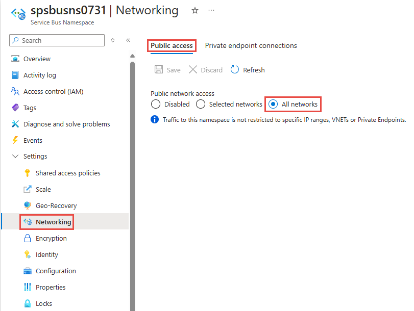
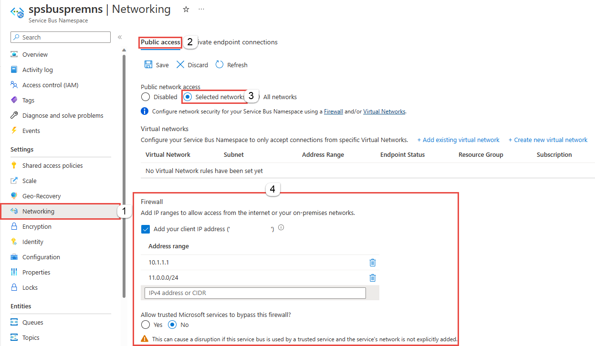

# Configure IP firewall rules for Azure Service Bus
By default, Service Bus namespaces are accessible from internet as long as the request comes with valid authentication and authorization. With IP firewall, you can restrict it further to only a set of IPv4 addresses or IPv4 address ranges in [CIDR (Classless Inter-Domain Routing)](https://en.wikipedia.org/wiki/Classless_Inter-Domain_Routing) notation.

This feature is helpful in scenarios in which Azure Service Bus should be only accessible from certain well-known sites. Firewall rules enable you to configure rules to accept traffic originating from specific IPv4 addresses. For example, if you use Service Bus with [Azure Express Route][express-route], you can create a **firewall rule** to allow traffic from only your on-premises infrastructure IP addresses or addresses of a corporate NAT gateway. 

> [!IMPORTANT]
> Firewalls and Virtual Networks are supported only in the **premium** tier of Service Bus. If upgrading to the **premier** tier isn't an option, we recommend that you keep the Shared Access Signature (SAS) token secure and share with only authorized users. For information about SAS authentication, see [Authentication and authorization](service-bus-authentication-and-authorization.md#shared-access-signature).

## IP firewall rules
The IP firewall rules are applied at the Service Bus namespace level. Therefore, the rules apply to all connections from clients using any supported protocol. Any connection attempt from an IP address that does not match an allowed IP rule on the Service Bus namespace is rejected as unauthorized. The response does not mention the IP rule. IP filter rules are applied in order, and the first rule that matches the IP address determines the accept or reject action.

>[!WARNING]
> Implementing Firewall rules can prevent other Azure services from interacting with Service Bus.
>
> Trusted Microsoft services are not supported when IP Filtering (Firewall rules) are implemented, and will be made available soon.
>
> Common Azure scenarios that don't work with IP Filtering (note that the list is **NOT** exhaustive) -
> - Integration with Azure Event Grid
> - Azure IoT Hub Routes
> - Azure IoT Device Explorer
>
> The following Microsoft services are required to be on a virtual network
> - Azure App Service
> - Azure Functions

## Use Azure portal
This section shows you how to use the Azure portal to create IP firewall rules for a Service Bus namespace. 

1. Navigate to your **Service Bus namespace** in the [Azure portal](https://portal.azure.com).
2. On the left menu, select **Networking** option. By default, the **All networks** option is selected. Your Service Bus namespace accepts connections from any IP address. This default setting is equivalent to a rule that accepts the 0.0.0.0/0 IP address range. 

    
1. Select the **Selected networks** option at the top of the page. In the **Firewall** section, follow these steps:
    1. Select **Add your client IP address** option to give your current client IP the access to the namespace. 
    2. For **address range**, enter a specific IPv4 address or a range of IPv4 address in CIDR notation. 
    3. Specify whether you want to **allow trusted Microsoft services to bypass this firewall**. 

        > [!WARNING]
        > If you choose the **Selected networks** option and don't specify an IP address or address range, the service will allow traffic from all networks. 

        
3. Select **Save** on the toolbar to save the settings. Wait for a few minutes for the confirmation to show up on the portal notifications.

## Use Resource Manager template
This section has a sample Azure Resource Manager template that creates a virtual network and a firewall rule.


The following Resource Manager template enables adding a virtual network rule to an existing Service Bus namespace.

Template parameters:

- **ipMask** is a single IPv4 address or a block of IP addresses in CIDR notation. For example, in CIDR notation 70.37.104.0/24 represents the 256 IPv4 addresses from 70.37.104.0 to 70.37.104.255, with 24 indicating the number of significant prefix bits for the range.

> [!NOTE]
> While there are no deny rules possible, the Azure Resource Manager template has the default action set to **"Allow"** which doesn't restrict connections.
> When making Virtual Network or Firewalls rules, we must change the
> ***"defaultAction"***
> 
> from
> ```json
> "defaultAction": "Allow"
> ```
> to
> ```json
> "defaultAction": "Deny"
> ```
>

```json
{
    "$schema": "https://schema.management.azure.com/schemas/2015-01-01/deploymentTemplate.json#",
    "contentVersion": "1.0.0.0",
    "parameters": {
      "servicebusNamespaceName": {
        "type": "string",
        "metadata": {
          "description": "Name of the Service Bus namespace"
        }
      },
      "location": {
        "type": "string",
        "metadata": {
          "description": "Location for Namespace"
        }
      }
    },
    "variables": {
      "namespaceNetworkRuleSetName": "[concat(parameters('servicebusNamespaceName'), concat('/', 'default'))]",
    },
    "resources": [
      {
        "apiVersion": "2018-01-01-preview",
        "name": "[parameters('servicebusNamespaceName')]",
        "type": "Microsoft.ServiceBus/namespaces",
        "location": "[parameters('location')]",
        "sku": {
          "name": "Premium",
          "tier": "Premium"
        },
        "properties": { }
      },
      {
        "apiVersion": "2018-01-01-preview",
        "name": "[variables('namespaceNetworkRuleSetName')]",
        "type": "Microsoft.ServiceBus/namespaces/networkruleset",
        "dependsOn": [
          "[concat('Microsoft.ServiceBus/namespaces/', parameters('servicebusNamespaceName'))]"
        ],
        "properties": {
		  "virtualNetworkRules": [<YOUR EXISTING VIRTUAL NETWORK RULES>],
          "ipRules": 
          [
            {
                "ipMask":"10.1.1.1",
                "action":"Allow"
            },
            {
                "ipMask":"11.0.0.0/24",
                "action":"Allow"
            }
          ],
          "trustedServiceAccessEnabled": false,          
          "defaultAction": "Deny"
        }
      }
    ],
    "outputs": { }
  }
```

To deploy the template, follow the instructions for [Azure Resource Manager][lnk-deploy].

## Next steps

For constraining access to Service Bus to Azure virtual networks, see the following link:

- [Virtual Network Service Endpoints for Service Bus][lnk-vnet]

<!-- Links -->

[lnk-deploy]: ../azure-resource-manager/templates/deploy-powershell.md
[lnk-vnet]: service-bus-service-endpoints.md
[express-route]:  /azure/expressroute/expressroute-faqs#supported-services
