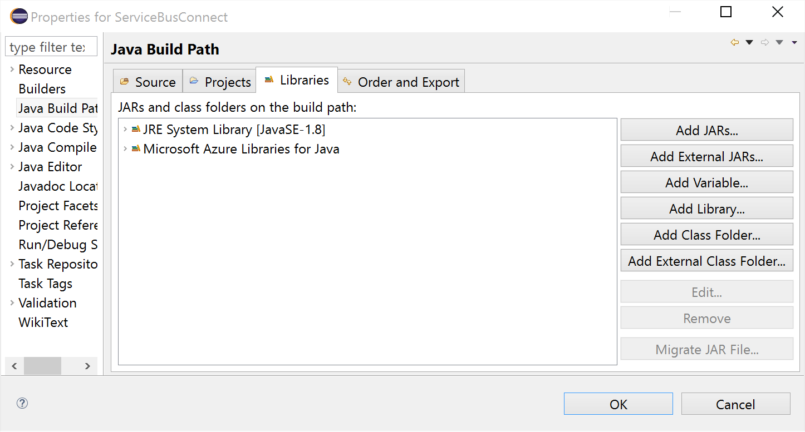

# How to use Service Bus queues with Java
[!INCLUDE [service-bus-selector-queues](../../includes/service-bus-selector-queues.md)]
In this tutorial, you learn how to create Java applications to send messages to and receive messages from a Service Bus queue. 

> [!NOTE]
> You can find Java samples on GitHub in the [azure-service-bus repository](https://github.com/Azure/azure-service-bus/tree/master/samples/Java).

## Prerequisites
1. An Azure subscription. To complete this tutorial, you need an Azure account. You can activate your [MSDN subscriber benefits](https://azure.microsoft.com/pricing/member-offers/credit-for-visual-studio-subscribers/?WT.mc_id=A85619ABF) or sign up for a [free account](https://azure.microsoft.com/free/?WT.mc_id=A85619ABF).
2. If you don't have a queue to work with, follow steps in the [Use Azure portal to create a Service Bus queue](service-bus-quickstart-portal.md) article to create a queue.
    1. Read the quick **overview** of Service Bus **queues**. 
    2. Create a Service Bus **namespace**. 
    3. Get the **connection string**.
    4. Create a Service Bus **queue**.
3. Install [Azure SDK for Java][Azure SDK for Java]. 


## Configure your application to use Service Bus
Make sure you have installed the [Azure SDK for Java][Azure SDK for Java] before building this sample. If you are using Eclipse, you can install the [Azure Toolkit for Eclipse][Azure Toolkit for Eclipse] that includes the Azure SDK for Java. You can then add the **Microsoft Azure Libraries for Java** to your project:



Add the following `import` statements to the top of the Java file:

```java
// Include the following imports to use Service Bus APIs
import com.google.gson.reflect.TypeToken;
import com.microsoft.azure.servicebus.*;
import com.microsoft.azure.servicebus.primitives.ConnectionStringBuilder;
import com.google.gson.Gson;

import static java.nio.charset.StandardCharsets.*;

import java.time.Duration;
import java.util.*;
import java.util.concurrent.*;

import org.apache.commons.cli.*;

```

## Send messages to a queue
To send messages to a Service Bus Queue, your application instantiates a **QueueClient** object and sends messages asynchronously. The following code shows how to send a message for a Queue that was created through the portal.

```java
public void run() throws Exception {
	// Create a QueueClient instance and then asynchronously send messages.
	// Close the sender once the send operation is complete.
	QueueClient sendClient = new QueueClient(new ConnectionStringBuilder(ConnectionString, QueueName), ReceiveMode.PEEKLOCK);
	this.sendMessageAsync(sendClient).thenRunAsync(() -> sendClient.closeAsync());

	sendClient.close();
}

    CompletableFuture<Void> sendMessagesAsync(QueueClient sendClient) {
        List<HashMap<String, String>> data =
                GSON.fromJson(
                        "[" +
                                "{'name' = 'Einstein', 'firstName' = 'Albert'}," +
                                "{'name' = 'Heisenberg', 'firstName' = 'Werner'}," +
                                "{'name' = 'Curie', 'firstName' = 'Marie'}," +
                                "{'name' = 'Hawking', 'firstName' = 'Steven'}," +
                                "{'name' = 'Newton', 'firstName' = 'Isaac'}," +
                                "{'name' = 'Bohr', 'firstName' = 'Niels'}," +
                                "{'name' = 'Faraday', 'firstName' = 'Michael'}," +
                                "{'name' = 'Galilei', 'firstName' = 'Galileo'}," +
                                "{'name' = 'Kepler', 'firstName' = 'Johannes'}," +
                                "{'name' = 'Kopernikus', 'firstName' = 'Nikolaus'}" +
                                "]",
                        new TypeToken<List<HashMap<String, String>>>() {}.getType());

        List<CompletableFuture> tasks = new ArrayList<>();
        for (int i = 0; i < data.size(); i++) {
            final String messageId = Integer.toString(i);
            Message message = new Message(GSON.toJson(data.get(i), Map.class).getBytes(UTF_8));
            message.setContentType("application/json");
            message.setLabel("Scientist");
            message.setMessageId(messageId);
            message.setTimeToLive(Duration.ofMinutes(2));
            System.out.printf("\nMessage sending: Id = %s", message.getMessageId());
            tasks.add(
                    sendClient.sendAsync(message).thenRunAsync(() -> {
                        System.out.printf("\n\tMessage acknowledged: Id = %s", message.getMessageId());
                    }));
        }
        return CompletableFuture.allOf(tasks.toArray(new CompletableFuture<?>[tasks.size()]));
    }

```

Messages sent to, and received from Service Bus queues are instances of the [Message](/java/api/com.microsoft.azure.servicebus.message?view=azure-java-stable) class. Message objects have a set of standard properties (such as Label and TimeToLive), a dictionary that is used to hold custom application-specific properties, and a body of arbitrary application data. An application can set the body of the message by passing any serializable object into the constructor of the Message, and the appropriate serializer will then be used to serialize the object. Alternatively, you can provide a **java.IO.InputStream** object.


Service Bus queues support a maximum message size of 256 KB in the [Standard tier](service-bus-premium-messaging.md) and 1 MB in the [Premium tier](service-bus-premium-messaging.md). The header, which includes the standard and custom application properties, can have
a maximum size of 64 KB. There is no limit on the number of messages
held in a queue but there is a cap on the total size of the messages
held by a queue. This queue size is defined at creation time, with an
upper limit of 5 GB.

## Receive messages from a queue
The primary way to receive messages from a queue is to use a
**ServiceBusContract** object. Received messages can work in two
different modes: **ReceiveAndDelete** and **PeekLock**.

When using the **ReceiveAndDelete** mode, receive is a single-shot
operation - that is, when Service Bus receives a read request for a
message in a queue, it marks the message as being consumed and returns
it to the application. **ReceiveAndDelete** mode (which is the default
mode) is the simplest model and works best for scenarios in which an
application can tolerate not processing a message in the event of a
failure. To understand this, consider a scenario in which the consumer
issues the receive request and then crashes before processing it.
Because Service Bus has marked the message as being consumed, then
when the application restarts and begins consuming messages again, it
has missed the message that was consumed prior to the crash.

In **PeekLock** mode, receive becomes a two stage operation, which makes
it possible to support applications that cannot tolerate missing
messages. When Service Bus receives a request, it finds the next message
to be consumed, locks it to prevent other consumers receiving it, and
then returns it to the application. After the application finishes
processing the message (or stores it reliably for future processing), it
completes the second stage of the receive process by calling **Delete**
on the received message. When Service Bus sees the **Delete** call, it
marks the message as being consumed and remove it from the queue.

The following example demonstrates how messages can be received and
processed using **PeekLock** mode (not the default mode). The example
below does an infinite loop and processes messages as they arrive into
our `TestQueue`:

```java
    public void run() throws Exception {
	    // Create a QueueClient instance for receiving using the connection string builder
        // We set the receive mode to "PeekLock", meaning the message is delivered
        // under a lock and must be acknowledged ("completed") to be removed from the queue
        QueueClient receiveClient = new QueueClient(new ConnectionStringBuilder(ConnectionString, QueueName), ReceiveMode.PEEKLOCK);
        this.registerReceiver(receiveClient);

        // shut down receiver to close the receive loop
        receiveClient.close();
    }
    void registerReceiver(QueueClient queueClient) throws Exception {
        // register the RegisterMessageHandler callback
        queueClient.registerMessageHandler(new IMessageHandler() {
		// callback invoked when the message handler loop has obtained a message
            public CompletableFuture<Void> onMessageAsync(IMessage message) {
			// receives message is passed to callback
                if (message.getLabel() != null &&
                    message.getContentType() != null &&
                    message.getLabel().contentEquals("Scientist") &&
                    message.getContentType().contentEquals("application/json")) {

                        byte[] body = message.getBody();
                        Map scientist = GSON.fromJson(new String(body, UTF_8), Map.class);

                        System.out.printf(
                          	"\n\t\t\t\tMessage received: \n\t\t\t\t\t\tMessageId = %s, \n\t\t\t\t\t\tSequenceNumber = %s, \n\t\t\t\t\t\tEnqueuedTimeUtc = %s," +
                            "\n\t\t\t\t\t\tExpiresAtUtc = %s, \n\t\t\t\t\t\tContentType = \"%s\",  \n\t\t\t\t\t\tContent: [ firstName = %s, name = %s ]\n",
                            message.getMessageId(),
                            message.getSequenceNumber(),
                            message.getEnqueuedTimeUtc(),
                            message.getExpiresAtUtc(),
                            message.getContentType(),
                            scientist != null ? scientist.get("firstName") : "",
                            scientist != null ? scientist.get("name") : "");
                    }
                    return CompletableFuture.completedFuture(null);
		        }

                // callback invoked when the message handler has an exception to report
                public void notifyException(Throwable throwable, ExceptionPhase exceptionPhase) {
			        System.out.printf(exceptionPhase + "-" + throwable.getMessage());
		        }
        },
	    // 1 concurrent call, messages are auto-completed, auto-renew duration
        new MessageHandlerOptions(1, true, Duration.ofMinutes(1)));
    }

```

## How to handle application crashes and unreadable messages
Service Bus provides functionality to help you gracefully recover from
errors in your application or difficulties processing a message. If a
receiver application is unable to process the message for some reason,
then it can call the **unlockMessage** method on the received message
(instead of the **deleteMessage** method). This causes Service Bus
to unlock the message within the queue and make it available to be
received again, either by the same consuming application or by another
consuming application.

There is also a timeout associated with a message locked within the
queue, and if the application fails to process the message before the
lock timeout expires (for example, if the application crashes), then Service
Bus unlocks the message automatically and makes it available to be
received again.

In the event that the application crashes after processing the message
but before the **deleteMessage** request is issued, then the message
is redelivered to the application when it restarts. This is often
called *At Least Once Processing*; that is, each message is
processed at least once but in certain situations the same message may
be redelivered. If the scenario cannot tolerate duplicate processing,
then application developers should add additional logic to their
application to handle duplicate message delivery. This is often achieved
using the **getMessageId** method of the message, which remains
constant across delivery attempts.

> [!NOTE]
> You can manage Service Bus resources with [Service Bus Explorer](https://github.com/paolosalvatori/ServiceBusExplorer/). The Service Bus Explorer allows users to connect to a Service Bus namespace and administer messaging entities in an easy manner. The tool provides advanced features like import/export functionality or the ability to test topic, queues, subscriptions, relay services, notification hubs and events hubs. 

## Next Steps
Now that you've learned the basics of Service Bus queues, see [Queues, topics, and subscriptions][Queues, topics, and subscriptions] for more information.

For more information, see the [Java Developer Center](https://azure.microsoft.com/develop/java/).

[Azure SDK for Java]: https://docs.microsoft.com/java/api/overview/azure/
[Azure Toolkit for Eclipse]: https://docs.microsoft.com/java/azure/eclipse/azure-toolkit-for-eclipse
[Queues, topics, and subscriptions]: service-bus-queues-topics-subscriptions.md
[BrokeredMessage]: /dotnet/api/microsoft.servicebus.messaging.brokeredmessage
