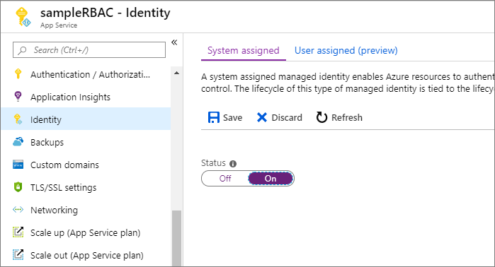
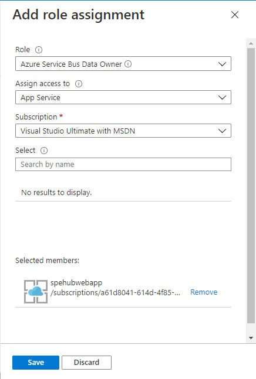
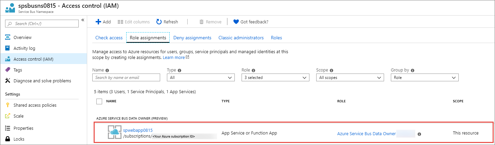
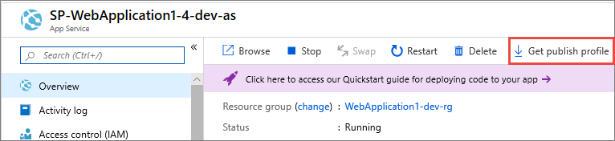

# Authenticate a managed identity with Azure Active Directory to access Azure Service Bus resources
[Managed identities for Azure resources](../active-directory/managed-identities-azure-resources/overview.md) is a cross-Azure feature that enables you to create a secure identity associated with the deployment under which your application code runs. You can then associate that identity with access-control roles that grant custom permissions for accessing specific Azure resources that your application needs.

With managed identities, the Azure platform manages this runtime identity. You do not need to store and protect access keys in your application code or configuration, either for the identity itself, or for the resources you need to access. A Service Bus client app running inside an Azure App Service application or in a virtual machine with enabled managed entities for Azure resources support does not need to handle SAS rules and keys, or any other access tokens. The client app only needs the endpoint address of the Service Bus Messaging namespace. When the app connects, Service Bus binds the managed entity's context to the client in an operation that is shown in an example later in this article. Once it is associated with a managed identity, your Service Bus client can do all authorized operations. Authorization is granted by associating a managed entity with Service Bus roles. 

## Overview
When a security principal (a user, group, or application) attempts to access a Service Bus entity, the request must be authorized. With Azure AD, access to a resource is a two-step process. 

 1. First, the security principal’s identity is authenticated, and an OAuth 2.0 token is returned. The resource name to request a token is `https://servicebus.azure.net`.
 1. Next, the token is passed as part of a request to the Service Bus service to authorize access to the specified resource.

The authentication step requires that an application request contains an OAuth 2.0 access token at runtime. If an application is running within an Azure entity such as an Azure VM,  a virtual machine scale set, or an Azure Function app, it can use a managed identity to access the resources. 

The authorization step requires that one or more RBAC roles be assigned to the security principal. Azure Service Bus provides RBAC roles that encompass sets of permissions for Service Bus resources. The roles that are assigned to a security principal determine the permissions that the principal will have. To learn more about assigning RBAC roles to Azure Service Bus, see [Built-in RBAC roles for Azure Service Bus](#built-in-rbac-roles-for-azure-service-bus). 

Native applications and web applications that make requests to Service Bus can also authorize with Azure AD. This article shows you how to request an access token and use it to authorize requests for Service Bus resources. 


## Assigning RBAC roles for access rights
Azure Active Directory (Azure AD) authorizes access rights to secured resources through [role-based access control (RBAC)](../role-based-access-control/overview.md). Azure Service Bus defines a set of built-in RBAC roles that encompass common sets of permissions used to access Service Bus entities and you can also define custom roles for accessing the data.

When an RBAC role is assigned to an Azure AD security principal, Azure grants access to those resources for that security principal. Access can be scoped to the level of subscription, the resource group, or the Service Bus namespace. An Azure AD security principal may be a user, a group, an application service principal, or a managed identity for Azure resources.

## Built-in RBAC roles for Azure Service Bus
For Azure Service Bus, the management of namespaces and all related resources through the Azure portal and the Azure resource management API is already protected using the *role-based access control* (RBAC) model. Azure provides the below built-in RBAC roles for authorizing access to a Service Bus namespace:

- [Azure Service Bus Data Owner](../role-based-access-control/built-in-roles.md#azure-service-bus-data-owner): Enables data access to Service Bus namespace and its entities (queues, topics, subscriptions, and filters)
- [Azure Service Bus Data Sender](../role-based-access-control/built-in-roles.md#azure-service-bus-data-sender): Use this role to give send access to Service Bus namespace and its entities.
- [Azure Service Bus Data Receiver](../role-based-access-control/built-in-roles.md#azure-service-bus-data-receiver): Use this role to give receiving access to Service Bus namespace and its entities. 

## Resource scope 
Before you assign an RBAC role to a security principal, determine the scope of access that the security principal should have. Best practices dictate that it's always best to grant only the narrowest possible scope.

The following list describes the levels at which you can scope access to Service Bus resources, starting with the narrowest scope:

- **Queue**, **topic**, or **subscription**: Role assignment applies to the specific Service Bus entity. Currently, the Azure portal doesn't support assigning users/groups/managed identities to Service Bus RBAC roles at the subscription level. Here's an example of using the Azure CLI command: [az-role-assignment-create](/cli/azure/role/assignment?view=azure-cli-latest#az-role-assignment-create) to assign an identity to a Service Bus RBAC role: 

    ```azurecli
    az role assignment create \
        --role $service_bus_role \
        --assignee $assignee_id \
        --scope /subscriptions/$subscription_id/resourceGroups/$resource_group/providers/Microsoft.ServiceBus/namespaces/$service_bus_namespace/topics/$service_bus_topic/subscriptions/$service_bus_subscription
    ```
- **Service Bus namespace**: Role assignment spans the entire topology of Service Bus under the namespace and to the consumer group associated with it.
- **Resource group**: Role assignment applies to all the Service Bus resources under the resource group.
- **Subscription**: Role assignment applies to all the Service Bus resources in all of the resource groups in the subscription.

> [!NOTE]
> Keep in mind that RBAC role assignments may take up to five minutes to propagate. 

For more information about how built-in roles are defined, see [Understand role definitions](../role-based-access-control/role-definitions.md#management-and-data-operations). For information about creating custom RBAC roles, see [Create custom roles for Azure Role-Based Access Control](../role-based-access-control/custom-roles.md).

## Enable managed identities on a VM
Before you can use managed identities for Azure Resources to authorize Service Bus resources from your VM, you must first enable managed identities for Azure Resources on the VM. To learn how to enable managed identities for Azure Resources, see one of these articles:

- [Azure portal](../active-directory/managed-service-identity/qs-configure-portal-windows-vm.md)
- [Azure PowerShell](../active-directory/managed-identities-azure-resources/qs-configure-powershell-windows-vm.md)
- [Azure CLI](../active-directory/managed-identities-azure-resources/qs-configure-cli-windows-vm.md)
- [Azure Resource Manager template](../active-directory/managed-identities-azure-resources/qs-configure-template-windows-vm.md)
- [Azure Resource Manager client libraries](../active-directory/managed-identities-azure-resources/qs-configure-sdk-windows-vm.md)

## Grant permissions to a managed identity in Azure AD
To authorize a request to the Service Bus service from a managed identity in your application, first configure role-based access control (RBAC) settings for that managed identity. Azure Service Bus defines RBAC roles that encompass permissions for sending and reading from Service Bus. When the RBAC role is assigned to a managed identity, the managed identity is granted access to Service Bus entities at the appropriate scope.

For more information about assigning RBAC roles, see [Authenticate and authorize with Azure Active Directory for access to Service Bus resources](authenticate-application.md#built-in-rbac-roles-for-azure-service-bus).

## Use Service Bus with managed identities for Azure resources
To use Service Bus with managed identities, you need to assign the identity the role and the appropriate scope. The procedure in this section uses a simple application that runs under a managed identity and accesses Service Bus resources.

Here we're using a sample web application hosted in [Azure App Service](https://azure.microsoft.com/services/app-service/). For step-by-step instructions for creating a web application, see [Create an ASP.NET Core web app in Azure](../app-service/app-service-web-get-started-dotnet.md)

Once the application is created, follow these steps: 

1. Go to **Settings** and select **Identity**. 
1. Select the **Status** to be **On**. 
1. Select **Save** to save the setting. 

    

Once you've enabled this setting, a new service identity is created in your Azure Active Directory (Azure AD) and configured into the App Service host.

Now, assign this service identity to a role in the required scope in your Service Bus resources.

### To Assign RBAC roles using the Azure portal
To assign a role to a Service Bus namespace, navigate to the namespace in the Azure portal. Display the Access Control (IAM) settings for the resource, and follow these instructions to manage role assignments:

> [!NOTE]
> The following steps assigns a service identity role to your Service Bus namespaces. You can follow the same steps to assign a role at other supported scopes (resource group and subscription). 
> 
> [Create a Service Bus Messaging namespace](service-bus-create-namespace-portal.md) if you don't have one. 

1. In the Azure portal, navigate to your Service Bus namespace and display the **Overview** for the namespace. 
1. Select **Access Control (IAM)** on the left menu to display access control settings for the Service Bus namespace.
1.  Select the **Role assignments** tab to see the list of role assignments.
3.	Select **Add** to add a new role.
4.	On the **Add role assignment** page, select the Azure Service Bus roles that you want to assign. Then search to locate the service identity you had registered to assign the role.
    
    
5.	Select **Save**. The identity to whom you assigned the role appears listed under that role. For example, the following image shows that service identity has Azure Service Bus Data owner.
    
    

Once you've assigned the role, the web application will have access to the Service Bus entities under the defined scope. 

### Run the app

Now, modify the default page of the ASP.NET application you created. You can use the web application code from [this GitHub repository](https://github.com/Azure-Samples/app-service-msi-servicebus-dotnet).  

The Default.aspx page is your landing page. The code can be found in the Default.aspx.cs file. The result is a minimal web application with a few entry fields, and with **send** and **receive** buttons that connect to Service Bus to either send or receive messages.

Note how the [MessagingFactory](/dotnet/api/microsoft.servicebus.messaging.messagingfactory) object is initialized. Instead of using the Shared Access Token (SAS) token provider, the code creates a token provider for the managed identity with the `var msiTokenProvider = TokenProvider.CreateManagedIdentityTokenProvider();` call. As such, there are no secrets to retain and use. The flow of the managed identity context to Service Bus and the authorization handshake are automatically handled by the token provider. It is a simpler model than using SAS.

After you make these changes, publish and run the application. You can obtain the correct publishing data easily by downloading and then importing a publishing profile in Visual Studio:


 
To send or receive messages, enter the name of the namespace and the name of the entity you created. Then, click either **send** or **receive**.


> [!NOTE]
> - The managed identity works only inside the Azure environment, on App services, Azure VMs, and scale sets. For .NET applications, the Microsoft.Azure.Services.AppAuthentication library, which is used by the Service Bus NuGet package, provides an abstraction over this protocol and supports a local development experience. This library also allows you to test your code locally on your development machine, using your user account from Visual Studio, Azure CLI 2.0 or Active Directory Integrated Authentication. For more on local development options with this library, see [Service-to-service authentication to Azure Key Vault using .NET](../key-vault/general/service-to-service-authentication.md).  
> 
> - Currently, managed identities do not work with App Service deployment slots.

## Next steps

To learn more about Service Bus messaging, see the following topics:

* [Service Bus queues, topics, and subscriptions](service-bus-queues-topics-subscriptions.md)
* [Get started with Service Bus queues](service-bus-dotnet-get-started-with-queues.md)
* [How to use Service Bus topics and subscriptions](service-bus-dotnet-how-to-use-topics-subscriptions.md)
