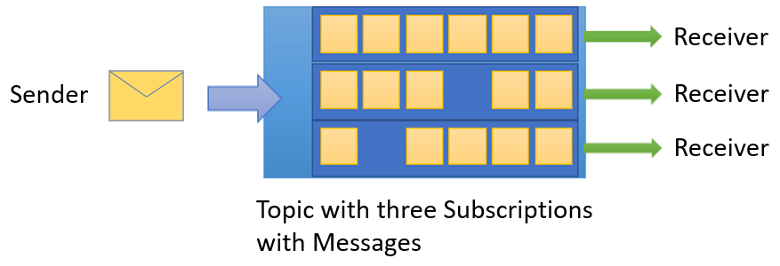

# What is Azure Service Bus?
Azure Service Bus is a fully managed enterprise message broker with message queues and publish-subscribe topics (in a namespace). Service Bus is used to decouple applications and services from each other, providing the following benefits:

- Load-balancing work across competing workers
- Safely routing and transferring data and control across service and application boundaries
- Coordinating transactional work that requires a high-degree of reliability 

## Overview
Data is transferred between different applications and services using **messages**. A message is a container decorated with metadata, and contains data. The data can be any kind of information, including structured data encoded with the common formats such as the following ones: JSON, XML, Apache Avro, Plain Text.

Some common messaging scenarios are:

* **Messaging**. Transfer business data, such as sales or purchase orders, journals, or inventory movements.
* **Decouple applications**. Improve reliability and scalability of applications and services. Producer and consumer don't have to be online or readily available at the same time. The [load is leveled](/azure/architecture/patterns/queue-based-load-leveling) such that traffic spikes don't overtax a service. 
* **Load balancing**. Allow for multiple [competing consumers](/azure/architecture/patterns/competing-consumers) to read from a queue at the same time, each safely obtaining exclusive ownership to specific messages. 
* **Topics and subscriptions**. Enable 1:*n* relationships between [publishers and subscribers](/azure/architecture/patterns/publisher-subscriber), allowing subscribers to select particular messages from a published message stream.
* **Transactions**. Allows you to do several operations, all in the scope of an atomic transaction. For example, the following operations can be done in the scope of a transaction.  

    1. Obtain a message from one queue.
    2. Post results of processing to one or more different queues.
    3. Move the input message from the original queue. 
    
    The results become visible to downstream consumers only upon success, including the successful settlement of input message, allowing for once-only processing semantics. This transaction model is a robust foundation for the [compensating transactions](/azure/architecture/patterns/compensating-transaction) pattern in the greater solution context. 
* **Message sessions**. Implement high-scale coordination of workflows and multiplexed transfers that require strict message ordering or message deferral.

If you're familiar with other message brokers like Apache ActiveMQ, Service Bus concepts are similar to what you know. As Service Bus is a platform-as-a-service (PaaS) offering, a key difference is that you don't need to worry about the following actions. Azure takes care of those chores for you. 

- Worrying about hardware failures 
- Keeping the operating systems or the products patched
- Placing logs and managing disk space
- Handling backups
- Failing over to a reserve machine

## Concepts
This section discusses basic concepts of Service Bus.

### Queues
Messages are sent to and received from **queues**. Queues store messages until the receiving application is available to receive and process them.

Messages in queues are ordered and timestamped on arrival. Once the broker accepts the message, the message is always held durably in triple-redundant storage, spread across availability zones if the namespace is zone-enabled. Service Bus keeps messages in memory or volatile storage until they've been reported by the client as accepted.

Messages are delivered in **pull** mode, only delivering messages when requested. Unlike the busy-polling model of some other cloud queues, the pull operation can be long-lived and only complete once a message is available. 

> [!NOTE]
> For a comparison of Service Bus queues with Storage queues, see [Storage queues and Service Bus queues - compared and contrasted](service-bus-azure-and-service-bus-queues-compared-contrasted.md).

### Topics

You can also use **topics** to send and receive messages. While a queue is often used for point-to-point communication, topics are useful in publish/subscribe scenarios.

Topics can have multiple, independent subscriptions, which attach to the topic and otherwise work exactly like queues from the receiver side. A subscriber to a topic can receive a copy of each message sent to that topic. Subscriptions are named entities. Subscriptions are durable by default, but can be configured to expire and then be automatically deleted. Via the Java Message Service (JMS) API, Service Bus Premium also allows you to create volatile subscriptions that exist for the duration of the connection.

You can define rules on a subscription. A subscription rule has a **filter** to define a condition for the message to be copied into the subscription and an optional **action** that can modify message metadata. For more information, see [Topic filters and actions](topic-filters.md). This feature is useful in the following scenarios:

- You don't want a subscription to receive all messages sent to a topic.
- You want to mark up messages with extra metadata when they pass through a subscription.

> [!NOTE]
> For more information about queues and topics, see [Service Bus queues, topics, and subscriptions](service-bus-queues-topics-subscriptions.md).

### Namespaces
A namespace is a container for all messaging components (queues and topics). Multiple queues and topics can be in a single namespace, and namespaces often serve as application containers. 

A namespace can be compared to a server in the terminology of other brokers, but the concepts aren't directly equivalent. A Service Bus namespace is your own capacity slice of a large cluster made up of dozens of all-active virtual machines. It may optionally span three [Azure availability zones](../availability-zones/az-overview.md). So, you get all the availability and robustness benefits of running the message broker at enormous scale. And, you don't need to worry about underlying complexities. Service Bus is serverless messaging.

## Advanced features

Service Bus also has advanced features that enable you to solve more complex messaging problems. The following sections describe these key features:

### Message sessions

To realize a first-in, first-out (**FIFO**) guarantee in processing messages in Service Bus queue or subscriptions, use sessions. Sessions can also be used in implementing request-response patterns. The **request-response pattern** enables the sender application to send a request and provides a way for the receiver to correctly send a response back to the sender application. For more information, see [Message sessions](message-sessions.md)

### Auto-forwarding

The **Auto-forwarding** feature enables you to chain a queue or subscription to another queue or topic that is part of the same namespace. When auto-forwarding is enabled, Service Bus automatically removes messages that are placed in the first queue or subscription (source) and puts them in the second queue or topic (destination). For more information, see [Chaining Service Bus entities with auto-forwarding](service-bus-auto-forwarding.md)

### Dead-lettering

Service Bus queues and topic subscriptions provide a secondary subqueue, called a dead-letter queue (DLQ). The dead letter queue holds messages that can't be delivered to any receiver, or messages that can't be processed. You can then remove messages from the DLQ and inspect them. An application might, with help of an operator, correct issues and resubmit the message, log the fact that there was an error, and take a corrective action. For more information, see [Overview of Service Bus dead-letter queues](service-bus-dead-letter-queues.md). 

### Scheduled delivery

You can submit messages to a queue or topic for delayed processing. For example, to schedule a job to become available for processing by a system at a certain time. For more information, see [Scheduled messages](message-sequencing.md#scheduled-messages).

### Message deferral

When a queue or subscription client receives a message that it's willing to process, but for which processing isn't currently possible because of special circumstances within the application, the entity can defer retrieval of the message to a later point. The message remains in the queue or subscription, but it's set aside. For more information, see [Message deferral](message-deferral.md).

### Transactions

A transaction groups two or more operations together into an execution scope. Service Bus supports grouping operations against a single messaging entity (queue, topic, subscription) within the scope of a transaction. For more information, see [Overview of Service Bus transaction processing](service-bus-transactions.md).

### Filters and actions

Subscribers can define which messages they want to receive from a topic. These messages are specified in the form of one or more named subscription rules. Each rule consists of a **filter condition** that selects particular messages, and **optionally** contains an **action** that annotates the selected message. For each matching rule condition, the subscription produces a copy of the message, which may be differently annotated for each matching rule. For more information, see [Topic filters and actions](topic-filters.md).

### Auto-delete on idle

[Auto-delete on idle](/dotnet/api/azure.messaging.servicebus.administration.queueproperties.autodeleteonidle) enables you to specify an idle interval after which the queue is automatically deleted. The interval is reset when there's traffic on the queue. The minimum duration is 5 minutes.

### Duplicate detection

If an error occurs that causes the client to have any doubt about the outcome of a send operation, duplicate detection takes the doubt out of these situations by enabling the sender to resend the same message, and the queue or topic discards any duplicate copies. For more information, see [Duplicate detection](duplicate-detection.md).

### Security
Service Bus supports security protocols such as [Shared Access Signatures](service-bus-sas.md) (SAS), [Role Based Access Control (RBAC)](service-bus-role-based-access-control.md) (RBAC) and [Managed identities for Azure resources](service-bus-managed-service-identity.md).

Service Bus supports standard [Advanced Message Queuing Protocol (AMQP) 1.0](service-bus-amqp-overview.md) and [HTTP/REST](/rest/api/servicebus/) protocols.

### Geo-disaster recovery

When Azure regions or datacenters experience downtime, [Geo-disaster recovery](service-bus-geo-dr.md) enables data processing to continue operating in a different region or datacenter.

> [!NOTE]
> For more information about these features, see [Advanced features of Azure Service Bus](advanced-features-overview.md).

## Compliance with standards and protocols

The primary wire protocol for Service Bus is [Advanced Messaging Queueing Protocol (AMQP) 1.0](service-bus-amqp-overview.md), an open ISO/IEC standard. It allows customers to write applications that work against Service Bus and on-premises brokers such as ActiveMQ or RabbitMQ. The [AMQP protocol guide](service-bus-amqp-protocol-guide.md) provides detailed information in case you want to build such an abstraction.

[Service Bus Premium](service-bus-premium-messaging.md) is fully compliant with the Java/Jakarta EE [Java Message Service (JMS) 2.0](how-to-use-java-message-service-20.md) API. And, Service Bus Standard supports the JMS 1.1 subset focused on queues. JMS is a common abstraction for message brokers and integrates with many applications and frameworks, including the popular Spring framework. To switch from other brokers to Azure Service Bus, you just need to recreate the topology of queues and topics, and change the client provider dependencies and configuration. For an example, see the [ActiveMQ migration guide](migrate-jms-activemq-to-servicebus.md).

## Client libraries

Fully supported Service Bus client libraries are available via the Azure SDK.

- [Azure Service Bus for .NET](/dotnet/api/overview/azure/service-bus?preserve-view=true)
- [Azure Service Bus libraries for Java](/java/api/overview/azure/servicebus?preserve-view=true)
- [Azure Service Bus provider for Java JMS 2.0](how-to-use-java-message-service-20.md)
- [Azure Service Bus modules for JavaScript and TypeScript](/javascript/api/overview/azure/service-bus?preserve-view=true)
- [Azure Service Bus libraries for Python](/python/api/overview/azure/servicebus?preserve-view=true)

[Azure Service Bus' primary protocol is AMQP 1.0](service-bus-amqp-overview.md) and it can be used from any AMQP 1.0 compliant protocol client. Several open-source AMQP clients have samples that explicitly demonstrate Service Bus interoperability. Review the [AMQP 1.0 protocol guide](service-bus-amqp-protocol-guide.md) to understand how to use Service Bus features with AMQP 1.0 clients directly.

[!INCLUDE [messaging-oss-amqp-stacks.md](../../includes/messaging-oss-amqp-stacks.md)]

## Integration

Service Bus fully integrates with many Microsoft and Azure services, for instance:

* [Event Grid](service-bus-to-event-grid-integration-example.md)
* [Logic Apps](../connectors/connectors-create-api-servicebus.md)
* [Azure Functions](../azure-functions/functions-bindings-service-bus.md)
* [Power Platform](../connectors/connectors-create-api-servicebus.md)
* [Dynamics 365](/dynamics365/fin-ops-core/dev-itpro/business-events/how-to/how-to-servicebus)
* [Azure Stream Analytics](../stream-analytics/stream-analytics-define-outputs.md)

## Next steps

To get started using Service Bus messaging, see the following articles:

- [Service Bus queues, topics, and subscriptions](service-bus-queues-topics-subscriptions.md)
- Quickstarts: [.NET](service-bus-dotnet-get-started-with-queues.md), [Java](service-bus-java-how-to-use-queues.md), or [JMS](service-bus-java-how-to-use-jms-api-amqp.md).
- [Service Bus pricing](https://azure.microsoft.com/pricing/details/service-bus/). 
- [Premium Messaging](service-bus-premium-messaging.md).
