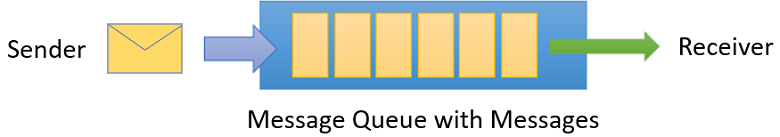
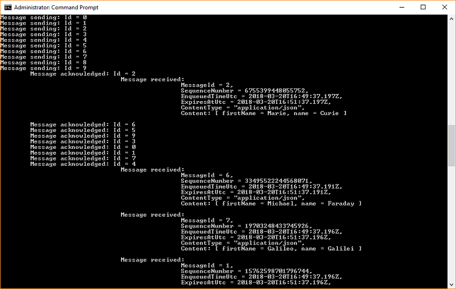

# Send and receive using Azure CLI and Java

Microsoft Azure Service Bus is an enterprise integration message broker that provides secure messaging and reliability. A typical Service Bus scenario usually involves decoupling two or more applications, services or processes from each other, and transferring state or data changes. Such scenarios might involve scheduling multiple batch jobs in another application or services, or triggering order fulfillment. For example, a retail company might send their point of sales data to a back office or regional distribution center for replenishment and inventory updates. In this scenario, the client app sends to and receives messages from a Service Bus queue.  



This quickstart describes how to send and receive messages with Service Bus, using Azure CLI to create a messaging namespace and a queue within that namespace, and obtain the authorization credentials on that namespace. The procedure then shows how to send and receive messages using the Java library.

If you don't have an Azure subscription, you can create a [free account][] before you begin.

## Prerequisites

To develop a Service Bus app with Java, you must have the following installed:

-  [Java Development Kit](http://www.oracle.com/technetwork/java/javase/downloads/jdk8-downloads-2133151.html), latest version.
-  [Azure CLI](https://docs.microsoft.com/cli/azure)
-  [Apache Maven](https://maven.apache.org), version 3.0 or above.

[!INCLUDE [cloud-shell-try-it.md](../../includes/cloud-shell-try-it.md)]

If you choose to install and use the CLI locally, this tutorial requires that you are running the Azure CLI version 2.0.4 or later. Run `az --version` to find the version. If you need to install or upgrade, see [Install Azure CLI 2.0](/cli/azure/install-azure-cli).

## Log in to Azure

1. Open Cloud Shell and from the **Select environment** dropdown, select **Bash**. 

2. From the Bash prompt, issue the following command to set the current subscription context to the Azure subscription you want to use:

   ```azurecli
   az account set --subscription Azure_subscription_name
   ``` 

## Use CLI to provision resources

In Cloud Shell, from the Bash prompt issue the following commands to provision Service Bus resources. Be sure to replace all placeholders with the appropriate values:

```azurecli
# Create a resource group
az group create --name my-resourcegroup --location eastus

# Create a Messaging namespace
az servicebus namespace create --name namespace-name --resource-group my-resourcegroup -l eastus2

# Create a queue
az servicebus queue create --resource-group my-resourcegroup --namespace-name namespace_name --name queue-name

# Get the connection string
az servicebus namespace authorization-rule keys list --resource-group my-resourcegroup --namespace-name namespace-name --name RootManageSharedAccessKey
```

After the last command runs, copy and paste the connection string, and the queue name you selected, to a temporary location such as Notepad. You will need it in the next step.

## Send and receive messages

After the namespace and queue are provisioned, and you have the necessary credentials, you are ready to send and receive messages. You can examine the code in [this GitHub sample folder](https://github.com/Azure/azure-service-bus/tree/master/samples/Java/quickstarts-and-tutorials/quickstart-java/src/main/java/samples/quickstart).

1. Make sure that Cloud Shell is open and displaying the Bash prompt.
2. Clone the [Service Bus GitHub repository](https://github.com/Azure/azure-service-bus/) by issuing the following command:
   ```shell
   git clone https://github.com/Azure/azure-service-bus.git
   ```

2. Navigate to the sample folder `/azure-service-bus/samples/Java/quickstarts-and-tutorials/quickstart-java`. Note that in the Bash shell, the commands are case sensitive and the path separators must be forward slashes.
3. Issue the following command to build the application:
   
   ```shell
   mvn clean package -DskipTests
   ```

4. To run the program, issue the following command. Make sure to replace the placeholders with the connection string and queue name you obtained in the previous step:

   ```shell
   java -jar ./target/samples.quickstart-1.0.0-jar-with-dependencies.jar -c "myConnectionString" -q "queue-name"
   ```

Observe 10 messages being sent to the queue, and subsequently received from the queue:



## Clean up deployment

Run the following command to remove the resource group, namespace, and all related resources:

```azurecli
az group delete --resource-group my-resourcegroup
```

## Understand the sample code

This section contains more details about what the sample code does. 

### Get connection string and queue

First, the code declares two string variables that are passed to the program as arguments on the command line:

```java
String ConnectionString = null;
String QueueName = null;
```

These values are added via parameters and allocated in the `runApp()` method:

```java
public static void main(String[] args) {
    SendAndReceiveMessages app = new SendAndReceiveMessages();
    try {
        app.runApp(args);
        app.run();
    } catch (Exception e) {
        System.out.printf("%s", e.toString());
    }
    System.exit(0);
}

public void runApp(String[] args) {
    try {
        // parse connection string from command line             
        Options options = new Options();
        options.addOption(new Option("c", true, "Connection string"));
        options.addOption(new Option("q", true, "Queue Name"));
        CommandLineParser clp = new DefaultParser();
        CommandLine cl = clp.parse(options, args);
        if (cl.getOptionValue("c") != null && cl.getOptionValue("q") != null) {
            ConnectionString = cl.getOptionValue("c");
            QueueName =  cl.getOptionValue("q");
        }
        else
        {
            HelpFormatter formatter = new HelpFormatter();
            formatter.printHelp("run jar with", "", options, "", true);
        }

    } catch (Exception e) {
        System.out.printf("%s", e.toString());
    }
}
```

### Create queue clients to send and receive

To send and receive messages, the `run()` method creates queue client instances, which are constructed from the connection string and the queue name. This code creates two queue clients, one each for sending and receiving:

```java
public void run() throws Exception {
// Create a QueueClient instance for receiving using the connection string builder
// We set the receive mode to "PeekLock", meaning the message is delivered
// under a lock and must be acknowledged ("completed") to be removed from the queue
QueueClient receiveClient = new QueueClient(new ConnectionStringBuilder(ConnectionString, QueueName), ReceiveMode.PEEKLOCK);
this.registerReceiver(receiveClient);

// Create a QueueClient instance for sending and then asynchronously send messages.
QueueClient sendClient = new QueueClient(new ConnectionStringBuilder(ConnectionString, QueueName), ReceiveMode.PEEKLOCK);
```

The `run()` method also starts the asynchronous message sending operation and closes the sender once the send operation is complete:

```java
this.sendMessagesAsync(sendClient).thenRunAsync(() -> sendClient.closeAsync());
``` 

### Construct and send messages

The `sendMessagesAsync()` method creates a set of 10 messages and asynchronously sends them using the queue client:

```java
CompletableFuture<Void> sendMessagesAsync(QueueClient sendClient) {
List<HashMap<String, String>> data =
        GSON.fromJson(
                "[" +
                        "{'name' = 'Einstein', 'firstName' = 'Albert'}," +
                        "{'name' = 'Heisenberg', 'firstName' = 'Werner'}," +
                        "{'name' = 'Curie', 'firstName' = 'Marie'}," +
                        "{'name' = 'Hawking', 'firstName' = 'Steven'}," +
                        "{'name' = 'Newton', 'firstName' = 'Isaac'}," +
                        "{'name' = 'Bohr', 'firstName' = 'Niels'}," +
                        "{'name' = 'Faraday', 'firstName' = 'Michael'}," +
                        "{'name' = 'Galilei', 'firstName' = 'Galileo'}," +
                        "{'name' = 'Kepler', 'firstName' = 'Johannes'}," +
                        "{'name' = 'Kopernikus', 'firstName' = 'Nikolaus'}" +
                        "]",
                new TypeToken<List<HashMap<String, String>>>() {}.getType());

List<CompletableFuture> tasks = new ArrayList<>();
for (int i = 0; i < data.size(); i++) {
    final String messageId = Integer.toString(i);
    Message message = new Message(GSON.toJson(data.get(i), Map.class).getBytes(UTF_8));
    message.setContentType("application/json");
    message.setLabel("Scientist");
    message.setMessageId(messageId);
    message.setTimeToLive(Duration.ofMinutes(2));
    System.out.printf("\nMessage sending: Id = %s", message.getMessageId());
    tasks.add(
            sendClient.sendAsync(message).thenRunAsync(() -> {
                System.out.printf("\n\tMessage acknowledged: Id = %s", message.getMessageId());
            }));
}
return CompletableFuture.allOf(tasks.toArray(new CompletableFuture<?>[tasks.size()]));
```

### Receive messages

The `registerReceiver()` method registers the `RegisterMessageHandler` callback and also sets some message handler options:

```java
void registerReceiver(QueueClient queueClient) throws Exception {
    // register the RegisterMessageHandler callback
    queueClient.registerMessageHandler(new IMessageHandler() {
                           // callback invoked when the message handler loop has obtained a message
                           public CompletableFuture<Void> onMessageAsync(IMessage message) {
                               // receives message is passed to callback
                               if (message.getLabel() != null &&
                                       message.getContentType() != null &&
                                       message.getLabel().contentEquals("Scientist") &&
                                       message.getContentType().contentEquals("application/json")) {
                                    byte[] body = message.getBody();
                                   Map scientist = GSON.fromJson(new String(body, UTF_8), Map.class);

                                   System.out.printf(
                                           "\n\t\t\t\tMessage received: \n\t\t\t\t\t\tMessageId = %s, \n\t\t\t\t\t\tSequenceNumber = %s, \n\t\t\t\t\t\tEnqueuedTimeUtc = %s," +
                                                   "\n\t\t\t\t\t\tExpiresAtUtc = %s, \n\t\t\t\t\t\tContentType = \"%s\",  \n\t\t\t\t\t\tContent: [ firstName = %s, name = %s ]\n",
                                           message.getMessageId(),
                                           message.getSequenceNumber(),
                                           message.getEnqueuedTimeUtc(),
                                           message.getExpiresAtUtc(),
                                           message.getContentType(),
                                           scientist != null ? scientist.get("firstName") : "",
                                           scientist != null ? scientist.get("name") : "");
                               }
                               return CompletableFuture.completedFuture(null);
                           }

                           // callback invoked when the message handler has an exception to report
                           public void notifyException(Throwable throwable, ExceptionPhase exceptionPhase) {
                               System.out.printf(exceptionPhase + "-" + throwable.getMessage());
                           }
                       },
    // 1 concurrent call, messages are auto-completed, auto-renew duration
    new MessageHandlerOptions(1, true, Duration.ofMinutes(1)));

}
```

## Next steps

In this article, you created a Service Bus namespace and other resources required to send and receive messages from a queue. To learn more about sending and receiving messages, continue with the following articles:

* [Service Bus messaging overview](service-bus-messaging-overview.md)
* [How to use Service Bus topics and subscriptions](service-bus-dotnet-how-to-use-topics-subscriptions.md)

[free account]: https://azure.microsoft.com/free/?ref=microsoft.com&utm_source=microsoft.com&utm_medium=docs&utm_campaign=visualstudio
[fully qualified domain name]: https://wikipedia.org/wiki/Fully_qualified_domain_name
[Install Azure CLI 2.0]: /cli/azure/install-azure-cli
[az group create]: /cli/azure/group#az_group_create