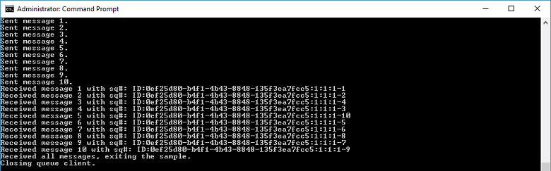

# Send and receive using the Azure portal and .NET

Microsoft Azure Service Bus is an enterprise integration message broker that provides secure messaging and absolute reliability. A typical Service Bus scenario usually involves decoupling two or more applications, services or processes from each other, and transferring state or data changes. Such scenarios might involve scheduling multiple batch jobs in another application or services, or triggering order fulfillment. For example, a retail company might send their point of sales data to a back office or regional distribution center for replenishment and inventory updates. In this scenario, the workflow sends to and receives messages from a Service Bus queue.  


This quickstart describes how to send and receive messages to and from a Service Bus queue, using the [Azure portal][Azure portal] to create a messaging namespace and a queue within that namespace, and to obtain the authorization credentials on that namespace. The procedure then shows how to send and receive messages from this queue using the [.NET Standard library](https://www.nuget.org/packages/Microsoft.Azure.ServiceBus).

If you don't have an Azure subscription, you can create a [free account][] before you begin.

## Prerequisites

To complete this tutorial, make sure you have installed:

1. [Visual Studio 2017 Update 3 (version 15.3, 26730.01)](http://www.visualstudio.com/vs) or later.
2. [NET Core SDK](https://www.microsoft.com/net/download/windows), version 2.0 or later.

## Log on to the Azure portal

First, go to the [Azure portal][Azure portal] and log on using your Azure subscription. The first step is to create a Service Bus namespace of type **Messaging**.

## Create a Service Bus messaging namespace

A Service Bus messaging namespace provides a unique scoping container, referenced by its [fully qualified domain name][], in which you create one or more queues, topics, and subscriptions. The following example creates a Service Bus messaging namespace in a new or existing [resource group](/azure/azure-resource-manager/resource-group-portal):

1. In the left navigation pane of the portal, click **+ Create a resource**, then click **Enterprise Integration**, and then click **Service Bus**.
2. In the **Create namespace** dialog, enter a namespace name. The system immediately checks to see if the name is available.
3. After making sure the namespace name is available, choose the pricing tier (Standard or Premium).
4. In the **Subscription** field, choose an Azure subscription in which to create the namespace.
5. In the **Resource group** field, choose an existing resource group in which the namespace will live, or create a new one.      
6. In **Location**, choose the country or region in which your namespace should be hosted.
7. Click **Create**. The system now creates your namespace and enables it. You might have to wait several minutes as the system provisions resources for your account.


### Obtain the management credentials

Creating a new namespace automatically generates an initial Shared Access Signature (SAS) rule with an associated pair of primary and secondary keys that each grant full control over all aspects of the namespace. To copy the initial rule, follow these steps: 

1.  Click **All resources**, then click the newly created namespace name.
2. In the namespace window, click **Shared access policies**.
3. In the **Shared access policies** screen, click **RootManageSharedAccessKey**.
4. In the **Policy: RootManageSharedAccessKey** window, click the **Copy** button next to **Primary Connection String**, to copy the connection string to your clipboard for later use. Paste this value into Notepad or some other temporary location. 

    ![connection-string][connection-string]
5. Repeat the previous step, copying and pasting the value of **Primary Key** to a temporary location for later use.

## Create a queue

To create a Service Bus queue, specify the namespace under which you want it created. The following example shows how to create a queue on the portal:

1. In the left navigation pane of the portal, click **Service Bus** (if you don't see **Service Bus**, click **More services**).
2. Click the namespace in which you would like to create the queue.
3. In the namespace window, click **Queues**, then in the **Queues** window, click **+ Queue**.
4. Enter the queue **Name** and leave the other values with their defaults.
5. At the bottom of the window, click **Create**.
6. Make a note of the queue name.

## Send and receive messages

After the namespace and queue are provisioned, and you have the necessary credentials, you are ready to send and receive messages. You can examine the code in [this GitHub sample folder](https://github.com/Azure/azure-service-bus/tree/master/samples/Java/quickstarts-and-tutorials/quickstart-jms).

To run the code, do the following:

1. Clone the [Service Bus GitHub repository](https://github.com/Azure/azure-service-bus/).
2. Open a command prompt with Administrator privileges.
3. Navigate to the sample folder `\azure-service-bus\samples\Java\quickstarts-and-tutorials\quickstart-jms`.
4. Obtain the connection string you copied to Notepad in the [Obtain the management credentials](#obtain-the-management-credentials) section of this quickstart. You also need the name of the queue you created in the previous section.
5. Type the following command to build the program:

   ```shell
   mvn clean package -DskipTests
   ```
6.	Type the following command to run the program. Be sure to replace `myConnectionString` with the value you previously obtained, and `myQueueName` with the name of the queue you created:

   ```shell
   java -jar .\target\samples.quickstart-jms-1.0.0-jar-with-dependencies.jar -c "myConnectionString" -q "myQueueName"
   ``` 
8. Observe ten messages being sent to the queue, and subsequently received from the queue:

   

## Clean up resources

When no longer needed, delete the namespace and queue. To do so, select these resources on the portal and click **Delete**. 

## Understand the sample code

This section contains more details about what the sample code does. 

### Get connection string and queue

First, the code declares two string variables that are passed to the program as arguments on the command line:

```java
String ConnectionString = null;
String QueueName = null;
```

These values are added via parameters and allocated in the `runApp()` method:

```java
public static void main(String[] args) {
    QuickStartJMS app = new QuickStartJMS();
    try {
        app.runApp(args);
        app.run();
    } catch (Exception e) {
        System.out.printf("%s", e.toString());
    }
    System.exit(0);
}

public void runApp(String[] args) {
    try {
        // parse connection string from command line             
        Options options = new Options();
        options.addOption(new Option("c", true, "Connection string"));
        options.addOption(new Option("q", true, "Queue Name"));
        CommandLineParser clp = new DefaultParser();
        CommandLine cl = clp.parse(options, args);
        if (cl.getOptionValue("c") != null && cl.getOptionValue("q") != null) {
            ConnectionString = cl.getOptionValue("c");
            QueueName =  cl.getOptionValue("q");
        }
        else
        {
            HelpFormatter formatter = new HelpFormatter();
            formatter.printHelp("run jar with", "", options, "", true);
        }

    } catch (Exception e) {
        System.out.printf("%s", e.toString());
    }
}
```

### Create JMS queue connection

The `run()` method uses the Java Messaging Service queue creation mechanics to create the queue context and send messages to it. It also uses the `ConnectionStringBuilder()` API from the Service Bus library to ensure robust parsing of the connection string:

```java
public void run() throws Exception {
    ConnectionStringBuilder csb = new ConnectionStringBuilder(ConnectionString);
        
    // set up JNDI context
    Hashtable<String, String> hashtable = new Hashtable<>();
    hashtable.put("connectionfactory.SBCF", "amqps://" + csb.getEndpoint().getHost() + "?amqp.idleTimeout=120000&amqp.traceFrames=true");
    hashtable.put("queue.QUEUE", QueueName);
    //hashtable.put("queue.QUEUE", "testqueue");
    hashtable.put(Context.INITIAL_CONTEXT_FACTORY, "org.apache.qpid.jms.jndi.JmsInitialContextFactory");
    Context context = new InitialContext(hashtable);
    ConnectionFactory cf = (ConnectionFactory) context.lookup("SBCF");
        
    // Look up queue
    Destination queue = (Destination) context.lookup("QUEUE");

    // we create a scope here so we can use the same set of local variables cleanly 
    // again to show the receive side separately with minimal clutter
    {
        // Create Connection
        Connection connection = cf.createConnection(csb.getSasKeyName(), csb.getSasKey());
        // Create Session, no transaction, client ack
        Session session = connection.createSession(false, Session.CLIENT_ACKNOWLEDGE);

        // Create producer
        MessageProducer producer = session.createProducer(queue);

        // Send messages
        for (int i = 0; i < totalSend; i++) {
            BytesMessage message = session.createBytesMessage();
            message.writeBytes(String.valueOf(i).getBytes());
            producer.send(message);
            System.out.printf("Sent message %d.\n", i + 1);
        }

        producer.close();
        session.close();
        connection.stop();
        connection.close();
    }

    {
        // Create Connection
        Connection connection = cf.createConnection(csb.getSasKeyName(), csb.getSasKey());
        connection.start();
        // Create Session, no transaction, client ack
        Session session = connection.createSession(false, Session.CLIENT_ACKNOWLEDGE);
        // Create consumer
        MessageConsumer consumer = session.createConsumer(queue);
        // create a listener callback to receive the messages
        consumer.setMessageListener(message -> {
            try {
                // receives message is passed to callback
                System.out.printf("Received message %d with sq#: %s\n",
                        totalReceived.incrementAndGet(), // increments the tracking counter
                        message.getJMSMessageID());
                message.acknowledge();
            } catch (Exception e) {
                logger.error(e);
            }
        });

        // wait on the main thread until all sent messages have been received
        while (totalReceived.get() < totalSend) {
            Thread.sleep(1000);
        }
        consumer.close();
        session.close();
        connection.stop();
        connection.close();
    }

    System.out.printf("Received all messages, exiting the sample.\n");
    System.out.printf("Closing queue client.\n");
}
```

## Next steps

In this article, you created a Service Bus namespace and other resources required to send and receive messages from a queue. To learn more about sending and receiving messages, continue with the following articles:

* [Service Bus messaging overview](service-bus-messaging-overview.md)
* [Get started with Service Bus queues](service-bus-dotnet-get-started-with-queues.md)
* [How to use Service Bus topics and subscriptions](service-bus-dotnet-how-to-use-topics-subscriptions.md)

[free account]: https://azure.microsoft.com/free/?ref=microsoft.com&utm_source=microsoft.com&utm_medium=docs&utm_campaign=visualstudio
[fully qualified domain name]: https://wikipedia.org/wiki/Fully_qualified_domain_name
[Azure portal]: https://portal.azure.com/

[connection-string]: ./media/service-bus-quickstart-portal/connection-string.png
[service-bus-flow]: ./media/service-bus-quickstart-portal/service-bus-flow.png
