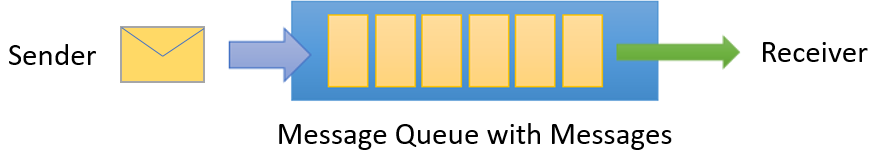
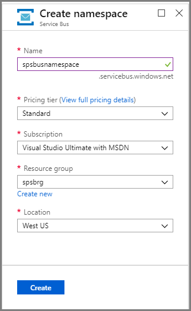
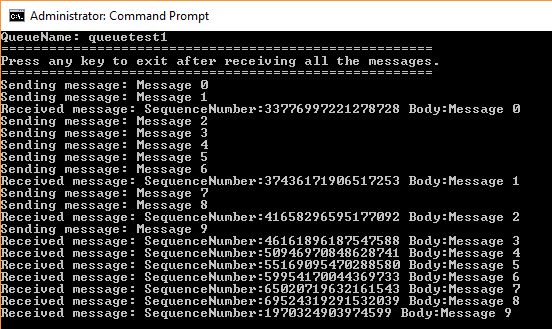

# Quickstart: Send and receive messages using the Azure portal and .NET

Microsoft Azure Service Bus is an enterprise integration message broker that provides secure messaging and absolute reliability. A typical Service Bus scenario usually involves decoupling two or more applications, services or processes from each other, and transferring state or data changes. Such scenarios might involve scheduling multiple batch jobs in another application or services, or triggering order fulfillment. For example, a retail company might send their point of sales data to a back office or regional distribution center for replenishment and inventory updates. In this scenario, the client app sends to and receives messages from a Service Bus queue.  



This quickstart describes how to send and receive messages to and from a Service Bus queue, using the [Azure portal][Azure portal] to create a messaging namespace and a queue within that namespace, and to obtain the authorization credentials on that namespace. The procedure then shows how to send and receive messages from this queue using the [.NET Standard library](https://www.nuget.org/packages/Microsoft.Azure.ServiceBus).

If you don't have an Azure subscription, you can create a [free account][] before you begin.

## Prerequisites

To complete this tutorial, make sure you have installed:

- [Visual Studio 2017 Update 3 (version 15.3, 26730.01)](http://www.visualstudio.com/vs) or later.
- [NET Core SDK](https://www.microsoft.com/net/download/windows), version 2.0 or later.

## Log on to the Azure portal

First, go to the [Azure portal][Azure portal] and log on using your Azure subscription. The first step is to create a Service Bus namespace of type **Messaging**.

## Create a Service Bus namespace

A Service Bus messaging namespace provides a unique scoping container, referenced by its [fully qualified domain name][], in which you create one or more queues, topics, and subscriptions. The following example creates a Service Bus messaging namespace in a new or existing [resource group](/azure/azure-resource-manager/resource-group-portal):

1. In the left navigation pane of the portal, click **+ Create a resource**, then click **Enterprise Integration**, and then click **Service Bus**.
2. In the **Create namespace** dialog, enter a namespace name. The system immediately checks to see if the name is available.
3. After making sure the namespace name is available, choose the pricing tier (Standard or Premium).
4. In the **Subscription** field, choose an Azure subscription in which to create the namespace.
5. In the **Resource group** field, choose an existing resource group in which the namespace will live, or create a new one.      
6. In **Location**, choose the country or region in which your namespace should be hosted.
7. Click **Create**. The system now creates your namespace and enables it. You might have to wait several minutes as the system provisions resources for your account.



### Obtain the management credentials

Creating a new namespace automatically generates an initial Shared Access Signature (SAS) rule with an associated pair of primary and secondary keys that each grant full control over all aspects of the namespace. To copy the initial rule, follow these steps: 

1.  Click **All resources**, then click the newly created namespace name.
2. In the namespace window, click **Shared access policies**.
3. In the **Shared access policies** screen, click **RootManageSharedAccessKey**.
4. In the **Policy: RootManageSharedAccessKey** window, click the **Copy** button next to **Primary Connection String**, to copy the connection string to your clipboard for later use. Paste this value into Notepad or some other temporary location. 

    ![connection-string][connection-string]
5. Repeat the previous step, copying and pasting the value of **Primary Key** to a temporary location for later use.

## Create a queue

To create a Service Bus queue, specify the namespace under which you want it created. The following example shows how to create a queue on the portal:

1. In the left navigation pane of the portal, click **Service Bus** (if you don't see **Service Bus**, click **More services**).
2. Click the namespace in which you would like to create the queue.
3. In the namespace window, click **Queues**, then in the **Queues** window, click **+ Queue**.
4. Enter the queue **Name** and leave the other values with their defaults.
5. At the bottom of the window, click **Create**.
6. Make a note of the queue name.

## Send and receive messages

After the namespace and queue are provisioned, and you have the necessary credentials, you are ready to send and receive messages. You can examine the code in [this GitHub sample folder](https://github.com/Azure/azure-service-bus/tree/master/samples/Java/quickstarts-and-tutorials/quickstart-jms).

To run the code, do the following:

1. Clone the [Service Bus GitHub repository](https://github.com/Azure/azure-service-bus/) by issuing the following command:

   ```shell
   git clone https://github.com/Azure/azure-service-bus.git
   ```

3. Navigate to the sample folder `azure-service-bus\samples\DotNet\GettingStarted\BasicSendReceiveQuickStart\BasicSendReceiveQuickStart`.

4. Copy the connection string and queue name you obtained in the [Obtain the management credentials](#obtain-the-management-credentials) section.

5.	At a command prompt, type the following command:

   ```shell
   dotnet build
   ```

6.	Navigate to the `bin\Debug\netcoreapp2.0` folder.

7.	Type the following command to run the program. Be sure to replace `myConnectionString` with the value you previously obtained, and `myQueueName` with the name of the queue you created:

   ```shell
   dotnet BasicSendReceiveQuickStart.dll -ConnectionString "myConnectionString" -QueueName "myQueueName"
   ``` 

8. Observe 10 messages being sent to the queue, and subsequently received from the queue:

   

## Clean up resources

You can use the portal to remove the resource group, namespace, and queue.

## Understand the sample code

This section contains more details about what the sample code does. 

### Get connection string and queue

The connection string and queue name are passed to the `Main()` method as command line arguments. `Main()` declares two string variables to hold these values:

```csharp
static void Main(string[] args)
{
    string ServiceBusConnectionString = "";
    string QueueName = "";

    for (int i = 0; i < args.Length; i++)
    {
        var p = new Program();
        if (args[i] == "-ConnectionString")
        {
            Console.WriteLine($"ConnectionString: {args[i+1]}");
            ServiceBusConnectionString = args[i + 1]; 
        }
        else if(args[i] == "-QueueName")
        {
            Console.WriteLine($"QueueName: {args[i+1]}");
            QueueName = args[i + 1];
        }                
    }

    if (ServiceBusConnectionString != "" && QueueName != "")
        MainAsync(ServiceBusConnectionString, QueueName).GetAwaiter().GetResult();
    else
    {
        Console.WriteLine("Specify -Connectionstring and -QueueName to execute the example.");
        Console.ReadKey();
    }                            
}
```
 
The `Main()` method then starts the asynchronous message loop, `MainAsync()`.

### Message loop

The MainAsync() method creates a queue client with the command line arguments, calls a receiving message handler named `RegisterOnMessageHandlerAndReceiveMessages()`, and sends the set of messages:

```csharp
static async Task MainAsync(string ServiceBusConnectionString, string QueueName)
{
    const int numberOfMessages = 10;
    queueClient = new QueueClient(ServiceBusConnectionString, QueueName);

    Console.WriteLine("======================================================");
    Console.WriteLine("Press any key to exit after receiving all the messages.");
    Console.WriteLine("======================================================");

    // Register QueueClient's MessageHandler and receive messages in a loop
    RegisterOnMessageHandlerAndReceiveMessages();

    // Send Messages
    await SendMessagesAsync(numberOfMessages);

    Console.ReadKey();

    await queueClient.CloseAsync();
}
```

The `RegisterOnMessageHandlerAndReceiveMessages()` method simply sets a few message handler options, then calls the queue client's `RegisterMessageHandler()` method, which starts the receiving:

```csharp
static void RegisterOnMessageHandlerAndReceiveMessages()
{
    // Configure the MessageHandler Options in terms of exception handling, number of concurrent messages to deliver etc.
    var messageHandlerOptions = new MessageHandlerOptions(ExceptionReceivedHandler)
    {
        // Maximum number of Concurrent calls to the callback `ProcessMessagesAsync`, set to 1 for simplicity.
        // Set it according to how many messages the application wants to process in parallel.
        MaxConcurrentCalls = 1,

        // Indicates whether MessagePump should automatically complete the messages after returning from User Callback.
        // False below indicates the Complete will be handled by the User Callback as in `ProcessMessagesAsync` below.
        AutoComplete = false
    };

    // Register the function that will process messages
    queueClient.RegisterMessageHandler(ProcessMessagesAsync, messageHandlerOptions);
} 
```

### Send messages

The message creation and send operations occur in the `SendMessagesAsync()` method:

```csharp
static async Task SendMessagesAsync(int numberOfMessagesToSend)
{
    try
    {
        for (var i = 0; i < numberOfMessagesToSend; i++)
        {
            // Create a new message to send to the queue
            string messageBody = $"Message {i}";
            var message = new Message(Encoding.UTF8.GetBytes(messageBody));

            // Write the body of the message to the console
            Console.WriteLine($"Sending message: {messageBody}");

            // Send the message to the queue
            await queueClient.SendAsync(message);
        }
    }
    catch (Exception exception)
    {
        Console.WriteLine($"{DateTime.Now} :: Exception: {exception.Message}");
    }
}
```

### Process messages

The `ProcessMessagesAsync()` method acknowledges, processes, and completes the receipt of the messages:

```csharp
static async Task ProcessMessagesAsync(Message message, CancellationToken token)
{
    // Process the message
    Console.WriteLine($"Received message: SequenceNumber:{message.SystemProperties.SequenceNumber} Body:{Encoding.UTF8.GetString(message.Body)}");

    // Complete the message so that it is not received again.
    await queueClient.CompleteAsync(message.SystemProperties.LockToken);
}
```

## Next steps

In this article, you created a Service Bus namespace and other resources required to send and receive messages from a queue. To learn more about writing code to send and receive messages, continue to the following tutorial for Service Bus:

> [!div class="nextstepaction"]
> [Update inventory using Azure portal](./service-bus-tutorial-topics-subscriptions-portal.md)


[free account]: https://azure.microsoft.com/free/?ref=microsoft.com&utm_source=microsoft.com&utm_medium=docs&utm_campaign=visualstudio
[fully qualified domain name]: https://wikipedia.org/wiki/Fully_qualified_domain_name
[Azure portal]: https://portal.azure.com/

[connection-string]: ./media/service-bus-quickstart-portal/connection-string.png
[service-bus-flow]: ./media/service-bus-quickstart-portal/service-bus-flow.png
