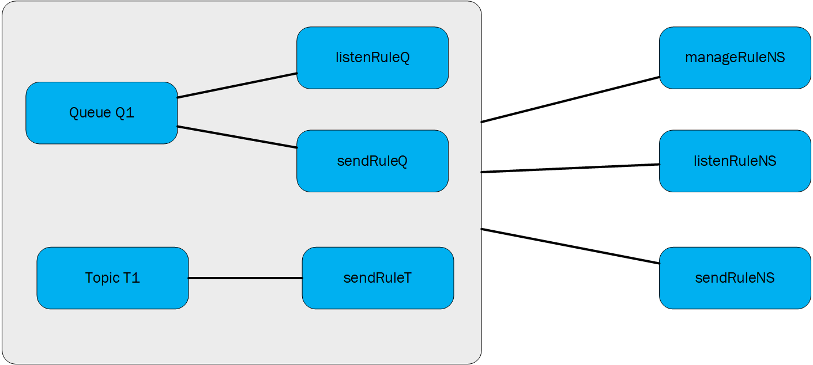

# Service Bus access control with Shared Access Signatures

This article discusses *Shared Access Signatures* (SAS), how they work, and how to use them in a platform-agnostic way.

SAS guards access to Service Bus based on authorization rules that are configured either on a namespace, or a messaging entity (queue, or topic). An authorization rule has a name, is associated with specific rights, and carries a pair of cryptographic keys. You use the rule's name and key via the Service Bus SDK or in your own code to generate a SAS token. A client can then pass the token to Service Bus to prove authorization for the requested operation.

> [!NOTE]
> Azure Service Bus supports authorizing access to a Service Bus namespace and its entities using Microsoft Entra ID. Authorizing users or applications using OAuth 2.0 token returned by Microsoft Entra ID provides superior security and ease of use over shared access signatures (SAS). With Microsoft Entra ID, there is no need to store the tokens in your code and risk potential security vulnerabilities.
>
> Microsoft recommends using Microsoft Entra ID with your Azure Service Bus applications when possible. For more information, see the following articles:
> - [Authenticate and authorize an application with Microsoft Entra ID to access Azure Service Bus entities](authenticate-application.md).
> - [Authenticate a managed identity with Microsoft Entra ID to access Azure Service Bus resources](service-bus-managed-service-identity.md)
> 
> You can disable local or SAS key authentication for a Service Bus namespace and allow only Microsoft Entra authentication. For step-by-step instructions, see [Disable local authentication](disable-local-authentication.md).

## Overview of SAS

Shared Access Signatures are a claims-based authorization mechanism using simple tokens. Using SAS, keys are never passed on the wire. Keys are used to cryptographically sign information that can later be verified by the service. SAS can be used similar to a username and password scheme where the client is in immediate possession of an authorization rule name and a matching key. SAS can also be used similar to a federated security model, where the client receives a time-limited and signed access token from a security token service without ever coming into possession of the signing key.

SAS authentication in Service Bus is configured with named [Shared Access Authorization Policies](#shared-access-authorization-policies) having associated access rights, and a pair of primary and secondary cryptographic keys. The keys are 256-bit values in Base64 representation. You can configure rules at the namespace level, on Service Bus [queues](service-bus-messaging-overview.md#queues) and [topics](service-bus-messaging-overview.md#topics).

> [!NOTE]
> These keys are plain text strings using a Base64 representation, and must not be decoded before they are used.

The Shared Access Signature token contains the name of the chosen authorization policy, the URI of the resource that shall be accessed, an expiry instant, and an HMAC-SHA256 cryptographic signature computed over these fields using either the primary or the secondary cryptographic key of the chosen authorization rule.

## Shared Access Authorization Policies

Each Service Bus namespace and each Service Bus entity has a Shared Access Authorization policy made up of rules. The policy at the namespace level applies to all entities inside the namespace, irrespective of their individual policy configuration.

For each authorization policy rule, you decide on three pieces of information: **name**, **scope**, and **rights**. The **name** is just that; a unique name within that scope. The scope is easy enough: it's the URI of the resource in question. For a Service Bus namespace, the scope is the fully qualified namespace, such as `https://<yournamespace>.servicebus.windows.net/`.

The rights conferred by the policy rule can be a combination of:

* 'Send' - Confers the right to send messages to the entity
* 'Listen' - Confers the right to receive (queue, subscriptions) and all related message handling
* 'Manage' - Confers the right to manage the topology of the namespace, including creating and deleting entities

The 'Manage' right includes the 'Send' and 'Receive' rights.

A namespace or entity policy can hold up to 12 Shared Access Authorization rules, providing room for three sets of rules, each covering the basic rights and the combination of Send and Listen. This limit is per entity, meaning the namespace and each entity can have up to 12 Shared Access Authorization rules. This limit underlines that the SAS policy store isn't intended to be a user or service account store. If your application needs to grant access to Service Bus based on user or service identities, it should implement a security token service that issues SAS tokens after an authentication and access check.

An authorization rule is assigned a *Primary Key* and a *Secondary Key*. These keys are cryptographically strong keys. Don't lose them or leak them - they'll always be available in the [Azure portal]. You can use either of the generated keys, and you can regenerate them at any time. If you regenerate or change a key in the policy, all previously issued tokens based on that key become instantly invalid. However, ongoing connections created based on such tokens will continue to work until the token expires.

When you create a Service Bus namespace, a policy rule named **RootManageSharedAccessKey** is automatically created for the namespace. This policy has Manage permissions for the entire namespace. It's recommended that you treat this rule like an administrative **root** account and don't use it in your application. You can create more policy rules in the **Configure** tab for the namespace in the portal, via PowerShell or Azure CLI. 

It is recommended that you periodically regenerate the keys used in the [SharedAccessAuthorizationRule](/dotnet/api/azure.messaging.servicebus.administration.sharedaccessauthorizationrule) object. The primary and secondary key slots exist so that you can rotate keys gradually. If your application generally uses the primary key, you can copy the primary key into the secondary key slot, and only then regenerate the primary key. The new primary key value can then be configured into the client applications, which have continued access using the old primary key in the secondary slot. Once all clients are updated, you can regenerate the secondary key to finally retire the old primary key.

If you know or suspect that a key is compromised and you have to revoke the keys, you can regenerate both the [PrimaryKey](/dotnet/api/azure.messaging.servicebus.administration.sharedaccessauthorizationrule.primarykey) and the [SecondaryKey](/dotnet/api/azure.messaging.servicebus.administration.sharedaccessauthorizationrule.secondarykey) of a [SharedAccessAuthorizationRule](/dotnet/api/azure.messaging.servicebus.administration.sharedaccessauthorizationrule), replacing them with new keys. This procedure invalidates all tokens signed with the old keys.

## Best practices when using SAS
When you use shared access signatures in your applications, you need to be aware of two potential risks:

- If a SAS is leaked, it can be used by anyone who obtains it, which can potentially compromise your Service Bus resources.
- If a SAS provided to a client application expires and the application is unable to retrieve a new SAS from your service, then application’s functionality may be hindered.

The following recommendations for using shared access signatures can help mitigate these risks:

- **Have clients automatically renew the SAS if necessary**: Clients should renew the SAS well before expiration, to allow time for retries if the service providing the SAS is unavailable. If your SAS is meant to be used for a few immediate, short-lived operations that are expected to be completed within the expiration period, then it may be unnecessary as the SAS isn't expected to be renewed. However, if you have client that is routinely making requests via SAS, then the possibility of expiration comes into play. The key consideration is to balance the need for the SAS to be short-lived (as previously stated) with the need to ensure that client is requesting renewal early enough (to avoid disruption due to the SAS expiring prior to a successful renewal).
- **Be careful with the SAS start time**: If you set the start time for SAS to **now**, then due to clock skew (differences in current time according to different machines), failures may be observed intermittently for the first few minutes. In general, set the start time to be at least 15 minutes in the past. Or, don’t set it at all, which will make it valid immediately in all cases. The same generally applies to the expiry time as well. Remember that you may observe up to 15 minutes of clock skew in either direction on any request. 
- **Be specific with the resource to be accessed**: A security best practice is to provide user with the minimum required privileges. If a user only needs read access to a single entity, then grant them read access to that single entity, and not read/write/delete access to all entities. It also helps lessen the damage if a SAS is compromised because the SAS has less power in the hands of an attacker.
- **Don’t always use SAS**: Sometimes the risks associated with a particular operation against your Service Bus outweigh the benefits of SAS. For such operations, create a middle-tier service that writes to your Service Bus after business rule validation, authentication, and auditing.
- **Always use HTTPs**: Always use Https to create or distribute a SAS. If a SAS is passed over HTTP and intercepted, an attacker performing a man-in-the-middle attach is able to read the SAS and then use it just as the intended user could have, potentially compromising sensitive data or allowing for data corruption by the malicious user.

## Configuration for Shared Access Signature authentication

You can configure the Shared Access Authorization Policy on Service Bus namespaces, queues, or topics. Configuring it on a Service Bus subscription is currently not supported, but you can use rules configured on a namespace or topic to secure access to subscriptions. 



In this figure, the *manageRuleNS*, *sendRuleNS*, and *listenRuleNS* authorization rules apply to both queue Q1 and topic T1, while *listenRuleQ* and *sendRuleQ* apply only to queue Q1 and *sendRuleT* applies only to topic T1.

## Generate a Shared Access Signature token

Any client that has access to name of an authorization rule name and one of its signing keys can generate a SAS token. The token is generated by crafting a string in the following format:

```
SharedAccessSignature sig=<signature-string>&se=<expiry>&skn=<keyName>&sr=<URL-encoded-resourceURI>
```

- `se` - Token expiry instant. Integer reflecting seconds since the epoch `00:00:00 UTC` on 1 January 1970 (UNIX epoch) when the token expires.
- `skn` - Name of the authorization rule.
- `sr` - URL-encoded URI of the resource being accessed.
- `sig` - URL-encoded HMACSHA256 signature. The hash computation looks similar to the following pseudo code and returns base64 of raw binary output.

    ```
    urlencode(base64(hmacsha256(urlencode('https://<yournamespace>.servicebus.windows.net/') + "\n" + '<expiry instant>', '<signing key>')))
    ```

> [!IMPORTANT]
> For examples of generating a SAS token using different programming languages, see [Generate SAS token](/rest/api/eventhub/generate-sas-token). 


The token contains the non-hashed values so that the recipient can recompute the hash with the same parameters, verifying that the issuer is in possession of a valid signing key.

The resource URI is the full URI of the Service Bus resource to which access is claimed. For example, `http://<namespace>.servicebus.windows.net/<entityPath>` or `sb://<namespace>.servicebus.windows.net/<entityPath>`; that is, `http://contoso.servicebus.windows.net/contosoTopics/T1/Subscriptions/S3`. 

**The URI must be [percent-encoded](/dotnet/api/system.web.httputility.urlencode).**

The shared access authorization rule used for signing must be configured on the entity specified by this URI, or by one of its hierarchical parents. For example, `http://contoso.servicebus.windows.net/contosoTopics/T1` or `http://contoso.servicebus.windows.net` in the previous example.

A SAS token is valid for all resources prefixed with the `<resourceURI>` used in the `signature-string`.


## Regenerating keys

It's recommended that you periodically regenerate the keys used in the Shared Access Authorization Policy. The primary and secondary key slots exist so that you can rotate keys gradually. If your application generally uses the primary key, you can copy the primary key into the secondary key slot, and only then regenerate the primary key. The new primary key value can then be configured into the client applications, which have continued access using the old primary key in the secondary slot. Once all clients are updated, you can regenerate the secondary key to finally retire the old primary key.

If you know or suspect that a key is compromised and you have to revoke the keys, you can regenerate both the primary key and the secondary key of a Shared Access Authorization Policy, replacing them with new keys. This procedure invalidates all tokens signed with the old keys.

To regenerate primary and secondary keys in the **Azure portal**, follow these steps:

1. Navigate to the Service Bus namespace in the [Azure portal](https://portal.azure.com).
2. Select **Shared Access Policies** on the left menu.
3. Select the policy from the list. In the following example, **RootManageSharedAccessKey** is selected. 
4. On the **SAS Policy: RootManageSharedAccessKey** page, select **...** from the command bar, and then select **Regenerate Primary Keys** or **Regenerate Secondary Keys**. 

    :::image type="content" source="./media/service-bus-sas/regenerate-keys.png" alt-text="Screenshot of SAS Policy page with Regenerate options selected.":::

If you are using **Azure PowerShell**, use the [`New-AzServiceBusKey`](/powershell/module/az.servicebus/new-azservicebuskey) cmdlet to regenerate primary and secondary keys for a Service Bus namespace. You can also specify values for primary and secondary keys that are being generated, by using the `-KeyValue` parameter. 

If you are using **Azure CLI**, use the [`az servicebus namespace authorization-rule keys renew`](/cli/azure/servicebus/namespace/authorization-rule/keys#az-servicebus-namespace-authorization-rule-keys-renew) command to regenerate primary and secondary keys for a Service Bus namespace. You can also specify values for primary and secondary keys that are being generated, by using the `--key-value` parameter. 
    
## Shared Access Signature authentication with Service Bus

The scenario described as follows include configuration of authorization rules, generation of SAS tokens, and client authorization.

For a sample of a Service Bus application that illustrates the configuration and uses SAS authorization, see [Shared Access Signature authentication with Service Bus](https://github.com/Azure/azure-sdk-for-net/blob/main/sdk/servicebus/Azure.Messaging.ServiceBus/samples/Sample07_CrudOperations.md).

## Access Shared Access Authorization rules on an entity

Use the get/update operation on queues or topics in of the [management libraries for Service Bus](service-bus-management-libraries.md) to access/update the corresponding Shared Access Authorization Rules. You can also add the rules when creating the queues or topics using these libraries.

## Use Shared Access Signature authorization

Applications using any of the Service Bus SDK in any of the officially supported languages like .NET, Java, JavaScript and Python can make use of SAS authorization through the connection strings passed to the client constructor.

Connection strings can include a rule name (*SharedAccessKeyName*) and rule key (*SharedAccessKey*) or a previously issued token (*SharedAccessSignature*). When those are present in the connection string passed to any constructor or factory method accepting a connection string, the SAS token provider is automatically created and populated.

To use SAS authorization with Service Bus subscriptions, you can use SAS keys configured on a Service Bus namespace or on a topic.

## Use the Shared Access Signature (at HTTP level)

Now that you know how to create Shared Access Signatures for any entities in Service Bus, you're ready to perform an HTTP POST:

```http
POST https://<yournamespace>.servicebus.windows.net/<yourentity>/messages
Content-Type: application/json
Authorization: SharedAccessSignature sr=https%3A%2F%2F<yournamespace>.servicebus.windows.net%2F<yourentity>&sig=<yoursignature from code above>&se=1438205742&skn=KeyName
ContentType: application/atom+xml;type=entry;charset=utf-8
```

Remember, this works for everything. You can create SAS for a queue, topic, or subscription.

If you give a sender or client a SAS token, they don't have the key directly, and they can't reverse the hash to obtain it. As such, you have control over what they can access, and for how long. An important thing to remember is that if you change the primary key in the policy, any Shared Access Signatures created from it are invalidated.

## Use the Shared Access Signature (at AMQP level)

In the previous section, you saw how to use the SAS token with an HTTP POST request for sending data to the Service Bus. As you know, you can access Service Bus using the Advanced Message Queuing Protocol (AMQP) that is the preferred protocol to use for performance reasons, in many scenarios. The SAS token usage with AMQP is described in the document [AMQP Claim-Based Security Version 1.0](https://www.oasis-open.org/committees/download.php/50506/amqp-cbs-v1%200-wd02%202013-08-12.doc) that is in working draft since 2013 but it's supported by Azure today.

Before starting to send data to Service Bus, the publisher must send the SAS token inside an AMQP message to a well-defined AMQP node named **$cbs** (you can see it as a "special" queue used by the service to acquire and validate all the SAS tokens). The publisher must specify the **ReplyTo** field inside the AMQP message; it's the node in which the service replies to the publisher with the result of the token validation (a simple request/reply pattern between publisher and service). This reply node is created "on the fly," speaking about "dynamic creation of remote node" as described by the AMQP 1.0 specification. After checking that the SAS token is valid, the publisher can go forward and start to send data to the service.

The following steps show how to send the SAS token with AMQP protocol using the [AMQP.NET Lite](https://github.com/Azure/amqpnetlite) library. It's useful if you can't use the official Service Bus SDK (for example, on WinRT, .NET Compact Framework, .NET Micro Framework and Mono) developing in C#. This library is useful to help understand how claims-based security works at the AMQP level, as you saw how it works at the HTTP level (with an HTTP POST request and the SAS token sent inside the "Authorization" header). If you don't need such deep knowledge about AMQP, you can use the official Service Bus SDK in any of the supported languages like .NET, Java, JavaScript, Python and Go, which will do it for you.

### C&#35;

```csharp
/// <summary>
/// Send claim-based security (CBS) token
/// </summary>
/// <param name="shareAccessSignature">Shared access signature (token) to send</param>
private bool PutCbsToken(Connection connection, string sasToken)
{
    bool result = true;
    Session session = new Session(connection);

    string cbsClientAddress = "cbs-client-reply-to";
    var cbsSender = new SenderLink(session, "cbs-sender", "$cbs");
    var cbsReceiver = new ReceiverLink(session, cbsClientAddress, "$cbs");

    // construct the put-token message
    var request = new Message(sasToken);
    request.Properties = new Properties();
    request.Properties.MessageId = Guid.NewGuid().ToString();
    request.Properties.ReplyTo = cbsClientAddress;
    request.ApplicationProperties = new ApplicationProperties();
    request.ApplicationProperties["operation"] = "put-token";
    request.ApplicationProperties["type"] = "servicebus.windows.net:sastoken";
    request.ApplicationProperties["name"] = Fx.Format("amqp://{0}/{1}", sbNamespace, entity);
    cbsSender.Send(request);

    // receive the response
    var response = cbsReceiver.Receive();
    if (response == null || response.Properties == null || response.ApplicationProperties == null)
    {
        result = false;
    }
    else
    {
        int statusCode = (int)response.ApplicationProperties["status-code"];
        if (statusCode != (int)HttpStatusCode.Accepted && statusCode != (int)HttpStatusCode.OK)
        {
            result = false;
        }
    }

    // the sender/receiver may be kept open for refreshing tokens
    cbsSender.Close();
    cbsReceiver.Close();
    session.Close();

    return result;
}
```

The `PutCbsToken()` method receives the *connection* (AMQP connection class instance as provided by the [AMQP .NET Lite library](https://github.com/Azure/amqpnetlite)) that represents the TCP connection to the service and the *sasToken* parameter that is the SAS token to send.

> [!NOTE]
> It's important that the connection is created with **SASL authentication mechanism set to ANONYMOUS** (and not the default PLAIN with username and password used when you don't need to send the SAS token).
>
>

Next, the publisher creates two AMQP links for sending the SAS token and receiving the reply (the token validation result) from the service.

The AMQP message contains a set of properties, and more information than a simple message. The SAS token is the body of the message (using its constructor). The **"ReplyTo"** property is set to the node name for receiving the validation result on the receiver link (you can change its name if you want, and it will be created dynamically by the service). The last three application/custom properties are used by the service to indicate what kind of operation it has to execute. As described by the CBS draft specification, they must be the **operation name** ("put-token"), the **type of token** (in this case, a `servicebus.windows.net:sastoken`), and the **"name" of the audience** to which the token applies (the entire entity).

After publisher sends the SAS token on the sender link, the publisher must read the reply on the receiver link. The reply is a simple AMQP message with an application property named **"status-code"** that can contain the same values as an HTTP status code.

## Rights required for Service Bus operations

The following table shows the access rights required for various operations on Service Bus resources.

| Operation | Claim Required | Claim Scope |
| --- | --- | --- |
| **Namespace** | | |
| Configure authorization rule on a namespace |Manage |Any namespace address |
| **Service Registry** | | |
| Enumerate Private Policies |Manage |Any namespace address |
| Begin listening on a namespace |Listen |Any namespace address |
| Send messages to a listener at a namespace |Send |Any namespace address |
| **Queue** | | |
| Create a queue |Manage |Any namespace address |
| Delete a queue |Manage |Any valid queue address |
| Enumerate queues |Manage |/$Resources/Queues |
| Get the queue description |Manage |Any valid queue address |
| Configure authorization rule for a queue |Manage |Any valid queue address |
| Send into to the queue |Send |Any valid queue address |
| Receive messages from a queue |Listen |Any valid queue address |
| Abandon or complete messages after receiving the message in peek-lock mode |Listen |Any valid queue address |
| Defer a message for later retrieval |Listen |Any valid queue address |
| Deadletter a message |Listen |Any valid queue address |
| Get the state associated with a message queue session |Listen |Any valid queue address |
| Set the state associated with a message queue session |Listen |Any valid queue address |
| Schedule a message for later delivery |Listen | Any valid queue address
| **Topic** | | |
| Create a topic |Manage |Any namespace address |
| Delete a topic |Manage |Any valid topic address |
| Enumerate topics |Manage |/$Resources/Topics |
| Get the topic description |Manage |Any valid topic address |
| Configure authorization rule for a topic |Manage |Any valid topic address |
| Send to the topic |Send |Any valid topic address |
| **Subscription** | | |
| Create a subscription |Manage |Any namespace address |
| Delete subscription |Manage |../myTopic/Subscriptions/mySubscription |
| Enumerate subscriptions |Manage |../myTopic/Subscriptions |
| Get subscription description |Manage |../myTopic/Subscriptions/mySubscription |
| Abandon or complete messages after receiving the message in peek-lock mode |Listen |../myTopic/Subscriptions/mySubscription |
| Defer a message for later retrieval |Listen |../myTopic/Subscriptions/mySubscription |
| Deadletter a message |Listen |../myTopic/Subscriptions/mySubscription |
| Get the state associated with a topic session |Listen |../myTopic/Subscriptions/mySubscription |
| Set the state associated with a topic session |Listen |../myTopic/Subscriptions/mySubscription |
| **Rules** | | |
| Create a rule | Listen |../myTopic/Subscriptions/mySubscription |
| Delete a rule | Listen |../myTopic/Subscriptions/mySubscription |
| Enumerate rules | Manage or Listen |../myTopic/Subscriptions/mySubscription/Rules

## Next steps

To learn more about Service Bus messaging, see the following topics.

* [Service Bus queues, topics, and subscriptions](service-bus-queues-topics-subscriptions.md)
* [How to use Service Bus queues](service-bus-dotnet-get-started-with-queues.md)
* [How to use Service Bus topics and subscriptions](service-bus-dotnet-how-to-use-topics-subscriptions.md)

[Azure portal]: https://portal.azure.com
