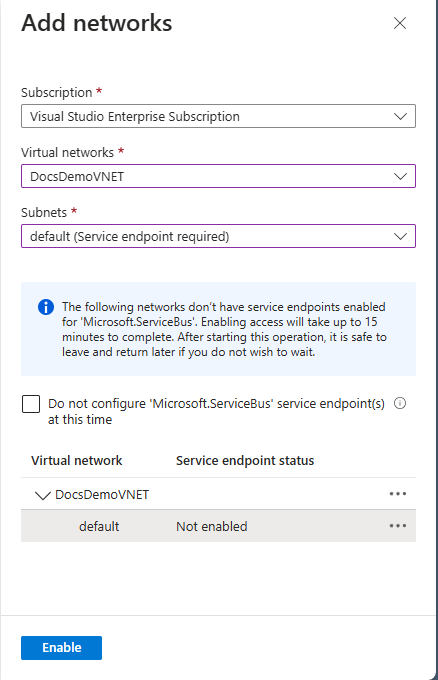
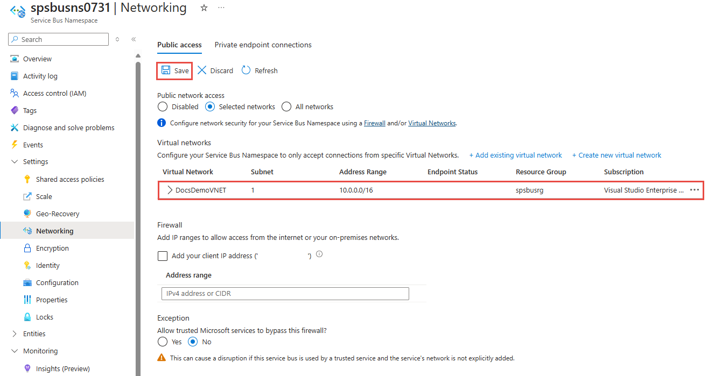

# Configure virtual network service endpoints for Azure Service Bus

The integration of Service Bus with [Virtual Network (VNet) service endpoints][vnet-sep] enables secure access to messaging capabilities from workloads like virtual machines that are bound to virtual networks, with the network traffic path being secured on both ends.

Once configured to be bound to at least one virtual network subnet service endpoint, the respective Service Bus namespace will no longer accept traffic from anywhere but authorized virtual network(s). From the virtual network perspective, binding a Service Bus namespace to a service endpoint configures an isolated networking tunnel from the virtual network subnet to the messaging service.

The result is a private and isolated relationship between the workloads bound to the subnet and the respective Service Bus namespace, in spite of the observable network address of the messaging service endpoint being in a public IP range.

>[!WARNING]
> Implementing Virtual Networks integration can prevent other Azure services from interacting with Service Bus.
>
> Trusted Microsoft services are not supported when Virtual Networks are implemented.
>
> Common Azure scenarios that don't work with Virtual Networks (note that the list is **NOT** exhaustive) -
> - Integration with Azure Event Grid
> - Azure IoT Hub Routes
> - Azure IoT Device Explorer
>
> The below Microsoft services are required to be on a virtual network
> - Azure App Service
> - Azure Functions

> [!IMPORTANT]
> Virtual Networks are supported only in [Premium tier](service-bus-premium-messaging.md) Service Bus namespaces.
> 
> When using VNet service endpoints with Service Bus, you should not enable these endpoints in applications that mix Standard and Premium tier Service Bus namespaces. Because Standard tier does not support VNets. The endpoint is restricted to Premium tier namespaces only.

## Advanced security scenarios enabled by VNet integration 

Solutions that require tight and compartmentalized security, and where virtual network subnets provide the segmentation between the compartmentalized services, generally still need communication paths between services residing in those compartments.

Any immediate IP route between the compartments, including those carrying HTTPS over TCP/IP, carries the risk of exploitation of vulnerabilities from the network layer on up. Messaging services provide completely insulated communication paths, where messages are even written to disk as they transition between parties. Workloads in two distinct virtual networks that are both bound to the same Service Bus instance can communicate efficiently and reliably via messages, while the respective network isolation boundary integrity is preserved.
 
That means your security sensitive cloud solutions not only gain access to Azure industry-leading reliable and  scalable asynchronous messaging capabilities, but they can now use messaging to create communication paths between secure solution compartments that are inherently more secure than what is achievable with any peer-to-peer communication mode, including HTTPS and other TLS-secured socket protocols.

## Binding Service Bus to Virtual Networks

*Virtual network rules* are the firewall security feature that controls whether your Azure Service Bus server accepts connections from a particular virtual network subnet.

Binding a Service Bus namespace to a virtual network is a two-step process. You first need to create a **Virtual Network service endpoint** on a Virtual Network subnet and enable it for **Microsoft.ServiceBus** as explained in the [service endpoint overview][vnet-sep]. Once you have added the service endpoint, you bind the Service Bus namespace to it with a **virtual network rule**.

The virtual network rule is an association of the Service Bus namespace with a virtual network subnet. While the rule exists, all workloads bound to the subnet are granted access to the Service Bus namespace. Service Bus itself never establishes outbound connections, does not need to gain access, and is therefore never granted access to your subnet by enabling this rule.

## Use Azure portal
This section shows you how to use Azure portal to add a virtual network service endpoint. To limit access, you need to integrate the virtual network service endpoint for this Event Hubs namespace.

1. Navigate to your **Service Bus namespace** in the [Azure portal](https://portal.azure.com).
2. On the left menu, select **Networking** option. By default, the **All networks** option is selected. Your namespace accepts connections from any IP address. This default setting is equivalent to a rule that accepts the 0.0.0.0/0 IP address range. 

    
1. Select the **Selected Networks** option at the top of the page.
2. In the **Virtual Network** section of the page, select **+Add existing virtual network**. 

    
3. Select the virtual network from the list of virtual networks, and then pick the **subnet**. You have to enable the service endpoint before adding the virtual network to the list. If the service endpoint isn't enabled, the portal will prompt you to enable it.
   
   

4. You should see the following successful message after the service endpoint for the subnet is enabled for **Microsoft.ServiceBus**. Select **Add** at the bottom of the page to add the network. 

    

    > [!NOTE]
    > If you are unable to enable the service endpoint, you may ignore the missing virtual network service endpoint using the Resource Manager template. This functionality is not available on the portal.
6. Select **Save** on the toolbar to save the settings. Wait for a few minutes for the confirmation to show up in the portal notifications. The **Save** button should be disabled. 

    

## Use Resource Manager template
The following Resource Manager template enables adding a virtual network rule to an existing Service Bus 
namespace.

Template parameters:

* **namespaceName**: Service Bus namespace.
* **virtualNetworkingSubnetId**: Fully qualified Resource Manager path for the virtual network subnet; for example, `/subscriptions/{id}/resourceGroups/{rg}/providers/Microsoft.Network/virtualNetworks/{vnet}/subnets/default` for the default subnet of a virtual network.

> [!NOTE]
> While there are no deny rules possible, the Azure Resource Manager template has the default action set to **"Allow"** which doesn't restrict connections.
> When making Virtual Network or Firewalls rules, we must change the
> ***"defaultAction"***
> 
> from
> ```json
> "defaultAction": "Allow"
> ```
> to
> ```json
> "defaultAction": "Deny"
> ```
>

Template:

```json
{
    "$schema": "https://schema.management.azure.com/schemas/2015-01-01/deploymentTemplate.json#",
    "contentVersion": "1.0.0.0",
    "parameters": {
      "servicebusNamespaceName": {
        "type": "string",
        "metadata": {
          "description": "Name of the Service Bus namespace"
        }
      },
      "virtualNetworkName": {
        "type": "string",
        "metadata": {
          "description": "Name of the Virtual Network Rule"
        }
      },
      "subnetName": {
        "type": "string",
        "metadata": {
          "description": "Name of the Virtual Network Sub Net"
        }
      },
      "location": {
        "type": "string",
        "metadata": {
          "description": "Location for Namespace"
        }
      }
    },
    "variables": {
      "namespaceNetworkRuleSetName": "[concat(parameters('servicebusNamespaceName'), concat('/', 'default'))]",
      "subNetId": "[resourceId('Microsoft.Network/virtualNetworks/subnets/', parameters('virtualNetworkName'), parameters('subnetName'))]"
    },
    "resources": [
      {
        "apiVersion": "2018-01-01-preview",
        "name": "[parameters('servicebusNamespaceName')]",
        "type": "Microsoft.ServiceBus/namespaces",
        "location": "[parameters('location')]",
        "sku": {
          "name": "Premium",
          "tier": "Premium"
        },
        "properties": { }
      },
      {
        "apiVersion": "2017-09-01",
        "name": "[parameters('virtualNetworkName')]",
        "location": "[parameters('location')]",
        "type": "Microsoft.Network/virtualNetworks",
        "properties": {
          "addressSpace": {
            "addressPrefixes": [
              "10.0.0.0/23"
            ]
          },
          "subnets": [
            {
              "name": "[parameters('subnetName')]",
              "properties": {
                "addressPrefix": "10.0.0.0/23",
                "serviceEndpoints": [
                  {
                    "service": "Microsoft.ServiceBus"
                  }
                ]
              }
            }
          ]
        }
      },
      {
        "apiVersion": "2018-01-01-preview",
        "name": "[variables('namespaceNetworkRuleSetName')]",
        "type": "Microsoft.ServiceBus/namespaces/networkruleset",
        "dependsOn": [
          "[concat('Microsoft.ServiceBus/namespaces/', parameters('servicebusNamespaceName'))]"
        ],
        "properties": {
          "virtualNetworkRules": 
          [
            {
              "subnet": {
                "id": "[variables('subNetId')]"
              },
              "ignoreMissingVnetServiceEndpoint": false
            }
          ],
          "ipRules":[<YOUR EXISTING IP RULES>],
          "trustedServiceAccessEnabled": false,          
          "defaultAction": "Deny"
        }
      }
    ],
    "outputs": { }
  }
```

To deploy the template, follow the instructions for [Azure Resource Manager][lnk-deploy].

## Next steps

For more information about virtual networks, see the following links:

- [Azure virtual network service endpoints][vnet-sep]
- [Azure Service Bus IP filtering][ip-filtering]

[vnet-sep]: ../virtual-network/virtual-network-service-endpoints-overview.md
[lnk-deploy]: ../azure-resource-manager/templates/deploy-powershell.md
[ip-filtering]: service-bus-ip-filtering.md
