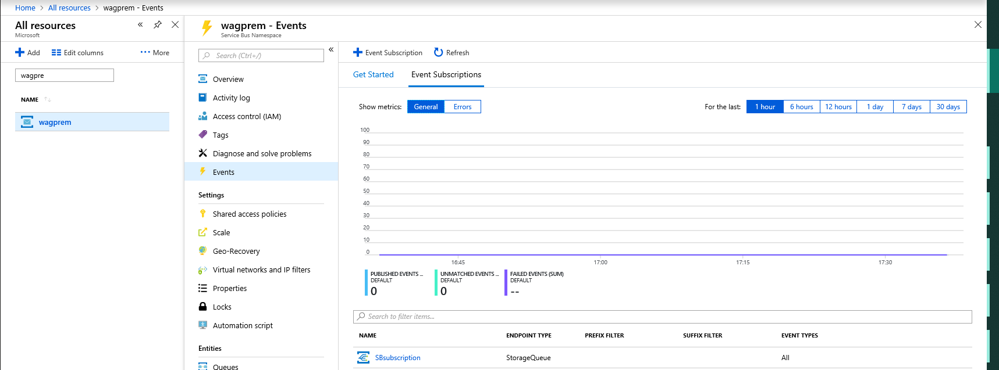

# Azure Service Bus to Event Grid integration overview

Azure Service Bus has launched a new integration to Azure Event Grid. The key scenario of this feature is that Service Bus queues or subscriptions with a low volume of messages do not need to have a receiver that polls for messages continuously. 

Service Bus can now emit events to Event Grid when there are messages in a queue or a subscription when no receivers are present. You can create Event Grid subscriptions to your Service Bus namespaces, listen to these events, and then react to the events by starting a receiver. With this feature, you can use Service Bus in reactive programming models.

To enable the feature, you need the following items:

* A Service Bus Premium namespace with at least one Service Bus queue or a Service Bus topic with at least one subscription.
* Contributor access to the Service Bus namespace.
* Additionally, you need an Event Grid subscription for the Service Bus namespace. This subscription receives a notification from Event Grid that there are messages to be picked up. Typical subscribers could be the Logic Apps feature of Azure App Service, Azure Functions, or a webhook contacting a web app. The subscriber then processes the messages. 

![19][]


[!INCLUDE [updated-for-az](../../includes/updated-for-az.md)]

### Verify that you have contributor access
Go to your Service Bus namespace, and then select **Access control (IAM)**, and select **Role assignments** tab. Verify that you have the contributor access to the namespace. 

### Events and event schemas

Service Bus today sends events for two scenarios:

* [ActiveMessagesWithNoListenersAvailable](#active-messages-available-event)
* DeadletterMessagesAvailable

Additionally, Service Bus uses the standard Event Grid security and [authentication mechanisms](https://docs.microsoft.com/azure/event-grid/security-authentication).

For more information, see [Azure Event Grid event schemas](https://docs.microsoft.com/azure/event-grid/event-schema).

#### Active Messages Available event

This event is generated if you have active messages in a queue or a subscription and there are no receivers listening.

The schema for this event is as follows:

```JSON
{
  "topic": "/subscriptions/<subscription id>/resourcegroups/DemoGroup/providers/Microsoft.ServiceBus/namespaces/<YOUR SERVICE BUS NAMESPACE WILL SHOW HERE>",
  "subject": "topics/<service bus topic>/subscriptions/<service bus subscription>",
  "eventType": "Microsoft.ServiceBus.ActiveMessagesAvailableWithNoListeners",
  "eventTime": "2018-02-14T05:12:53.4133526Z",
  "id": "dede87b0-3656-419c-acaf-70c95ddc60f5",
  "data": {
    "namespaceName": "YOUR SERVICE BUS NAMESPACE WILL SHOW HERE",
    "requestUri": "https://YOUR-SERVICE-BUS-NAMESPACE-WILL-SHOW-HERE.servicebus.windows.net/TOPIC-NAME/subscriptions/SUBSCRIPTIONNAME/messages/head",
    "entityType": "subscriber",
    "queueName": "QUEUE NAME IF QUEUE",
    "topicName": "TOPIC NAME IF TOPIC",
    "subscriptionName": "SUBSCRIPTION NAME"
  },
  "dataVersion": "1",
  "metadataVersion": "1"
}
```

#### Dead-letter Messages Available event

You get at least one event per Dead Letter queue, which has messages and no active receivers.

The schema for this event is as follows:

```JSON
[{
  "topic": "/subscriptions/<subscription id>/resourcegroups/DemoGroup/providers/Microsoft.ServiceBus/namespaces/<YOUR SERVICE BUS NAMESPACE WILL SHOW HERE>",
  "subject": "topics/<service bus topic>/subscriptions/<service bus subscription>",
  "eventType": "Microsoft.ServiceBus.DeadletterMessagesAvailableWithNoListener",
  "eventTime": "2018-02-14T05:12:53.4133526Z",
  "id": "dede87b0-3656-419c-acaf-70c95ddc60f5",
  "data": {
    "namespaceName": "YOUR SERVICE BUS NAMESPACE WILL SHOW HERE",
    "requestUri": "https://YOUR-SERVICE-BUS-NAMESPACE-WILL-SHOW-HERE.servicebus.windows.net/TOPIC-NAME/subscriptions/SUBSCRIPTIONNAME/$deadletterqueue/messages/head",
    "entityType": "subscriber",
    "queueName": "QUEUE NAME IF QUEUE",
    "topicName": "TOPIC NAME IF TOPIC",
    "subscriptionName": "SUBSCRIPTION NAME"
  },
  "dataVersion": "1",
  "metadataVersion": "1"
}]
```

### How many events are emitted, and how often?

If you have multiple queues and topics or subscriptions in the namespace, you get at least one event per queue and one per subscription. The events are emitted immediately if there are no messages in the Service Bus entity and a new message arrives. Or the events are emitted every two minutes unless Service Bus detects an active receiver. Message browsing does not interrupt the events.

By default, Service Bus emits events for all entities in the namespace. If you want to get events for specific entities only, see the next section.

### Use filters to limit where you get events from

If you want to get events only from, for example, one queue or one subscription within your namespace, you can use the *Begins with* or *Ends with* filters that are provided by Event Grid. In some interfaces, the filters are called *Pre* and *Suffix* filters. If you want to get events for multiple, but not all, queues and subscriptions, you can create multiple Event Grid subscriptions and provide a filter for each.

## Create Event Grid subscriptions for Service Bus namespaces

You can create Event Grid subscriptions for Service Bus namespaces in three different ways:

* In the Azure portal
* In [Azure CLI](#azure-cli-instructions)
* In [PowerShell](#powershell-instructions)

## Azure portal instructions

To create a new Event Grid subscription, do the following:
1. In the Azure portal, go to your namespace.
2. In the left pane, select the **Event Grid**. 
3. Select **Event Subscription**.  

   The following image displays a namespace that has an Event Grid subscription:

   

   The following image shows how to subscribe to a function or a webhook without any specific filtering:

   ![21][]

## Azure CLI instructions

First, make sure that you have Azure CLI version 2.0 or later installed. [Download the installer](https://docs.microsoft.com/cli/azure/install-azure-cli?view=azure-cli-latest). Select **Windows + X**, and then open a new PowerShell console with administrator permissions. Alternatively, you can use a command shell within the Azure portal.

Execute the following code:

 ```azurecli-interactive
az login

az account set -s "<Azure subscription name>"

namespaceid=$(az resource show --namespace Microsoft.ServiceBus --resource-type namespaces --name "<service bus namespace>" --resource-group "<resource group that contains the service bus namespace>" --query id --output tsv

az eventgrid event-subscription create --resource-id $namespaceid --name "<YOUR EVENT GRID SUBSCRIPTION NAME (CAN BE ANY NOT EXISTING)>" --endpoint "<your_function_url>" --subject-ends-with "<YOUR SERVICE BUS SUBSCRIPTION NAME>"
```

If you are using BASH 

## PowerShell instructions

Make sure you have Azure PowerShell installed. [Download the installer](https://docs.microsoft.com/powershell/azure/install-Az-ps). Select **Windows + X**, and then open a new PowerShell console with Administrator permissions. Alternatively, you can use a command shell within the Azure portal.

```powershell-interactive
Connect-AzAccount

Select-AzSubscription -SubscriptionName "<YOUR SUBSCRIPTION NAME>"

# This might be installed already
Install-Module Az.ServiceBus

$NSID = (Get-AzServiceBusNamespace -ResourceGroupName "<YOUR RESOURCE GROUP NAME>" -Na
mespaceName "<YOUR NAMESPACE NAME>").Id

New-AzEVentGridSubscription -EventSubscriptionName "<YOUR EVENT GRID SUBSCRIPTION NAME (CAN BE ANY NOT EXISTING)>" -ResourceId $NSID -Endpoint "<YOUR FUNCTION URL>” -SubjectEndsWith "<YOUR SERVICE BUS SUBSCRIPTION NAME>"
```

From here, you can explore the other setup options or test that events are flowing.

## Next steps

* Get Service Bus and Event Grid [examples](service-bus-to-event-grid-integration-example.md).
* Learn more about [Event Grid](https://docs.microsoft.com/azure/event-grid/).
* Learn more about [Azure Functions](https://docs.microsoft.com/azure/azure-functions/).
* Learn more about [Logic Apps](https://docs.microsoft.com/azure/logic-apps/).
* Learn more about [Service Bus](https://docs.microsoft.com/azure/service-bus/).

[1]: ./media/service-bus-to-event-grid-integration-concept/sbtoeventgrid1.png
[19]: ./media/service-bus-to-event-grid-integration-concept/sbtoeventgriddiagram.png
[8]: ./media/service-bus-to-event-grid-integration-example/sbtoeventgrid8.png
[9]: ./media/service-bus-to-event-grid-integration-example/sbtoeventgrid9.png
[20]: ./media/service-bus-to-event-grid-integration-example/sbtoeventgridportal.png
[21]: ./media/service-bus-to-event-grid-integration-example/sbtoeventgridportal2.png
