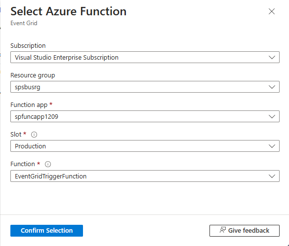

# Tutorial: Respond to Azure Service Bus events received via Azure Event Grid by using Azure Functions and Azure Logic Apps
In this tutorial, you learn how to respond to Azure Service Bus events that are received via Azure Event Grid by using Azure Functions and Azure Logic Apps. 

In this tutorial, you learn how to:
> [!div class="checklist"]
> * Create a Service Bus namespace
> * Prepare a sample application to send messages
> * Send messages to the Service Bus topic
> * Receive messages by using Logic Apps
> * Set up a test function on Azure
> * Connect the function and namespace via Event Grid
> * Receive messages by using Azure Functions

## Prerequisites

To complete this tutorial, make sure you have installed:

- [Visual Studio 2017 Update 3 (version 15.3, 26730.01)](https://www.visualstudio.com/vs) or later.
- [NET Core SDK](https://www.microsoft.com/net/download/windows), version 2.0 or later.

## Create a Service Bus namespace
Follow instructions in this tutorial: [Quickstart: Use the Azure portal to create a Service Bus topic and subscriptions to the topic](service-bus-quickstart-topics-subscriptions-portal.md) to do the following tasks:

- Create a **premium** Service Bus namespace. 
- Get the connection string. 
- Create a Service Bus topic.
- Create two subscriptions to the topic. 

## Prepare a sample application to send messages
You can use any method to send a message to your Service Bus topic. The sample code at the end of this procedure assumes that you're using Visual Studio 2017.

1. Clone [the GitHub azure-service-bus repository](https://github.com/Azure/azure-service-bus/).
2. In Visual Studio, go to the *\samples\DotNet\Microsoft.ServiceBus.Messaging\ServiceBusEventGridIntegration* folder, and then open the *SBEventGridIntegration.sln* file.
3. Go to the **MessageSender** project, and then select **Program.cs**.
4. Fill in your Service Bus topic name and the connection string you got from the previous step:

    ```csharp
    const string ServiceBusConnectionString = "YOUR CONNECTION STRING";
    const string TopicName = "YOUR TOPIC NAME";
    ```
5. Update the `numberOfMessages` value to **5**. 
5. Build and run the program to send test messages to the Service Bus topic. 

## Receive messages by using Logic Apps
Connect a logic app with Azure Service Bus and Azure Event Grid by following these steps:

1. Create a logic app in the Azure portal.
    1. Select **+ Create a resource**, select **Integration**, and then select **Logic App**. 
    2. On the **Logic App - Create** page, enter a **name** for the logic app.
    3. Select your Azure **subscription**. 
    4. Select **Use existing** for the **Resource group**, and select the resource group that you used for other resources (like Azure function, Service Bus namespace) that you created earlier. 
    5. Select the **Location** for the logic app. 
    6. Select **Create** to create the logic app. 
2. On the **Logic Apps Designer** page, select **Blank Logic App** under **Templates**. 
3. On the designer, do the following steps:
    1. Search for **Event Grid**. 
    2. Select **When a resource event occurs - Azure Event Grid**. 

        
4. Select **Sign in**, enter your Azure credentials, and select **Allow Access**. 
5. On the **When a resource event occurs** page, do the following steps:
    1. Select your Azure subscription. 
    2. For **Resource Type**, select **Microsoft.ServiceBus.Namespaces**. 
    3. For **Resource Name**, select your Service Bus namespace. 
    4. Select **Add new parameter**, and select **Suffix Filter**. 
    5. For **Suffix Filter**, enter the name of your second Service Bus topic subscription. 
        
6. Select **+ New Step** in the designer, and do the following steps:
    1. Search for **Service Bus**.
    2. Select **Service Bus** in the list. 
    3. Select for **Get messages** in the **Actions** list. 
    4. Select **Get messages from a topic subscription (peek-lock)**. 

        
    5. Enter a **name for the connection**. For example: **Get messages from the topic subscription**, and select the Service Bus namespace. 

         
    6. Select **RootManageSharedAccessKey**, and then select **Create**.

         
    8. Select your **topic** and **subscription**. 
    
        
7. Select **+ New step**, and do the following steps: 
    1. Select **Service Bus**.
    2. Select **Complete the message in a topic subscription** from the list of actions. 
    3. Select your Service Bus **topic**.
    4. Select the second **subscription** to the topic.
    5. For **Lock token of the message**, select **Lock Token** from the **Dynamic content**. 

        
8. Select **Save** on the toolbar on the Logic Apps Designer to save the logic app. 
9. Follow instruction in the [Send messages to the Service Bus topic](#send-messages-to-the-service-bus-topic) section to send messages to the topic. 
10. Switch to the **Overview** page of your logic app. You see the logic app runs in the **Runs history** for the messages sent.

    

## Set up a test function on Azure 
Before you work through the entire scenario, set up at least a small test function, which you can use to debug and observe the events that are flowing. Follow instructions in the [Create your first function in the Azure portal](../azure-functions/functions-create-first-azure-function.md) article to do the following tasks: 

1. Create a function app.
2. Create an HTTP triggered function. 

Then, do the following steps: 


# [Azure Functions V2](#tab/v2)

1. Expand **Functions** in the tree view, and select your function. Replace the code for the function with the following code: 

    ```csharp
    #r "Newtonsoft.Json"
    
    using System.Net;
    using Microsoft.AspNetCore.Mvc;
    using Microsoft.Extensions.Primitives;
    using Newtonsoft.Json;
    
    public static async Task<IActionResult> Run(HttpRequest req, ILogger log)
    {
        log.LogInformation("C# HTTP trigger function processed a request.");
        var content = req.Body;
        string jsonContent = await new StreamReader(content).ReadToEndAsync();
        log.LogInformation($"Received Event with payload: {jsonContent}");
    
        IEnumerable<string> headerValues;
        headerValues = req.Headers.GetCommaSeparatedValues("Aeg-Event-Type");
    
        if (headerValues.Count() != 0)
        {
            var validationHeaderValue = headerValues.FirstOrDefault();
            if(validationHeaderValue == "SubscriptionValidation")
            {
                log.LogInformation("Validating the subscription");            
                var events = JsonConvert.DeserializeObject<GridEvent[]>(jsonContent);
                var code = events[0].Data["validationCode"];
                log.LogInformation($"Validation code: {code}");
                return (ActionResult) new OkObjectResult(new { validationResponse = code });
            }
        }
    
        return jsonContent == null
            ? new BadRequestObjectResult("Please pass a name on the query string or in the request body")
            : (ActionResult)new OkObjectResult($"Hello, {jsonContent}");
    }
    
    public class GridEvent
    {
        public string Id { get; set; }
        public string EventType { get; set; }
        public string Subject { get; set; }
        public DateTime EventTime { get; set; }
        public Dictionary<string, string> Data { get; set; }
        public string Topic { get; set; }
    }    
    ```
2. Select **Save** on the toolbar to save the code for the function.

    
3. Select **Test/Run** on the toolbar, and do the following steps: 
    1. Enter the following JSON in the **body**.

        ```json
        [{
          "id": "64ba80ae-9f8e-425f-8bd7-d88d2c0ba3e3",
          "topic": "/subscriptions/0000000000-0000-0000-0000-0000000000000/resourceGroups/spegridsbusrg/providers/Microsoft.ServiceBus/namespaces/spegridsbusns",
          "subject": "",
          "data": {
            "validationCode": "D7D825D4-BD04-4F73-BDE3-70666B149857",
            "validationUrl": "https://rp-eastus.eventgrid.azure.net:553/eventsubscriptions/spsbusegridsubscription/validate?id=D7D825D4-BD04-4F73-BDE3-70666B149857&t=2020-06-09T18:28:51.5724615Z&apiVersion=2020-04-01-preview&[Hidden Credential]"
          },
          "eventType": "Microsoft.EventGrid.SubscriptionValidationEvent",
          "eventTime": "2020-06-09T18:28:51.5724615Z",
          "metadataVersion": "1",
          "dataVersion": "2"
        }]
        ```    
    2. Click **Add header**, and add a header with name `aeg-event-type` and value `SubscriptionValidation`. 
    3. Select **Run**. 

        
    4. Confirm that you see the return status code of **OK** and the validation code in the response body. Also, see the information logged by the function. 

                
3. Select **Get function URL** and note down the URL. 

    
5. Select the **copy** button next to the URL text.    
    

# [Azure Functions V1](#tab/v1)

1. Configure the function to use **V1** version: 
    1. Select your function app in the tree view, and select **Function app settings**. 
    2. Select **~1** for **Runtime version**. 
2. Expand **Functions** in the tree view, and select your function. Replace the code for the function with the following code: 

    ```csharp
    #r "Newtonsoft.Json"
    using System.Net;
    using Newtonsoft.Json;
    using Newtonsoft.Json.Linq;
    
    public static async Task<HttpResponseMessage> Run(HttpRequestMessage req, TraceWriter log)
    {
        log.Info("C# HTTP trigger function processed a request.");
        // parse query parameter
        var content = req.Content;
    
        string jsonContent = await content.ReadAsStringAsync(); 
        log.Info($"Received Event with payload: {jsonContent}");
    
        IEnumerable<string> headerValues;
        if (req.Headers.TryGetValues("Aeg-Event-Type", out headerValues))
        {
            var validationHeaderValue = headerValues.FirstOrDefault();
            if(validationHeaderValue == "SubscriptionValidation")
            {
            var events = JsonConvert.DeserializeObject<GridEvent[]>(jsonContent);
                 var code = events[0].Data["validationCode"];
                 return req.CreateResponse(HttpStatusCode.OK,
                 new { validationResponse = code });
            }
        }
    
        return jsonContent == null
        ? req.CreateResponse(HttpStatusCode.BadRequest, "Pass a name on the query string or in the request body")
        : req.CreateResponse(HttpStatusCode.OK, "Hello " + jsonContent);
    }
    
    public class GridEvent
    {
        public string Id { get; set; }
        public string EventType { get; set; }
        public string Subject { get; set; }
        public DateTime EventTime { get; set; }
        public Dictionary<string, string> Data { get; set; }
        public string Topic { get; set; }
    }
    ```
4. Select **Save and run**.

    
4. Select **Get function URL** on the toolbar. 

    
5. Select the **copy** button next to the URL text.    
    

---

## Connect the function and namespace via Event Grid
In this section, you tie together the function and the Service Bus namespace by using the Azure portal. 

To create an Azure Event Grid subscription, follow these steps:

1. In the Azure portal, go to your namespace and then, in the left pane, select **Events**. Your namespace window opens, with two Event Grid subscriptions displayed in the right pane. 
    
    
2. Select **+ Event Subscription** on the toolbar. 
3. On the **Create Event Subscription** page, do the following steps:
    1. Enter a **name** for the subscription. 
    2. Enter a **name** for the **system topic**. System topics are topics created for Azure resources such as Azure Storage account and Azure Service Bus. To learn more about system topics, see [System topics overview](../event-grid/system-topics.md).
    2. Select **Web Hook** for **Endpoint Type**. 

        
    3. Choose **Select an endpoint**, paste the function URL, and then select **Confirm selection**. 

        
    4. Switch to the **Filters** tab, and do the following tasks:
        1. Select **Enable subject filtering**
        2. Enter the name of the **first subscription** to the Service Bus topic you created earlier.
        3. Select the **Create** button. 

            
4. Switch to the **Event Subscriptions** tab of the **Events** page and confirm that you see the event subscription in the list.

    

## Send messages to the Service Bus topic
1. Run the .NET C# application, which sends messages to the Service Bus topic. 

    
1. On the page for your Azure function app, switch to the **Monitor** tab from the **Code + Test** tab. You should see an entry for each message posted to the Service Bus topic. If you don't see them, refresh the page after waiting for a few minutes. 

    

    You can also use the **Logs** tab of the **Monitor** page to see the logging information as the messages are sent. There could some delay, so give it a few minutes to see the logged messages. 

## Receive messages by using Azure Functions
In the preceding section, you observed a simple test and debugging scenario and ensured that events are flowing. 

In this section, you'll learn how to receive and process messages after you receive an event.

### Publish a function from Visual Studio
1. In the same Visual Studio solution (**SBEventGridIntegration**) that you opened, select **ReceiveMessagesOnEvent.cs** in the **SBEventGridIntegration** project. 
2. Enter your Service Bus connection string in the following code:

    ```Csharp
    const string ServiceBusConnectionString = "YOUR CONNECTION STRING";
    ```
3. Download the **publish profile** for the function:
    1. Select your function app. 
    2. Select the **Overview** tab if it isn't already selected. 
    3. Select **Get publish profile** on the toolbar. 

        
    4. Save the file to your project's folder. 
4. In Visual Studio, right-click **SBEventGridIntegration**, and then select **Publish**. 
5. On the **Publish**, do the following steps: 
    1. Select **Start** on the **Publish** page 
    2. For the **Target**, select **Import Profile**. 
    3. Select **Next**. 

        
7. Select the **publish profile file** you downloaded earlier, and select **Finish**.

    
8. Select **Publish** on the **Publish** page. 

    
9. Confirm that you see the new Azure function **ReceiveMessagesOnEvent**. Refresh the page if needed. 

    
10. Get the URL to the new function and note it down. 

### Event Grid subscription

1. Delete the existing Event Grid subscription:
    1. On the **Service Bus Namespace** page, select **Events** on the left menu. 
    2. Switch to the **Event Subscriptions** tab. 
    2. Select the existing event subscription. 

        
    3. On the **Event Subscription** page, select **Delete**. Select **Yes** to confirm deletion. 
        
2. Follow instructions in the [Connect the function and namespace via Event Grid](#connect-the-function-and-namespace-via-event-grid) section to create an Event Grid subscription using the new function URL.
3. Follow instruction in the [Send messages to the Service Bus topic](#send-messages-to-the-service-bus-topic) section to send messages to the topic and monitor the function. 


## Next steps

* Learn more about [Azure Event Grid](https://docs.microsoft.com/azure/event-grid/).
* Learn more about [Azure Functions](https://docs.microsoft.com/azure/azure-functions/).
* Learn more about the [Logic Apps feature of Azure App Service](https://docs.microsoft.com/azure/logic-apps/).
* Learn more about [Azure Service Bus](https://docs.microsoft.com/azure/service-bus/).


[2]: ./media/service-bus-to-event-grid-integration-example/sbtoeventgrid2.png
[3]: ./media/service-bus-to-event-grid-integration-example/sbtoeventgrid3.png
[7]: ./media/service-bus-to-event-grid-integration-example/sbtoeventgrid7.png
[8]: ./media/service-bus-to-event-grid-integration-example/sbtoeventgrid8.png
[9]: ./media/service-bus-to-event-grid-integration-example/sbtoeventgrid9.png
[10]: ./media/service-bus-to-event-grid-integration-example/sbtoeventgrid10.png
[11]: ./media/service-bus-to-event-grid-integration-example/sbtoeventgrid11.png
[12]: ./media/service-bus-to-event-grid-integration-example/sbtoeventgrid12.png
[12-1]: ./media/service-bus-to-event-grid-integration-example/sbtoeventgrid12-1.png
[12-2]: ./media/service-bus-to-event-grid-integration-example/sbtoeventgrid12-2.png
[13]: ./media/service-bus-to-event-grid-integration-example/sbtoeventgrid13.png
[14]: ./media/service-bus-to-event-grid-integration-example/sbtoeventgrid14.png
[15]: ./media/service-bus-to-event-grid-integration-example/sbtoeventgrid15.png
[16]: ./media/service-bus-to-event-grid-integration-example/sbtoeventgrid16.png
[17]: ./media/service-bus-to-event-grid-integration-example/sbtoeventgrid17.png
[18]: ./media/service-bus-to-event-grid-integration-example/sbtoeventgrid18.png
[20]: ./media/service-bus-to-event-grid-integration-example/sbtoeventgridportal.png
[21]: ./media/service-bus-to-event-grid-integration-example/sbtoeventgridportal2.png
