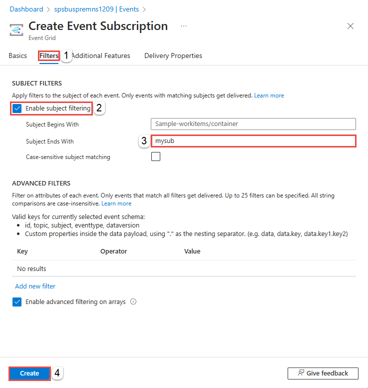

# Tutorial: Respond to Azure Service Bus events received via Azure Event Grid by using Azure Functions and Azure Logic Apps
In this tutorial, you learn how to respond to Azure Service Bus events that are received via Azure Event Grid by using Azure Functions and Azure Logic Apps. 

In this tutorial, you learn how to:
> [!div class="checklist"]
> * Create a Service Bus namespace
> * Prepare a sample application to send messages
> * Send messages to the Service Bus topic
> * Receive messages by using Logic Apps
> * Set up a test function on Azure
> * Connect the function and namespace via Event Grid
> * Receive messages by using Azure Functions

[!INCLUDE [service-bus-event-grid-prerequisites](../../includes/service-bus-event-grid-prerequisites.md)]

## Deploy the function app 

## Connect the function and namespace via Event Grid
In this section, you tie together the function and the Service Bus namespace by using the Azure portal. 

To create an Azure Event Grid subscription, follow these steps:

1. In the Azure portal, go to your namespace and then, in the left pane, select **Events**. Your namespace window opens, with two Event Grid subscriptions displayed in the right pane. 
    
    
2. Select **+ Event Subscription** on the toolbar. 
3. On the **Create Event Subscription** page, do the following steps:
    1. Enter a **name** for the subscription. 
    2. Enter a **name** for the **system topic**. System topics are topics created for Azure resources such as Azure Storage account and Azure Service Bus. To learn more about system topics, see [System topics overview](../event-grid/system-topics.md).
    2. Select **Web Hook** for **Endpoint Type**. 

        
    3. Choose **Select an endpoint**, paste the function URL, and then select **Confirm selection**. 

        
    4. Switch to the **Filters** tab, and do the following tasks:
        1. Select **Enable subject filtering**
        2. Enter the name of the **first subscription** to the Service Bus topic you created earlier.
        3. Select the **Create** button. 

            
4. Switch to the **Event Subscriptions** tab of the **Events** page and confirm that you see the event subscription in the list.

    

## Send messages to the Service Bus topic
1. Run the .NET C# application, which sends messages to the Service Bus topic. 

    
1. On the page for your Azure function app, switch to the **Monitor** tab from the **Code + Test** tab. You should see an entry for each message posted to the Service Bus topic. If you don't see them, refresh the page after waiting for a few minutes. 

    

    You can also use the **Logs** tab of the **Monitor** page to see the logging information as the messages are sent. There could some delay, so give it a few minutes to see the logged messages. 

## Receive messages by using Azure Functions
In the preceding section, you observed a simple test and debugging scenario and ensured that events are flowing. 

In this section, you'll learn how to receive and process messages after you receive an event.

## Next steps

* Learn more about [Azure Event Grid](../event-grid/index.yml).
* Learn more about [Azure Functions](../azure-functions/index.yml).
* Learn more about the [Logic Apps feature of Azure App Service](../logic-apps/index.yml).
* Learn more about [Azure Service Bus](/azure/service-bus/).

[2]: ./media/service-bus-to-event-grid-integration-example/sbtoeventgrid2.png
[3]: ./media/service-bus-to-event-grid-integration-example/sbtoeventgrid3.png
[7]: ./media/service-bus-to-event-grid-integration-example/sbtoeventgrid7.png
[8]: ./media/service-bus-to-event-grid-integration-example/sbtoeventgrid8.png
[9]: ./media/service-bus-to-event-grid-integration-example/sbtoeventgrid9.png
[10]: ./media/service-bus-to-event-grid-integration-example/sbtoeventgrid10.png
[11]: ./media/service-bus-to-event-grid-integration-example/sbtoeventgrid11.png
[12]: ./media/service-bus-to-event-grid-integration-example/sbtoeventgrid12.png
[12-1]: ./media/service-bus-to-event-grid-integration-example/sbtoeventgrid12-1.png
[12-2]: ./media/service-bus-to-event-grid-integration-example/sbtoeventgrid12-2.png
[13]: ./media/service-bus-to-event-grid-integration-example/sbtoeventgrid13.png
[14]: ./media/service-bus-to-event-grid-integration-example/sbtoeventgrid14.png
[15]: ./media/service-bus-to-event-grid-integration-example/sbtoeventgrid15.png
[16]: ./media/service-bus-to-event-grid-integration-example/sbtoeventgrid16.png
[17]: ./media/service-bus-to-event-grid-integration-example/sbtoeventgrid17.png
[18]: ./media/service-bus-to-event-grid-integration-example/sbtoeventgrid18.png
[20]: ./media/service-bus-to-event-grid-integration-example/sbtoeventgridportal.png
[21]: ./media/service-bus-to-event-grid-integration-example/sbtoeventgridportal2.png