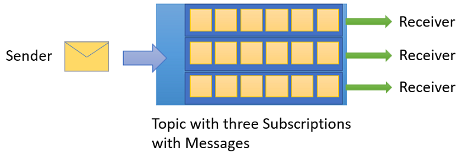
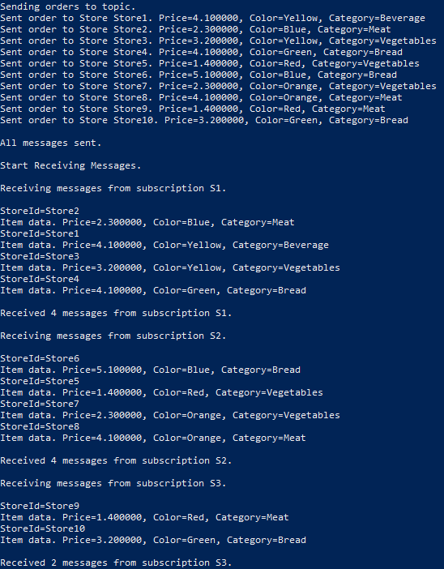

# Publish/subscribe channels and filters using CLI and Java

Microsoft Azure Service Bus is a multi-tenant cloud messaging service that sends information between applications and services. Asynchronous operations give you flexible, brokered messaging, along with structured first-in, first-out (FIFO) messaging, and publish/subscribe capabilities. This tutorial shows how to use Service Bus topics and subscriptions with publish/subscribe channels using Azure CLI and Java.

In this tutorial, you learn how to:
> [!div class="checklist"]
> * Create a Service Bus topic and one or more subscriptions to that topic
> * Add topic filters
> * Create two messages with different content
> * Send the messages and verify they arrived in the expected subscriptions
> * Receive messages from the subscriptions

An example of this scenario is an inventory assortment update for multiple retail stores. In this scenario, each store, or set of stores, gets messages intended for them to update their assortments. This tutorial shows how to implement this scenario using subscriptions and filters. First, you create a topic with 3 subscriptions, add some rules and filters, and then send and receive messages from the topic and subscriptions.



If you don't have an Azure subscription, you can create a [free account][] before you begin.

## Prerequisites

To develop a Service Bus app with Java, you must have the following installed:

- [Java Development Kit](http://www.oracle.com/technetwork/java/javase/downloads/jdk8-downloads-2133151.html), latest version.
- [Azure CLI](https://docs.microsoft.com/cli/azure)
- [Apache Maven](https://maven.apache.org), version 3.0 or above.

[!INCLUDE [cloud-shell-try-it.md](../../includes/cloud-shell-try-it.md)]

If you choose to install and use the CLI locally, this tutorial requires that you are running the Azure CLI version 2.0.4 or later. Run `az --version` to find the version. If you need to install or upgrade, see [Install Azure CLI 2.0]( /cli/azure/install-azure-cli).

## Service Bus topics and subscriptions

Each [subscription to a topic](service-bus-messaging-overview.md#topics) can receive a copy of each message. Topic "tail" and subscription "head" are fully protocol and semantically compatible with Service Bus queues. Topics support a vast array of selection rules with filter conditions, and optional actions to set or modify message properties. Each time a rule matches, it produces a message. To learn more about rules, filters, and actions, follow this [link](topic-filters.md).

## Log in to Azure

Once CLI is installed, open Cloud Shell and issue the following commands to log in to Azure:

1. If you are using Azure CLI locally, run the following command to log in to Azure. This login step is not necessary if you're running these commands in Cloud Shell:

   ```azurecli
   az login
   ```

2. Set the current subscription context to the Azure subscription you want to use:

   ```azurecli
   az account set --subscription Azure_subscription_name
   ```

## Use CLI to provision resources

After logging in to Azure, issue the following commands to provision Service Bus resources. Be sure to replace all placeholders with the appropriate values:

```azurecli
# Create a resource group
az group create --name my-resourcegroup --location eastus

# Create a Messaging namespace
az servicebus namespace create --name namespace-name --resource-group my-resourcegroup -l eastus2

# Create topic
az servicebus topic create --resource-group my-resourcegroup --namespace-name my-namespace-name --name my-topic-name

# Create subscription 1
az servicebus subscription create --resource-group my-resourcegroup --namespace-name my-namespace-name --topic-name my-topic-name --name S1

# Create filter 1 - use custom properties
az servicebus rule create --resource-group my-resourcegroup --namespace-name my-namespace-name --topic-name my-topic-name --subscription-name S1 --name MyFilter --filter-sql-expression "StoreId IN ('Store1','Store2','Store3')"

# Create filter 2 - use custom properties
az servicebus rule create --resource-group my-resourcegroup --namespace-name my-namespace-name --topic-name my-topic-name --subscription-name S1 --name MySecondFilter --filter-sql-expression "StoreId = 'Store4'"

# Create subscription 2
az servicebus subscription create --resource-group my-resourcegroup --namespace-name my-namespace-name --topic-name my-topic-name --name S2

# Create filter 3 - use Message header properties via IN list and combine with custom properties.
az servicebus rule create --resource-group my-resourcegroup --namespace-name my-namespace-name --topic-name my-topic-name --subscription-name S2 --name MyFilter --filter-sql-expression "sys.To IN ('Store5','Store6','Store7') OR StoreId = 'Store8'"

# Create subscription 3
az servicebus subscription create --resource-group my-resourcegroup --namespace-name my-namespace-name --topic-name my-topic-name --name S3

# Create filter 4 - Get everything but messages for subscription 1 and 2. Also modify a add an action, in this case setting the Label to a certain value. Assume those stores might not be part of your main store and you only add specific items to them and for that you flag them specifically.
az servicebus rule create --resource-group DemoGroup --namespace-name DemoNamespaceSB --topic-name tutorialtest1
 --subscription-name S3 --name MyFilter --filter-sql-expression "sys.To NOT IN ('Store1','Store2','Store3','Store4','Sto
re5','Store6','Store7','Store8') OR StoreId NOT IN ('Store1','Store2','Store3','Store4','Store5','Store6','Store7','Stor
e8')" --action-sql-expression "SET sys.Label = 'SalesEvent'"

# Get the connection string
az servicebus namespace authorizationrule keys list --resource-group my-resourcegroup --namespace-name my-namespace-name --name RootManageSharedAccessKey
```

After the last command runs, copy and paste the connection string, and the queue name you selected, to a temporary location such as Notepad. You will need it in the next step.

## Create filter rules on subscriptions

After the namespace and topic/subscriptions are provisioned, and you have the necessary credentials, you are ready to create filter rules on the subscriptions, then send and receive messages. You can examine the code in [this GitHub sample folder](https://github.com/Azure/azure-service-bus/tree/master/samples/Java/quickstarts-and-tutorials/tutorial-topics-subscriptions-filters-java/src/main/java/com/microsoft/azure/).

## Send and receive messages

1. Make sure that Cloud Shell is open and displaying the Bash prompt.

2. Clone the [Service Bus GitHub repository](https://github.com/Azure/azure-service-bus/) by issuing the following command:

   ```shell
   git clone https://github.com/Azure/azure-service-bus.git
   ```

2. Navigate to the sample folder `/azure-service-bus/samples/Java/quickstarts-and-tutorials/quickstart-java/tutorial-topics-subscriptions-filters-java`. Note that in the Bash shell, the commands are case sensitive and the path separators must be forward slashes.

3. Issue the following command to build the application:
   
   ```shell
   mvn clean package -DskipTests
   ```
4. To run the program, issue the following command. Make sure to replace the placeholders with the connection string and topic name you obtained in the previous step:

   ```shell
  java -jar .\target\tutorial-topics-subscriptions-filters-1.0.0-jar-with-dependencies.jar -c "myConnectionString" -t "myTopicName"
   ```

Observe 10 messages being sent to the topic, and subsequently received from the individual subscriptions:



## Clean up deployment

Run the following command to remove the resource group, namespace, and all related resources:

```azurecli
az group delete --resource-group my-resourcegroup
```

## Understand the sample code

This section contains more details about what the sample code does.

### Get connection string and queue

First, the code declares a set of variables, which drive the remaining execution of the program:

```java
    public String ConnectionString = null;
    public String TopicName = null;
    static final String[] Subscriptions = {"S1","S2","S3"};
    static final String[] Store = {"Store1","Store2","Store3","Store4","Store5","Store6","Store7","Store8","Store9","Store10"};
    static final String SysField = "sys.To";
    static final String CustomField = "StoreId";    
    int NrOfMessagesPerStore = 1; // Send at least 1.
```

The connection string and the topic name are the only values added via command line parameters and passed to `main()`. The actual code execution is triggered in the `run()` method and sends, then receives messages from the topic:

```java
public static void main(String[] args) {
		TutorialTopicsSubscriptionsFilters app = new TutorialTopicsSubscriptionsFilters();
        try {
            app.runApp(args);
            app.run();
        } catch (Exception e) {
            System.out.printf("%s", e.toString());
        }
        System.exit(0);
	}
}

public void run() throws Exception {
		// Send sample messages.
        this.sendMessagesToTopic();

        // Receive messages from subscriptions.
        this.receiveAllMessages();
}
```

### Create topic client to send messages

To send and receive messages, the `sendMessagesToTopic()` method creates a topic client instance, which uses the connection string and the topic name, then calls another method that sends the messages:

```java
public void sendMessagesToTopic() throws Exception, ServiceBusException {
		 // Create client for the topic.
        TopicClient topicClient = new TopicClient(new ConnectionStringBuilder(ConnectionString, TopicName));

        // Create a message sender from the topic client.

        System.out.printf("\nSending orders to topic.\n");

        // Now we can start sending orders.
        CompletableFuture.allOf(
                SendOrders(topicClient,Store[0]),
                SendOrders(topicClient,Store[1]),
                SendOrders(topicClient,Store[2]),
                SendOrders(topicClient,Store[3]),
                SendOrders(topicClient,Store[4]),
                SendOrders(topicClient,Store[5]),
                SendOrders(topicClient,Store[6]),
                SendOrders(topicClient,Store[7]),
                SendOrders(topicClient,Store[8]),
                SendOrders(topicClient,Store[9])                
        ).join();

        System.out.printf("\nAll messages sent.\n");
    }

     public CompletableFuture<Void> SendOrders(TopicClient topicClient, String store) throws Exception {

        for(int i = 0;i<NrOfMessagesPerStore;i++) {
        	Random r = new Random();
        	final Item item = new Item(r.nextInt(5),r.nextInt(5),r.nextInt(5));        	
        	IMessage message = new Message(GSON.toJson(item,Item.class).getBytes(UTF_8)); 
        	// We always set the Sent to field
            message.setTo(store);    
            final String StoreId = store;
            Double priceToString = item.getPrice();
            final String priceForPut = priceToString.toString();
            message.setProperties(new HashMap<String, String>() {{
            	// Additionally we add a customer store field. In reality you would use sys.To or a customer property but not both. 
            	// This is just for demo purposes.
                put("StoreId", StoreId);
                // Adding more potential filter / rule and action able fields
                put("Price", priceForPut);
                put("Color", item.getColor());
                put("Category", item.getItemCategory());
            }});
                        
            System.out.printf("Sent order to Store %s. Price=%f, Color=%s, Category=%s\n", StoreId, item.getPrice(), item.getColor(), item.getItemCategory());            
            topicClient.sendAsync(message);
        }
               
		return new CompletableFuture().completedFuture(null);         
    }
```

### Receive messages from the individual Subscriptions

The `receiveAllMessages()` method calls the `receiveAllMessageFromSubscription()` method, which then creates a subscription client per call and receives messages from the individual subscriptions:

```java
public void receiveAllMessages() throws Exception {		
    System.out.printf("\nStart Receiving Messages.\n");
    
    CompletableFuture.allOf(
            receiveAllMessageFromSubscription(Subscriptions[0]),
            receiveAllMessageFromSubscription(Subscriptions[1]),
            receiveAllMessageFromSubscription(Subscriptions[2]) 
            ).join();
}

public CompletableFuture<Void> receiveAllMessageFromSubscription(String subscription) throws Exception {
		
		int receivedMessages = 0;

        // Create subscription client.
        IMessageReceiver subscriptionClient = ClientFactory.createMessageReceiverFromConnectionStringBuilder(new ConnectionStringBuilder(ConnectionString, TopicName+"/subscriptions/"+ subscription), ReceiveMode.PEEKLOCK);

        // Create a receiver from the subscription client and receive all messages.
        System.out.printf("\nReceiving messages from subscription %s.\n\n", subscription);

        while (true)
        {
        	// This will make the connection wait for N seconds if new messages are available. 
        	// If no additional messages come we close the connection. This can also be used to realize long polling.
        	// In case of long polling you would obviously set it more to e.g. 60 seconds.
        	IMessage receivedMessage = subscriptionClient.receive(Duration.ofSeconds(1));
            if (receivedMessage != null)
            {
                if ( receivedMessage.getProperties() != null ) {                	                	                	                	
                    System.out.printf("StoreId=%s\n", receivedMessage.getProperties().get("StoreId"));                                                	                                    	
                	
                    // Show the label modified by the rule action
                    if(receivedMessage.getLabel() != null)
                		System.out.printf("Label=%s\n", receivedMessage.getLabel());   
                }
                
                byte[] body = receivedMessage.getBody();
                Item theItem = GSON.fromJson(new String(body, UTF_8), Item.class);
                System.out.printf("Item data. Price=%f, Color=%s, Category=%s\n", theItem.getPrice(), theItem.getColor(), theItem.getItemCategory());                          
                
                subscriptionClient.complete(receivedMessage.getLockToken());
                receivedMessages++;
            }
            else
            {
                // No more messages to receive.
            	subscriptionClient.close();
                break;
            }
        }
        System.out.printf("\nReceived %s messages from subscription %s.\n", receivedMessages, subscription);
		
		return new CompletableFuture().completedFuture(null);
}
```

## Next steps

In this article, you created a Service Bus namespace and other resources required to send and receive messages from a topic and its subscriptions. To learn more about sending and receiving messages, continue with the following articles:

* [Get started with Service Bus samples on GitHub](https://github.com/Azure/azure-service-bus/tree/master/samples/DotNet/GettingStarted)
* [Service Bus .NET Standard library samples](https://github.com/Azure/azure-service-bus/tree/master/samples/DotNet/Microsoft.Azure.ServiceBus)[Service Bus messaging overview](service-bus-messaging-overview.md)
* [How to use Service Bus queues](service-bus-quickstart-cli.md)

[free account]: https://azure.microsoft.com/free/?ref=microsoft.com&utm_source=microsoft.com&utm_medium=docs&utm_campaign=visualstudio
[fully qualified domain name]: https://wikipedia.org/wiki/Fully_qualified_domain_name
[Install Azure CLI 2.0]: /cli/azure/install-azure-cli
[az group create]: /cli/azure/group#az_group_create