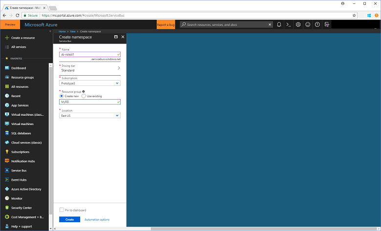
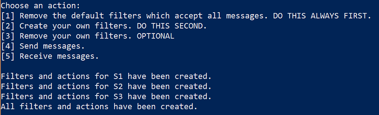
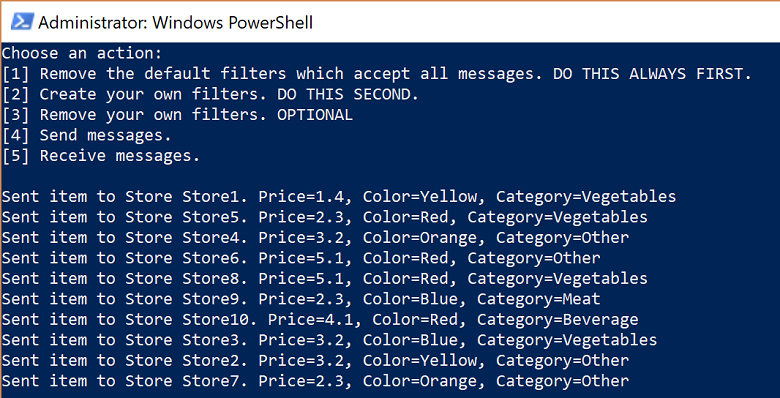
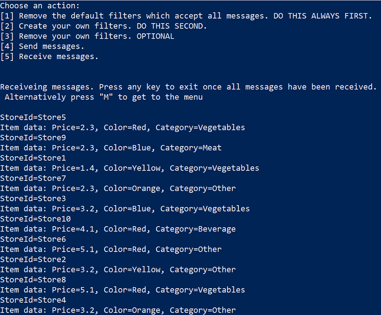

# Tutorial: Update inventory using Azure portal and topics/subscriptions

Microsoft Azure Service Bus is a multi-tenant cloud messaging service that sends information between applications and services. Asynchronous operations give you flexible, brokered messaging, along with structured first-in, first-out (FIFO) messaging, and publish/subscribe capabilities. This tutorial shows how to use Service Bus topics and subscriptions in a retail inventory scenario, with publish/subscribe channels using the Azure portal and .NET.

In this tutorial, you learn how to:
> [!div class="checklist"]
> * Create a Service Bus topic and one or more subscriptions to that topic using the Azure portal
> * Add topic filters using .NET code
> * Create two messages with different content
> * Send the messages and verify they arrived in the expected subscriptions
> * Receive messages from the subscriptions

An example of this scenario is an inventory assortment update for multiple retail stores. In this scenario, each store, or set of stores, gets messages intended for them to update their assortments. This tutorial shows how to implement this scenario using subscriptions and filters. First, you create a topic with 3 subscriptions, add some rules and filters, and then send and receive messages from the topic and subscriptions.


If you don't have an Azure subscription, you can create a [free account][] before you begin.

## Prerequisites

To complete this tutorial, make sure you have installed:

- [Visual Studio 2017 Update 3 (version 15.3, 26730.01)](http://www.visualstudio.com/vs) or later.
- [NET Core SDK](https://www.microsoft.com/net/download/windows), version 2.0 or later.

## Service Bus topics and subscriptions

Each [subscription to a topic](service-bus-messaging-overview.md#topics) can receive a copy of each message. Topics are fully protocol and semantically compatible with Service Bus queues. Service Bus topics support a wide array of selection rules with filter conditions, with optional actions that set or modify message properties. Each time a rule matches, it produces a message. To learn more about rules, filters, and actions, follow this [link](topic-filters.md).

## Sign in to the Azure portal

First, go to the [Azure portal][Azure portal] and sign in using your Azure subscription. The first step is to create a Service Bus namespace of type **Messaging**.

## Create a Service Bus namespace

A Service Bus messaging namespace provides a unique scoping container, referenced by its [fully qualified domain name][], in which you create one or more queues, topics, and subscriptions. The following example creates a Service Bus messaging namespace in a new or existing [resource group](/azure/azure-resource-manager/resource-group-portal):

1. In the left navigation pane of the portal, click **+ Create a resource**, then click **Enterprise Integration**, and then click **Service Bus**.
2. In the **Create namespace** dialog, enter a namespace name. The system immediately checks to see if the name is available.
3. After making sure the namespace name is available, choose the pricing tier (Standard or Premium).
4. In the **Subscription** field, choose an Azure subscription in which to create the namespace.
5. In the **Resource group** field, choose an existing resource group in which the namespace will live, or create a new one.      
6. In **Location**, choose the country or region in which your namespace should be hosted.
7. Click **Create**. The system now creates your namespace and enables it. You might have to wait several minutes as the system provisions resources for your account.

  

### Obtain the management credentials

Creating a new namespace automatically generates an initial Shared Access Signature (SAS) rule with an associated pair of primary and secondary keys that each grant full control over all aspects of the namespace. To copy the initial rule, follow these steps:

1. Click **All resources**, then click the newly created namespace name.
2. In the namespace window, click **Shared access policies**.
3. In the **Shared access policies** screen, click **RootManageSharedAccessKey**.
4. In the **Policy: RootManageSharedAccessKey** window, click the **Copy** button next to **Primary Connection String**, to copy the connection string to your clipboard for later use. Paste this value into Notepad or some other temporary location.

    ![connection-string][connection-string]
5. Repeat the previous step, copying and pasting the value of **Primary Key** to a temporary location for later use.

## Create a topic and subscriptions

To create a Service Bus topic, specify the namespace under which you want it created. The following example shows how to create a topic on the portal:

1. In the left navigation pane of the portal, click **Service Bus** (if you don't see **Service Bus**, click **All services**).
2. Click the namespace in which you would like to create the Topic.
3. In the namespace window, click **Topics**, then in the **Topics** window, click **+ Topics**.
4. Enter the Topic **Name** and leave the other values with their defaults.
5. At the bottom of the window, click **Create**.
6. Make a note of the topic name.
7. Select the topic you just created.
8. Click on **+ Subscription**, enter the subscription name **S1**, and leave all other values with their defaults.
9. Repeat the previous step twice more, creating subscriptions named **S2** and **S3**.

## Create filter rules on subscriptions

After the namespace and topic/subscriptions are provisioned, and you have the necessary credentials, you are ready to create filter rules on the subscriptions, then send and receive messages. You can examine the code in [this GitHub sample folder](https://github.com/Azure/azure-service-bus/tree/master/samples/Java/GettingStarted\BasicSendReceiveTutorialwithFilters).

### Send and receive messages

To run the code, do the following:

1. In a command prompt or PowerShell prompt, clone the [Service Bus GitHub repository](https://github.com/Azure/azure-service-bus/) by issuing the following command:

   ```shell
   git clone https://github.com/Azure/azure-service-bus.git
   ```

2. Navigate to the sample folder `azure-service-bus\samples\DotNet\GettingStarted\BasicSendReceiveTutorialwithFilters`.

3. Obtain the connection string you copied to Notepad in the [Obtain the management credentials](#obtain-the-management-credentials) section of this tutorial. You also need the name of the topic you created in the previous section.

4. At the command prompt, type the following command:

   ```shell
   dotnet build
   ```

5. Navigate to the `BasicSendReceiveTutorialwithFilters\bin\Debug\netcoreapp2.0` folder.

6. Type the following command to run the program. Be sure to replace `myConnectionString` with the value you previously obtained, and `myTopicName` with the name of the topic you created:

   ```shell
   dotnet BasicSendReceiveTutorialwithFilters.dll -ConnectionString "myConnectionString" -TopicName "myTopicName"
   ``` 
7. Follow the instructions in the console to select filter creation first. Part of creating filters is to remove the default filters. When you use PowerShell or CLI you don't need to remove the default filter, but if you do this in code, you must remove them. The console commands 1 and 3 help you manage the filters on the subscriptions you previously created:

   - Execute 1: to remove the default filters.
   - Execute 2: to add your own filters.
   - Execute 3: to optionally remove your own filters. Note that this will not recreate the default filters.

    

8. After filter creation, you can send messages. Press 4 and observe 10 messages being sent to the topic:

    

9. Press 5 and observe the messages being received. If you did not get 10 messages back, press "m" to display the menu, then press 5 again.

    

## Clean up resources

When no longer needed, delete the namespace and queue. To do so, select these resources on the portal and click **Delete**.

## Understand the sample code

This section contains more details about what the sample code does.

### Get connection string and topic

First, the code declares a set of variables, which drive the remaining execution of the program.

```csharp
string ServiceBusConnectionString;
string TopicName;

static string[] Subscriptions = { "S1", "S2", "S3" };
static IDictionary<string, string[]> SubscriptionFilters = new Dictionary<string, string[]> {
    { "S1", new[] { "StoreId IN('Store1', 'Store2', 'Store3')", "StoreId = 'Store4'"} },
    { "S2", new[] { "sys.To IN ('Store5','Store6','Store7') OR StoreId = 'Store8'" } },
    { "S3", new[] { "sys.To NOT IN ('Store1','Store2','Store3','Store4','Store5','Store6','Store7','Store8') OR StoreId NOT IN ('Store1','Store2','Store3','Store4','Store5','Store6','Store7','Store8')" } }
};
// You can have only have one action per rule and this sample code supports only one action for the first filter, which is used to create the first rule. 
static IDictionary<string, string> SubscriptionAction = new Dictionary<string, string> {
    { "S1", "" },
    { "S2", "" },
    { "S3", "SET sys.Label = 'SalesEvent'"  }
};
static string[] Store = { "Store1", "Store2", "Store3", "Store4", "Store5", "Store6", "Store7", "Store8", "Store9", "Store10" };
static string SysField = "sys.To";
static string CustomField = "StoreId";
static int NrOfMessagesPerStore = 1; // Send at least 1.
```

The connection string and topic name are passed in via command line parameters as shown, and then are read in the `Main()` method:

```csharp
static void Main(string[] args)
{
    string ServiceBusConnectionString = "";
    string TopicName = "";

    for (int i = 0; i < args.Length; i++)
    {
        if (args[i] == "-ConnectionString")
        {
            Console.WriteLine($"ConnectionString: {args[i + 1]}");
            ServiceBusConnectionString = args[i + 1]; // Alternatively enter your connection string here.
        }
        else if (args[i] == "-TopicName")
        {
            Console.WriteLine($"TopicName: {args[i + 1]}");
            TopicName = args[i + 1]; // Alternatively enter your queue name here.
        }
    }

    if (ServiceBusConnectionString != "" && TopicName != "")
    {
        Program P = StartProgram(ServiceBusConnectionString, TopicName);
        P.PresentMenu().GetAwaiter().GetResult();
    }
    else
    {
        Console.WriteLine("Specify -Connectionstring and -TopicName to execute the example.");
        Console.ReadKey();
    }
}
```

### Remove default filters

When you create a subscription, Service Bus creates a default filter per subscription. This filter enables receiving every message sent to the topic. If you want to use custom filters, you can remove the default filter, as shown in the following code:

```csharp
private async Task RemoveDefaultFilters()
{
    Console.WriteLine($"Starting to remove default filters.");

    try
    {
        foreach (var subscription in Subscriptions)
        {
            SubscriptionClient s = new SubscriptionClient(ServiceBusConnectionString, TopicName, subscription);
            await s.RemoveRuleAsync(RuleDescription.DefaultRuleName);
            Console.WriteLine($"Default filter for {subscription} has been removed.");
            await s.CloseAsync();
        }

        Console.WriteLine("All default Rules have been removed.\n");
    }
    catch (Exception ex)
    {
        Console.WriteLine(ex.ToString());
    }

    await PresentMenu();
}
```

### Create filters

The following code adds the custom filters defined in this tutorial:

```csharp
private async Task CreateCustomFilters()
{
    try
    {
        for (int i = 0; i < Subscriptions.Length; i++)
        {
            SubscriptionClient s = new SubscriptionClient(ServiceBusConnectionString, TopicName, Subscriptions[i]);
            string[] filters = SubscriptionFilters[Subscriptions[i]];
            if (filters[0] != "")
            {
                int count = 0;
                foreach (var myFilter in filters)
                {
                    count++;

                    string action = SubscriptionAction[Subscriptions[i]];
                    if (action != "")
                    {
                        await s.AddRuleAsync(new RuleDescription
                        {
                            Filter = new SqlFilter(myFilter),
                            Action = new SqlRuleAction(action),
                            Name = $"MyRule{count}"
                        });
                    }
                    else
                    {
                        await s.AddRuleAsync(new RuleDescription
                        {
                            Filter = new SqlFilter(myFilter),
                            Name = $"MyRule{count}"
                        });
                    }
                }
            }

            Console.WriteLine($"Filters and actions for {Subscriptions[i]} have been created.");
        }

        Console.WriteLine("All filters and actions have been created.\n");
    }
    catch (Exception ex)
    {
        Console.WriteLine(ex.ToString());
    }

    await PresentMenu();
}
```

### Remove your custom created filters

If you want to remove all filters on your subscription, the following code shows how to do that:

```csharp
private async Task CleanUpCustomFilters()
{
    foreach (var subscription in Subscriptions)
    {
        try
        {
            SubscriptionClient s = new SubscriptionClient(ServiceBusConnectionString, TopicName, subscription);
            IEnumerable<RuleDescription> rules = await s.GetRulesAsync();
            foreach (RuleDescription r in rules)
            {
                await s.RemoveRuleAsync(r.Name);
                Console.WriteLine($"Rule {r.Name} has been removed.");
            }
            await s.CloseAsync();
        }
        catch (Exception ex)
        {
            Console.WriteLine(ex.ToString());
        }
    }
    Console.WriteLine("All default filters have been removed.\n");

    await PresentMenu();
}
```

### Send messages

Sending messages to a topic is similar to sending messages to a queue. This example shows how to send messages, using a task list and asynchronous processing:

```csharp
public async Task SendMessages()
{
    try
    {
        TopicClient tc = new TopicClient(ServiceBusConnectionString, TopicName);

        var taskList = new List<Task>();
        for (int i = 0; i < Store.Length; i++)
        {
            taskList.Add(SendItems(tc, Store[i]));
        }

        await Task.WhenAll(taskList);
        await tc.CloseAsync();
    }
    catch (Exception ex)
    {
        Console.WriteLine(ex.ToString());
    }
    Console.WriteLine("\nAll messages sent.\n");
}

private async Task SendItems(TopicClient tc, string store)
{
    for (int i = 0; i < NrOfMessagesPerStore; i++)
    {
        Random r = new Random();
        Item item = new Item(r.Next(5), r.Next(5), r.Next(5));

        // Note the extension class which is serializing an deserializing messages
        Message message = item.AsMessage();
        message.To = store;
        message.UserProperties.Add("StoreId", store);
        message.UserProperties.Add("Price", item.getPrice().ToString());
        message.UserProperties.Add("Color", item.getColor());
        message.UserProperties.Add("Category", item.getItemCategory());

        await tc.SendAsync(message);
        Console.WriteLine($"Sent item to Store {store}. Price={item.getPrice()}, Color={item.getColor()}, Category={item.getItemCategory()}"); ;
    }
}
```

### Receive messages

Messages are again received via a task list, and the code uses batching. You can send and receive using batching, but this example only shows how to batch receive. In reality, you would not break out of the loop, but keep looping and set a higher timespan, such as one minute. The receive call to the broker is kept open for this amount of time and if messages arrive, they are returned immediately and a new receive call is issued. This concept is called *long polling*. Using the receive pump which you can see in the [quickstart](service-bus-quickstart-portal.md), and in several other samples in the repository, is a more typical option.

```csharp
public async Task Receive()
{
    var taskList = new List<Task>();
    for (var i = 0; i < Subscriptions.Length; i++)
    {
        taskList.Add(this.ReceiveMessages(Subscriptions[i]));
    }

    await Task.WhenAll(taskList);
}

private async Task ReceiveMessages(string subscription)
{
    var entityPath = EntityNameHelper.FormatSubscriptionPath(TopicName, subscription);
    var receiver = new MessageReceiver(ServiceBusConnectionString, entityPath, ReceiveMode.PeekLock, RetryPolicy.Default, 100);

    while (true)
    {
        try
        {
            IList<Message> messages = await receiver.ReceiveAsync(10, TimeSpan.FromSeconds(2));
            if (messages.Any())
            {
                foreach (var message in messages)
                {
                    lock (Console.Out)
                    {
                        Item item = message.As<Item>();
                        IDictionary<string, object> myUserProperties = message.UserProperties;
                        Console.WriteLine($"StoreId={myUserProperties["StoreId"]}");

                        if (message.Label != null)
                        {
                            Console.WriteLine($"Label={message.Label}");
                        }

                        Console.WriteLine(
                            $"Item data: Price={item.getPrice()}, Color={item.getColor()}, Category={item.getItemCategory()}");
                    }

                    await receiver.CompleteAsync(message.SystemProperties.LockToken);
                }
            }
            else
            {
                break;
            }
        }
        catch (Exception ex)
        {
            Console.WriteLine(ex.ToString());
        }
    }

    await receiver.CloseAsync();
}
```

## Next steps

In this tutorial, you provisioned resources using the Azure portal, then sent and received messages from a Service Bus topic and its subscriptions. You learned how to:

> [!div class="checklist"]
> * Create a Service Bus topic and one or more subscriptions to that topic using the Azure portal
> * Add topic filters using .NET code
> * Create two messages with different content
> * Send the messages and verify they arrived in the expected subscriptions
> * Receive messages from the subscriptions

For more examples of sending and receiving messages, get started with the [Service Bus samples on GitHub](https://github.com/Azure/azure-service-bus/tree/master/samples/DotNet/GettingStarted).

Advance to the next tutorial to learn more about using the publish/subscribe capabilities of Service Bus.

> [!div class="nextstepaction"]
> [Update inventory using PowerShell and topics/subscriptions](service-bus-tutorial-topics-subscriptions-powershell.md)

[free account]: https://azure.microsoft.com/free/?ref=microsoft.com&utm_source=microsoft.com&utm_medium=docs&utm_campaign=visualstudio
[fully qualified domain name]: https://wikipedia.org/wiki/Fully_qualified_domain_name
[Azure portal]: https://portal.azure.com/

[connection-string]: ./media/service-bus-tutorial-topics-subscriptions-portal/connection-string.png
[service-bus-flow]: ./media/service-bus-tutorial-topics-subscriptions-portal/about-service-bus-topic.png