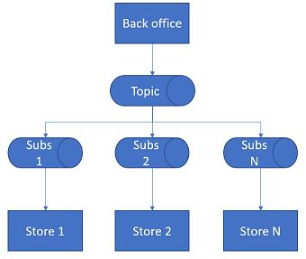

# Tutorial: update inventory assortment using topics and subscriptions

Microsoft Azure Service Bus is a multi-tenant cloud messaging service that sends information between applications and services. Asynchronous operations give you flexible, brokered messaging, along with structured first-in, first-out (FIFO) messaging, and publish/subscribe capabilities.

This tutorial shows how to use Service Bus topics, subscriptions with publish/subscribe channels. The article describes a retail scenario that updates an inventory assortment and sends a set of messages from the back office to the stores. The workflow is pictured as follows:



In this tutorial, you learn how to:
> [!div class="checklist"]
> * Create a Service Bus topic and one or more subscriptions to that topic
> * Add topic filters
> * Create two messages with different content
> * Send the messages and verify they arrived in the expected subscriptions
> * Receive message from one subscription

If you don't have an Azure subscription, you can create a [free account](https://azure.microsoft.com/free/) before you begin.

## Prerequisites

To complete this tutorial, make sure you have installed:

1. [Visual Studio 2017 Update 3 (version 15.3, 26730.01)](http://www.visualstudio.com/vs) or later.
2. [NET Core SDK](https://www.microsoft.com/net/download/windows), version 2.0 or later.

[!INCLUDE [cloud-shell-try-it.md](../../includes/cloud-shell-try-it.md)]

If you choose to install and use the CLI locally, this tutorial requires that you are running the Azure CLI version 2.0.4 or later. Run `az --version` to find the version. If you need to install or upgrade, see [Install Azure CLI 2.0]( /cli/azure/install-azure-cli).

## Log in to Azure

Once CLI is installed, open a command prompt and issue the following commands:

1. Add the Service Bus cli extension using the following command:

   ```azurecli-interactive
   az extension add --name servicebus
   ```

2. Run the following command to log in to Azure:

   ```azurecli-interactive
   az login
   ```
   This command displays the following text:

   ```Output
   To sign in, use a web browser to open the page https://aka.ms/devicelogin and enter the code ######## to authenticate.
   ```

3. Open the https://aka.ms/devicelogin link in the browser and enter the code to authenticate your Azure login.

## Create a resource group

A resource group is a logical collection of Azure resources. All resources are deployed and managed in a resource group. Create a new resource group with [az group create][] command.

The following example creates a resource group named **serviceBusResourceGroup** in the **East US** region

```azurecli-interactive
az group create --name serviceBusResourceGroup --location eastus
```

## Create a Service Bus namespace

A Service Bus messaging namespace provides a unique scoping container, referenced by its [fully qualified domain name][], in which you create one or more queues, topics, and subscriptions. The following example creates a namespace in your resource group. Replace `<namespace_name>` with a unique name for your namespace:

```azurecli-interactive
az servicebus namespace create --name <namespace_name> -location eastus
```

## Create a topic

To create a Service Bus topic, specify the namespace under which you want it created. The following example shows how to create a topic:

```azurecli-interactive
az servicebus entity create --name <topic_name> -location eastus
```

## Create a subscription to the topic

Create a subscription to the topic:

```azurecli-interactive
az servicebus entity create --name <subscription_name> -location eastus
```

## Clean up resources

Run the following command to remove the resource group, namespace, and all related resources:

```azurecli-interactive
az group delete --name serviceBusResourceGroup
```

## Next steps

In this tutorial, you learned how to:
> [!div class="checklist"]
> * Create a Service Bus topic and subscription
> * Add topic filters
> * Create two messages
> * Send the messages to subscriptions
> * Receive message from one subscription

Advance to the next article to learn about message time to live and the deadletter queue.

> [!div class="nextstepaction"]
> [Service Bus Messaging overview](service-bus-messaging-overview.md)

