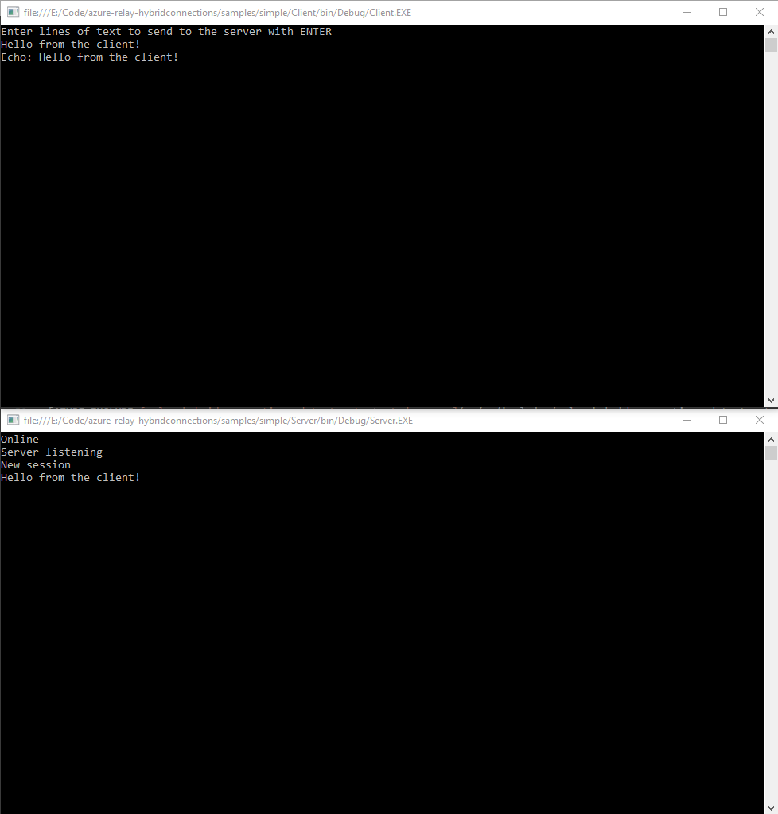

# Get started with Relay Hybrid Connections Websockets in .NET
[!INCLUDE [relay-selector-hybrid-connections](../../includes/relay-selector-hybrid-connections.md)]

This tutorial provides an introduction to [Azure Relay Hybrid Connections](relay-what-is-it.md#hybrid-connections). Learn how to use Microsoft .NET to create a client application that sends messages to a corresponding listener application. 

## What will be accomplished
Hybrid Connections requires both a client component and a server component. In this tutorial, you complete these steps to create two console applications:

1. Create a Relay namespace by using the Azure portal.
2. Create a hybrid connection in that namespace by using the Azure portal.
3. Write a server (listener) console application to receive messages.
4. Write a client (sender) console application to send messages.

## Prerequisites

To complete this tutorial, you need the following prerequisites:

* [Visual Studio 2015 or later](http://www.visualstudio.com). The examples in this tutorial use Visual Studio 2017.
* An Azure subscription.

[!INCLUDE [create-account-note](../../includes/create-account-note.md)]

## 1. Create a namespace by using the Azure portal
If you have already created a Relay namespace, go to [Create a hybrid connection by using the Azure portal](#2-create-a-hybrid-connection-using-the-azure-portal).

[!INCLUDE [relay-create-namespace-portal](../../includes/relay-create-namespace-portal.md)]

## 2. Create a hybrid connection by using the Azure portal
If you have already created a hybrid connection, go to [Create a server application](#3-create-a-server-application-listener).

[!INCLUDE [relay-create-hybrid-connection-portal](../../includes/relay-create-hybrid-connection-portal.md)]

## 3. Create a server application (listener)
In Visual Studio, write a C# console application to listen for and receive messages from the relay.

[!INCLUDE [relay-hybrid-connections-dotnet-get-started-server](../../includes/relay-hybrid-connections-dotnet-get-started-server.md)]

## 4. Create a client application (sender)
In Visual Studio, write a C# console application to send messages to the relay.

[!INCLUDE [relay-hybrid-connections-dotnet-get-started-client](../../includes/relay-hybrid-connections-dotnet-get-started-client.md)]

## 5. Run the applications
1. Run the server application.
2. Run the client application and enter some text.
3. Ensure that the server application console displays the text that was entered in the client application.

Congratulations, you have created an end-to-end Hybrid Connections application!

## Next steps

* [Relay FAQ](relay-faq.md)
* [Create a namespace](relay-create-namespace-portal.md)
* [Get started with Node](relay-hybrid-connections-node-get-started.md)

